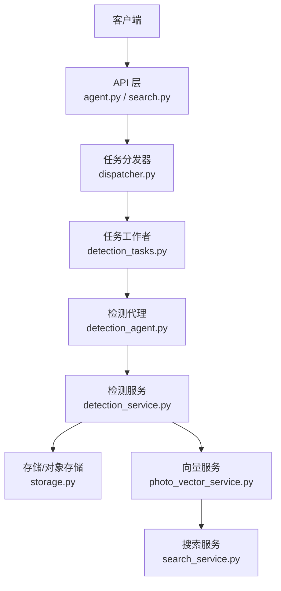
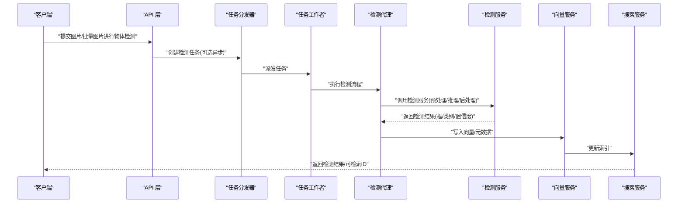
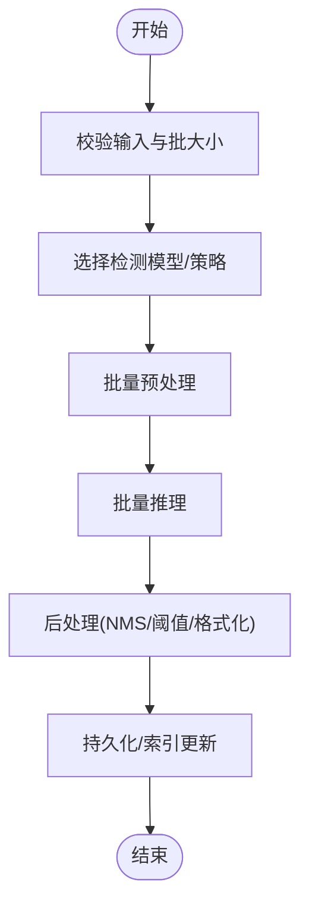
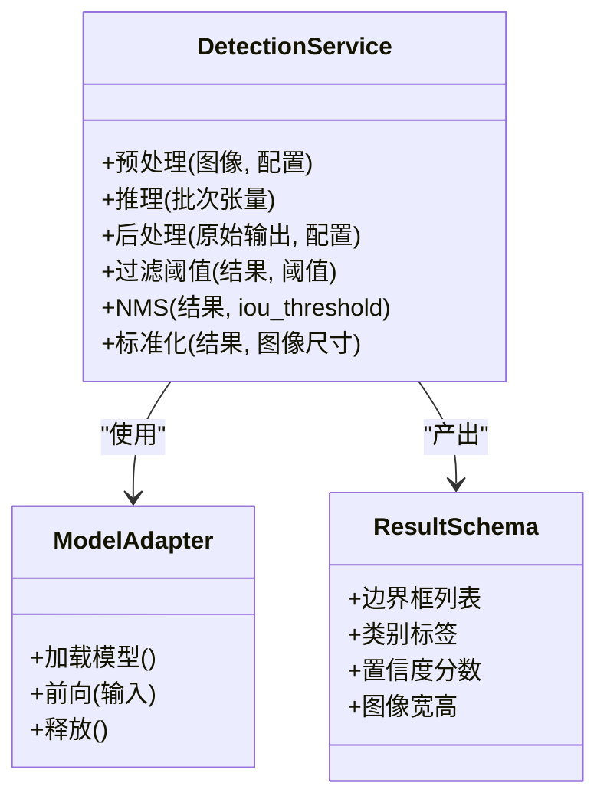
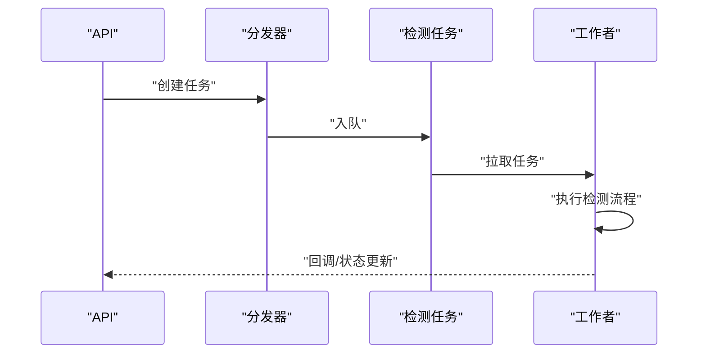
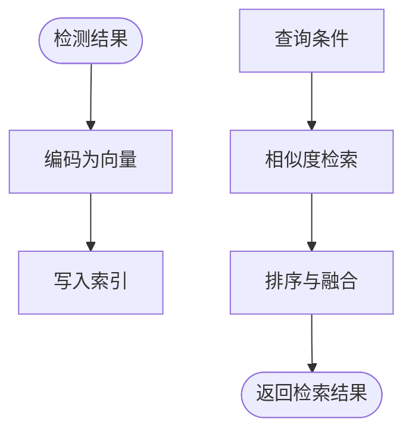
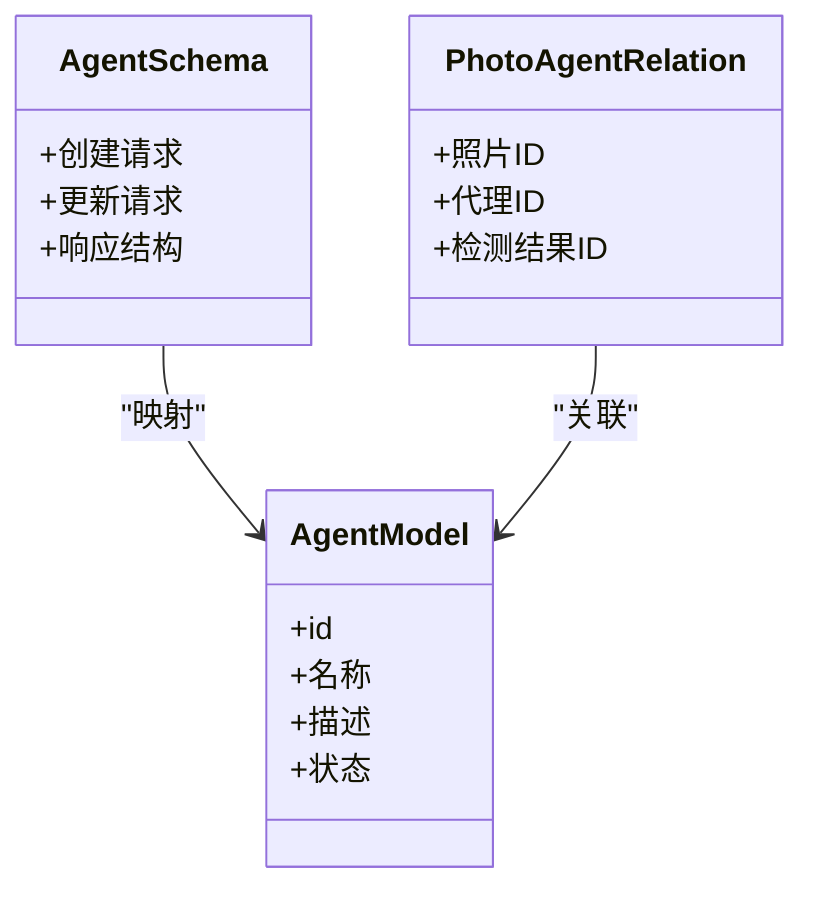
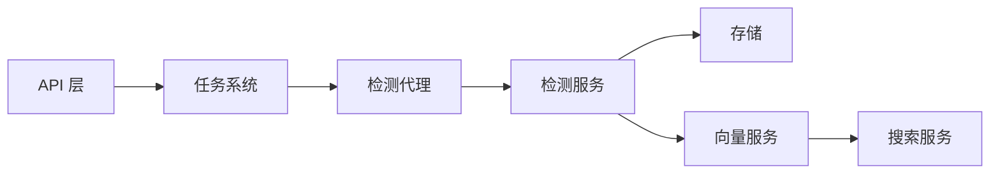
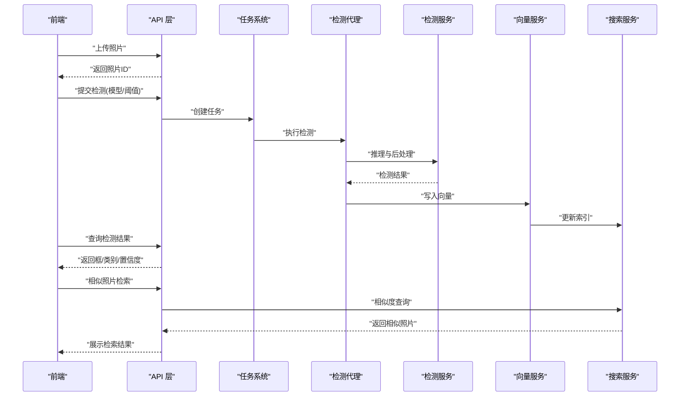

# 检测代理

<cite>
**本文引用的文件**   
- [backend/app/services/agent/detection_agent.py](file://backend/app/services/agent/detection_agent.py)
- [backend/app/services/detection_service.py](file://backend/app/services/detection_service.py)
- [backend/app/api/agent.py](file://backend/app/api/agent.py)
- [backend/app/models/agent.py](file://backend/app/models/agent.py)
- [backend/app/schemas/agent.py](file://backend/app/schemas/agent.py)
- [backend/app/tasks/detection_tasks.py](file://backend/app/tasks/detection_tasks.py)
- [backend/app/tasks/dispatcher.py](file://backend/app/tasks/dispatcher.py)
- [backend/app/config/settings.py](file://backend/app/config/settings.py)
- [backend/app/core/logger.py](file://backend/app/core/logger.py)
- [backend/app/database/storage.py](file://backend/app/database/storage.py)
- [backend/app/services/photo_vector_service.py](file://backend/app/services/photo_vector_service.py)
- [backend/app/services/search_service.py](file://backend/app/services/search_service.py)
- [backend/app/api/search.py](file://backend/app/api/search.py)
</cite>

## 目录
1. [简介](#简介)
2. [项目结构](#项目结构)
3. [核心组件](#核心组件)
4. [架构总览](#架构总览)
5. [详细组件分析](#详细组件分析)
6. [依赖关系分析](#依赖关系分析)
7. [性能考虑](#性能考虑)
8. [故障排查指南](#故障排查指南)
9. [结论](#结论)
10. [附录](#附录)

## 简介
本文件面向“检测代理（Detection Agent）”，系统性阐述其在照片中的物体检测与场景识别的实现机制。内容覆盖：
- 支持的检测模型类型与选择策略
- 输入预处理与输出后处理流程
- 检测结果的数据结构与置信度阈值控制
- 批量处理优化策略
- 检测结果的存储格式、索引构建与查询优化
- 配置参数、性能监控与故障排查
- 与实际照片分析流程的集成示例

## 项目结构
检测代理位于后端服务中，围绕“API层 -> 任务调度 -> 代理服务 -> 检测服务 -> 向量/搜索服务”的链路组织。关键位置如下：
- API 入口：接收检测相关请求并转发到任务或同步处理路径
- 任务系统：异步执行检测任务，支持队列与并发
- 检测代理：编排检测流程，协调不同模型与后处理
- 检测服务：封装具体推理逻辑、预处理/后处理、阈值过滤等
- 向量与搜索服务：将检测结果持久化并建立检索索引

**图表来源**
- [backend/app/api/agent.py](file://backend/app/api/agent.py)
- [backend/app/tasks/dispatcher.py](file://backend/app/tasks/dispatcher.py)
- [backend/app/tasks/detection_tasks.py](file://backend/app/tasks/detection_tasks.py)
- [backend/app/services/agent/detection_agent.py](file://backend/app/services/agent/detection_agent.py)
- [backend/app/services/detection_service.py](file://backend/app/services/detection_service.py)
- [backend/app/database/storage.py](file://backend/app/database/storage.py)
- [backend/app/services/photo_vector_service.py](file://backend/app/services/photo_vector_service.py)
- [backend/app/services/search_service.py](file://backend/app/services/search_service.py)

**章节来源**
- [backend/app/api/agent.py](file://backend/app/api/agent.py)
- [backend/app/tasks/dispatcher.py](file://backend/app/tasks/dispatcher.py)
- [backend/app/tasks/detection_tasks.py](file://backend/app/tasks/detection_tasks.py)
- [backend/app/services/agent/detection_agent.py](file://backend/app/services/agent/detection_agent.py)
- [backend/app/services/detection_service.py](file://backend/app/services/detection_service.py)
- [backend/app/database/storage.py](file://backend/app/database/storage.py)
- [backend/app/services/photo_vector_service.py](file://backend/app/services/photo_vector_service.py)
- [backend/app/services/search_service.py](file://backend/app/services/search_service.py)

## 核心组件
- 检测代理（Detection Agent）
  - 职责：编排检测流程、选择模型、管理批处理、统一结果聚合与标准化
  - 关键点：模型路由、阈值策略、错误降级、日志与指标上报
- 检测服务（Detection Service）
  - 职责：实现具体模型的推理、输入预处理、输出后处理、NMS/去重、结构化结果生成
  - 关键点：多模型适配、张量/图像预处理、IOU/NMS、类别映射
- 任务系统（Tasks & Dispatcher）
  - 职责：异步任务入队、调度、重试、失败告警
  - 关键点：并发度、超时、幂等、可观测性
- 向量与搜索服务
  - 职责：将检测结果转化为可检索特征，构建索引并提供查询
  - 关键点：向量化策略、索引更新、相似度检索

**章节来源**
- [backend/app/services/agent/detection_agent.py](file://backend/app/services/agent/detection_agent.py)
- [backend/app/services/detection_service.py](file://backend/app/services/detection_service.py)
- [backend/app/tasks/detection_tasks.py](file://backend/app/tasks/detection_tasks.py)
- [backend/app/tasks/dispatcher.py](file://backend/app/tasks/dispatcher.py)
- [backend/app/services/photo_vector_service.py](file://backend/app/services/photo_vector_service.py)
- [backend/app/services/search_service.py](file://backend/app/services/search_service.py)

## 架构总览
检测代理采用“分层+事件驱动”的架构：API 层暴露接口；任务系统负责异步执行；代理层进行流程编排；服务层完成具体推理与后处理；向量/搜索层提供检索能力。

**图表来源**
- [backend/app/api/agent.py](file://backend/app/api/agent.py)
- [backend/app/tasks/dispatcher.py](file://backend/app/tasks/dispatcher.py)
- [backend/app/tasks/detection_tasks.py](file://backend/app/tasks/detection_tasks.py)
- [backend/app/services/agent/detection_agent.py](file://backend/app/services/agent/detection_agent.py)
- [backend/app/services/detection_service.py](file://backend/app/services/detection_service.py)
- [backend/app/services/photo_vector_service.py](file://backend/app/services/photo_vector_service.py)
- [backend/app/services/search_service.py](file://backend/app/services/search_service.py)

## 详细组件分析

### 检测代理（Detection Agent）
- 功能要点
  - 模型选择：根据任务类型（通用物体检测/场景分类）、资源约束与配置策略选择合适模型
  - 批处理：对多图进行合并预处理与批量推理，减少重复计算与I/O开销
  - 结果聚合：合并多次推理结果，应用全局阈值与NMS，输出统一结构
  - 容错与降级：单模型失败时回退到其他模型或关闭某类检测
  - 可观测性：记录耗时、吞吐、错误率与关键指标
- 关键流程
  - 输入校验与批大小决策
  - 模型路由与加载缓存
  - 调用检测服务执行推理
  - 后处理与结果标准化
  - 触发向量/搜索更新

**图表来源**
- [backend/app/services/agent/detection_agent.py](file://backend/app/services/agent/detection_agent.py)
- [backend/app/services/detection_service.py](file://backend/app/services/detection_service.py)

**章节来源**
- [backend/app/services/agent/detection_agent.py](file://backend/app/services/agent/detection_agent.py)

### 检测服务（Detection Service）
- 功能要点
  - 输入预处理：缩放、归一化、通道顺序调整、填充/裁剪等
  - 推理引擎：支持多种目标检测模型（如 YOLO 系列、DETR 等），通过抽象接口统一
  - 输出后处理：置信度阈值过滤、非极大值抑制（NMS）、类别映射、坐标规范化
  - 结果结构：统一为包含边界框、类别、置信度、图像尺寸等信息的结构体
- 性能优化
  - 批内复用预处理中间结果
  - 设备侧缓存（模型权重、预编译图）
  - 动态批大小与早停策略
  - 多线程/多进程并行（受限于GIL与GPU利用率）

**图表来源**
- [backend/app/services/detection_service.py](file://backend/app/services/detection_service.py)

**章节来源**
- [backend/app/services/detection_service.py](file://backend/app/services/detection_service.py)

### 任务系统与调度（Tasks & Dispatcher）
- 任务定义：检测任务包含图片ID/路径、模型选择、阈值、是否异步等
- 调度策略：基于队列的分发，支持优先级与重试
- 并发控制：限制同时运行的检测任务数，避免资源争用
- 幂等与追踪：任务ID唯一，状态机推进，失败可恢复

**图表来源**
- [backend/app/tasks/dispatcher.py](file://backend/app/tasks/dispatcher.py)
- [backend/app/tasks/detection_tasks.py](file://backend/app/tasks/detection_tasks.py)

**章节来源**
- [backend/app/tasks/dispatcher.py](file://backend/app/tasks/dispatcher.py)
- [backend/app/tasks/detection_tasks.py](file://backend/app/tasks/detection_tasks.py)

### 向量与搜索服务（Vector & Search）
- 向量化策略：将检测结果（类别、置信度、空间分布）编码为向量，便于语义检索
- 索引构建：增量更新索引，支持高维近似最近邻搜索
- 查询优化：结合关键词与向量相似度，提升召回与精度

**图表来源**
- [backend/app/services/photo_vector_service.py](file://backend/app/services/photo_vector_service.py)
- [backend/app/services/search_service.py](file://backend/app/services/search_service.py)

**章节来源**
- [backend/app/services/photo_vector_service.py](file://backend/app/services/photo_vector_service.py)
- [backend/app/services/search_service.py](file://backend/app/services/search_service.py)

### API 层与数据模型（API & Models/Schemas）
- API 端点：提供检测任务的提交、状态查询、结果获取
- 数据模型：定义检测任务、检测结果、用户与相册关联等实体
- 模式定义：规范请求/响应结构，确保前后端一致

**图表来源**
- [backend/app/api/agent.py](file://backend/app/api/agent.py)
- [backend/app/models/agent.py](file://backend/app/models/agent.py)
- [backend/app/schemas/agent.py](file://backend/app/schemas/agent.py)

**章节来源**
- [backend/app/api/agent.py](file://backend/app/api/agent.py)
- [backend/app/models/agent.py](file://backend/app/models/agent.py)
- [backend/app/schemas/agent.py](file://backend/app/schemas/agent.py)

## 依赖关系分析
- 模块耦合
  - API 层依赖任务分发器与检测代理
  - 检测代理依赖检测服务与配置中心
  - 检测服务依赖模型适配器与存储
  - 向量/搜索服务依赖存储与索引库
- 外部依赖
  - 深度学习框架（PyTorch/TensorFlow）
  - 推理加速（TensorRT/OpenVINO，可选）
  - 向量数据库（Milvus/Faiss/Chroma，可选）
  - 消息队列（Celery/RQ，可选）

**图表来源**
- [backend/app/api/agent.py](file://backend/app/api/agent.py)
- [backend/app/tasks/dispatcher.py](file://backend/app/tasks/dispatcher.py)
- [backend/app/tasks/detection_tasks.py](file://backend/app/tasks/detection_tasks.py)
- [backend/app/services/agent/detection_agent.py](file://backend/app/services/agent/detection_agent.py)
- [backend/app/services/detection_service.py](file://backend/app/services/detection_service.py)
- [backend/app/database/storage.py](file://backend/app/database/storage.py)
- [backend/app/services/photo_vector_service.py](file://backend/app/services/photo_vector_service.py)
- [backend/app/services/search_service.py](file://backend/app/services/search_service.py)

**章节来源**
- [backend/app/api/agent.py](file://backend/app/api/agent.py)
- [backend/app/tasks/dispatcher.py](file://backend/app/tasks/dispatcher.py)
- [backend/app/tasks/detection_tasks.py](file://backend/app/tasks/detection_tasks.py)
- [backend/app/services/agent/detection_agent.py](file://backend/app/services/agent/detection_agent.py)
- [backend/app/services/detection_service.py](file://backend/app/services/detection_service.py)
- [backend/app/database/storage.py](file://backend/app/database/storage.py)
- [backend/app/services/photo_vector_service.py](file://backend/app/services/photo_vector_service.py)
- [backend/app/services/search_service.py](file://backend/app/services/search_service.py)

## 性能考虑
- 批处理优化
  - 合理设置批大小，平衡吞吐与时延
  - 复用预处理中间结果，减少重复计算
- 模型与设备
  - 选择轻量模型用于实时场景，重型模型用于离线分析
  - 启用混合精度与算子融合（若可用）
- I/O 与存储
  - 使用对象存储直读，避免本地磁盘瓶颈
  - 索引增量更新，避免全量重建
- 并发与限流
  - 限制并发任务数，防止资源耗尽
  - 对热点图片做缓存，降低重复推理

[本节为通用指导，不直接分析具体文件]

## 故障排查指南
- 常见问题
  - 模型加载失败：检查模型路径、权限与依赖版本
  - 推理超时：增大超时时间或降低批大小
  - NMS 效果异常：调整 IoU 阈值与置信度阈值
  - 索引不一致：检查向量写入与索引更新的事务性
- 日志与监控
  - 关键指标：推理耗时、吞吐、错误率、内存/GPU占用
  - 日志级别：调试模式下输出预处理/后处理细节
- 定位步骤
  - 从 API 层开始，核对请求参数与任务状态
  - 查看任务工作者日志，确认执行阶段
  - 检查检测服务日志，定位预处理/推理/后处理问题
  - 验证向量/搜索服务的写入与查询一致性

**章节来源**
- [backend/app/core/logger.py](file://backend/app/core/logger.py)
- [backend/app/tasks/detection_tasks.py](file://backend/app/tasks/detection_tasks.py)
- [backend/app/services/detection_service.py](file://backend/app/services/detection_service.py)
- [backend/app/services/photo_vector_service.py](file://backend/app/services/photo_vector_service.py)
- [backend/app/services/search_service.py](file://backend/app/services/search_service.py)

## 结论
检测代理通过清晰的层次划分与模块化设计，实现了灵活的模型选择、高效的批处理与稳定的结果输出。配合任务系统与向量/搜索服务，形成了端到端的物体检测与场景识别流水线。在生产环境中，建议关注批大小、阈值策略与索引更新的调优，并结合日志与监控快速定位问题。

[本节为总结，不直接分析具体文件]

## 附录

### 配置参数参考
- 检测代理
  - 默认模型、候选模型列表
  - 批大小上限、最小批大小
  - 置信度阈值、IoU 阈值
  - 是否启用异步任务
- 检测服务
  - 预处理选项（缩放比例、归一化方式）
  - 后处理选项（NMS 策略、类别映射表）
  - 设备选择（CPU/GPU）与显存限制
- 任务系统
  - 最大并发任务数
  - 任务超时与重试次数
  - 队列容量与优先级策略
- 向量/搜索服务
  - 向量维度与编码方法
  - 索引类型与刷新频率
  - 相似度阈值与召回数量

**章节来源**
- [backend/app/config/settings.py](file://backend/app/config/settings.py)
- [backend/app/services/agent/detection_agent.py](file://backend/app/services/agent/detection_agent.py)
- [backend/app/services/detection_service.py](file://backend/app/services/detection_service.py)
- [backend/app/tasks/dispatcher.py](file://backend/app/tasks/dispatcher.py)
- [backend/app/services/photo_vector_service.py](file://backend/app/services/photo_vector_service.py)
- [backend/app/services/search_service.py](file://backend/app/services/search_service.py)

### 实际照片分析流程集成示例
- 上传照片
  - 前端调用上传接口，返回照片ID
- 触发检测
  - 调用检测接口，指定模型与阈值
  - 可选择异步模式，立即返回任务ID
- 等待结果
  - 轮询任务状态或直接订阅回调
- 查看结果
  - 获取边界框、类别、置信度
  - 在界面绘制检测结果
- 检索增强
  - 基于检测结果进行相似照片检索
  - 结合关键词与向量相似度排序

**图表来源**
- [backend/app/api/agent.py](file://backend/app/api/agent.py)
- [backend/app/tasks/dispatcher.py](file://backend/app/tasks/dispatcher.py)
- [backend/app/tasks/detection_tasks.py](file://backend/app/tasks/detection_tasks.py)
- [backend/app/services/agent/detection_agent.py](file://backend/app/services/agent/detection_agent.py)
- [backend/app/services/detection_service.py](file://backend/app/services/detection_service.py)
- [backend/app/services/photo_vector_service.py](file://backend/app/services/photo_vector_service.py)
- [backend/app/services/search_service.py](file://backend/app/services/search_service.py)
- [backend/app/api/search.py](file://backend/app/api/search.py)