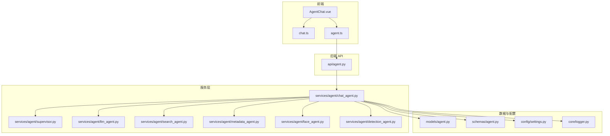
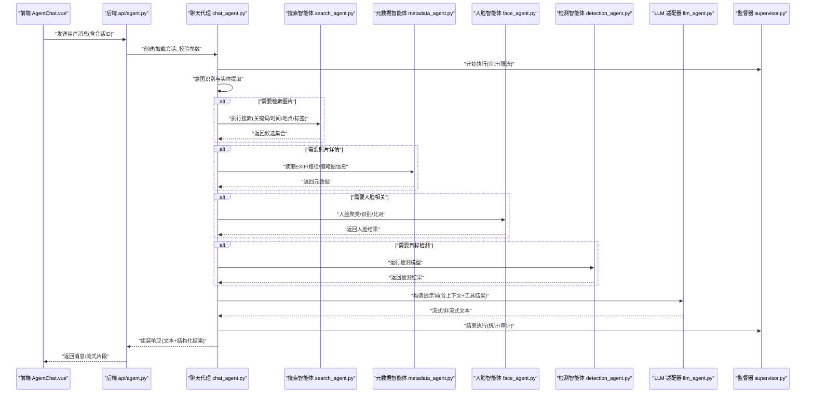
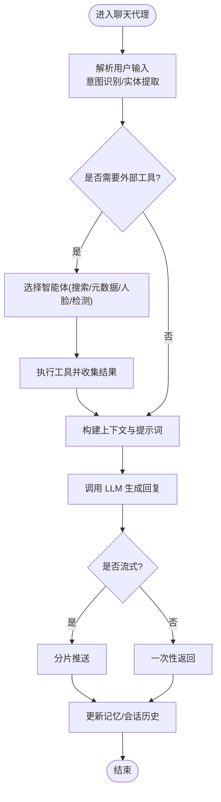
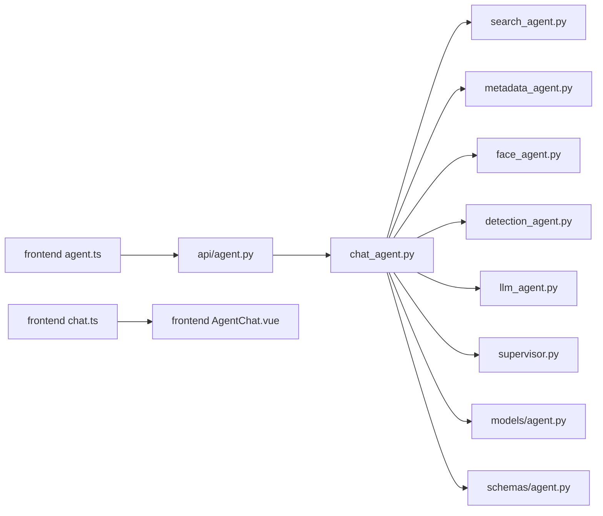

# 聊天代理

<cite>
**本文引用的文件**   
- [backend/app/api/agent.py](file://backend/app/api/agent.py)
- [backend/app/services/agent/chat_agent.py](file://backend/app/services/agent/chat_agent.py)
- [backend/app/services/agent/llm_agent.py](file://backend/app/services/agent/llm_agent.py)
- [backend/app/services/agent/supervisor.py](file://backend/app/services/agent/supervisor.py)
- [backend/app/services/agent/search_agent.py](file://backend/app/services/agent/search_agent.py)
- [backend/app/services/agent/metadata_agent.py](file://backend/app/services/agent/metadata_agent.py)
- [backend/app/services/agent/detection_agent.py](file://backend/app/services/agent/detection_agent.py)
- [backend/app/services/agent/face_agent.py](file://backend/app/services/agent/face_agent.py)
- [backend/app/models/agent.py](file://backend/app/models/agent.py)
- [backend/app/schemas/agent.py](file://backend/app/schemas/agent.py)
- [backend/app/config/settings.py](file://backend/app/config/settings.py)
- [backend/app/core/logger.py](file://backend/app/core/logger.py)
- [frontend/src/api/agent.ts](file://frontend/src/api/agent.ts)
- [frontend/src/stores/chat.ts](file://frontend/src/stores/chat.ts)
- [frontend/src/views/AgentChat.vue](file://frontend/src/views/AgentChat.vue)
</cite>

## 目录
1. [简介](#简介)
2. [项目结构](#项目结构)
3. [核心组件](#核心组件)
4. [架构总览](#架构总览)
5. [详细组件分析](#详细组件分析)
6. [依赖关系分析](#依赖关系分析)
7. [性能考虑](#性能考虑)
8. [故障排查指南](#故障排查指南)
9. [结论](#结论)
10. [附录](#附录)

## 简介
本文件为“聊天代理”模块的权威技术文档，面向开发者与使用者，系统阐述以下能力与机制：
- 自然语言处理能力与对话管理机制
- 与大型语言模型（LLM）的集成方式、提示词工程与上下文管理策略
- 对话状态跟踪、记忆机制与多轮对话处理逻辑
- 用户意图识别、实体提取与响应生成流程
- 配置项、性能调优与错误处理策略
- 实际使用示例与常见问题解决方案

该模块以“编排式智能体”为核心思想：一个聊天入口负责解析用户意图、维护会话上下文，并调度多个领域智能体（搜索、元数据、人脸、检测等）完成具体任务，最终由 LLM 综合生成自然语言回复。

## 项目结构
聊天代理相关代码主要分布在后端服务与前端界面两部分：
- 后端
  - API 层：暴露聊天接口，接收消息、返回流式或非流式响应
  - 服务层：聊天代理编排器、LLM 适配、领域智能体（搜索、元数据、人脸、检测）、监督器
  - 模型与模式：持久化会话、消息、工具调用结果等
  - 配置与日志：全局设置、结构化日志
- 前端
  - 视图与组件：聊天页面、输入框、消息气泡、确认对话框
  - 状态管理：本地会话历史、消息渲染、交互状态
  - API 客户端：封装聊天请求、流式读取与错误处理

图表来源
- [backend/app/api/agent.py](file://backend/app/api/agent.py)
- [backend/app/services/agent/chat_agent.py](file://backend/app/services/agent/chat_agent.py)
- [backend/app/services/agent/llm_agent.py](file://backend/app/services/agent/llm_agent.py)
- [backend/app/services/agent/supervisor.py](file://backend/app/services/agent/supervisor.py)
- [backend/app/services/agent/search_agent.py](file://backend/app/services/agent/search_agent.py)
- [backend/app/services/agent/metadata_agent.py](file://backend/app/services/agent/metadata_agent.py)
- [backend/app/services/agent/detection_agent.py](file://backend/app/services/agent/detection_agent.py)
- [backend/app/services/agent/face_agent.py](file://backend/app/services/agent/face_agent.py)
- [backend/app/models/agent.py](file://backend/app/models/agent.py)
- [backend/app/schemas/agent.py](file://backend/app/schemas/agent.py)
- [backend/app/config/settings.py](file://backend/app/config/settings.py)
- [backend/app/core/logger.py](file://backend/app/core/logger.py)
- [frontend/src/views/AgentChat.vue](file://frontend/src/views/AgentChat.vue)
- [frontend/src/stores/chat.ts](file://frontend/src/stores/chat.ts)
- [frontend/src/api/agent.ts](file://frontend/src/api/agent.ts)

章节来源
- [backend/app/api/agent.py](file://backend/app/api/agent.py)
- [backend/app/services/agent/chat_agent.py](file://backend/app/services/agent/chat_agent.py)
- [backend/app/services/agent/llm_agent.py](file://backend/app/services/agent/llm_agent.py)
- [backend/app/services/agent/supervisor.py](file://backend/app/services/agent/supervisor.py)
- [backend/app/services/agent/search_agent.py](file://backend/app/services/agent/search_agent.py)
- [backend/app/services/agent/metadata_agent.py](file://backend/app/services/agent/metadata_agent.py)
- [backend/app/services/agent/detection_agent.py](file://backend/app/services/agent/detection_agent.py)
- [backend/app/services/agent/face_agent.py](file://backend/app/services/agent/face_agent.py)
- [backend/app/models/agent.py](file://backend/app/models/agent.py)
- [backend/app/schemas/agent.py](file://backend/app/schemas/agent.py)
- [backend/app/config/settings.py](file://backend/app/config/settings.py)
- [backend/app/core/logger.py](file://backend/app/core/logger.py)
- [frontend/src/views/AgentChat.vue](file://frontend/src/views/AgentChat.vue)
- [frontend/src/stores/chat.ts](file://frontend/src/stores/chat.ts)
- [frontend/src/api/agent.ts](file://frontend/src/api/agent.ts)

## 核心组件
- 聊天入口 API：负责鉴权、参数校验、会话路由与响应格式统一
- 聊天代理编排器：解析意图、维护上下文、选择并调用领域智能体、汇总结果
- LLM 适配器：抽象不同厂商/模型的调用协议、流式输出、重试与降级
- 领域智能体：搜索、元数据、人脸、检测等，提供可组合的工具能力
- 监督器：对执行过程进行监控、限流、熔断与审计
- 数据模型与模式：会话、消息、工具调用记录、结果摘要等
- 配置与日志：全局开关、超时、并发、缓存、日志级别等

章节来源
- [backend/app/api/agent.py](file://backend/app/api/agent.py)
- [backend/app/services/agent/chat_agent.py](file://backend/app/services/agent/chat_agent.py)
- [backend/app/services/agent/llm_agent.py](file://backend/app/services/agent/llm_agent.py)
- [backend/app/services/agent/supervisor.py](file://backend/app/services/agent/supervisor.py)
- [backend/app/services/agent/search_agent.py](file://backend/app/services/agent/search_agent.py)
- [backend/app/services/agent/metadata_agent.py](file://backend/app/services/agent/metadata_agent.py)
- [backend/app/services/agent/detection_agent.py](file://backend/app/services/agent/detection_agent.py)
- [backend/app/services/agent/face_agent.py](file://backend/app/services/agent/face_agent.py)
- [backend/app/models/agent.py](file://backend/app/models/agent.py)
- [backend/app/schemas/agent.py](file://backend/app/schemas/agent.py)
- [backend/app/config/settings.py](file://backend/app/config/settings.py)
- [backend/app/core/logger.py](file://backend/app/core/logger.py)

## 架构总览
聊天代理采用“API 编排 + 领域智能体 + LLM 生成”的分层架构。前端通过 REST/WebSocket 发起请求，后端 API 将请求转发至聊天代理；聊天代理根据用户意图选择合适工具或子智能体，必要时调用 LLM 进行推理与总结，最后将结果以流式或非流式返回前端。

图表来源
- [backend/app/api/agent.py](file://backend/app/api/agent.py)
- [backend/app/services/agent/chat_agent.py](file://backend/app/services/agent/chat_agent.py)
- [backend/app/services/agent/search_agent.py](file://backend/app/services/agent/search_agent.py)
- [backend/app/services/agent/metadata_agent.py](file://backend/app/services/agent/metadata_agent.py)
- [backend/app/services/agent/face_agent.py](file://backend/app/services/agent/face_agent.py)
- [backend/app/services/agent/detection_agent.py](file://backend/app/services/agent/detection_agent.py)
- [backend/app/services/agent/llm_agent.py](file://backend/app/services/agent/llm_agent.py)
- [backend/app/services/agent/supervisor.py](file://backend/app/services/agent/supervisor.py)
- [frontend/src/views/AgentChat.vue](file://frontend/src/views/AgentChat.vue)

## 详细组件分析

### 聊天入口 API
职责
- 接收前端聊天请求，校验鉴权与会话参数
- 将请求路由到聊天代理编排器
- 支持流式与非流式响应，统一错误码与消息格式
- 记录请求审计日志

关键流程
- 参数校验与会话加载
- 调用聊天代理处理
- 构建响应（文本、结构化结果、分页/游标）
- 异常捕获与降级返回

章节来源
- [backend/app/api/agent.py](file://backend/app/api/agent.py)

### 聊天代理编排器（Chat Agent）
职责
- 意图识别与实体提取：从用户输入中抽取查询条件（时间、地点、人物、标签等）
- 上下文管理：维护会话历史、最近 N 条消息、工具调用摘要
- 智能体调度：根据意图选择搜索、元数据、人脸、检测等子智能体
- 结果聚合与提示词构造：将工具结果与上下文合并，生成高质量提示词
- 与 LLM 交互：调用 LLM 生成自然语言回复，支持流式增量输出
- 记忆机制：将重要事实与偏好写入短期/长期记忆，供后续轮次复用

数据结构要点
- 会话对象：包含会话 ID、历史消息、记忆条目、工具调用记录
- 消息对象：角色、内容、时间戳、附加结构化字段（如搜索结果摘要）
- 工具调用对象：名称、参数、结果摘要、耗时、错误信息

提示词工程
- 系统提示：定义角色、能力边界、输出格式与安全约束
- 上下文注入：最近对话、记忆摘要、当前工具结果
- 动态模板：按意图类型切换模板，减少无关信息干扰

错误处理与降级
- 工具失败时回退到仅基于上下文的回答
- LLM 不可用时返回友好提示与替代方案
- 超时与重试策略，避免雪崩

图表来源
- [backend/app/services/agent/chat_agent.py](file://backend/app/services/agent/chat_agent.py)
- [backend/app/services/agent/search_agent.py](file://backend/app/services/agent/search_agent.py)
- [backend/app/services/agent/metadata_agent.py](file://backend/app/services/agent/metadata_agent.py)
- [backend/app/services/agent/face_agent.py](file://backend/app/services/agent/face_agent.py)
- [backend/app/services/agent/detection_agent.py](file://backend/app/services/agent/detection_agent.py)
- [backend/app/services/agent/llm_agent.py](file://backend/app/services/agent/llm_agent.py)

章节来源
- [backend/app/services/agent/chat_agent.py](file://backend/app/services/agent/chat_agent.py)
- [backend/app/models/agent.py](file://backend/app/models/agent.py)
- [backend/app/schemas/agent.py](file://backend/app/schemas/agent.py)

### LLM 适配器
职责
- 抽象不同 LLM 提供商的调用接口（REST/SDK）
- 统一请求/响应格式，支持流式增量输出
- 实现重试、超时、熔断与降级策略
- 可选：缓存高频问答、压缩长上下文

关键特性
- 连接池与并发控制
- 令牌计数与成本估算
- 安全过滤与敏感信息脱敏

章节来源
- [backend/app/services/agent/llm_agent.py](file://backend/app/services/agent/llm_agent.py)
- [backend/app/config/settings.py](file://backend/app/config/settings.py)

### 领域智能体
- 搜索智能体：根据关键词、时间范围、地理位置、标签等条件检索图片集合，返回摘要与分页信息
- 元数据智能体：读取 EXIF、路径、缩略图、文件大小等元信息，用于展示与筛选
- 人脸智能体：执行人脸聚类、识别、比对，返回人脸标签与关联照片
- 检测智能体：运行通用目标检测模型，返回检测框与类别

协作方式
- 聊天代理按需并行或串行调用，合并结果后交由 LLM 总结
- 所有工具调用均被记录，便于审计与调试

章节来源
- [backend/app/services/agent/search_agent.py](file://backend/app/services/agent/search_agent.py)
- [backend/app/services/agent/metadata_agent.py](file://backend/app/services/agent/metadata_agent.py)
- [backend/app/services/agent/face_agent.py](file://backend/app/services/agent/face_agent.py)
- [backend/app/services/agent/detection_agent.py](file://backend/app/services/agent/detection_agent.py)

### 监督器（Supervisor）
职责
- 执行审计：记录每次调用的开始/结束、耗时、资源占用
- 限流与熔断：防止突发流量导致系统过载
- 告警与追踪：在异常时触发告警，输出链路追踪 ID

章节来源
- [backend/app/services/agent/supervisor.py](file://backend/app/services/agent/supervisor.py)

### 数据模型与模式
- 会话模型：会话 ID、创建时间、更新时间、状态、记忆索引
- 消息模型：角色、内容、时间戳、附件、结构化字段
- 工具调用模型：名称、参数、结果摘要、错误、耗时
- 模式校验：前后端一致的 Pydantic/TS 类型定义，确保契约稳定

章节来源
- [backend/app/models/agent.py](file://backend/app/models/agent.py)
- [backend/app/schemas/agent.py](file://backend/app/schemas/agent.py)

### 前端集成
- 视图组件：聊天页面、消息气泡、输入框、确认对话框
- 状态管理：本地会话历史、消息列表、加载态、错误态
- API 客户端：封装聊天请求、流式读取、断线重连、错误提示

章节来源
- [frontend/src/views/AgentChat.vue](file://frontend/src/views/AgentChat.vue)
- [frontend/src/stores/chat.ts](file://frontend/src/stores/chat.ts)
- [frontend/src/api/agent.ts](file://frontend/src/api/agent.ts)

## 依赖关系分析
聊天代理与各组件之间的耦合关系如下：
- API 层仅依赖聊天代理与公共模式，保持薄控制器
- 聊天代理依赖各领域智能体与 LLM 适配器，并通过监督器进行横切关注点治理
- 数据模型与模式在各层共享，保证一致性
- 前端通过 API 客户端与后端交互，状态管理与 UI 解耦

图表来源
- [backend/app/api/agent.py](file://backend/app/api/agent.py)
- [backend/app/services/agent/chat_agent.py](file://backend/app/services/agent/chat_agent.py)
- [backend/app/services/agent/search_agent.py](file://backend/app/services/agent/search_agent.py)
- [backend/app/services/agent/metadata_agent.py](file://backend/app/services/agent/metadata_agent.py)
- [backend/app/services/agent/face_agent.py](file://backend/app/services/agent/face_agent.py)
- [backend/app/services/agent/detection_agent.py](file://backend/app/services/agent/detection_agent.py)
- [backend/app/services/agent/llm_agent.py](file://backend/app/services/agent/llm_agent.py)
- [backend/app/services/agent/supervisor.py](file://backend/app/services/agent/supervisor.py)
- [backend/app/models/agent.py](file://backend/app/models/agent.py)
- [backend/app/schemas/agent.py](file://backend/app/schemas/agent.py)
- [frontend/src/api/agent.ts](file://frontend/src/api/agent.ts)
- [frontend/src/stores/chat.ts](file://frontend/src/stores/chat.ts)
- [frontend/src/views/AgentChat.vue](file://frontend/src/views/AgentChat.vue)

章节来源
- [backend/app/api/agent.py](file://backend/app/api/agent.py)
- [backend/app/services/agent/chat_agent.py](file://backend/app/services/agent/chat_agent.py)
- [backend/app/services/agent/llm_agent.py](file://backend/app/services/agent/llm_agent.py)
- [backend/app/services/agent/supervisor.py](file://backend/app/services/agent/supervisor.py)
- [backend/app/models/agent.py](file://backend/app/models/agent.py)
- [backend/app/schemas/agent.py](file://backend/app/schemas/agent.py)
- [frontend/src/api/agent.ts](file://frontend/src/api/agent.ts)
- [frontend/src/stores/chat.ts](file://frontend/src/stores/chat.ts)
- [frontend/src/views/AgentChat.vue](file://frontend/src/views/AgentChat.vue)

## 性能考虑
- 流式响应：优先使用流式输出降低首字节延迟，提升用户体验
- 上下文裁剪：限制历史消息长度，使用摘要或滑动窗口减少 LLM 输入规模
- 工具并行：对无依赖的智能体调用并行执行，缩短整体时延
- 缓存策略：对热点查询结果与 LLM 输出进行短期缓存，注意失效策略
- 并发与限流：结合监督器进行速率限制与熔断，保护下游服务
- 资源隔离：为 CPU/GPU 密集型任务（检测、人脸）分配独立队列与线程池
- 日志采样：在高吞吐场景下启用采样日志，避免 I/O 瓶颈

[本节为通用指导，不直接分析具体文件]

## 故障排查指南
常见问题与定位方法
- 意图识别不准
  - 检查提示词模板与实体抽取规则
  - 查看聊天代理日志中的意图分类与实体字段
- 工具调用失败
  - 核对智能体返回的错误码与消息
  - 检查网络、权限与依赖服务可用性
- LLM 超时或不可用
  - 调整超时与重试参数
  - 启用降级策略，返回友好提示
- 流式中断
  - 检查前端 WebSocket/事件流处理
  - 确认服务端未提前关闭连接
- 内存与性能问题
  - 评估上下文大小与并发度
  - 开启采样日志与指标采集

定位建议
- 使用结构化日志与链路追踪 ID，快速定位请求路径
- 在监督器中记录关键指标（QPS、P95/P99、错误率）
- 对异常分支增加更详细的上下文快照

章节来源
- [backend/app/core/logger.py](file://backend/app/core/logger.py)
- [backend/app/services/agent/supervisor.py](file://backend/app/services/agent/supervisor.py)
- [backend/app/services/agent/chat_agent.py](file://backend/app/services/agent/chat_agent.py)
- [backend/app/services/agent/llm_agent.py](file://backend/app/services/agent/llm_agent.py)

## 结论
聊天代理通过清晰的编排与模块化设计，实现了强大的自然语言处理能力与灵活的对话管理机制。借助提示词工程、上下文管理与记忆机制，系统在多轮对话与复杂任务场景中具备良好稳定性与可扩展性。配合完善的配置、性能调优与错误处理策略，可在生产环境中提供高质量的智能对话体验。

[本节为总结性内容，不直接分析具体文件]

## 附录

### 配置选项（示例）
- LLM 相关
  - 提供商、模型名、密钥、基础 URL
  - 最大令牌数、温度、Top-P、Top-K
  - 超时、重试次数、并发上限
- 上下文与记忆
  - 历史消息保留数量
  - 记忆条目上限与过期策略
  - 上下文压缩开关
- 工具与智能体
  - 搜索索引、人脸库、检测模型路径
  - 工具超时与重试策略
- 监控与日志
  - 日志级别、采样率
  - 指标上报地址

章节来源
- [backend/app/config/settings.py](file://backend/app/config/settings.py)

### 使用示例（端到端）
- 前端发起聊天请求
  - 调用 API 客户端，传入用户消息与会话 ID
  - 监听流式响应，逐步渲染消息
- 后端处理
  - API 校验与会话加载
  - 聊天代理意图识别与工具调度
  - LLM 生成回复并返回
- 结果呈现
  - 前端显示文本与结构化结果（如图片卡片、人脸标签）

章节来源
- [frontend/src/api/agent.ts](file://frontend/src/api/agent.ts)
- [frontend/src/stores/chat.ts](file://frontend/src/stores/chat.ts)
- [frontend/src/views/AgentChat.vue](file://frontend/src/views/AgentChat.vue)
- [backend/app/api/agent.py](file://backend/app/api/agent.py)
- [backend/app/services/agent/chat_agent.py](file://backend/app/services/agent/chat_agent.py)
- [backend/app/services/agent/llm_agent.py](file://backend/app/services/agent/llm_agent.py)