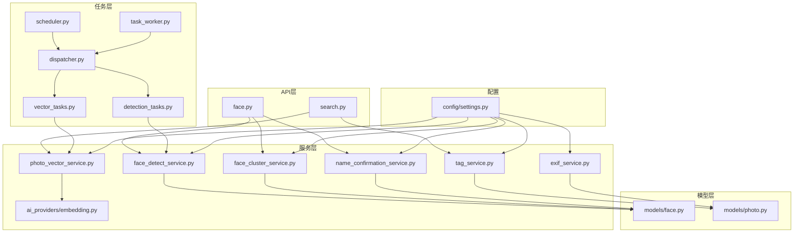
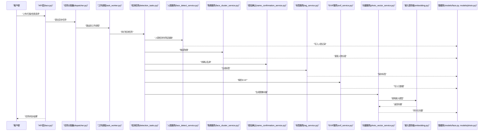
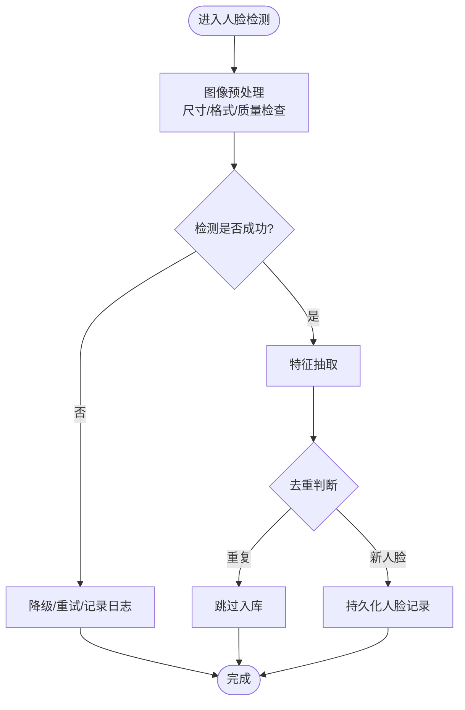
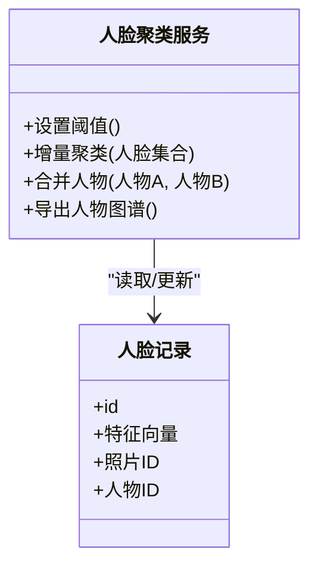
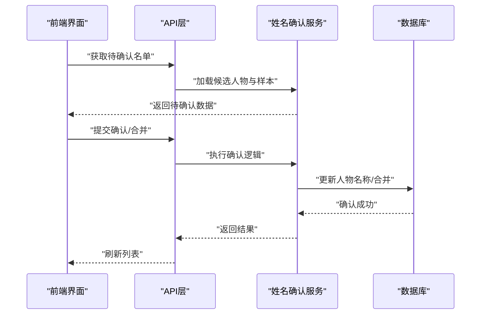
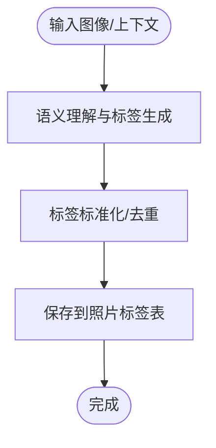
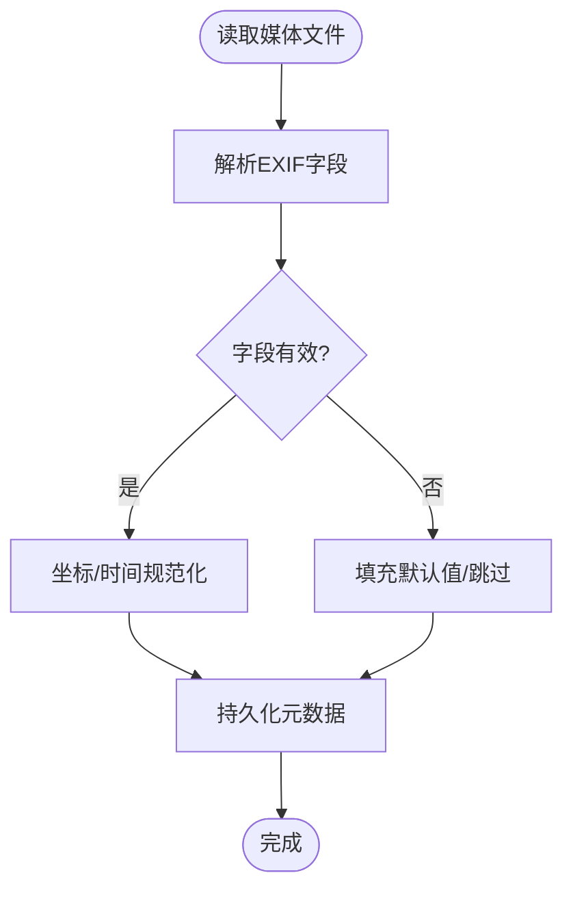
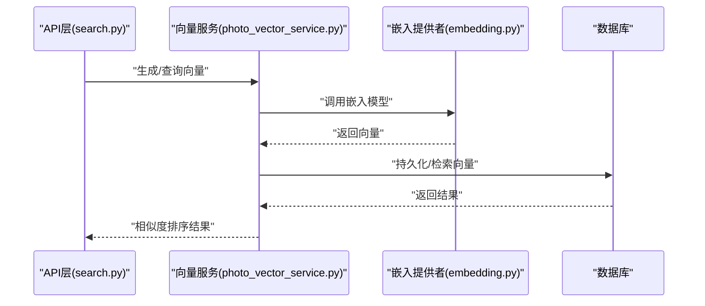
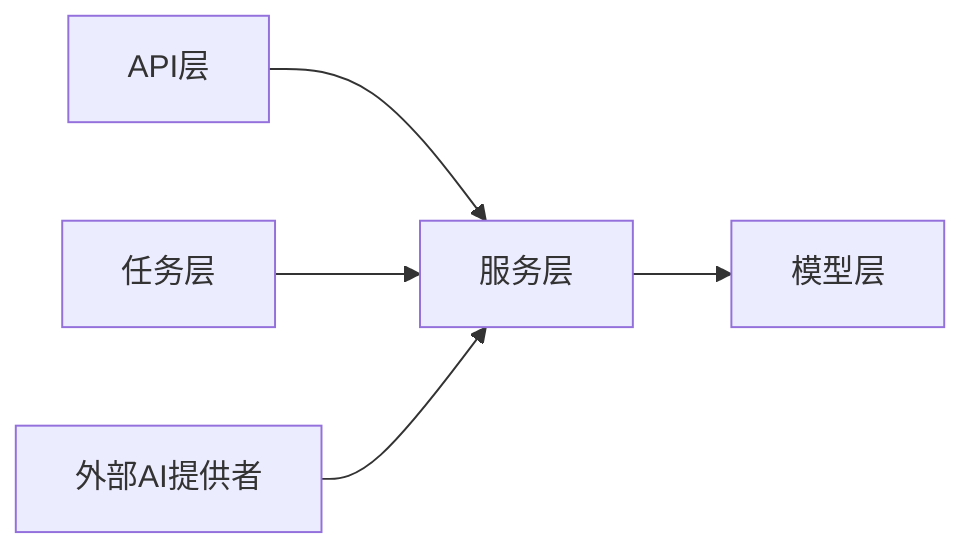

# AI服务模块

<cite>
**本文引用的文件**   
- [backend/app/services/face_detect_service.py](file://backend/app/services/face_detect_service.py)
- [backend/app/services/face_cluster_service.py](file://backend/app/services/face_cluster_service.py)
- [backend/app/services/name_confirmation_service.py](file://backend/app/services/name_confirmation_service.py)
- [backend/app/services/tag_service.py](file://backend/app/services/tag_service.py)
- [backend/app/services/exif_service.py](file://backend/app/services/exif_service.py)
- [backend/app/services/photo_vector_service.py](file://backend/app/services/photo_vector_service.py)
- [backend/app/services/ai_providers/embedding.py](file://backend/app/services/ai_providers/embedding.py)
- [backend/app/tasks/detection_tasks.py](file://backend/app/tasks/detection_tasks.py)
- [backend/app/tasks/vector_tasks.py](file://backend/app/tasks/vector_tasks.py)
- [backend/app/tasks/dispatcher.py](file://backend/app/tasks/dispatcher.py)
- [backend/app/tasks/scheduler.py](file://backend/app/tasks/scheduler.py)
- [backend/app/tasks/task_worker.py](file://backend/app/tasks/task_worker.py)
- [backend/app/api/face.py](file://backend/app/api/face.py)
- [backend/app/api/search.py](file://backend/app/api/search.py)
- [backend/app/models/face.py](file://backend/app/models/face.py)
- [backend/app/models/photo.py](file://backend/app/models/photo.py)
- [backend/app/config/settings.py](file://backend/app/config/settings.py)
</cite>

## 目录
1. [简介](#简介)
2. [项目结构](#项目结构)
3. [核心组件](#核心组件)
4. [架构总览](#架构总览)
5. [详细组件分析](#详细组件分析)
6. [依赖关系分析](#依赖关系分析)
7. [性能考虑](#性能考虑)
8. [故障排查指南](#故障排查指南)
9. [结论](#结论)
10. [附录](#附录)

## 简介
本章节面向AI智能相册管理系统的AI服务模块，聚焦以下能力：人脸识别、人脸聚类、姓名确认、标签生成与EXIF信息提取。文档将深入解释各服务的实现原理与技术细节，涵盖向量嵌入生成、语义理解、图像分析与元数据提取；说明AI算法调用流程、结果处理与错误恢复机制；给出配置选项、性能调优与缓存策略；并阐述AI服务与任务调度系统的集成方式及异步处理模式。

## 项目结构
AI服务模块位于后端应用的服务层与任务层，API层提供对外接口，模型层持久化结果，配置中心统一参数。关键目录与职责如下：
- services：具体AI能力实现（人脸检测、聚类、姓名确认、标签、EXIF、向量等）
- ai_providers：外部AI能力提供者封装（如嵌入向量）
- tasks：异步任务定义、分发、调度与工作进程
- api：HTTP接口，编排服务调用
- models：数据库模型（人脸、照片等）
- config：全局配置项

图表来源
- [backend/app/api/face.py](file://backend/app/api/face.py)
- [backend/app/api/search.py](file://backend/app/api/search.py)
- [backend/app/services/face_detect_service.py](file://backend/app/services/face_detect_service.py)
- [backend/app/services/face_cluster_service.py](file://backend/app/services/face_cluster_service.py)
- [backend/app/services/name_confirmation_service.py](file://backend/app/services/name_confirmation_service.py)
- [backend/app/services/tag_service.py](file://backend/app/services/tag_service.py)
- [backend/app/services/exif_service.py](file://backend/app/services/exif_service.py)
- [backend/app/services/photo_vector_service.py](file://backend/app/services/photo_vector_service.py)
- [backend/app/services/ai_providers/embedding.py](file://backend/app/services/ai_providers/embedding.py)
- [backend/app/tasks/detection_tasks.py](file://backend/app/tasks/detection_tasks.py)
- [backend/app/tasks/vector_tasks.py](file://backend/app/tasks/vector_tasks.py)
- [backend/app/tasks/dispatcher.py](file://backend/app/tasks/dispatcher.py)
- [backend/app/tasks/scheduler.py](file://backend/app/tasks/scheduler.py)
- [backend/app/tasks/task_worker.py](file://backend/app/tasks/task_worker.py)
- [backend/app/models/face.py](file://backend/app/models/face.py)
- [backend/app/models/photo.py](file://backend/app/models/photo.py)
- [backend/app/config/settings.py](file://backend/app/config/settings.py)

章节来源
- [backend/app/api/face.py](file://backend/app/api/face.py)
- [backend/app/api/search.py](file://backend/app/api/search.py)
- [backend/app/services/face_detect_service.py](file://backend/app/services/face_detect_service.py)
- [backend/app/services/face_cluster_service.py](file://backend/app/services/face_cluster_service.py)
- [backend/app/services/name_confirmation_service.py](file://backend/app/services/name_confirmation_service.py)
- [backend/app/services/tag_service.py](file://backend/app/services/tag_service.py)
- [backend/app/services/exif_service.py](file://backend/app/services/exif_service.py)
- [backend/app/services/photo_vector_service.py](file://backend/app/services/photo_vector_service.py)
- [backend/app/services/ai_providers/embedding.py](file://backend/app/services/ai_providers/embedding.py)
- [backend/app/tasks/detection_tasks.py](file://backend/app/tasks/detection_tasks.py)
- [backend/app/tasks/vector_tasks.py](file://backend/app/tasks/vector_tasks.py)
- [backend/app/tasks/dispatcher.py](file://backend/app/tasks/dispatcher.py)
- [backend/app/tasks/scheduler.py](file://backend/app/tasks/scheduler.py)
- [backend/app/tasks/task_worker.py](file://backend/app/tasks/task_worker.py)
- [backend/app/models/face.py](file://backend/app/models/face.py)
- [backend/app/models/photo.py](file://backend/app/models/photo.py)
- [backend/app/config/settings.py](file://backend/app/config/settings.py)

## 核心组件
本节概述五大AI服务的能力边界与交互要点：
- 人脸识别服务：负责从图像中检测人脸、裁剪、特征抽取与存储，支撑后续聚类与识别。
- 人脸聚类服务：基于人脸特征进行相似度计算与分组，形成“人物”实体，便于检索与管理。
- 姓名确认服务：在用户参与下对疑似人物进行命名或合并，维护最终的人名映射。
- 标签服务：结合图像语义与上下文生成图片标签，用于搜索与推荐。
- EXIF信息提取服务：解析媒体文件的元数据（拍摄时间、设备、地理位置等），丰富索引与展示。

此外，向量嵌入服务为图像/文本生成高维向量，配合语义检索与相似性查询。

章节来源
- [backend/app/services/face_detect_service.py](file://backend/app/services/face_detect_service.py)
- [backend/app/services/face_cluster_service.py](file://backend/app/services/face_cluster_service.py)
- [backend/app/services/name_confirmation_service.py](file://backend/app/services/name_confirmation_service.py)
- [backend/app/services/tag_service.py](file://backend/app/services/tag_service.py)
- [backend/app/services/exif_service.py](file://backend/app/services/exif_service.py)
- [backend/app/services/photo_vector_service.py](file://backend/app/services/photo_vector_service.py)
- [backend/app/services/ai_providers/embedding.py](file://backend/app/services/ai_providers/embedding.py)

## 架构总览
AI服务采用“API编排 + 服务实现 + 任务队列 + 外部AI提供者”的分层架构。同步请求由API层触发，复杂耗时操作通过任务系统异步执行，结果落库后供前端查询。

图表来源
- [backend/app/api/face.py](file://backend/app/api/face.py)
- [backend/app/tasks/dispatcher.py](file://backend/app/tasks/dispatcher.py)
- [backend/app/tasks/task_worker.py](file://backend/app/tasks/task_worker.py)
- [backend/app/tasks/detection_tasks.py](file://backend/app/tasks/detection_tasks.py)
- [backend/app/services/face_detect_service.py](file://backend/app/services/face_detect_service.py)
- [backend/app/services/face_cluster_service.py](file://backend/app/services/face_cluster_service.py)
- [backend/app/services/name_confirmation_service.py](file://backend/app/services/name_confirmation_service.py)
- [backend/app/services/tag_service.py](file://backend/app/services/tag_service.py)
- [backend/app/services/exif_service.py](file://backend/app/services/exif_service.py)
- [backend/app/services/photo_vector_service.py](file://backend/app/services/photo_vector_service.py)
- [backend/app/services/ai_providers/embedding.py](file://backend/app/services/ai_providers/embedding.py)
- [backend/app/models/face.py](file://backend/app/models/face.py)
- [backend/app/models/photo.py](file://backend/app/models/photo.py)

## 详细组件分析

### 人脸识别服务
- 功能要点
  - 图像预处理与质量校验
  - 人脸检测与关键点定位
  - 人脸特征抽取与向量化
  - 人脸记录持久化与去重
- 技术细节
  - 使用可配置的阈值控制检测置信度与相似度匹配
  - 支持批量处理与并发限制
  - 失败重试与降级策略（如跳过低质量图）
- 结果处理
  - 将人脸框、特征向量与关联照片ID写入模型
  - 输出统计信息（检测数量、平均耗时）
- 错误恢复
  - 网络/模型异常时回退至本地轻量模型或标记待重试
  - 幂等写入避免重复入库

图表来源
- [backend/app/services/face_detect_service.py](file://backend/app/services/face_detect_service.py)
- [backend/app/models/face.py](file://backend/app/models/face.py)

章节来源
- [backend/app/services/face_detect_service.py](file://backend/app/services/face_detect_service.py)
- [backend/app/models/face.py](file://backend/app/models/face.py)

### 人脸聚类服务
- 功能要点
  - 基于人脸特征的相似度计算与分组
  - 动态阈值与增量更新
  - 人物实体管理与合并
- 技术细节
  - 使用距离度量与阈值策略平衡召回与精度
  - 支持按时间窗口或批次增量聚类
- 结果处理
  - 将人脸归属到人物组，更新人物主键与成员列表
- 错误恢复
  - 大规模数据时分片处理，失败分片重试
  - 冲突合并策略（保留高质量特征）

图表来源
- [backend/app/services/face_cluster_service.py](file://backend/app/services/face_cluster_service.py)
- [backend/app/models/face.py](file://backend/app/models/face.py)

章节来源
- [backend/app/services/face_cluster_service.py](file://backend/app/services/face_cluster_service.py)
- [backend/app/models/face.py](file://backend/app/models/face.py)

### 姓名确认服务
- 功能要点
  - 生成待确认名单（候选人物+样本图）
  - 支持用户确认、重命名、合并
  - 维护人名到人物的映射
- 技术细节
  - 结合人脸聚类结果与历史命名记录
  - 提供一致性校验与冲突提示
- 结果处理
  - 更新人物名称与关联关系
  - 审计日志记录变更
- 错误恢复
  - 并发确认加锁，防止覆盖
  - 事务性更新保证一致性

图表来源
- [backend/app/services/name_confirmation_service.py](file://backend/app/services/name_confirmation_service.py)
- [backend/app/models/face.py](file://backend/app/models/face.py)

章节来源
- [backend/app/services/name_confirmation_service.py](file://backend/app/services/name_confirmation_service.py)
- [backend/app/models/face.py](file://backend/app/models/face.py)

### 标签服务
- 功能要点
  - 基于图像语义与上下文生成标签
  - 支持多粒度标签（主体、场景、属性）
  - 标签标准化与去重
- 技术细节
  - 结合视觉模型与语言模型进行语义理解
  - 规则过滤与同义词归一
- 结果处理
  - 将标签与照片关联，构建检索索引
- 错误恢复
  - 模型不可用时回退到关键词提取或空标签
  - 标签写入失败重试

图表来源
- [backend/app/services/tag_service.py](file://backend/app/services/tag_service.py)
- [backend/app/models/photo.py](file://backend/app/models/photo.py)

章节来源
- [backend/app/services/tag_service.py](file://backend/app/services/tag_service.py)
- [backend/app/models/photo.py](file://backend/app/models/photo.py)

### EXIF信息提取服务
- 功能要点
  - 解析媒体文件EXIF字段（时间、设备、GPS等）
  - 坐标转换与时区校正
  - 缺失字段补全与默认值
- 技术细节
  - 兼容多种图像/视频容器格式
  - 大文件流式读取降低内存占用
- 结果处理
  - 写入照片元数据表，建立地理与时间索引
- 错误恢复
  - 解析失败记录日志并跳过，不影响整体流程

图表来源
- [backend/app/services/exif_service.py](file://backend/app/services/exif_service.py)
- [backend/app/models/photo.py](file://backend/app/models/photo.py)

章节来源
- [backend/app/services/exif_service.py](file://backend/app/services/exif_service.py)
- [backend/app/models/photo.py](file://backend/app/models/photo.py)

### 向量嵌入与语义检索
- 功能要点
  - 为图像/文本生成高维向量嵌入
  - 支持相似度检索与混合检索（向量+关键词）
- 技术细节
  - 通过嵌入提供者封装外部AI能力
  - 批量化推理与缓存命中优化
- 结果处理
  - 向量持久化并与资源ID关联
- 错误恢复
  - 外部服务超时/限流时退避重试与降级

图表来源
- [backend/app/api/search.py](file://backend/app/api/search.py)
- [backend/app/services/photo_vector_service.py](file://backend/app/services/photo_vector_service.py)
- [backend/app/services/ai_providers/embedding.py](file://backend/app/services/ai_providers/embedding.py)

章节来源
- [backend/app/api/search.py](file://backend/app/api/search.py)
- [backend/app/services/photo_vector_service.py](file://backend/app/services/photo_vector_service.py)
- [backend/app/services/ai_providers/embedding.py](file://backend/app/services/ai_providers/embedding.py)

## 依赖关系分析
- 组件耦合
  - API层仅依赖服务层接口，保持松耦合
  - 服务层依赖模型层进行数据持久化
  - 任务层解耦耗时操作，提升吞吐
- 外部依赖
  - 嵌入提供者作为AI能力抽象，便于替换与扩展
- 潜在循环依赖
  - 服务层不直接导入任务层，避免循环
- 接口契约
  - 服务方法签名稳定，错误码与返回值规范统一

图表来源
- [backend/app/api/face.py](file://backend/app/api/face.py)
- [backend/app/api/search.py](file://backend/app/api/search.py)
- [backend/app/services/face_detect_service.py](file://backend/app/services/face_detect_service.py)
- [backend/app/services/face_cluster_service.py](file://backend/app/services/face_cluster_service.py)
- [backend/app/services/name_confirmation_service.py](file://backend/app/services/name_confirmation_service.py)
- [backend/app/services/tag_service.py](file://backend/app/services/tag_service.py)
- [backend/app/services/exif_service.py](file://backend/app/services/exif_service.py)
- [backend/app/services/photo_vector_service.py](file://backend/app/services/photo_vector_service.py)
- [backend/app/services/ai_providers/embedding.py](file://backend/app/services/ai_providers/embedding.py)
- [backend/app/tasks/detection_tasks.py](file://backend/app/tasks/detection_tasks.py)
- [backend/app/tasks/vector_tasks.py](file://backend/app/tasks/vector_tasks.py)
- [backend/app/models/face.py](file://backend/app/models/face.py)
- [backend/app/models/photo.py](file://backend/app/models/photo.py)

章节来源
- [backend/app/api/face.py](file://backend/app/api/face.py)
- [backend/app/api/search.py](file://backend/app/api/search.py)
- [backend/app/services/face_detect_service.py](file://backend/app/services/face_detect_service.py)
- [backend/app/services/face_cluster_service.py](file://backend/app/services/face_cluster_service.py)
- [backend/app/services/name_confirmation_service.py](file://backend/app/services/name_confirmation_service.py)
- [backend/app/services/tag_service.py](file://backend/app/services/tag_service.py)
- [backend/app/services/exif_service.py](file://backend/app/services/exif_service.py)
- [backend/app/services/photo_vector_service.py](file://backend/app/services/photo_vector_service.py)
- [backend/app/services/ai_providers/embedding.py](file://backend/app/services/ai_providers/embedding.py)
- [backend/app/tasks/detection_tasks.py](file://backend/app/tasks/detection_tasks.py)
- [backend/app/tasks/vector_tasks.py](file://backend/app/tasks/vector_tasks.py)
- [backend/app/models/face.py](file://backend/app/models/face.py)
- [backend/app/models/photo.py](file://backend/app/models/photo.py)

## 性能考虑
- 并发与批处理
  - 任务并行度可调，避免资源争用
  - 批量推理减少模型切换开销
- 缓存策略
  - 向量与标签结果缓存，命中率优先
  - 热数据近线缓存，冷数据归档
- 阈值与精度权衡
  - 人脸检测与相似度阈值可按场景调整
  - 标签生成多粒度组合，按需启用
- 资源隔离
  - GPU/CPU任务分离，队列分级
- 监控与指标
  - 关键路径耗时、错误率、队列积压监控

[本节为通用指导，无需特定文件引用]

## 故障排查指南
- 常见问题
  - 外部AI服务超时/限流：检查网络与配额，启用退避重试
  - 模型加载失败：核对配置与路径，回退到本地模型
  - 任务堆积：扩容工作进程，调整队列优先级
  - 数据不一致：检查事务与幂等写入
- 诊断步骤
  - 查看任务日志与错误堆栈
  - 验证模型与提供者连通性
  - 回放失败任务并复现
- 恢复策略
  - 自动重试与人工干预并重
  - 断点续跑与增量修复

章节来源
- [backend/app/tasks/dispatcher.py](file://backend/app/tasks/dispatcher.py)
- [backend/app/tasks/task_worker.py](file://backend/app/tasks/task_worker.py)
- [backend/app/services/ai_providers/embedding.py](file://backend/app/services/ai_providers/embedding.py)

## 结论
AI服务模块以清晰的分层与异步任务机制，实现了人脸识别、聚类、姓名确认、标签与EXIF提取等核心能力。通过统一的配置与错误恢复策略，系统在可扩展性与稳定性之间取得平衡。建议在生产环境完善监控告警与容量规划，持续优化阈值与缓存策略以提升用户体验。

[本节为总结性内容，无需特定文件引用]

## 附录
- 配置项参考
  - 人脸检测阈值、相似度阈值
  - 聚类窗口大小与增量策略
  - 标签生成模型开关与粒度
  - EXIF解析容错与默认值
  - 向量嵌入模型选择与批大小
- 任务调度集成
  - 任务类型注册与路由
  - 工作进程池与负载均衡
  - 定时任务与事件驱动

章节来源
- [backend/app/config/settings.py](file://backend/app/config/settings.py)
- [backend/app/tasks/scheduler.py](file://backend/app/tasks/scheduler.py)
- [backend/app/tasks/dispatcher.py](file://backend/app/tasks/dispatcher.py)
- [backend/app/tasks/task_worker.py](file://backend/app/tasks/task_worker.py)