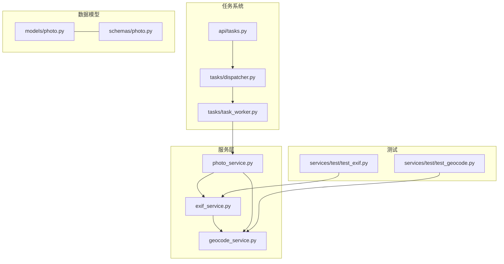
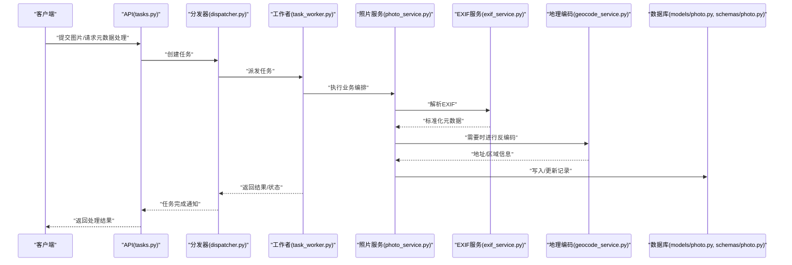
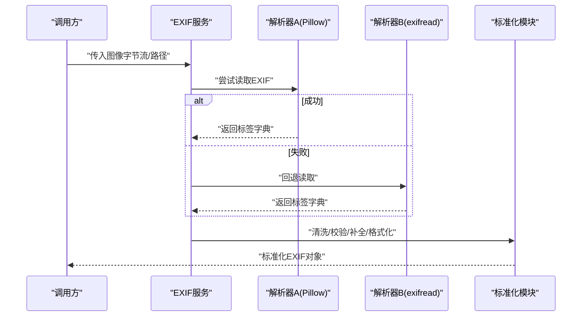
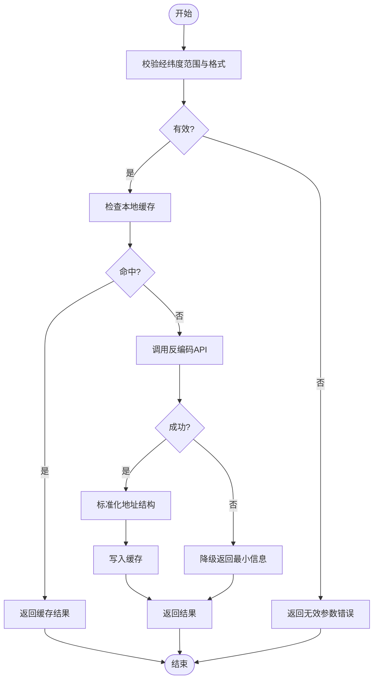
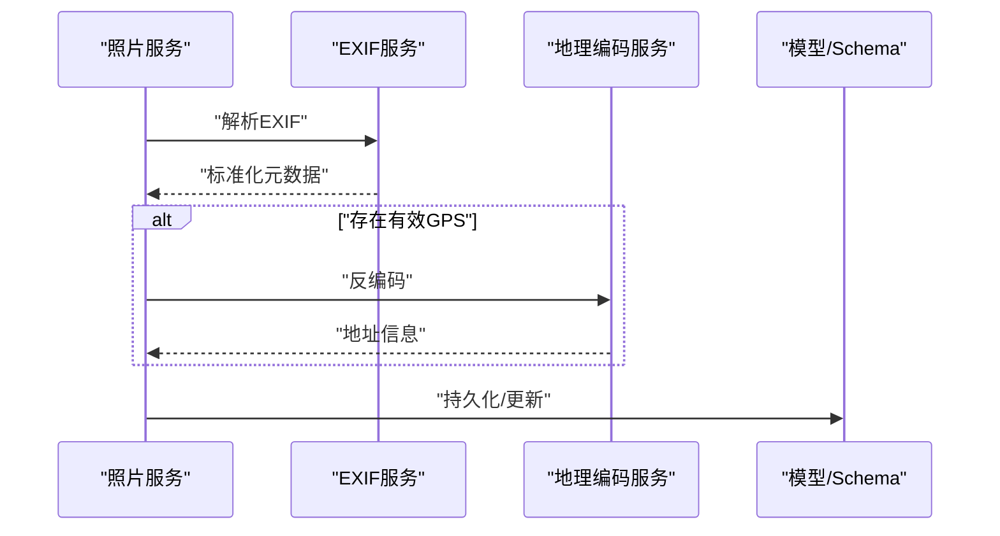
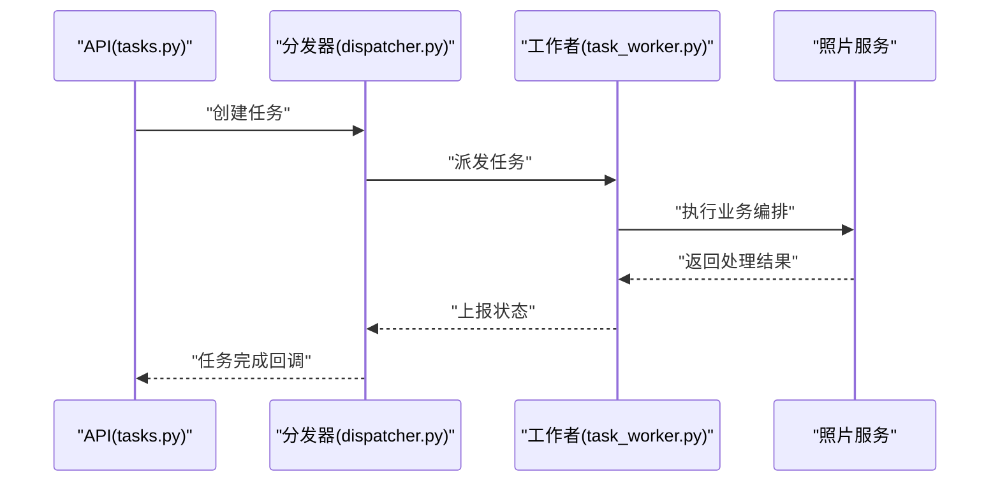
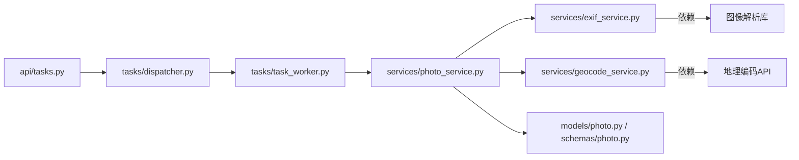

# EXIF信息提取服务

<cite>
**本文引用的文件**   
- [exif_service.py](file://backend/app/services/exif_service.py)
- [geocode_service.py](file://backend/app/services/geocode_service.py)
- [test_exif.py](file://backend/app/services/test/test_exif.py)
- [test_geocode.py](file://backend/app/services/test/test_geocode.py)
- [photo_service.py](file://backend/app/services/photo_service.py)
- [photo.py](file://backend/app/models/photo.py)
- [photo.py](file://backend/app/schemas/photo.py)
- [tasks.py](file://backend/app/api/tasks.py)
- [dispatcher.py](file://backend/app/tasks/dispatcher.py)
- [task_worker.py](file://backend/app/tasks/task_worker.py)
</cite>

## 目录
1. [简介](#简介)
2. [项目结构](#项目结构)
3. [核心组件](#核心组件)
4. [架构总览](#架构总览)
5. [详细组件分析](#详细组件分析)
6. [依赖关系分析](#依赖关系分析)
7. [性能考虑](#性能考虑)
8. [故障排查指南](#故障排查指南)
9. [结论](#结论)
10. [附录](#附录)

## 简介
本文件面向EXIF信息提取服务，系统性阐述图像元数据解析的技术实现与工程实践。内容覆盖：
- EXIF标准支持、GPS坐标提取、时间戳处理
- 不同图像格式的元数据兼容性与缺失字段处理
- 地理位置反编码、时区转换与格式标准化
- 元数据缓存策略、批量处理优化与错误恢复
- 与照片上传流程的集成方式与异步处理模式

## 项目结构
围绕EXIF信息提取的相关代码主要位于后端服务的services层与测试用例中，并与任务调度、API层以及模型/Schema定义协同工作。

图表来源
- [exif_service.py](file://backend/app/services/exif_service.py)
- [geocode_service.py](file://backend/app/services/geocode_service.py)
- [photo_service.py](file://backend/app/services/photo_service.py)
- [tasks.py](file://backend/app/api/tasks.py)
- [dispatcher.py](file://backend/app/tasks/dispatcher.py)
- [task_worker.py](file://backend/app/tasks/task_worker.py)
- [photo.py](file://backend/app/models/photo.py)
- [photo.py](file://backend/app/schemas/photo.py)
- [test_exif.py](file://backend/app/services/test/test_exif.py)
- [test_geocode.py](file://backend/app/services/test/test_geocode.py)

章节来源
- [exif_service.py](file://backend/app/services/exif_service.py)
- [geocode_service.py](file://backend/app/services/geocode_service.py)
- [photo_service.py](file://backend/app/services/photo_service.py)
- [tasks.py](file://backend/app/api/tasks.py)
- [dispatcher.py](file://backend/app/tasks/dispatcher.py)
- [task_worker.py](file://backend/app/tasks/task_worker.py)
- [photo.py](file://backend/app/models/photo.py)
- [photo.py](file://backend/app/schemas/photo.py)
- [test_exif.py](file://backend/app/services/test/test_exif.py)
- [test_geocode.py](file://backend/app/services/test/test_geocode.py)

## 核心组件
- EXIF解析服务：负责从图像文件中读取并标准化EXIF元数据，包括相机信息、拍摄时间、方向、GPS等。
- 地理编码服务：提供经纬度到地址的反编码能力，用于将GPS坐标转换为可读位置信息。
- 照片服务：在上传或索引流程中调用EXIF与地理编码服务，完成元数据持久化与后续处理。
- 任务系统：通过API触发任务、分发器路由、工作者执行，实现异步批处理与容错。

章节来源
- [exif_service.py](file://backend/app/services/exif_service.py)
- [geocode_service.py](file://backend/app/services/geocode_service.py)
- [photo_service.py](file://backend/app/services/photo_service.py)
- [tasks.py](file://backend/app/api/tasks.py)
- [dispatcher.py](file://backend/app/tasks/dispatcher.py)
- [task_worker.py](file://backend/app/tasks/task_worker.py)

## 架构总览
下图展示了从上传到元数据落库的关键路径，包含同步与异步分支。

图表来源
- [tasks.py](file://backend/app/api/tasks.py)
- [dispatcher.py](file://backend/app/tasks/dispatcher.py)
- [task_worker.py](file://backend/app/tasks/task_worker.py)
- [photo_service.py](file://backend/app/services/photo_service.py)
- [exif_service.py](file://backend/app/services/exif_service.py)
- [geocode_service.py](file://backend/app/services/geocode_service.py)
- [photo.py](file://backend/app/models/photo.py)
- [photo.py](file://backend/app/schemas/photo.py)

## 详细组件分析

### EXIF解析服务
职责与要点
- 支持的标签：常见EXIF标签如拍摄时间、相机型号、镜头、曝光参数、方向、GPS等。
- 格式兼容性：优先尝试主流库（如Pillow/PIL）读取；若失败则回退到其他解析器（如exifread），以增强对非标准或特殊文件的鲁棒性。
- GPS处理：解析WGS84坐标与参考方向，统一为十进制度数，校验范围与有效性。
- 时间戳处理：识别多种时间标签（如原始时间、修改时间、数字创建时间），选择最可信值；必要时结合时区信息进行规范化。
- 缺失字段与默认值：对缺失字段设置合理默认值（如未知时间、未定位、默认方向），保证下游流程稳定。
- 标准化输出：将各来源字段映射到统一的数据结构，便于持久化与查询。

关键流程（时序）

图表来源
- [exif_service.py](file://backend/app/services/exif_service.py)

章节来源
- [exif_service.py](file://backend/app/services/exif_service.py)
- [test_exif.py](file://backend/app/services/test/test_exif.py)

### 地理编码服务
职责与要点
- 输入：经度、纬度（十进制度）、可选精度/坐标系说明。
- 输出：国家/省/市/区县/街道等层级信息，以及结构化地址字符串。
- 异常与降级：网络不可用、配额耗尽、无结果等情况下的降级策略（返回空或最小可用信息）。
- 缓存：对热点地点进行本地缓存，减少重复请求。

关键流程（流程图）

图表来源
- [geocode_service.py](file://backend/app/services/geocode_service.py)

章节来源
- [geocode_service.py](file://backend/app/services/geocode_service.py)
- [test_geocode.py](file://backend/app/services/test/test_geocode.py)

### 照片服务（与EXIF集成）
职责与要点
- 在上传或扫描流程中编排EXIF解析与地理编码。
- 根据业务规则决定是否需要反编码（例如仅当存在有效GPS时才调用）。
- 将标准化后的元数据写入数据库模型与Schema定义。
- 支持批量处理：按批次拉取待处理项，逐条解析并聚合结果。

关键流程（时序）

图表来源
- [photo_service.py](file://backend/app/services/photo_service.py)
- [exif_service.py](file://backend/app/services/exif_service.py)
- [geocode_service.py](file://backend/app/services/geocode_service.py)
- [photo.py](file://backend/app/models/photo.py)
- [photo.py](file://backend/app/schemas/photo.py)

章节来源
- [photo_service.py](file://backend/app/services/photo_service.py)
- [photo.py](file://backend/app/models/photo.py)
- [photo.py](file://backend/app/schemas/photo.py)

### 任务系统与异步处理
职责与要点
- API层接收外部请求，创建任务并返回任务ID。
- 分发器将任务路由至工作者队列。
- 工作者执行具体逻辑（调用照片服务、EXIF与地理编码服务），并将结果写回存储。
- 支持重试、超时与幂等控制，保障大规模批处理的稳定性。

关键流程（时序）

图表来源
- [tasks.py](file://backend/app/api/tasks.py)
- [dispatcher.py](file://backend/app/tasks/dispatcher.py)
- [task_worker.py](file://backend/app/tasks/task_worker.py)
- [photo_service.py](file://backend/app/services/photo_service.py)

章节来源
- [tasks.py](file://backend/app/api/tasks.py)
- [dispatcher.py](file://backend/app/tasks/dispatcher.py)
- [task_worker.py](file://backend/app/tasks/task_worker.py)

## 依赖关系分析
- 内聚与耦合
  - EXIF服务相对独立，主要依赖图像解析库与内部标准化逻辑。
  - 地理编码服务依赖外部API与本地缓存。
  - 照片服务作为编排者，耦合EXIF与地理编码两个子服务。
  - 任务系统解耦了API与具体处理逻辑，提升可扩展性与容错性。
- 外部依赖
  - 图像解析库（如Pillow/PIL、exifread等）。
  - 地理编码API（可配置提供商）。
  - 数据库ORM与连接池。
- 潜在循环依赖
  - 当前分层清晰，未见直接循环依赖；需确保新增功能保持单向依赖。

图表来源
- [tasks.py](file://backend/app/api/tasks.py)
- [dispatcher.py](file://backend/app/tasks/dispatcher.py)
- [task_worker.py](file://backend/app/tasks/task_worker.py)
- [photo_service.py](file://backend/app/services/photo_service.py)
- [exif_service.py](file://backend/app/services/exif_service.py)
- [geocode_service.py](file://backend/app/services/geocode_service.py)
- [photo.py](file://backend/app/models/photo.py)
- [photo.py](file://backend/app/schemas/photo.py)

章节来源
- [tasks.py](file://backend/app/api/tasks.py)
- [dispatcher.py](file://backend/app/tasks/dispatcher.py)
- [task_worker.py](file://backend/app/tasks/task_worker.py)
- [photo_service.py](file://backend/app/services/photo_service.py)
- [exif_service.py](file://backend/app/services/exif_service.py)
- [geocode_service.py](file://backend/app/services/geocode_service.py)
- [photo.py](file://backend/app/models/photo.py)
- [photo.py](file://backend/app/schemas/photo.py)

## 性能考虑
- 解析器选择与回退
  - 优先使用更快的解析器，失败再回退，避免阻塞主流程。
- 批量处理
  - 采用分批拉取与并发处理，限制并发度以避免资源争用。
- 缓存策略
  - 地理编码结果本地缓存，TTL与容量可配置；EXIF解析结果可按文件指纹短期缓存。
- I/O与序列化
  - 大文件尽量使用流式读取；避免不必要的中间拷贝。
- 数据库写入
  - 批量插入/更新，减少事务粒度；必要时使用UPSERT。
- 监控与指标
  - 记录解析耗时、失败率、缓存命中率、反编码延迟等关键指标。

[本节为通用指导，不直接分析具体文件]

## 故障排查指南
常见问题与定位建议
- EXIF解析失败
  - 检查图像是否损坏或格式不支持；确认回退解析器是否启用。
  - 查看日志中的解析器名称与异常堆栈。
- GPS坐标无效
  - 校验经纬度范围与单位；确认参考方向与坐标系。
  - 若为空，跳过地理编码步骤，避免额外开销。
- 时间戳不一致
  - 对比多个时间标签来源，确认优先级策略；必要时引入时区修正。
- 地理编码失败
  - 检查网络连通性、配额与限流；启用降级返回最小信息。
- 任务堆积
  - 检查工作队列长度与消费者数量；调整并发与重试策略。

章节来源
- [test_exif.py](file://backend/app/services/test/test_exif.py)
- [test_geocode.py](file://backend/app/services/test/test_geocode.py)

## 结论
本服务通过分层设计与异步任务机制，实现了稳健的EXIF信息提取与地理位置反编码能力。通过多解析器回退、严格的数据校验与标准化、合理的缓存与批量策略，系统在准确性、性能与可用性之间取得平衡。建议在后续迭代中持续完善指标监控、错误分类与自愈能力，进一步提升整体可靠性。

[本节为总结性内容，不直接分析具体文件]

## 附录
- 术语
  - EXIF：可交换图像文件格式，包含相机、拍摄参数、GPS等元数据。
  - 反编码：将经纬度转换为人类可读的地址信息。
  - 幂等：多次执行同一操作产生相同结果，适合重试场景。
- 最佳实践
  - 始终对输入进行边界校验与类型转换。
  - 对外部依赖调用增加超时与熔断保护。
  - 对关键路径添加结构化日志与追踪ID。

[本节为概念性内容，不直接分析具体文件]