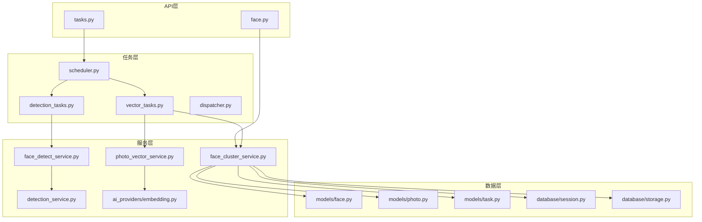
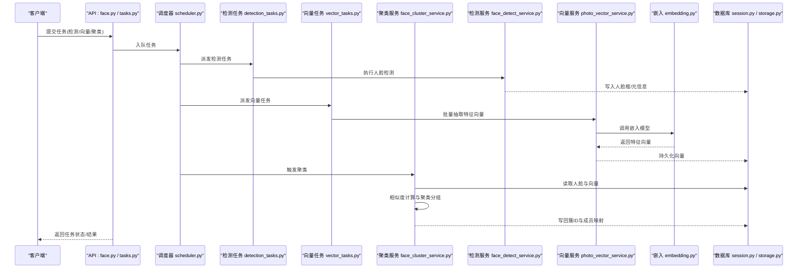
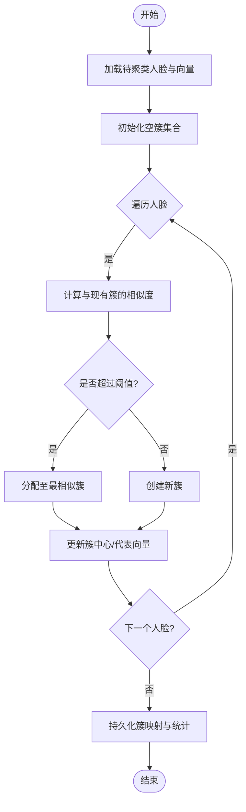
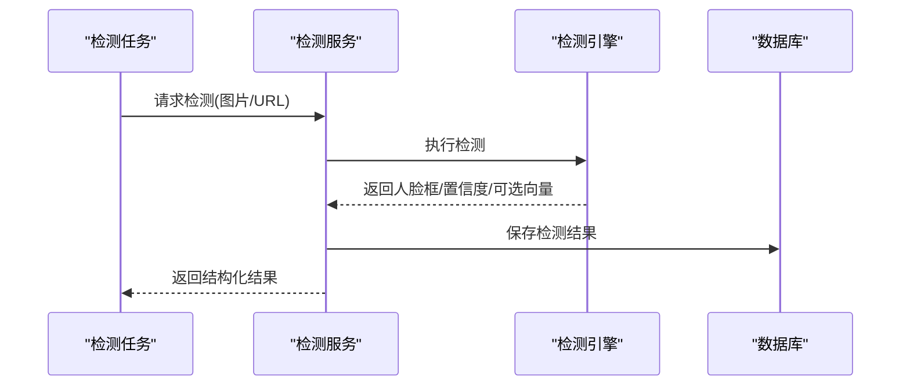
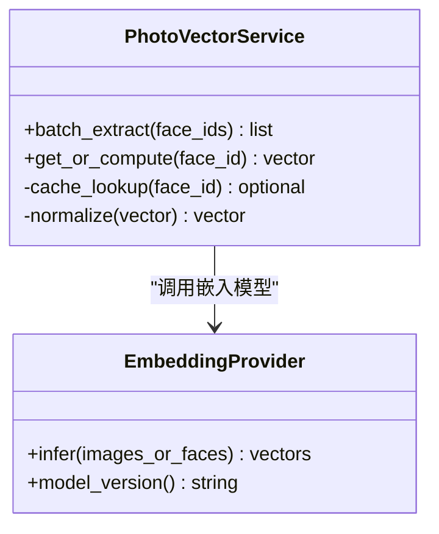
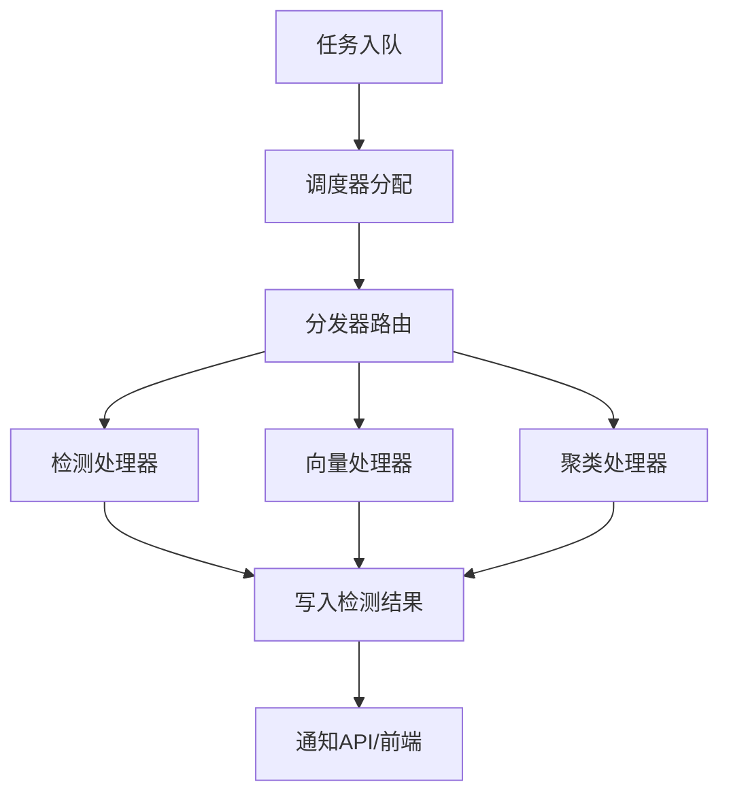
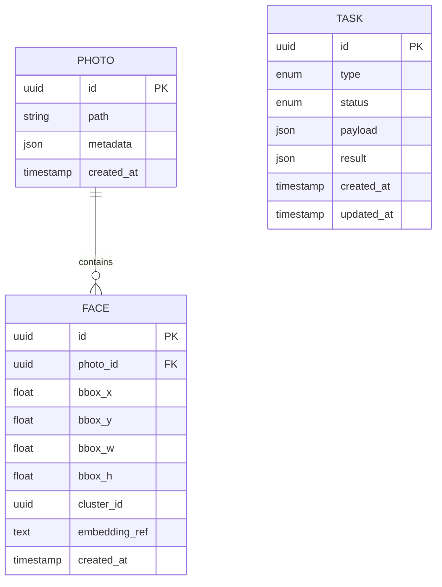
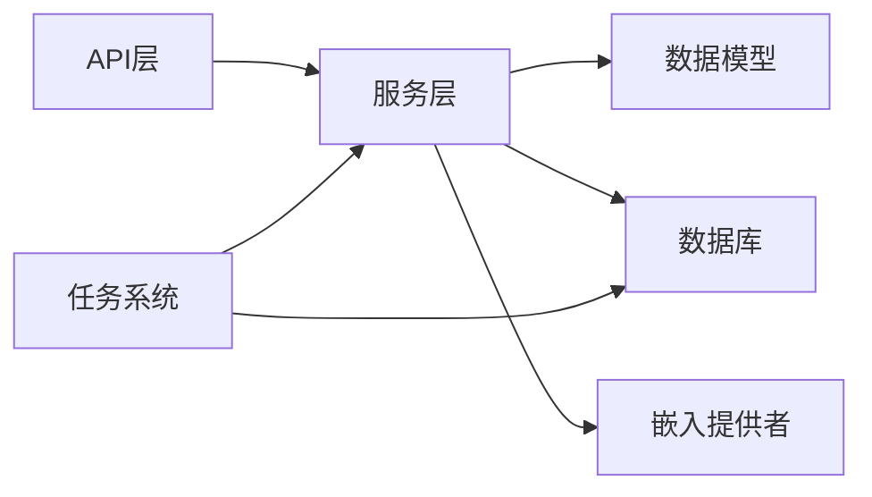

# 人脸聚类服务

<cite>
**本文引用的文件**   
- [face_cluster_service.py](file://backend/app/services/face_cluster_service.py)
- [face_detect_service.py](file://backend/app/services/face_detect_service.py)
- [face_detection.py](file://backend/app/services/face_detection.py)
- [detection_service.py](file://backend/app/services/detection_service.py)
- [photo_vector_service.py](file://backend/app/services/photo_vector_service.py)
- [embedding.py](file://backend/app/services/ai_providers/embedding.py)
- [face.py](file://backend/app/models/face.py)
- [photo.py](file://backend/app/models/photo.py)
- [task.py](file://backend/app/models/task.py)
- [face.py](file://backend/app/schemas/face.py)
- [tasks.py](file://backend/app/api/tasks.py)
- [face.py](file://backend/app/api/face.py)
- [vector_tasks.py](file://backend/app/tasks/vector_tasks.py)
- [detection_tasks.py](file://backend/app/tasks/detection_tasks.py)
- [scheduler.py](file://backend/app/tasks/scheduler.py)
- [dispatcher.py](file://backend/app/tasks/dispatcher.py)
- [session.py](file://backend/app/database/session.py)
- [storage.py](file://backend/app/database/storage.py)
</cite>

## 目录
1. [简介](#简介)
2. [项目结构](#项目结构)
3. [核心组件](#核心组件)
4. [架构总览](#架构总览)
5. [详细组件分析](#详细组件分析)
6. [依赖关系分析](#依赖关系分析)
7. [性能与内存优化](#性能与内存优化)
8. [故障排查指南](#故障排查指南)
9. [结论](#结论)
10. [附录](#附录)

## 简介
本文件面向“人脸聚类服务”的技术文档，聚焦以下目标：
- 算法实现：相似度计算、聚类策略与分组逻辑
- 特征向量：生成方式、距离度量方法与阈值配置
- 大规模数据处理：内存管理、并行化与性能调优
- 结果后处理与验证：一致性校验、冲突合并与人工确认流程
- 协作流程：与人脸检测服务的协作与端到端数据处理管道

## 项目结构
本项目采用分层与按功能域组织相结合的结构。与人脸聚类相关的核心代码主要位于后端 services、models、schemas、api、tasks 等目录中：
- services：业务逻辑与服务编排（聚类、检测、向量化等）
- models/schemas：数据模型与接口契约
- api：对外暴露的 REST 接口
- tasks：异步任务调度与执行（检测、向量、聚类）
- database：数据库会话与存储抽象

图表来源
- [face.py](file://backend/app/api/face.py)
- [tasks.py](file://backend/app/api/tasks.py)
- [face_cluster_service.py](file://backend/app/services/face_cluster_service.py)
- [face_detect_service.py](file://backend/app/services/face_detect_service.py)
- [detection_service.py](file://backend/app/services/detection_service.py)
- [photo_vector_service.py](file://backend/app/services/photo_vector_service.py)
- [embedding.py](file://backend/app/services/ai_providers/embedding.py)
- [vector_tasks.py](file://backend/app/tasks/vector_tasks.py)
- [detection_tasks.py](file://backend/app/tasks/detection_tasks.py)
- [scheduler.py](file://backend/app/tasks/scheduler.py)
- [dispatcher.py](file://backend/app/tasks/dispatcher.py)
- [face.py](file://backend/app/models/face.py)
- [photo.py](file://backend/app/models/photo.py)
- [task.py](file://backend/app/models/task.py)
- [session.py](file://backend/app/database/session.py)
- [storage.py](file://backend/app/database/storage.py)

章节来源
- [face_cluster_service.py](file://backend/app/services/face_cluster_service.py)
- [face_detect_service.py](file://backend/app/services/face_detect_service.py)
- [detection_service.py](file://backend/app/services/detection_service.py)
- [photo_vector_service.py](file://backend/app/services/photo_vector_service.py)
- [embedding.py](file://backend/app/services/ai_providers/embedding.py)
- [face.py](file://backend/app/models/face.py)
- [photo.py](file://backend/app/models/photo.py)
- [task.py](file://backend/app/models/task.py)
- [face.py](file://backend/app/schemas/face.py)
- [tasks.py](file://backend/app/api/tasks.py)
- [face.py](file://backend/app/api/face.py)
- [vector_tasks.py](file://backend/app/tasks/vector_tasks.py)
- [detection_tasks.py](file://backend/app/tasks/detection_tasks.py)
- [scheduler.py](file://backend/app/tasks/scheduler.py)
- [dispatcher.py](file://backend/app/tasks/dispatcher.py)
- [session.py](file://backend/app/database/session.py)
- [storage.py](file://backend/app/database/storage.py)

## 核心组件
- 人脸聚类服务：负责将已检测到的人脸进行特征比对、相似度计算与聚类分组，输出人脸簇及成员映射。
- 人脸检测服务：调用底层检测能力，产出人脸框与可选特征向量，供后续聚类使用。
- 照片向量服务：批量抽取或更新人脸特征向量，提供统一的嵌入获取接口。
- 嵌入提供者：封装具体的人脸特征模型推理，支持不同供应商或本地模型。
- 任务系统：基于调度器与分发器，将检测、向量抽取与聚类任务异步化，提升吞吐与稳定性。
- 数据模型与存储：持久化人脸、照片、任务状态，支撑查询与审计。

章节来源
- [face_cluster_service.py](file://backend/app/services/face_cluster_service.py)
- [face_detect_service.py](file://backend/app/services/face_detect_service.py)
- [photo_vector_service.py](file://backend/app/services/photo_vector_service.py)
- [embedding.py](file://backend/app/services/ai_providers/embedding.py)
- [scheduler.py](file://backend/app/tasks/scheduler.py)
- [dispatcher.py](file://backend/app/tasks/dispatcher.py)
- [face.py](file://backend/app/models/face.py)
- [photo.py](file://backend/app/models/photo.py)
- [task.py](file://backend/app/models/task.py)

## 架构总览
整体流程从上传或扫描触发，经检测、向量化、聚类到结果落库与前端展示。关键交互如下：

图表来源
- [face.py](file://backend/app/api/face.py)
- [tasks.py](file://backend/app/api/tasks.py)
- [scheduler.py](file://backend/app/tasks/scheduler.py)
- [detection_tasks.py](file://backend/app/tasks/detection_tasks.py)
- [vector_tasks.py](file://backend/app/tasks/vector_tasks.py)
- [face_cluster_service.py](file://backend/app/services/face_cluster_service.py)
- [face_detect_service.py](file://backend/app/services/face_detect_service.py)
- [detection_service.py](file://backend/app/services/detection_service.py)
- [photo_vector_service.py](file://backend/app/services/photo_vector_service.py)
- [embedding.py](file://backend/app/services/ai_providers/embedding.py)
- [session.py](file://backend/app/database/session.py)
- [storage.py](file://backend/app/database/storage.py)

## 详细组件分析

### 人脸聚类服务（face_cluster_service.py）
职责与要点：
- 输入：人脸记录及其特征向量、可选的预置阈值与策略参数
- 相似度计算：基于特征向量间的距离度量（如余弦距离或欧氏距离），并转换为相似度分数
- 聚类策略：根据阈值判定是否归入同一簇；支持增量式加入与跨批次合并
- 分组逻辑：维护簇中心或代表向量，新样本与簇内成员比较，满足条件则并入
- 结果输出：人脸到簇ID的映射、簇统计信息与成员列表
- 事务与幂等：在批量写入时保证一致性，支持重复触发时的幂等处理

图表来源
- [face_cluster_service.py](file://backend/app/services/face_cluster_service.py)

章节来源
- [face_cluster_service.py](file://backend/app/services/face_cluster_service.py)

### 人脸检测服务（face_detect_service.py / detection_service.py）
职责与要点：
- 接收图片路径或字节流，调用底层检测引擎，返回人脸框坐标、置信度与可选特征向量
- 与检测任务协同，支持批量与并发处理
- 对检测结果进行清洗与规范化，确保后续向量抽取与聚类的输入质量

图表来源
- [face_detect_service.py](file://backend/app/services/face_detect_service.py)
- [detection_service.py](file://backend/app/services/detection_service.py)
- [detection_tasks.py](file://backend/app/tasks/detection_tasks.py)

章节来源
- [face_detect_service.py](file://backend/app/services/face_detect_service.py)
- [detection_service.py](file://backend/app/services/detection_service.py)
- [detection_tasks.py](file://backend/app/tasks/detection_tasks.py)

### 照片向量服务与嵌入提供者（photo_vector_service.py / embedding.py）
职责与要点：
- 批量抽取人脸特征向量，缓存命中减少重复计算
- 统一嵌入接口，屏蔽底层模型差异（供应商切换、版本兼容）
- 支持分片与批处理，降低单次推理开销与内存峰值

图表来源
- [photo_vector_service.py](file://backend/app/services/photo_vector_service.py)
- [embedding.py](file://backend/app/services/ai_providers/embedding.py)

章节来源
- [photo_vector_service.py](file://backend/app/services/photo_vector_service.py)
- [embedding.py](file://backend/app/services/ai_providers/embedding.py)

### 任务系统与调度（scheduler.py / dispatcher.py / vector_tasks.py / detection_tasks.py）
职责与要点：
- 调度器负责任务生命周期管理与重试
- 分发器将任务路由到对应处理器（检测、向量、聚类）
- 向量与检测任务分别负责各自阶段的批处理与落库
- 支持优先级队列与资源隔离，避免热点任务阻塞

图表来源
- [scheduler.py](file://backend/app/tasks/scheduler.py)
- [dispatcher.py](file://backend/app/tasks/dispatcher.py)
- [vector_tasks.py](file://backend/app/tasks/vector_tasks.py)
- [detection_tasks.py](file://backend/app/tasks/detection_tasks.py)

章节来源
- [scheduler.py](file://backend/app/tasks/scheduler.py)
- [dispatcher.py](file://backend/app/tasks/dispatcher.py)
- [vector_tasks.py](file://backend/app/tasks/vector_tasks.py)
- [detection_tasks.py](file://backend/app/tasks/detection_tasks.py)

### 数据模型与存储（models/face.py, models/photo.py, models/task.py, database/session.py, database/storage.py）
职责与要点：
- 人脸模型：包含人脸唯一标识、所属照片、边界框、特征向量引用、簇ID等
- 照片模型：关联多个人脸，承载元数据与索引字段
- 任务模型：记录任务类型、状态、进度、错误信息等
- 数据库会话与存储：提供连接池、事务、分页与批量写入能力

图表来源
- [face.py](file://backend/app/models/face.py)
- [photo.py](file://backend/app/models/photo.py)
- [task.py](file://backend/app/models/task.py)
- [session.py](file://backend/app/database/session.py)
- [storage.py](file://backend/app/database/storage.py)

章节来源
- [face.py](file://backend/app/models/face.py)
- [photo.py](file://backend/app/models/photo.py)
- [task.py](file://backend/app/models/task.py)
- [session.py](file://backend/app/database/session.py)
- [storage.py](file://backend/app/database/storage.py)

## 依赖关系分析
- 低耦合：API 仅暴露任务与查询接口，核心逻辑下沉至服务层
- 可插拔：嵌入提供者通过接口抽象，便于替换模型供应商
- 异步解耦：任务系统将耗时操作与请求响应分离，提高吞吐
- 数据一致性：通过事务与幂等设计，保障批量写入正确性

图表来源
- [face.py](file://backend/app/api/face.py)
- [tasks.py](file://backend/app/api/tasks.py)
- [face_cluster_service.py](file://backend/app/services/face_cluster_service.py)
- [photo_vector_service.py](file://backend/app/services/photo_vector_service.py)
- [embedding.py](file://backend/app/services/ai_providers/embedding.py)
- [session.py](file://backend/app/database/session.py)
- [storage.py](file://backend/app/database/storage.py)

章节来源
- [face.py](file://backend/app/api/face.py)
- [tasks.py](file://backend/app/api/tasks.py)
- [face_cluster_service.py](file://backend/app/services/face_cluster_service.py)
- [photo_vector_service.py](file://backend/app/services/photo_vector_service.py)
- [embedding.py](file://backend/app/services/ai_providers/embedding.py)
- [session.py](file://backend/app/database/session.py)
- [storage.py](file://backend/app/database/storage.py)

## 性能与内存优化
- 相似度计算优化
  - 优先使用归一化向量与余弦相似度，避免开方与缩放开销
  - 对候选簇进行剪枝，仅与最近邻簇比较，降低 O(N^2) 复杂度
- 批量与分片
  - 向量抽取与聚类均按批次处理，控制单批大小以平衡吞吐与内存占用
  - 大表查询使用分页与只读副本，减少主库压力
- 并发与资源隔离
  - 检测与向量任务独立队列，避免相互阻塞
  - 限制并发线程/进程数，防止 GPU/CPU 过载
- 缓存与去重
  - 对人脸向量与中间结果做缓存，避免重复计算
  - 幂等写入，支持任务重试不产生重复数据
- 存储优化
  - 向量字段采用高效序列化格式，必要时压缩存储
  - 为常用查询字段建立索引（如 photo_id、cluster_id）

[本节为通用性能建议，无需特定文件来源]

## 故障排查指南
- 常见问题定位
  - 任务失败：查看任务模型的 status/result 字段，结合日志定位异常堆栈
  - 向量缺失：检查嵌入提供者健康状态与模型版本兼容性
  - 聚类异常：核对阈值配置与相似度分布，必要时调整阈值或策略
- 诊断步骤
  - 通过 API 查询任务状态与中间结果
  - 抽样导出人脸与向量，离线复现相似度矩阵
  - 对比不同阈值下的聚类效果，评估误分/漏分情况
- 恢复策略
  - 针对失败任务进行重试与补偿
  - 对不一致数据进行修复脚本，重新计算受影响簇

章节来源
- [task.py](file://backend/app/models/task.py)
- [face_cluster_service.py](file://backend/app/services/face_cluster_service.py)
- [embedding.py](file://backend/app/services/ai_providers/embedding.py)

## 结论
本服务通过“检测→向量化→聚类”的分阶段流水线，结合任务系统与可插拔嵌入提供者，实现了可扩展、高吞吐的人脸聚类能力。通过合理的相似度度量、阈值策略与批量优化，可在大规模数据场景下保持良好性能与稳定性。配合完善的结果后处理与验证机制，可有效提升最终簇质量与用户体验。

[本节为总结性内容，无需特定文件来源]

## 附录
- 术语说明
  - 相似度：人脸特征向量之间的接近程度，通常由距离度量转换而来
  - 阈值：用于判定两个样本是否属于同一簇的临界值
  - 簇：一组被判定为同一个人的所有人脸集合
- 相关接口与入口
  - 任务提交与查询：参见 tasks.py 与 face.py 中的 API 定义
  - 服务调用：参见各 service 模块的职责划分与调用约定

章节来源
- [tasks.py](file://backend/app/api/tasks.py)
- [face.py](file://backend/app/api/face.py)