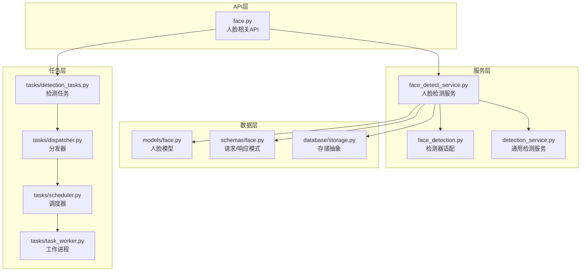
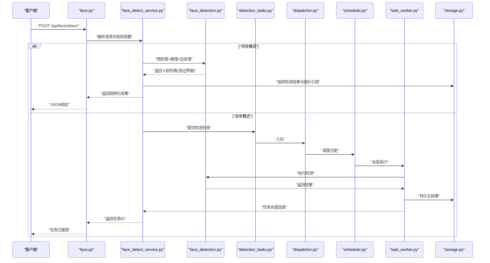
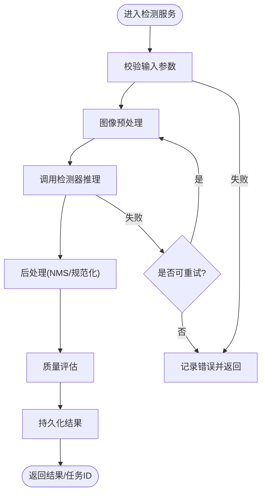
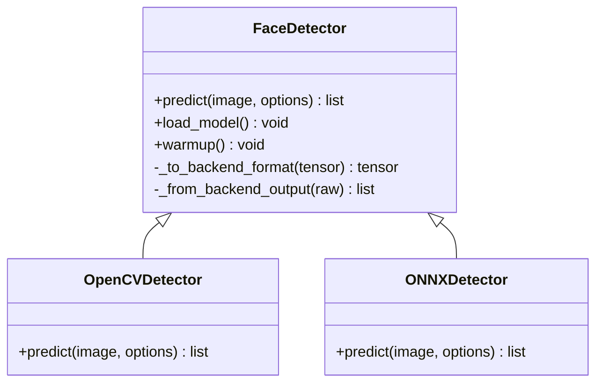
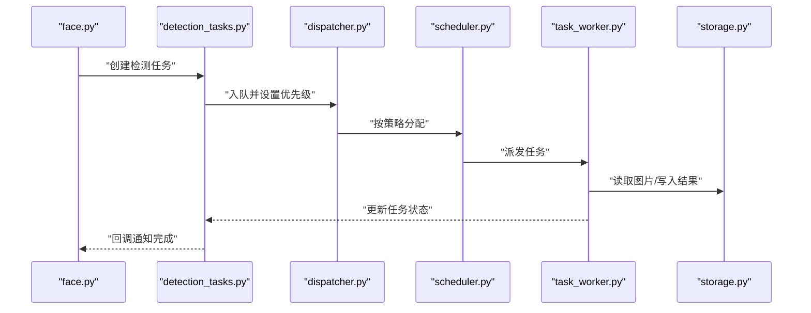
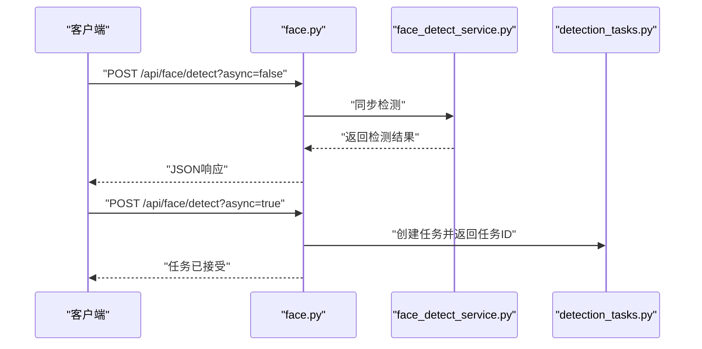
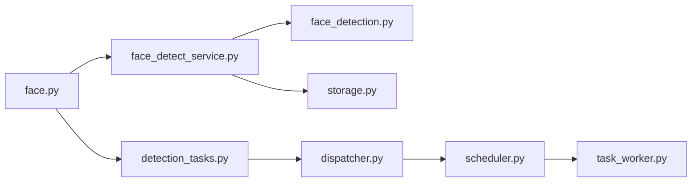

# 人脸识别服务

<cite>
**本文引用的文件**   
- [backend/app/api/face.py](file://backend/app/api/face.py)
- [backend/app/services/face_detect_service.py](file://backend/app/services/face_detect_service.py)
- [backend/app/services/face_detection.py](file://backend/app/services/face_detection.py)
- [backend/app/services/detection_service.py](file://backend/app/services/detection_service.py)
- [backend/app/models/face.py](file://backend/app/models/face.py)
- [backend/app/schemas/face.py](file://backend/app/schemas/face.py)
- [backend/app/tasks/detection_tasks.py](file://backend/app/tasks/detection_tasks.py)
- [backend/app/tasks/dispatcher.py](file://backend/app/tasks/dispatcher.py)
- [backend/app/tasks/scheduler.py](file://backend/app/tasks/scheduler.py)
- [backend/app/tasks/task_worker.py](file://backend/app/tasks/task_worker.py)
- [backend/app/database/storage.py](file://backend/app/database/storage.py)
- [backend/app/core/logger.py](file://backend/app/core/logger.py)
</cite>

## 目录
1. [简介](#简介)
2. [项目结构](#项目结构)
3. [核心组件](#核心组件)
4. [架构总览](#架构总览)
5. [详细组件分析](#详细组件分析)
6. [依赖关系分析](#依赖关系分析)
7. [性能考虑](#性能考虑)
8. [故障排查指南](#故障排查指南)
9. [结论](#结论)
10. [附录](#附录)

## 简介
本文件面向人脸识别服务，重点围绕人脸检测能力进行系统化说明。内容涵盖：
- 人脸检测算法实现原理（定位、特征提取、边界框计算）
- 人脸检测API调用流程、参数配置与结果处理
- 图像预处理、质量评估与错误恢复策略
- 性能优化技巧、批量处理模式与缓存机制
- 与任务调度系统的集成方式及异步处理模式

## 项目结构
本项目采用分层架构：API层暴露HTTP接口；服务层封装业务逻辑与模型推理；数据层负责持久化与存储；任务层提供异步调度与执行。

图表来源
- [backend/app/api/face.py](file://backend/app/api/face.py)
- [backend/app/services/face_detect_service.py](file://backend/app/services/face_detect_service.py)
- [backend/app/services/face_detection.py](file://backend/app/services/face_detection.py)
- [backend/app/services/detection_service.py](file://backend/app/services/detection_service.py)
- [backend/app/models/face.py](file://backend/app/models/face.py)
- [backend/app/schemas/face.py](file://backend/app/schemas/face.py)
- [backend/app/database/storage.py](file://backend/app/database/storage.py)
- [backend/app/tasks/detection_tasks.py](file://backend/app/tasks/detection_tasks.py)
- [backend/app/tasks/dispatcher.py](file://backend/app/tasks/dispatcher.py)
- [backend/app/tasks/scheduler.py](file://backend/app/tasks/scheduler.py)
- [backend/app/tasks/task_worker.py](file://backend/app/tasks/task_worker.py)

章节来源
- [backend/app/api/face.py](file://backend/app/api/face.py)
- [backend/app/services/face_detect_service.py](file://backend/app/services/face_detect_service.py)
- [backend/app/services/face_detection.py](file://backend/app/services/face_detection.py)
- [backend/app/services/detection_service.py](file://backend/app/services/detection_service.py)
- [backend/app/models/face.py](file://backend/app/models/face.py)
- [backend/app/schemas/face.py](file://backend/app/schemas/face.py)
- [backend/app/database/storage.py](file://backend/app/database/storage.py)
- [backend/app/tasks/detection_tasks.py](file://backend/app/tasks/detection_tasks.py)
- [backend/app/tasks/dispatcher.py](file://backend/app/tasks/dispatcher.py)
- [backend/app/tasks/scheduler.py](file://backend/app/tasks/scheduler.py)
- [backend/app/tasks/task_worker.py](file://backend/app/tasks/task_worker.py)

## 核心组件
- 人脸检测服务：封装图像预处理、模型推理、后处理（NMS、边界框规范化）、质量评估与结果落库。
- 检测器适配：统一不同后端（如OpenCV、ONNXRuntime等）的推理接口，屏蔽差异。
- 通用检测服务：提供可复用的检测流程模板，支持多种检测目标。
- 任务系统：将耗时的人脸检测放入队列，由调度器与工作进程异步执行，提升吞吐与稳定性。
- 数据模型与Schema：定义人脸实体、检测结果结构与校验规则。
- 存储抽象：对图片与元数据的读写进行解耦，便于切换存储后端。

章节来源
- [backend/app/services/face_detect_service.py](file://backend/app/services/face_detect_service.py)
- [backend/app/services/face_detection.py](file://backend/app/services/face_detection.py)
- [backend/app/services/detection_service.py](file://backend/app/services/detection_service.py)
- [backend/app/models/face.py](file://backend/app/models/face.py)
- [backend/app/schemas/face.py](file://backend/app/schemas/face.py)
- [backend/app/database/storage.py](file://backend/app/database/storage.py)

## 架构总览
下图展示从HTTP请求到异步任务执行的完整链路，包括预处理、检测、后处理、质量评估、持久化与回调。

图表来源
- [backend/app/api/face.py](file://backend/app/api/face.py)
- [backend/app/services/face_detect_service.py](file://backend/app/services/face_detect_service.py)
- [backend/app/services/face_detection.py](file://backend/app/services/face_detection.py)
- [backend/app/tasks/detection_tasks.py](file://backend/app/tasks/detection_tasks.py)
- [backend/app/tasks/dispatcher.py](file://backend/app/tasks/dispatcher.py)
- [backend/app/tasks/scheduler.py](file://backend/app/tasks/scheduler.py)
- [backend/app/tasks/task_worker.py](file://backend/app/tasks/task_worker.py)
- [backend/app/database/storage.py](file://backend/app/database/storage.py)

## 详细组件分析

### 人脸检测服务（face_detect_service.py）
职责与流程
- 输入校验与参数合并：接收图片路径或字节流、阈值、最大人脸数、是否异步等参数。
- 图像预处理：缩放、归一化、通道转换、裁剪增强等。
- 模型推理：通过检测器适配层调用具体后端。
- 后处理：置信度过滤、非极大值抑制（NMS）、边界框坐标规范化与越界修正。
- 质量评估：基于清晰度、遮挡比例、人脸尺寸占比、姿态估计等指标打分。
- 结果持久化：写入数据库与对象存储，建立索引以便检索。
- 错误恢复：重试、降级、回滚与告警。

关键数据结构
- 检测结果：包含人脸边界框、关键点、相似度向量、质量分等。
- 任务上下文：包含原始图片标识、处理状态、进度与错误信息。

图表来源
- [backend/app/services/face_detect_service.py](file://backend/app/services/face_detect_service.py)
- [backend/app/services/face_detection.py](file://backend/app/services/face_detection.py)
- [backend/app/database/storage.py](file://backend/app/database/storage.py)

章节来源
- [backend/app/services/face_detect_service.py](file://backend/app/services/face_detect_service.py)

### 检测器适配（face_detection.py）
职责与流程
- 统一推理接口：对外暴露统一的predict方法，内部根据配置选择具体后端。
- 模型加载与预热：懒加载、多实例管理、GPU/CPU资源隔离。
- 输入输出映射：将预处理后的张量转换为后端期望格式，并将输出映射为标准化结果。
- 异常封装：将底层异常转换为上层可处理的错误类型。

图表来源
- [backend/app/services/face_detection.py](file://backend/app/services/face_detection.py)

章节来源
- [backend/app/services/face_detection.py](file://backend/app/services/face_detection.py)

### 通用检测服务（detection_service.py）
职责与流程
- 提供检测流程模板：适用于人脸、物体等多类检测场景。
- 可插拔策略：支持不同的NMS策略、评分融合与后处理管线。
- 监控与度量：统计延迟、吞吐、错误率等指标。

章节来源
- [backend/app/services/detection_service.py](file://backend/app/services/detection_service.py)

### 任务系统与异步处理（detection_tasks.py, dispatcher.py, scheduler.py, task_worker.py）
职责与流程
- detection_tasks.py：定义检测任务的创建、序列化与重试策略。
- dispatcher.py：任务分发与负载均衡，避免热点节点过载。
- scheduler.py：定时与事件驱动的调度，支持优先级与退避。
- task_worker.py：工作进程执行任务，处理异常与幂等性。

图表来源
- [backend/app/tasks/detection_tasks.py](file://backend/app/tasks/detection_tasks.py)
- [backend/app/tasks/dispatcher.py](file://backend/app/tasks/dispatcher.py)
- [backend/app/tasks/scheduler.py](file://backend/app/tasks/scheduler.py)
- [backend/app/tasks/task_worker.py](file://backend/app/tasks/task_worker.py)
- [backend/app/database/storage.py](file://backend/app/database/storage.py)

章节来源
- [backend/app/tasks/detection_tasks.py](file://backend/app/tasks/detection_tasks.py)
- [backend/app/tasks/dispatcher.py](file://backend/app/tasks/dispatcher.py)
- [backend/app/tasks/scheduler.py](file://backend/app/tasks/scheduler.py)
- [backend/app/tasks/task_worker.py](file://backend/app/tasks/task_worker.py)

### API层（face.py）
职责与流程
- 暴露REST接口：支持单图检测、多图批量检测、任务查询与结果拉取。
- 参数校验：使用Schema进行严格校验，确保输入安全与一致性。
- 同步/异步路由：根据请求头或参数决定同步返回或异步任务。
- 错误码与日志：统一错误响应格式，记录关键步骤日志。

图表来源
- [backend/app/api/face.py](file://backend/app/api/face.py)
- [backend/app/services/face_detect_service.py](file://backend/app/services/face_detect_service.py)
- [backend/app/tasks/detection_tasks.py](file://backend/app/tasks/detection_tasks.py)

章节来源
- [backend/app/api/face.py](file://backend/app/api/face.py)

### 数据模型与Schema（models/face.py, schemas/face.py）
- models/face.py：定义人脸实体、检测结果表结构、关联关系与索引。
- schemas/face.py：定义请求/响应体字段、约束与默认值，用于Pydantic校验。

章节来源
- [backend/app/models/face.py](file://backend/app/models/face.py)
- [backend/app/schemas/face.py](file://backend/app/schemas/face.py)

### 存储抽象（database/storage.py）
职责与流程
- 统一图片与元数据访问：支持本地磁盘、对象存储等多种后端。
- 事务与幂等：保证写入一致性与重复提交安全。
- 缓存策略：读多写少场景下引入缓存层，降低IO压力。

章节来源
- [backend/app/database/storage.py](file://backend/app/database/storage.py)

## 依赖关系分析
- 低耦合高内聚：API仅依赖服务层，服务层通过适配层与存储层交互，任务层独立运行。
- 外部依赖：检测后端（OpenCV/ONNXRuntime等）、消息队列/任务队列、对象存储。
- 潜在循环依赖：通过接口与适配器避免直接循环导入。

图表来源
- [backend/app/api/face.py](file://backend/app/api/face.py)
- [backend/app/services/face_detect_service.py](file://backend/app/services/face_detect_service.py)
- [backend/app/services/face_detection.py](file://backend/app/services/face_detection.py)
- [backend/app/database/storage.py](file://backend/app/database/storage.py)
- [backend/app/tasks/detection_tasks.py](file://backend/app/tasks/detection_tasks.py)
- [backend/app/tasks/dispatcher.py](file://backend/app/tasks/dispatcher.py)
- [backend/app/tasks/scheduler.py](file://backend/app/tasks/scheduler.py)
- [backend/app/tasks/task_worker.py](file://backend/app/tasks/task_worker.py)

章节来源
- [backend/app/api/face.py](file://backend/app/api/face.py)
- [backend/app/services/face_detect_service.py](file://backend/app/services/face_detect_service.py)
- [backend/app/services/face_detection.py](file://backend/app/services/face_detection.py)
- [backend/app/database/storage.py](file://backend/app/database/storage.py)
- [backend/app/tasks/detection_tasks.py](file://backend/app/tasks/detection_tasks.py)
- [backend/app/tasks/dispatcher.py](file://backend/app/tasks/dispatcher.py)
- [backend/app/tasks/scheduler.py](file://backend/app/tasks/scheduler.py)
- [backend/app/tasks/task_worker.py](file://backend/app/tasks/task_worker.py)

## 性能考虑
- 预处理优化
  - 使用内存映射与零拷贝减少I/O开销。
  - 批量缩放与向量化操作，避免逐像素循环。
- 推理加速
  - 模型量化与剪枝，启用GPU并行与批推理。
  - 动态形状与固定形状权衡，减少重编译。
- 后处理优化
  - 高效NMS实现，利用SIMD/GPU加速。
  - 提前过滤低置信度候选，减少后续计算。
- 并发与缓存
  - 连接池与线程池复用，限制并发上限防止OOM。
  - 结果缓存（相同图片哈希命中），短TTL与失效策略。
- 监控与自适应
  - 采集P95/P99延迟、吞吐、错误率，自动扩缩容。
  - 动态阈值调整，平衡召回与精度。

[本节为通用指导，不直接分析具体文件]

## 故障排查指南
- 常见问题
  - 图片过大或损坏：检查分辨率、格式与完整性，增加校验与降级策略。
  - 检测超时：调整超时时间、开启异步模式与重试。
  - 内存溢出：限制并发、启用分页与流式处理。
  - 结果不一致：确认随机种子、模型版本与预处理一致性。
- 日志与追踪
  - 关键步骤打点：预处理、推理、后处理、持久化。
  - 错误堆栈与上下文：保留请求ID、任务ID与输入摘要。
- 恢复策略
  - 幂等写入：基于唯一键去重。
  - 补偿任务：失败任务自动重试与死信队列。
  - 熔断与降级：当错误率超过阈值时快速失败并回退。

章节来源
- [backend/app/core/logger.py](file://backend/app/core/logger.py)

## 结论
本服务以清晰的分层与适配设计实现了稳定可扩展的人脸检测能力。通过预处理、推理、后处理、质量评估与持久化的全链路优化，并结合任务调度与异步处理，能够在高并发与大数据量场景下保持良好性能与可用性。建议在生产环境完善监控告警、容量规划与灾备方案，持续迭代模型与工程优化。

[本节为总结，不直接分析具体文件]

## 附录
- 术语
  - NMS：非极大值抑制，用于去除冗余检测框。
  - 边界框：表示人脸位置的矩形区域坐标。
  - 质量评估：对人脸图像质量进行打分，辅助筛选与排序。
- 最佳实践
  - 优先使用异步模式处理大图与批量任务。
  - 合理设置阈值与最大人脸数以平衡性能与效果。
  - 定期评估模型与阈值，结合业务反馈调优。

[本节为补充说明，不直接分析具体文件]