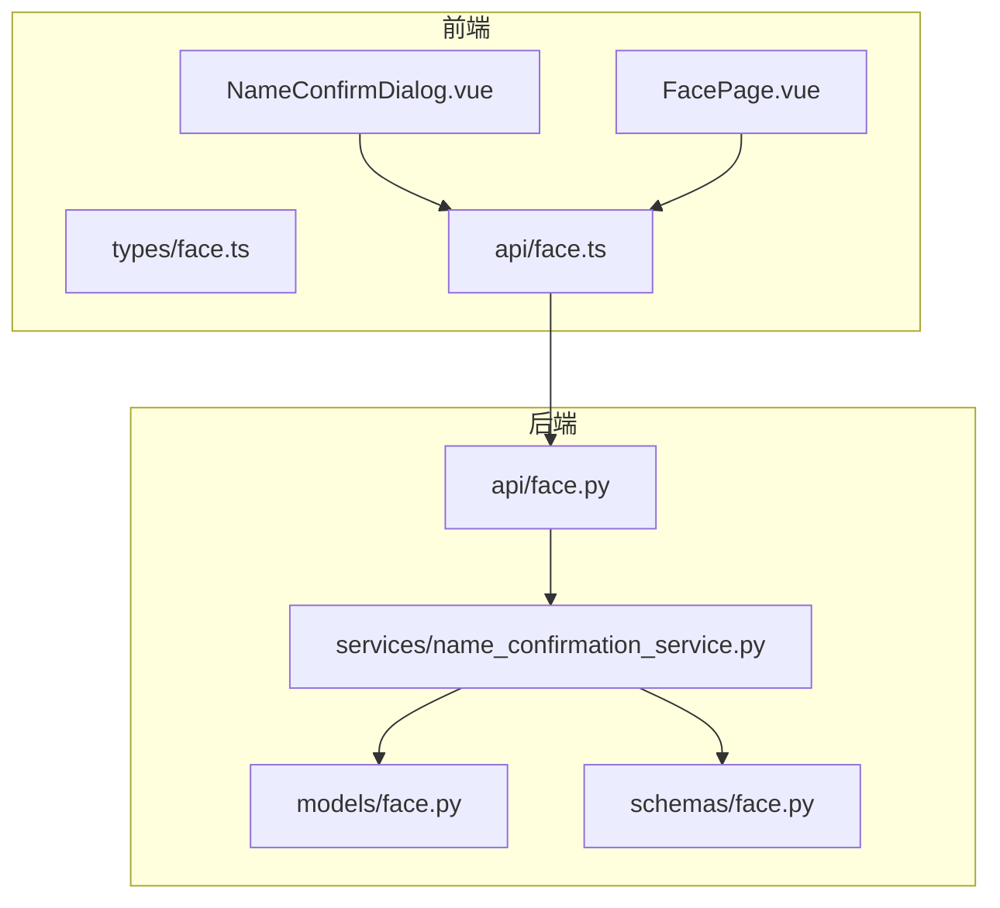
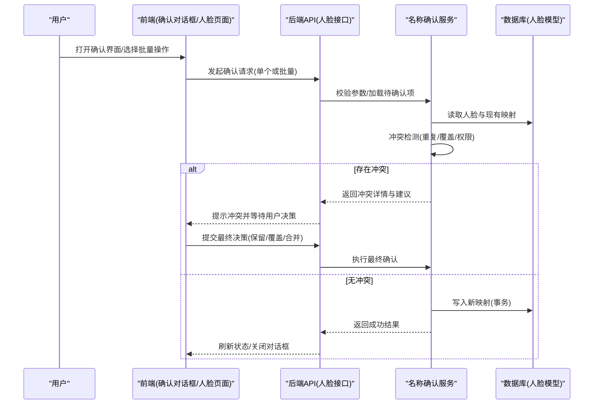
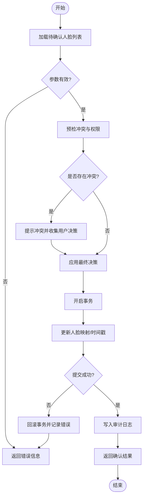
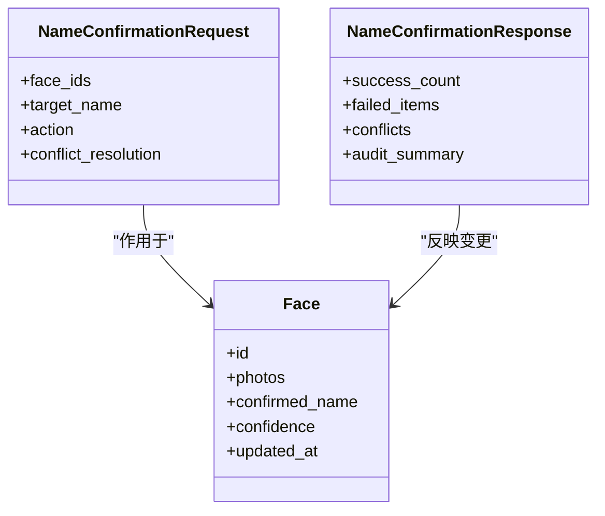
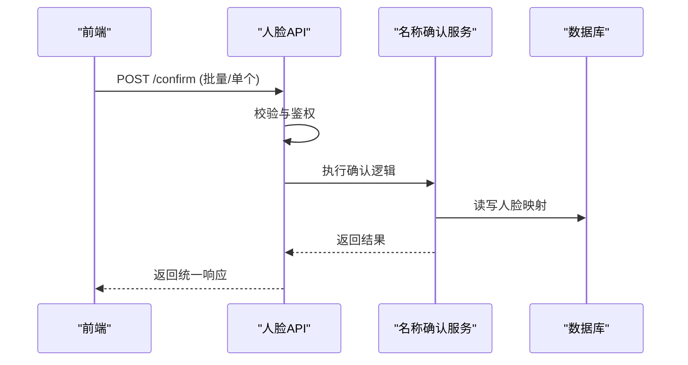
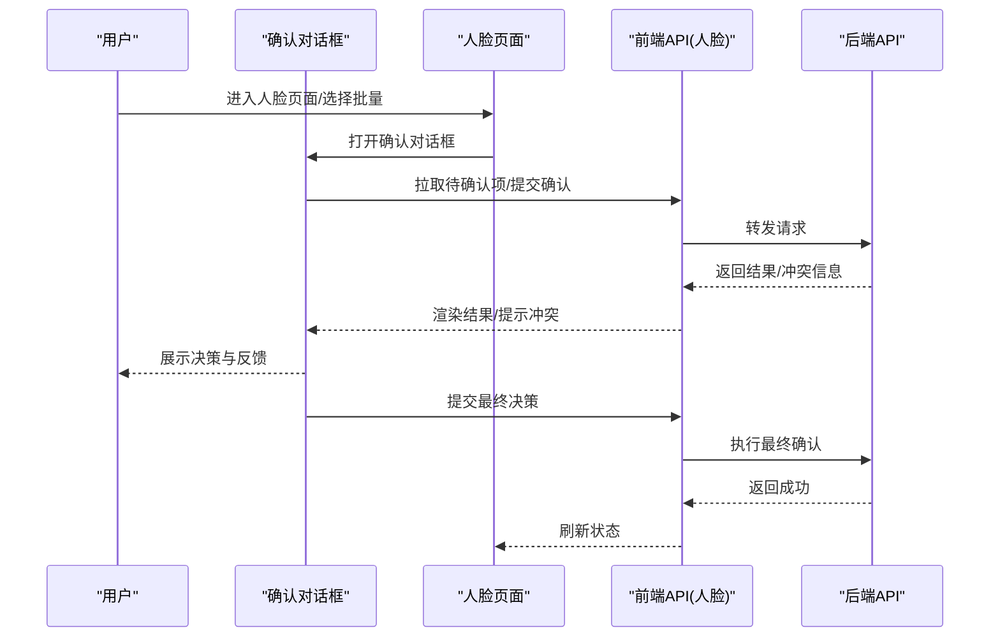
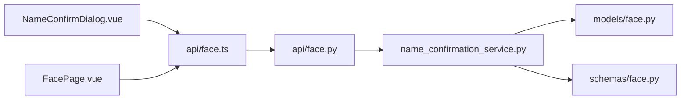

# 姓名确认服务

<cite>
**本文引用的文件**   
- [name_confirmation_service.py](file://backend/app/services/name_confirmation_service.py)
- [face.py](file://backend/app/models/face.py)
- [schemas/face.py](file://backend/app/schemas/face.py)
- [api/face.py](file://backend/app/api/face.py)
- [NameConfirmDialog.vue](file://frontend/src/components/chat/NameConfirmDialog.vue)
- [FacePage.vue](file://frontend/src/views/FacePage.vue)
- [types/face.ts](file://frontend/src/types/face.ts)
- [api/face.ts](file://frontend/src/api/face.ts)
</cite>

## 目录
1. [简介](#简介)
2. [项目结构](#项目结构)
3. [核心组件](#核心组件)
4. [架构总览](#架构总览)
5. [详细组件分析](#详细组件分析)
6. [依赖关系分析](#依赖关系分析)
7. [性能考虑](#性能考虑)
8. [故障排查指南](#故障排查指南)
9. [结论](#结论)
10. [附录](#附录)

## 简介
本文件面向“姓名确认服务”，聚焦于用户交互确认人脸身份的全链路机制，包括：
- 确认界面设计与交互流程
- 后端状态管理与数据同步策略
- 人脸与姓名映射关系的建立、更新与维护
- 批量确认操作、冲突解决与一致性保证
- 自动化选项与人工干预机制
- 前后端交互协议与实时状态更新方式

该服务旨在为照片库中的人脸聚类结果提供高效、可追溯的命名能力，确保最终的人脸-姓名映射准确可靠。

## 项目结构
围绕姓名确认的核心代码分布在后端服务、模型与接口层，以及前端确认对话框与页面中：
- 后端服务：负责确认任务编排、批量处理、冲突检测与持久化
- 模型与模式：定义人脸实体、确认记录及请求/响应结构
- API 层：暴露确认相关接口（单个/批量确认、查询待确认列表等）
- 前端：提供确认对话框与人脸管理页面，支持交互式确认与批量操作

图表来源
- [NameConfirmDialog.vue](file://frontend/src/components/chat/NameConfirmDialog.vue)
- [FacePage.vue](file://frontend/src/views/FacePage.vue)
- [types/face.ts](file://frontend/src/types/face.ts)
- [api/face.ts](file://frontend/src/api/face.ts)
- [api/face.py](file://backend/app/api/face.py)
- [name_confirmation_service.py](file://backend/app/services/name_confirmation_service.py)
- [face.py](file://backend/app/models/face.py)
- [schemas/face.py](file://backend/app/schemas/face.py)

章节来源
- [name_confirmation_service.py](file://backend/app/services/name_confirmation_service.py)
- [face.py](file://backend/app/models/face.py)
- [schemas/face.py](file://backend/app/schemas/face.py)
- [api/face.py](file://backend/app/api/face.py)
- [NameConfirmDialog.vue](file://frontend/src/components/chat/NameConfirmDialog.vue)
- [FacePage.vue](file://frontend/src/views/FacePage.vue)
- [types/face.ts](file://frontend/src/types/face.ts)
- [api/face.ts](file://frontend/src/api/face.ts)

## 核心组件
- 名称确认服务：封装确认业务逻辑，包含单条/批量确认、冲突检测、幂等性控制、事务提交与回滚、审计日志等。
- 人脸模型：承载人脸ID、关联照片、已确认姓名、置信度、更新时间戳等字段，作为映射关系的数据载体。
- 确认模式：定义请求参数与返回结构，如待确认人脸集合、建议候选、确认动作、冲突信息等。
- 确认API：对外暴露确认接口，接收前端确认指令，调用服务完成持久化并返回结果。
- 前端确认对话框：展示待确认人脸及其照片，支持输入姓名、选择候选、批量确认、撤销等操作。
- 人脸管理页面：聚合展示所有未确认/已确认的人脸，提供批量操作入口与状态筛选。

章节来源
- [name_confirmation_service.py](file://backend/app/services/name_confirmation_service.py)
- [face.py](file://backend/app/models/face.py)
- [schemas/face.py](file://backend/app/schemas/face.py)
- [api/face.py](file://backend/app/api/face.py)
- [NameConfirmDialog.vue](file://frontend/src/components/chat/NameConfirmDialog.vue)
- [FacePage.vue](file://frontend/src/views/FacePage.vue)

## 架构总览
下图展示了从前端到后端的完整确认流程，包括批量确认、冲突检测与一致性保障。

图表来源
- [api/face.py](file://backend/app/api/face.py)
- [name_confirmation_service.py](file://backend/app/services/name_confirmation_service.py)
- [face.py](file://backend/app/models/face.py)

## 详细组件分析

### 名称确认服务（后端）
职责与要点：
- 单条确认：校验人脸ID与目标姓名，检查是否已有映射，必要时触发冲突处理；在事务中更新人脸模型的姓名与时间戳。
- 批量确认：按批次加载人脸、去重、预检冲突、分片提交；失败项记录并继续其他项，最后汇总结果。
- 冲突解决：当同一姓名被多人使用或同一人脸被多次确认时，提供“保留旧值/覆盖/合并”策略；对高置信度或最近更新的映射优先。
- 幂等性：基于人脸ID与确认动作的幂等键，避免重复提交导致的状态漂移。
- 审计与追踪：记录每次确认的操作者、时间、变更前后值，便于回溯。

图表来源
- [name_confirmation_service.py](file://backend/app/services/name_confirmation_service.py)
- [face.py](file://backend/app/models/face.py)

章节来源
- [name_confirmation_service.py](file://backend/app/services/name_confirmation_service.py)
- [face.py](file://backend/app/models/face.py)

### 人脸模型与确认模式
- 人脸模型字段：人脸唯一标识、关联照片集合、已确认姓名、置信度、创建/更新时间戳等。
- 确认模式：
  - 请求体：包含待确认人脸ID集合、目标姓名、操作类型（确认/撤销/覆盖）、冲突决策等。
  - 响应体：包含成功/失败明细、冲突信息、建议候选、审计摘要等。

图表来源
- [face.py](file://backend/app/models/face.py)
- [schemas/face.py](file://backend/app/schemas/face.py)

章节来源
- [face.py](file://backend/app/models/face.py)
- [schemas/face.py](file://backend/app/schemas/face.py)

### 确认API（后端）
职责与要点：
- 接收前端确认请求，进行基础校验与鉴权。
- 调用名称确认服务执行具体逻辑。
- 将结果转换为统一响应格式返回给前端。
- 支持分页与过滤，用于获取待确认列表与历史确认记录。

图表来源
- [api/face.py](file://backend/app/api/face.py)
- [name_confirmation_service.py](file://backend/app/services/name_confirmation_service.py)
- [face.py](file://backend/app/models/face.py)

章节来源
- [api/face.py](file://backend/app/api/face.py)
- [name_confirmation_service.py](file://backend/app/services/name_confirmation_service.py)

### 前端确认对话框与人脸页面
- 确认对话框：
  - 展示待确认人脸缩略图与基本信息。
  - 支持输入姓名、选择候选、批量勾选、一键确认、撤销操作。
  - 显示冲突提示与用户决策入口。
  - 实时更新确认状态，完成后自动刷新列表。
- 人脸页面：
  - 聚合展示所有未确认/已确认的人脸卡片。
  - 提供批量操作入口、筛选与排序。
  - 与确认对话框联动，支持从页面直接发起确认。

图表来源
- [NameConfirmDialog.vue](file://frontend/src/components/chat/NameConfirmDialog.vue)
- [FacePage.vue](file://frontend/src/views/FacePage.vue)
- [api/face.ts](file://frontend/src/api/face.ts)

章节来源
- [NameConfirmDialog.vue](file://frontend/src/components/chat/NameConfirmDialog.vue)
- [FacePage.vue](file://frontend/src/views/FacePage.vue)
- [api/face.ts](file://frontend/src/api/face.ts)
- [types/face.ts](file://frontend/src/types/face.ts)

## 依赖关系分析
- 前端依赖：
  - 确认对话框依赖人脸类型定义与API封装。
  - 人脸页面依赖确认对话框与API，用于批量操作与状态展示。
- 后端依赖：
  - API依赖名称确认服务与人脸模型。
  - 名称确认服务依赖人脸模型与确认模式，可能依赖数据库会话与事务管理器。

图表来源
- [NameConfirmDialog.vue](file://frontend/src/components/chat/NameConfirmDialog.vue)
- [FacePage.vue](file://frontend/src/views/FacePage.vue)
- [api/face.ts](file://frontend/src/api/face.ts)
- [api/face.py](file://backend/app/api/face.py)
- [name_confirmation_service.py](file://backend/app/services/name_confirmation_service.py)
- [face.py](file://backend/app/models/face.py)
- [schemas/face.py](file://backend/app/schemas/face.py)

章节来源
- [api/face.ts](file://frontend/src/api/face.ts)
- [api/face.py](file://backend/app/api/face.py)
- [name_confirmation_service.py](file://backend/app/services/name_confirmation_service.py)
- [face.py](file://backend/app/models/face.py)
- [schemas/face.py](file://backend/app/schemas/face.py)

## 性能考虑
- 批量确认分片：将大批量确认拆分为多个小批次，降低单次事务压力，提高吞吐。
- 预检与缓存：在提交前预检冲突与权限，减少无效提交；对热点人脸映射做短期缓存以降低读放大。
- 并发控制：对同一人脸ID的请求进行串行化，避免并发覆盖；对批量操作采用队列与限流。
- 索引优化：为人脸ID、已确认姓名、更新时间等字段建立索引，提升查询与冲突检测效率。
- 异步处理：对于大规模确认任务，可采用后台任务队列异步执行，前端轮询或事件通知进度。

[本节为通用性能建议，不直接分析具体文件]

## 故障排查指南
常见问题与定位方法：
- 冲突频繁出现：检查是否有多人同时确认同一人脸；查看冲突决策是否正确应用；核对幂等键是否一致。
- 批量确认部分失败：查看失败明细与错误码；确认网络超时与重试策略；检查事务回滚范围。
- 状态不同步：确认前端是否在成功后刷新列表；检查后端返回的统一响应结构是否被正确解析。
- 审计缺失：确认审计日志写入是否成功；检查权限与操作者上下文是否正确传递。

章节来源
- [name_confirmation_service.py](file://backend/app/services/name_confirmation_service.py)
- [api/face.py](file://backend/app/api/face.py)
- [schemas/face.py](file://backend/app/schemas/face.py)

## 结论
姓名确认服务通过清晰的前后端分层与明确的服务职责，实现了高效、可靠的人脸-姓名映射管理。其关键优势在于：
- 明确的冲突检测与解决策略，保障数据一致性
- 批量操作的幂等性与事务性，提升鲁棒性
- 完善的审计与追踪，便于问题定位与合规审查
- 友好的前端交互设计，提升用户体验与操作效率

建议在后续迭代中持续优化批量任务的异步化与实时状态推送，进一步提升大规模场景下的性能与体验。

[本节为总结性内容，不直接分析具体文件]

## 附录
- 术语说明：
  - 人脸ID：系统中唯一标识一张人脸的标识符
  - 已确认姓名：经用户确认后绑定到人脸的正式姓名
  - 冲突：同一人脸被多次确认或同一姓名被多人使用的情况
  - 幂等键：确保相同请求不会重复生效的唯一标识
- 最佳实践：
  - 批量操作前先进行预检与预览
  - 对高风险操作增加二次确认与审计
  - 保持前后端响应结构一致，便于错误处理与调试

[本节为补充说明，不直接分析具体文件]