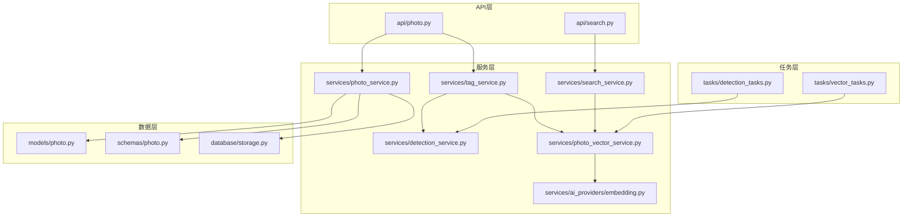
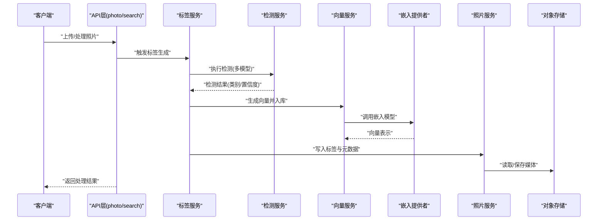
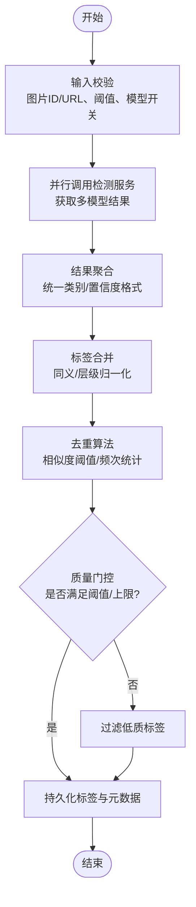
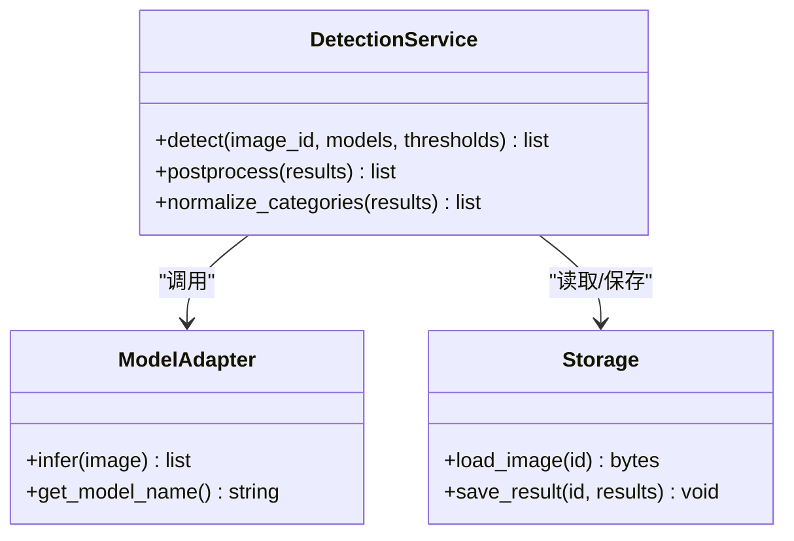
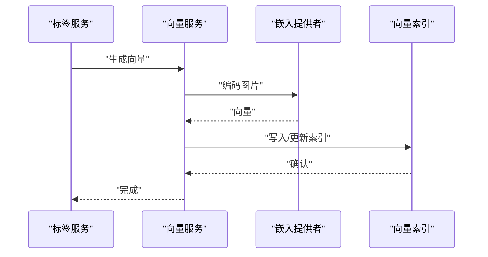
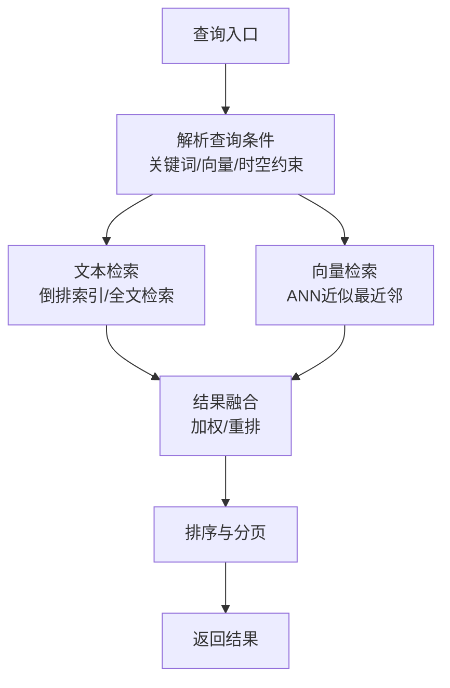
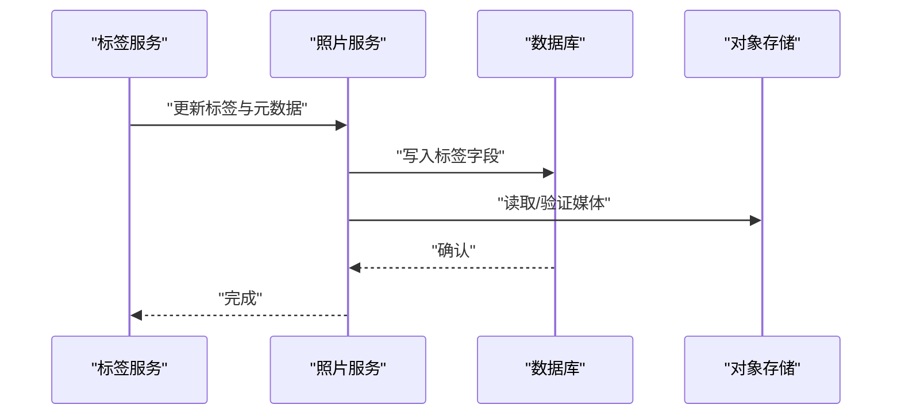
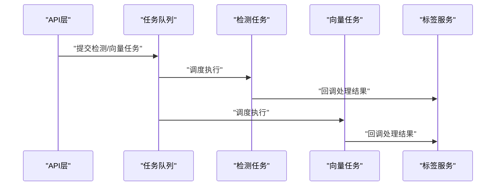
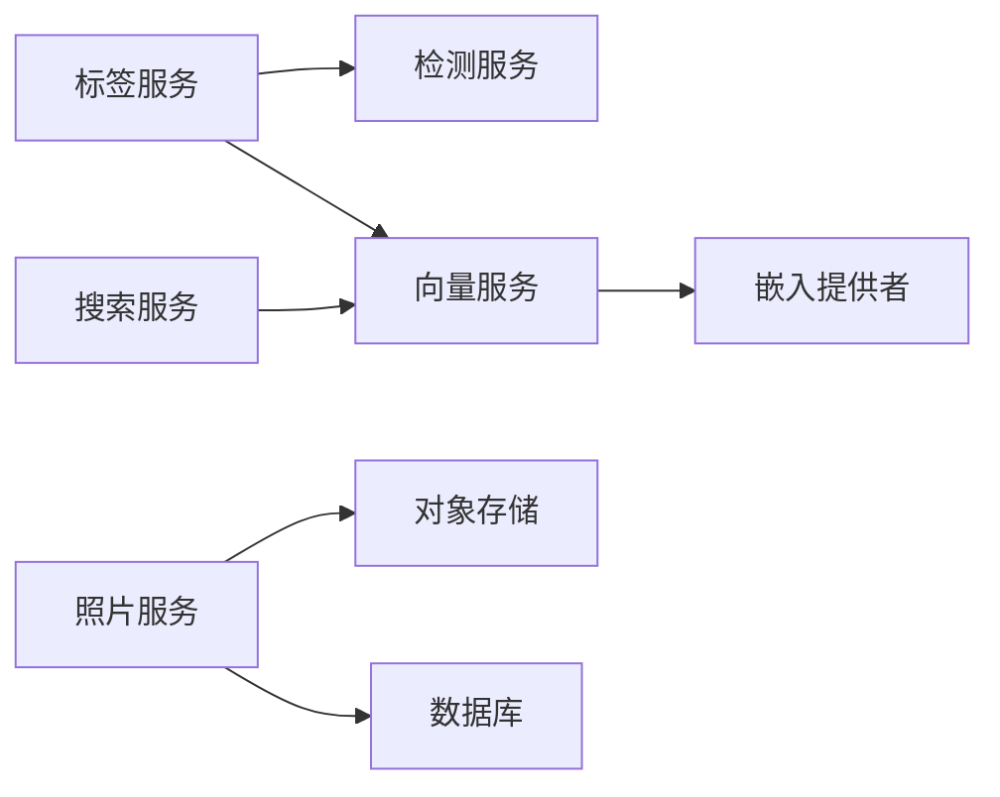

# 标签服务

<cite>
**本文引用的文件**   
- [tag_service.py](file://backend/app/services/tag_service.py)
- [detection_service.py](file://backend/app/services/detection_service.py)
- [photo_service.py](file://backend/app/services/photo_service.py)
- [search_service.py](file://backend/app/services/search_service.py)
- [photo_vector_service.py](file://backend/app/services/photo_vector_service.py)
- [ai_providers/embedding.py](file://backend/app/services/ai_providers/embedding.py)
- [models/photo.py](file://backend/app/models/photo.py)
- [schemas/photo.py](file://backend/app/schemas/photo.py)
- [api/photo.py](file://backend/app/api/photo.py)
- [api/search.py](file://backend/app/api/search.py)
- [tasks/detection_tasks.py](file://backend/app/tasks/detection_tasks.py)
- [tasks/vector_tasks.py](file://backend/app/tasks/vector_tasks.py)
- [database/storage.py](file://backend/app/database/storage.py)
</cite>

## 目录
1. [简介](#简介)
2. [项目结构](#项目结构)
3. [核心组件](#核心组件)
4. [架构总览](#架构总览)
5. [详细组件分析](#详细组件分析)
6. [依赖关系分析](#依赖关系分析)
7. [性能考虑](#性能考虑)
8. [故障排查指南](#故障排查指南)
9. [结论](#结论)
10. [附录](#附录)

## 简介
本文件面向“标签服务”，围绕AI驱动的图像标签生成与检索展开，覆盖以下关键主题：
- 算法实现：物体检测、场景识别、内容分析的技术细节与流程
- 标签体系：分类体系、置信度评分、标签合并策略
- 多模型融合：多模型输出聚合、去重与质量控制
- 搜索优化：索引构建、查询加速方案
- 系统集成：与照片管理系统的集成方式与标签生命周期管理

## 项目结构
标签服务位于后端服务的“服务层”和“任务层”，并与API层、数据模型层、存储层紧密协作。核心路径如下：
- 服务层：标签服务、检测服务、向量服务、搜索服务等
- 任务层：异步检测任务、向量任务
- API层：照片与搜索接口
- 数据层：照片模型、Schema定义、对象存储

图表来源
- [api/photo.py](file://backend/app/api/photo.py)
- [api/search.py](file://backend/app/api/search.py)
- [services/tag_service.py](file://backend/app/services/tag_service.py)
- [services/detection_service.py](file://backend/app/services/detection_service.py)
- [services/photo_vector_service.py](file://backend/app/services/photo_vector_service.py)
- [services/ai_providers/embedding.py](file://backend/app/services/ai_providers/embedding.py)
- [services/search_service.py](file://backend/app/services/search_service.py)
- [services/photo_service.py](file://backend/app/services/photo_service.py)
- [tasks/detection_tasks.py](file://backend/app/tasks/detection_tasks.py)
- [tasks/vector_tasks.py](file://backend/app/tasks/vector_tasks.py)
- [models/photo.py](file://backend/app/models/photo.py)
- [schemas/photo.py](file://backend/app/schemas/photo.py)
- [database/storage.py](file://backend/app/database/storage.py)

章节来源
- [tag_service.py](file://backend/app/services/tag_service.py)
- [detection_service.py](file://backend/app/services/detection_service.py)
- [photo_service.py](file://backend/app/services/photo_service.py)
- [search_service.py](file://backend/app/services/search_service.py)
- [photo_vector_service.py](file://backend/app/services/photo_vector_service.py)
- [ai_providers/embedding.py](file://backend/app/services/ai_providers/embedding.py)
- [models/photo.py](file://backend/app/models/photo.py)
- [schemas/photo.py](file://backend/app/schemas/photo.py)
- [api/photo.py](file://backend/app/api/photo.py)
- [api/search.py](file://backend/app/api/search.py)
- [tasks/detection_tasks.py](file://backend/app/tasks/detection_tasks.py)
- [tasks/vector_tasks.py](file://backend/app/tasks/vector_tasks.py)
- [database/storage.py](file://backend/app/database/storage.py)

## 核心组件
- 标签服务（Tag Service）
  - 职责：编排检测与向量化流程，执行多模型结果融合、去重、质量门控，并持久化标签到照片记录。
  - 输入：图片ID或URL、可选的模型配置与阈值参数。
  - 输出：标准化后的标签集合（含类别、置信度、来源模型、时间戳等）。
- 检测服务（Detection Service）
  - 职责：调用视觉模型进行物体检测与场景识别，产出结构化检测结果（边界框、类别、置信度）。
  - 扩展点：支持多模型接入与插件式替换。
- 向量服务（Photo Vector Service）
  - 职责：将图片编码为向量，维护向量索引，提供相似检索能力。
  - 依赖：嵌入提供者（Embedding Provider）。
- 搜索服务（Search Service）
  - 职责：组合关键词、语义向量、地理/时间等条件，返回排序后的照片列表。
- 照片服务（Photo Service）
  - 职责：照片元数据读写、标签字段更新、与对象存储交互。
- 任务层（Tasks）
  - 职责：异步执行检测与向量化任务，解耦主请求链路，提升吞吐与稳定性。

章节来源
- [tag_service.py](file://backend/app/services/tag_service.py)
- [detection_service.py](file://backend/app/services/detection_service.py)
- [photo_vector_service.py](file://backend/app/services/photo_vector_service.py)
- [ai_providers/embedding.py](file://backend/app/services/ai_providers/embedding.py)
- [search_service.py](file://backend/app/services/search_service.py)
- [photo_service.py](file://backend/app/services/photo_service.py)
- [tasks/detection_tasks.py](file://backend/app/tasks/detection_tasks.py)
- [tasks/vector_tasks.py](file://backend/app/tasks/vector_tasks.py)

## 架构总览
标签服务采用“服务+任务”的分层架构，API层接收请求后交由服务层编排，具体计算通过任务队列异步执行，最终落库并建立向量索引以支撑高效检索。

图表来源
- [api/photo.py](file://backend/app/api/photo.py)
- [api/search.py](file://backend/app/api/search.py)
- [services/tag_service.py](file://backend/app/services/tag_service.py)
- [services/detection_service.py](file://backend/app/services/detection_service.py)
- [services/photo_vector_service.py](file://backend/app/services/photo_vector_service.py)
- [services/ai_providers/embedding.py](file://backend/app/services/ai_providers/embedding.py)
- [services/photo_service.py](file://backend/app/services/photo_service.py)
- [database/storage.py](file://backend/app/database/storage.py)

## 详细组件分析

### 标签服务（Tag Service）
- 功能要点
  - 多模型标签融合：汇总来自不同检测模型的类别与置信度，按规则合并同类项。
  - 置信度评分：对同一标签的多源置信度进行加权平均或最大值选择，结合质量门控过滤低置信度标签。
  - 标签合并策略：基于语义相似度或层级关系进行归一化，避免重复与冗余。
  - 质量控制：设置最小置信度阈值、最大标签数量、黑名单/白名单机制。
  - 持久化：将最终标签集写入照片记录，供检索与展示使用。
- 关键流程
  - 输入校验 -> 并行调用检测服务 -> 结果聚合 -> 去重与合并 -> 质量门控 -> 写库与索引更新。

图表来源
- [services/tag_service.py](file://backend/app/services/tag_service.py)
- [services/detection_service.py](file://backend/app/services/detection_service.py)
- [services/photo_vector_service.py](file://backend/app/services/photo_vector_service.py)
- [services/photo_service.py](file://backend/app/services/photo_service.py)

章节来源
- [tag_service.py](file://backend/app/services/tag_service.py)

### 检测服务（Detection Service）
- 功能要点
  - 物体检测：输出目标类别、边界框、置信度。
  - 场景识别：输出场景类标签及其置信度。
  - 多模型支持：可插拔地接入多个检测模型，统一输出格式。
- 关键流程
  - 加载图片 -> 预处理 -> 模型推理 -> 后处理（NMS、阈值过滤）-> 标准化输出。

图表来源
- [services/detection_service.py](file://backend/app/services/detection_service.py)
- [database/storage.py](file://backend/app/database/storage.py)

章节来源
- [detection_service.py](file://backend/app/services/detection_service.py)

### 向量服务（Photo Vector Service）
- 功能要点
  - 图片编码：通过嵌入提供者将图片转换为高维向量。
  - 索引管理：维护向量索引，支持近似最近邻检索。
  - 批量处理：支持批量生成与更新向量，提高吞吐。
- 关键流程
  - 输入图片 -> 调用嵌入模型 -> 生成向量 -> 写入索引 -> 返回成功状态。

图表来源
- [services/photo_vector_service.py](file://backend/app/services/photo_vector_service.py)
- [services/ai_providers/embedding.py](file://backend/app/services/ai_providers/embedding.py)

章节来源
- [photo_vector_service.py](file://backend/app/services/photo_vector_service.py)
- [ai_providers/embedding.py](file://backend/app/services/ai_providers/embedding.py)

### 搜索服务（Search Service）
- 功能要点
  - 混合检索：结合关键词匹配与语义向量检索，提升召回与精度。
  - 排序策略：根据相关性、时间、地理位置等多因子排序。
  - 分页与缓存：支持分页查询与热点结果缓存。
- 关键流程
  - 解析查询 -> 构建关键词索引查询 -> 向量近似检索 -> 结果融合与排序 -> 返回分页结果。

图表来源
- [services/search_service.py](file://backend/app/services/search_service.py)
- [services/photo_vector_service.py](file://backend/app/services/photo_vector_service.py)

章节来源
- [search_service.py](file://backend/app/services/search_service.py)

### 照片服务（Photo Service）
- 功能要点
  - 元数据读写：更新标签字段、时间戳、来源信息等。
  - 存储交互：从对象存储读取原图与缩略图，确保一致性。
  - 事务性：保证标签写入与元数据更新的原子性。
- 关键流程
  - 接收标签结果 -> 更新数据库记录 -> 同步索引 -> 返回成功。

图表来源
- [services/photo_service.py](file://backend/app/services/photo_service.py)
- [database/storage.py](file://backend/app/database/storage.py)
- [models/photo.py](file://backend/app/models/photo.py)
- [schemas/photo.py](file://backend/app/schemas/photo.py)

章节来源
- [photo_service.py](file://backend/app/services/photo_service.py)
- [models/photo.py](file://backend/app/models/photo.py)
- [schemas/photo.py](file://backend/app/schemas/photo.py)
- [database/storage.py](file://backend/app/database/storage.py)

### 任务层（Tasks）
- 检测任务（Detection Tasks）
  - 作用：异步执行检测流程，避免阻塞主线程；支持重试与失败告警。
- 向量任务（Vector Tasks）
  - 作用：异步生成与更新向量索引；支持批量处理与断点续跑。

图表来源
- [tasks/detection_tasks.py](file://backend/app/tasks/detection_tasks.py)
- [tasks/vector_tasks.py](file://backend/app/tasks/vector_tasks.py)
- [services/tag_service.py](file://backend/app/services/tag_service.py)

章节来源
- [tasks/detection_tasks.py](file://backend/app/tasks/detection_tasks.py)
- [tasks/vector_tasks.py](file://backend/app/tasks/vector_tasks.py)

## 依赖关系分析
- 组件耦合
  - 标签服务依赖检测服务与向量服务，形成松耦合的服务编排。
  - 向量服务依赖嵌入提供者，便于替换不同的嵌入模型。
  - 搜索服务依赖向量服务与文本检索组件，实现混合检索。
- 外部依赖
  - 对象存储用于媒体存取。
  - 数据库用于元数据与标签持久化。
  - 任务队列用于异步处理。

图表来源
- [services/tag_service.py](file://backend/app/services/tag_service.py)
- [services/detection_service.py](file://backend/app/services/detection_service.py)
- [services/photo_vector_service.py](file://backend/app/services/photo_vector_service.py)
- [services/ai_providers/embedding.py](file://backend/app/services/ai_providers/embedding.py)
- [services/search_service.py](file://backend/app/services/search_service.py)
- [services/photo_service.py](file://backend/app/services/photo_service.py)
- [database/storage.py](file://backend/app/database/storage.py)

章节来源
- [tag_service.py](file://backend/app/services/tag_service.py)
- [detection_service.py](file://backend/app/services/detection_service.py)
- [photo_vector_service.py](file://backend/app/services/photo_vector_service.py)
- [ai_providers/embedding.py](file://backend/app/services/ai_providers/embedding.py)
- [search_service.py](file://backend/app/services/search_service.py)
- [photo_service.py](file://backend/app/services/photo_service.py)
- [database/storage.py](file://backend/app/database/storage.py)

## 性能考虑
- 并发与批处理
  - 检测与向量化任务采用异步队列，支持批量处理以提升吞吐。
- 缓存策略
  - 对热门查询结果进行缓存，减少重复计算。
- 索引优化
  - 向量索引采用近似最近邻算法，平衡召回率与延迟。
- 资源隔离
  - 不同模型与任务分片运行，避免相互干扰。

[本节为通用性能建议，不直接分析具体文件]

## 故障排查指南
- 常见问题
  - 检测失败：检查模型加载、图片格式、阈值配置。
  - 向量生成失败：确认嵌入模型可用性与网络连通性。
  - 标签未持久化：核对数据库连接与事务回滚日志。
- 定位方法
  - 查看任务队列重试与错误日志。
  - 检查对象存储访问权限与路径。
  - 监控API层响应时间与错误码分布。

章节来源
- [tasks/detection_tasks.py](file://backend/app/tasks/detection_tasks.py)
- [tasks/vector_tasks.py](file://backend/app/tasks/vector_tasks.py)
- [api/photo.py](file://backend/app/api/photo.py)
- [api/search.py](file://backend/app/api/search.py)

## 结论
标签服务通过多模型检测、向量检索与任务队列的组合，实现了可扩展、高性能的AI标签生成与检索能力。其模块化设计便于后续引入更多模型与检索策略，同时通过质量控制与索引优化保障用户体验与系统稳定性。

[本节为总结性内容，不直接分析具体文件]

## 附录
- 标签分类体系
  - 类别命名规范：统一小写、去除停用词、保留领域术语。
  - 层级结构：根类别->子类别，便于合并与展示。
- 置信度评分
  - 单模型置信度：模型输出的概率值。
  - 多模型融合：加权平均或最大值选择，权重由模型准确率与历史表现决定。
- 标签合并策略
  - 语义相似度：基于嵌入距离进行合并。
  - 层级归一化：将子类别映射至父类别，控制粒度。
- 去重算法
  - 相似度阈值：超过阈值的标签视为重复。
  - 频次统计：低频标签在合并阶段被抑制。
- 质量控制机制
  - 最小置信度阈值：低于阈值的标签被过滤。
  - 最大标签数量：限制每张照片的标签总数，避免噪声。
- 搜索优化与索引构建
  - 倒排索引：用于关键词快速匹配。
  - 向量索引：用于语义检索，支持增量更新。
- 与照片管理系统集成
  - 标签生命周期：生成->合并->持久化->检索->更新。
  - 事件驱动：上传/修改触发标签再生成与索引更新。

[本节为概念性说明，不直接分析具体文件]