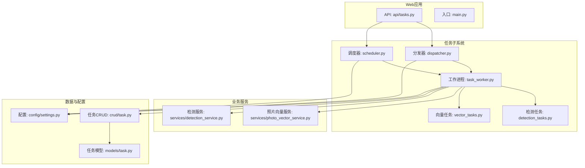
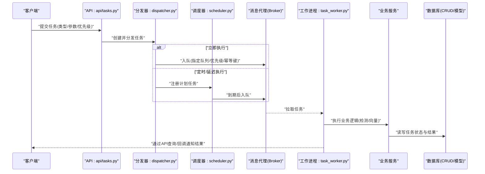
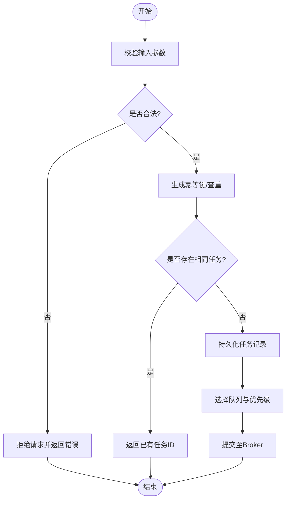
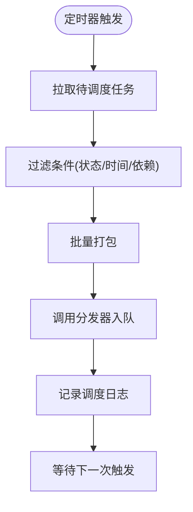
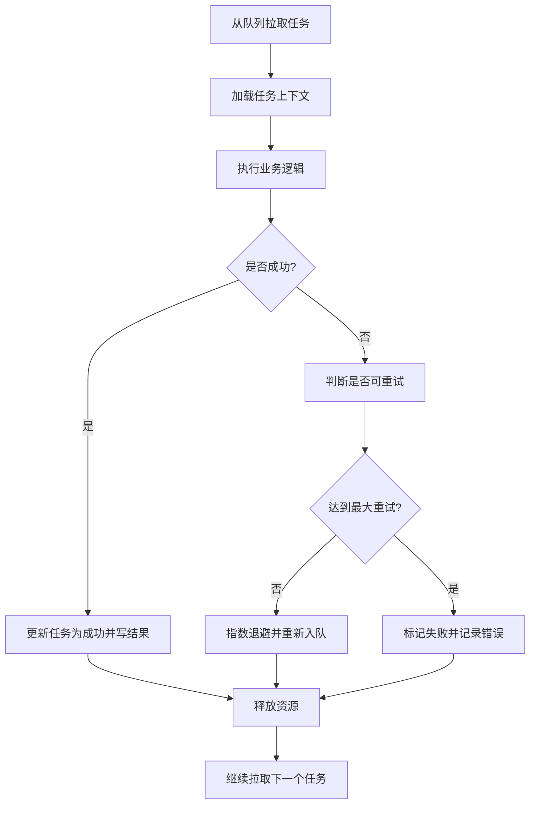
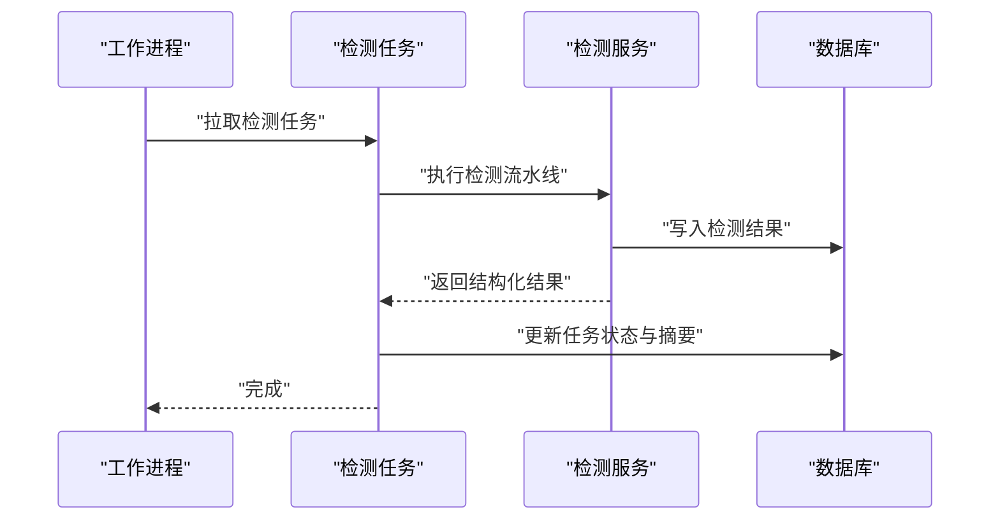
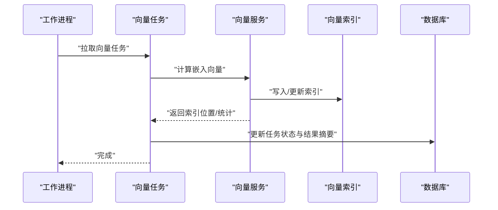
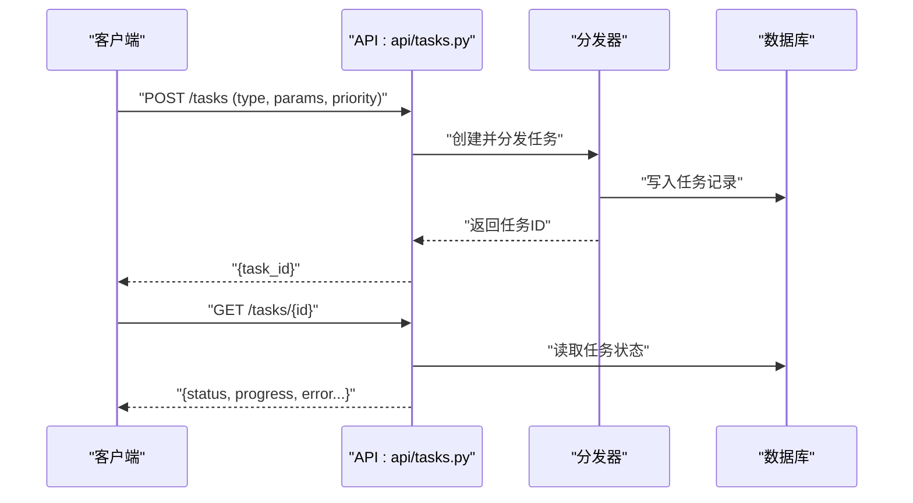
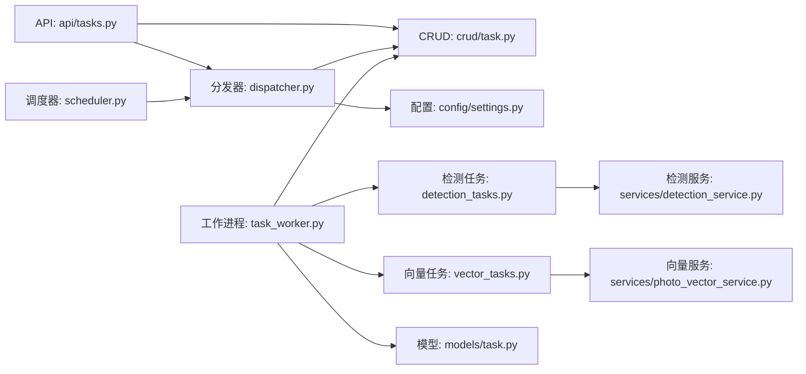

# 任务调度服务

<cite>
**本文引用的文件**   
- [backend/app/tasks/dispatcher.py](file://backend/app/tasks/dispatcher.py)
- [backend/app/tasks/scheduler.py](file://backend/app/tasks/scheduler.py)
- [backend/app/tasks/task_worker.py](file://backend/app/tasks/task_worker.py)
- [backend/app/tasks/detection_tasks.py](file://backend/app/tasks/detection_tasks.py)
- [backend/app/tasks/vector_tasks.py](file://backend/app/tasks/vector_tasks.py)
- [backend/app/api/tasks.py](file://backend/app/api/tasks.py)
- [backend/app/services/photo_vector_service.py](file://backend/app/services/photo_vector_service.py)
- [backend/app/services/detection_service.py](file://backend/app/services/detection_service.py)
- [backend/app/models/task.py](file://backend/app/models/task.py)
- [backend/app/crud/task.py](file://backend/app/crud/task.py)
- [backend/app/config/settings.py](file://backend/app/config/settings.py)
- [backend/main.py](file://backend/main.py)
</cite>

## 目录
1. [简介](#简介)
2. [项目结构](#项目结构)
3. [核心组件](#核心组件)
4. [架构总览](#架构总览)
5. [详细组件分析](#详细组件分析)
6. [依赖关系分析](#依赖关系分析)
7. [性能与资源管理](#性能与资源管理)
8. [监控、进度与告警](#监控进度与告警)
9. [故障排查指南](#故障排查指南)
10. [结论](#结论)

## 简介
本文件面向AI智能相册管理系统的“任务调度服务”，聚焦于Celery任务队列的配置与管理机制，系统阐述任务分发器、调度器、工作进程与具体任务类型的实现原理。文档覆盖检测任务与向量任务的异步处理流程、重试与错误恢复策略、优先级设置、并发控制与资源管理、以及任务监控、进度跟踪与失败告警的实现方式，并提供性能优化、内存管理与负载均衡的最佳实践建议。

## 项目结构
任务调度相关代码主要位于后端模块的 tasks 子包中，并与API层、服务层、数据模型及配置模块紧密协作：
- 任务定义与执行：tasks 包下的 detection_tasks.py、vector_tasks.py
- 任务编排与生命周期：dispatcher.py（分发器）、scheduler.py（调度器）、task_worker.py（工作进程）
- API暴露：api/tasks.py
- 业务服务：services 中的 photo_vector_service.py、detection_service.py
- 持久化与状态：models/task.py、crud/task.py
- 运行入口与全局配置：main.py、config/settings.py

图表来源
- [backend/app/tasks/dispatcher.py](file://backend/app/tasks/dispatcher.py)
- [backend/app/tasks/scheduler.py](file://backend/app/tasks/scheduler.py)
- [backend/app/tasks/task_worker.py](file://backend/app/tasks/task_worker.py)
- [backend/app/tasks/detection_tasks.py](file://backend/app/tasks/detection_tasks.py)
- [backend/app/tasks/vector_tasks.py](file://backend/app/tasks/vector_tasks.py)
- [backend/app/api/tasks.py](file://backend/app/api/tasks.py)
- [backend/app/services/photo_vector_service.py](file://backend/app/services/photo_vector_service.py)
- [backend/app/services/detection_service.py](file://backend/app/services/detection_service.py)
- [backend/app/models/task.py](file://backend/app/models/task.py)
- [backend/app/crud/task.py](file://backend/app/crud/task.py)
- [backend/app/config/settings.py](file://backend/app/config/settings.py)
- [backend/main.py](file://backend/main.py)

章节来源
- [backend/app/tasks/dispatcher.py](file://backend/app/tasks/dispatcher.py)
- [backend/app/tasks/scheduler.py](file://backend/app/tasks/scheduler.py)
- [backend/app/tasks/task_worker.py](file://backend/app/tasks/task_worker.py)
- [backend/app/tasks/detection_tasks.py](file://backend/app/tasks/detection_tasks.py)
- [backend/app/tasks/vector_tasks.py](file://backend/app/tasks/vector_tasks.py)
- [backend/app/api/tasks.py](file://backend/app/api/tasks.py)
- [backend/app/services/photo_vector_service.py](file://backend/app/services/photo_vector_service.py)
- [backend/app/services/detection_service.py](file://backend/app/services/detection_service.py)
- [backend/app/models/task.py](file://backend/app/models/task.py)
- [backend/app/crud/task.py](file://backend/app/crud/task.py)
- [backend/app/config/settings.py](file://backend/app/config/settings.py)
- [backend/main.py](file://backend/main.py)

## 核心组件
- 任务分发器（Dispatcher）
  - 职责：接收来自API或服务的任务请求，进行参数校验、路由选择、优先级与队列绑定、幂等键生成、提交至消息代理（Broker）。
  - 关键点：支持按任务类型选择不同队列；为长耗时任务提供幂等键以避免重复执行；将任务元信息写入数据库以便追踪。
- 任务调度器（Scheduler）
  - 职责：基于时间或事件触发周期性/延迟任务；维护任务计划表；在需要时向分发器提交任务。
  - 关键点：支持定时扫描待处理任务、批量派发、退避策略与失败重试。
- 工作进程（Worker）
  - 职责：从队列拉取任务并执行；负责日志记录、指标上报、异常捕获与结果回写；可配置多进程/多线程与资源限制。
  - 关键点：隔离CPU密集与IO密集任务；优雅关闭与信号处理；任务级超时与内存上限。
- 具体任务类型
  - 检测任务：人脸/物体/场景检测、特征抽取、结果入库。
  - 向量任务：图片/文本嵌入计算、索引更新、相似度检索准备。
- API接口
  - 暴露任务提交、查询、取消、重试等能力；返回任务ID与状态供前端轮询或WebSocket推送。
- 数据模型与CRUD
  - 任务实体包含类型、状态、优先级、重试次数、错误信息、结果摘要等字段；CRUD封装数据库访问。
- 配置
  - Celery Broker/Backend、队列名、并发数、任务超时、重试策略、日志级别等集中管理。

章节来源
- [backend/app/tasks/dispatcher.py](file://backend/app/tasks/dispatcher.py)
- [backend/app/tasks/scheduler.py](file://backend/app/tasks/scheduler.py)
- [backend/app/tasks/task_worker.py](file://backend/app/tasks/task_worker.py)
- [backend/app/tasks/detection_tasks.py](file://backend/app/tasks/detection_tasks.py)
- [backend/app/tasks/vector_tasks.py](file://backend/app/tasks/vector_tasks.py)
- [backend/app/api/tasks.py](file://backend/app/api/tasks.py)
- [backend/app/models/task.py](file://backend/app/models/task.py)
- [backend/app/crud/task.py](file://backend/app/crud/task.py)
- [backend/app/config/settings.py](file://backend/app/config/settings.py)

## 架构总览
下图展示从HTTP请求到任务执行与结果落库的整体流程，涵盖分发、调度、执行、持久化与监控的关键节点。

图表来源
- [backend/app/api/tasks.py](file://backend/app/api/tasks.py)
- [backend/app/tasks/dispatcher.py](file://backend/app/tasks/dispatcher.py)
- [backend/app/tasks/scheduler.py](file://backend/app/tasks/scheduler.py)
- [backend/app/tasks/task_worker.py](file://backend/app/tasks/task_worker.py)
- [backend/app/services/detection_service.py](file://backend/app/services/detection_service.py)
- [backend/app/services/photo_vector_service.py](file://backend/app/services/photo_vector_service.py)
- [backend/app/crud/task.py](file://backend/app/crud/task.py)
- [backend/app/models/task.py](file://backend/app/models/task.py)

## 详细组件分析

### 任务分发器（Dispatcher）
- 功能要点
  - 任务路由：根据任务类型映射到对应队列（如检测队列、向量队列），以隔离资源与优先级。
  - 幂等性：为同一业务操作生成幂等键，避免重复提交导致重复执行。
  - 优先级：结合队列与任务属性（如高优通道）提升关键任务吞吐。
  - 元数据持久化：提交前创建任务记录，便于状态追踪与审计。
- 关键流程
  - 参数校验 → 生成幂等键 → 选择队列/优先级 → 写入任务记录 → 提交至Broker。
- 错误处理
  - 参数非法直接拒绝；Broker不可达时降级为本地队列或延迟重试；幂等冲突返回已有任务ID。

图表来源
- [backend/app/tasks/dispatcher.py](file://backend/app/tasks/dispatcher.py)
- [backend/app/crud/task.py](file://backend/app/crud/task.py)
- [backend/app/models/task.py](file://backend/app/models/task.py)

章节来源
- [backend/app/tasks/dispatcher.py](file://backend/app/tasks/dispatcher.py)
- [backend/app/crud/task.py](file://backend/app/crud/task.py)
- [backend/app/models/task.py](file://backend/app/models/task.py)

### 任务调度器（Scheduler）
- 功能要点
  - 周期扫描：定期检查待处理任务集合，按策略批量派发。
  - 延迟执行：支持一次性延迟任务与周期性任务。
  - 退避与重试：对失败任务实施指数退避与最大重试次数限制。
- 关键流程
  - 扫描任务 → 过滤过期/未就绪 → 批量入队 → 记录调度日志。
- 与分发器的协作
  - 调度器作为“生产者”之一，复用分发器的幂等与持久化能力，确保一致性。

图表来源
- [backend/app/tasks/scheduler.py](file://backend/app/tasks/scheduler.py)
- [backend/app/tasks/dispatcher.py](file://backend/app/tasks/dispatcher.py)

章节来源
- [backend/app/tasks/scheduler.py](file://backend/app/tasks/scheduler.py)
- [backend/app/tasks/dispatcher.py](file://backend/app/tasks/dispatcher.py)

### 工作进程（Task Worker）
- 功能要点
  - 消费队列：从指定队列拉取任务，按优先级顺序执行。
  - 资源隔离：为CPU密集型任务与IO密集型任务分配不同worker实例或池。
  - 安全执行：任务级超时、内存限制、异常捕获与结果回写。
- 关键流程
  - 拉取任务 → 加载上下文 → 执行业务逻辑 → 更新状态/结果 → 清理资源。
- 优雅关闭
  - 处理SIGTERM/SIGINT，完成当前任务后退出；防止中断导致数据不一致。

图表来源
- [backend/app/tasks/task_worker.py](file://backend/app/tasks/task_worker.py)
- [backend/app/crud/task.py](file://backend/app/crud/task.py)
- [backend/app/models/task.py](file://backend/app/models/task.py)

章节来源
- [backend/app/tasks/task_worker.py](file://backend/app/tasks/task_worker.py)
- [backend/app/crud/task.py](file://backend/app/crud/task.py)
- [backend/app/models/task.py](file://backend/app/models/task.py)

### 检测任务（Detection Tasks）
- 典型步骤
  - 读取媒体源 → 预处理（缩放/格式转换）→ 调用检测服务 → 结果规范化 → 入库与索引更新。
- 错误恢复
  - 网络/模型加载失败采用重试；数据损坏跳过并记录；部分失败保留已处理片段。
- 性能优化
  - 批处理图片、预加载模型、使用连接池与缓存中间结果。

图表来源
- [backend/app/tasks/detection_tasks.py](file://backend/app/tasks/detection_tasks.py)
- [backend/app/services/detection_service.py](file://backend/app/services/detection_service.py)
- [backend/app/crud/task.py](file://backend/app/crud/task.py)

章节来源
- [backend/app/tasks/detection_tasks.py](file://backend/app/tasks/detection_tasks.py)
- [backend/app/services/detection_service.py](file://backend/app/services/detection_service.py)
- [backend/app/crud/task.py](file://backend/app/crud/task.py)

### 向量任务（Vector Tasks）
- 典型步骤
  - 读取图像/文本 → 调用嵌入服务 → 归一化向量 → 写入向量存储/索引 → 更新任务状态。
- 错误恢复
  - 嵌入服务不可用则重试；向量维度不匹配则修正或丢弃并告警。
- 性能优化
  - 批量嵌入、异步索引构建、分片写入与压缩存储。

图表来源
- [backend/app/tasks/vector_tasks.py](file://backend/app/tasks/vector_tasks.py)
- [backend/app/services/photo_vector_service.py](file://backend/app/services/photo_vector_service.py)
- [backend/app/crud/task.py](file://backend/app/crud/task.py)

章节来源
- [backend/app/tasks/vector_tasks.py](file://backend/app/tasks/vector_tasks.py)
- [backend/app/services/photo_vector_service.py](file://backend/app/services/photo_vector_service.py)
- [backend/app/crud/task.py](file://backend/app/crud/task.py)

### API层（任务接口）
- 能力
  - 提交任务：接收任务类型、参数、优先级，返回任务ID。
  - 查询状态：根据任务ID获取状态、进度、错误信息。
  - 控制任务：取消、重试、强制完成。
- 设计原则
  - 无阻塞：提交即返回；结果通过查询或回调获取。
  - 幂等：重复提交相同幂等键返回同一任务ID。

图表来源
- [backend/app/api/tasks.py](file://backend/app/api/tasks.py)
- [backend/app/tasks/dispatcher.py](file://backend/app/tasks/dispatcher.py)
- [backend/app/crud/task.py](file://backend/app/crud/task.py)

章节来源
- [backend/app/api/tasks.py](file://backend/app/api/tasks.py)
- [backend/app/tasks/dispatcher.py](file://backend/app/tasks/dispatcher.py)
- [backend/app/crud/task.py](file://backend/app/crud/task.py)

## 依赖关系分析
- 组件耦合
  - API仅依赖分发器与CRUD，保持薄控制器。
  - 分发器依赖配置与CRUD，解耦Broker细节。
  - 调度器复用分发器，降低重复逻辑。
  - 工作进程依赖任务实现与服务层，通过CRUD与模型交互。
- 外部依赖
  - Celery与Broker（如Redis/RabbitMQ）、数据库、向量存储、AI服务。
- 潜在循环依赖
  - 通过分层与接口抽象避免循环；任务实现只依赖服务与CRUD，不反向依赖API。

图表来源
- [backend/app/api/tasks.py](file://backend/app/api/tasks.py)
- [backend/app/tasks/dispatcher.py](file://backend/app/tasks/dispatcher.py)
- [backend/app/tasks/scheduler.py](file://backend/app/tasks/scheduler.py)
- [backend/app/tasks/task_worker.py](file://backend/app/tasks/task_worker.py)
- [backend/app/tasks/detection_tasks.py](file://backend/app/tasks/detection_tasks.py)
- [backend/app/tasks/vector_tasks.py](file://backend/app/tasks/vector_tasks.py)
- [backend/app/services/detection_service.py](file://backend/app/services/detection_service.py)
- [backend/app/services/photo_vector_service.py](file://backend/app/services/photo_vector_service.py)
- [backend/app/crud/task.py](file://backend/app/crud/task.py)
- [backend/app/models/task.py](file://backend/app/models/task.py)
- [backend/app/config/settings.py](file://backend/app/config/settings.py)

章节来源
- [backend/app/api/tasks.py](file://backend/app/api/tasks.py)
- [backend/app/tasks/dispatcher.py](file://backend/app/tasks/dispatcher.py)
- [backend/app/tasks/scheduler.py](file://backend/app/tasks/scheduler.py)
- [backend/app/tasks/task_worker.py](file://backend/app/tasks/task_worker.py)
- [backend/app/tasks/detection_tasks.py](file://backend/app/tasks/detection_tasks.py)
- [backend/app/tasks/vector_tasks.py](file://backend/app/tasks/vector_tasks.py)
- [backend/app/services/detection_service.py](file://backend/app/services/detection_service.py)
- [backend/app/services/photo_vector_service.py](file://backend/app/services/photo_vector_service.py)
- [backend/app/crud/task.py](file://backend/app/crud/task.py)
- [backend/app/models/task.py](file://backend/app/models/task.py)
- [backend/app/config/settings.py](file://backend/app/config/settings.py)

## 性能与资源管理
- 并发控制
  - 按任务类型拆分队列，分别启动不同worker实例，避免相互抢占。
  - 合理设置并发度：CPU密集型任务使用进程池，IO密集型任务使用线程池。
- 优先级与公平性
  - 高优先级队列优先消费；同时保障低优先级任务不被饿死（加权轮询或时间片）。
- 资源限制
  - 任务级超时、内存上限、文件句柄限制；大对象走临时存储而非消息体。
- 批处理与流式处理
  - 批量嵌入与批量入库减少往返开销；流式处理大文件避免峰值内存。
- 缓存与去重
  - 结果缓存与幂等键避免重复计算；热点数据缓存加速查询。
- 负载均衡
  - 多worker横向扩展；按队列容量动态扩缩容；跨主机部署避免单点瓶颈。

[本节为通用指导，无需特定文件引用]

## 监控、进度与告警
- 监控
  - 使用任务状态与指标（入队/出队/成功/失败/重试）可视化；记录关键路径耗时。
- 进度跟踪
  - 任务内部分段更新进度（如百分比、阶段名称），API层聚合展示。
- 失败告警
  - 超过阈值的重试次数或连续失败触发告警；错误堆栈与上下文信息随告警发送。
- 健康检查
  - Broker、数据库、向量存储健康探针；worker存活与队列积压监控。

章节来源
- [backend/app/api/tasks.py](file://backend/app/api/tasks.py)
- [backend/app/tasks/task_worker.py](file://backend/app/tasks/task_worker.py)
- [backend/app/crud/task.py](file://backend/app/crud/task.py)
- [backend/app/models/task.py](file://backend/app/models/task.py)

## 故障排查指南
- 常见问题
  - 任务堆积：检查worker数量与队列容量、任务耗时、下游服务可用性。
  - 重复执行：确认幂等键是否正确生成与去重逻辑生效。
  - 任务失败：查看错误信息与重试次数，定位上游依赖问题。
- 诊断步骤
  - 查询任务记录与日志；核对Broker与数据库连通性；验证模型与向量索引状态。
- 恢复策略
  - 自动重试与退避；人工干预重试；必要时重置任务状态并重新入队。

章节来源
- [backend/app/tasks/task_worker.py](file://backend/app/tasks/task_worker.py)
- [backend/app/crud/task.py](file://backend/app/crud/task.py)
- [backend/app/models/task.py](file://backend/app/models/task.py)

## 结论
本任务调度服务通过清晰的分层与职责划分，实现了检测与向量任务的稳定异步处理。借助分发器与调度器的协同、工作进程的弹性与健壮性、以及完善的监控与告警机制，系统在可扩展性与可靠性方面具备良好基础。后续可在批处理、缓存与自适应扩缩容方面持续优化，进一步提升吞吐与稳定性。