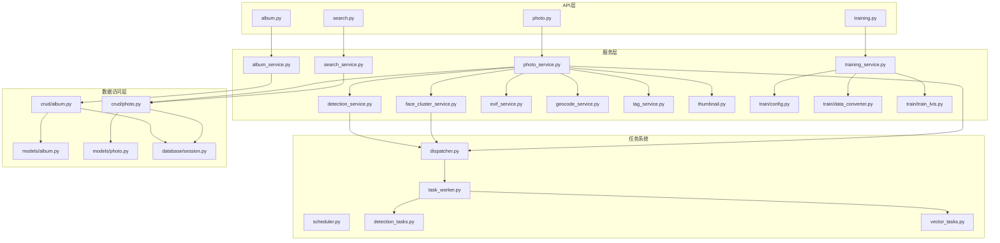
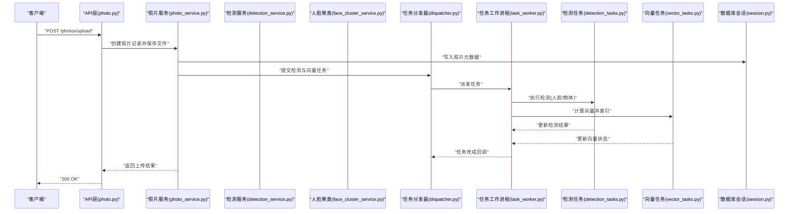
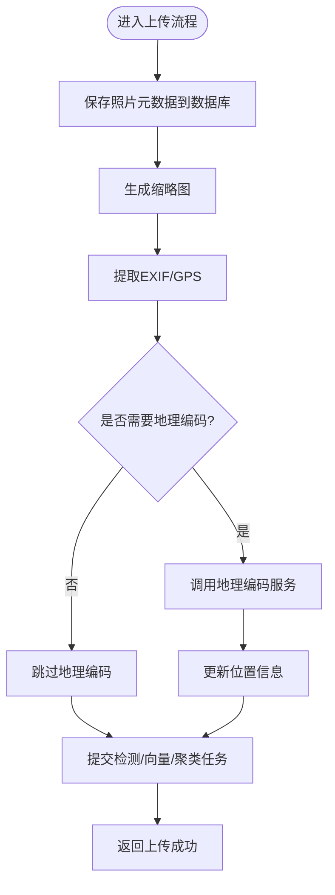
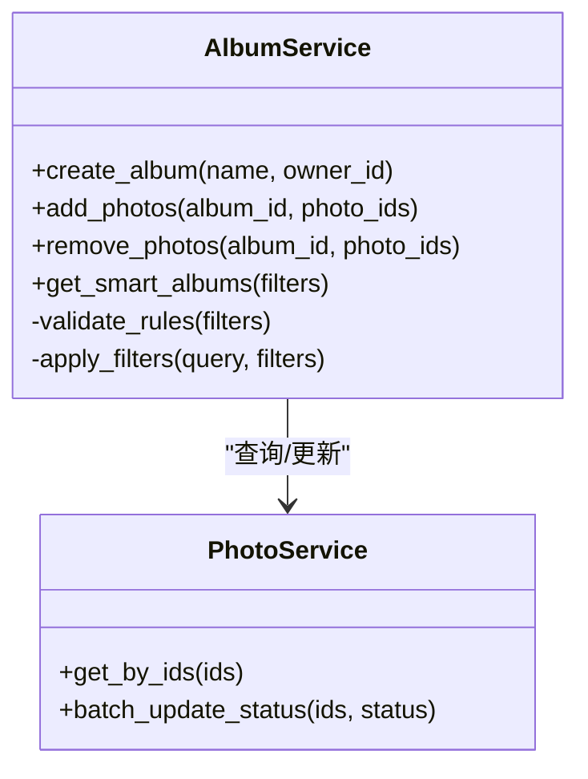
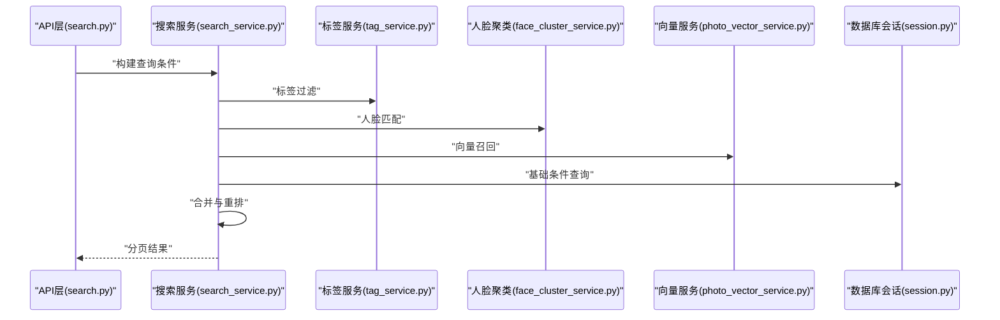
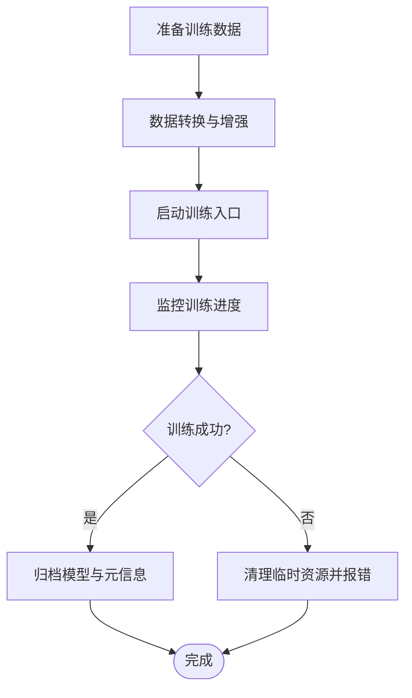
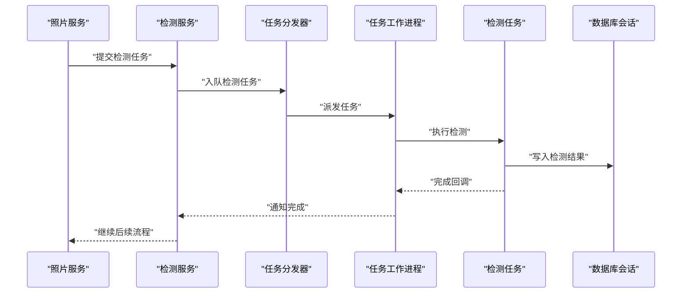
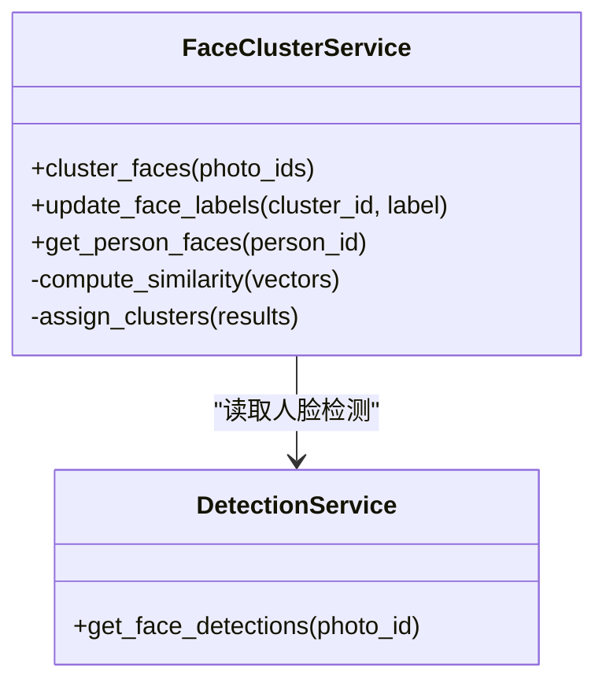
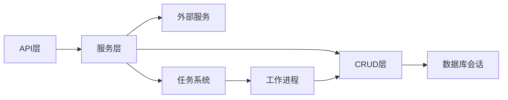

# 服务层架构

<cite>
**本文引用的文件**   
- [backend/app/services/album_service.py](file://backend/app/services/album_service.py)
- [backend/app/services/photo_service.py](file://backend/app/services/photo_service.py)
- [backend/app/services/search_service.py](file://backend/app/services/search_service.py)
- [backend/app/services/training_service.py](file://backend/app/services/training_service.py)
- [backend/app/services/detection_service.py](file://backend/app/services/detection_service.py)
- [backend/app/services/face_cluster_service.py](file://backend/app/services/face_cluster_service.py)
- [backend/app/services/exif_service.py](file://backend/app/services/exif_service.py)
- [backend/app/services/geocode_service.py](file://backend/app/services/geocode_service.py)
- [backend/app/services/tag_service.py](file://backend/app/services/tag_service.py)
- [backend/app/services/thumbnail.py](file://backend/app/services/thumbnail.py)
- [backend/app/services/train/config.py](file://backend/app/services/train/config.py)
- [backend/app/services/train/data_converter.py](file://backend/app/services/train/data_converter.py)
- [backend/app/services/train/train_lvis.py](file://backend/app/services/train/train_lvis.py)
- [backend/app/tasks/dispatcher.py](file://backend/app/tasks/dispatcher.py)
- [backend/app/tasks/scheduler.py](file://backend/app/tasks/scheduler.py)
- [backend/app/tasks/task_worker.py](file://backend/app/tasks/task_worker.py)
- [backend/app/tasks/detection_tasks.py](file://backend/app/tasks/detection_tasks.py)
- [backend/app/tasks/vector_tasks.py](file://backend/app/tasks/vector_tasks.py)
- [backend/app/crud/album.py](file://backend/app/crud/album.py)
- [backend/app/crud/photo.py](file://backend/app/crud/photo.py)
- [backend/app/models/album.py](file://backend/app/models/album.py)
- [backend/app/models/photo.py](file://backend/app/models/photo.py)
- [backend/app/database/session.py](file://backend/app/database/session.py)
- [backend/app/api/album.py](file://backend/app/api/album.py)
- [backend/app/api/photo.py](file://backend/app/api/photo.py)
- [backend/app/api/search.py](file://backend/app/api/search.py)
- [backend/app/api/training.py](file://backend/app/api/training.py)
- [backend/app/core/exceptions.py](file://backend/app/core/exceptions.py)
</cite>

## 目录
1. [简介](#简介)
2. [项目结构](#项目结构)
3. [核心组件](#核心组件)
4. [架构总览](#架构总览)
5. [详细组件分析](#详细组件分析)
6. [依赖关系分析](#依赖关系分析)
7. [性能考虑](#性能考虑)
8. [故障排查指南](#故障排查指南)
9. [结论](#结论)
10. [附录](#附录)

## 简介
本文件聚焦于AI智能相册管理系统的服务层设计与实现，围绕业务逻辑封装、事务边界、数据转换、异步任务集成、缓存策略与外部服务调用进行系统化说明。文档覆盖照片服务、相册服务、搜索服务与训练服务等核心服务，解释服务间通信机制、依赖关系与错误传播策略，并给出与API层和数据访问层的交互方式及最佳实践建议。

## 项目结构
服务层位于后端应用的服务目录中，按职责划分为：
- 领域服务：相册、照片、人脸聚类、检测、地理编码、标签、缩略图、向量等
- 训练服务：训练配置、数据转换、训练入口
- 任务系统：调度器、分发器、工作进程、具体任务（检测、向量）
- API层：路由控制器，负责参数校验、鉴权、调用服务层
- 数据访问层：CRUD与ORM模型、数据库会话与存储抽象

图表来源
- [backend/app/api/album.py](file://backend/app/api/album.py)
- [backend/app/api/photo.py](file://backend/app/api/photo.py)
- [backend/app/api/search.py](file://backend/app/api/search.py)
- [backend/app/api/training.py](file://backend/app/api/training.py)
- [backend/app/services/album_service.py](file://backend/app/services/album_service.py)
- [backend/app/services/photo_service.py](file://backend/app/services/photo_service.py)
- [backend/app/services/search_service.py](file://backend/app/services/search_service.py)
- [backend/app/services/training_service.py](file://backend/app/services/training_service.py)
- [backend/app/services/detection_service.py](file://backend/app/services/detection_service.py)
- [backend/app/services/face_cluster_service.py](file://backend/app/services/face_cluster_service.py)
- [backend/app/services/exif_service.py](file://backend/app/services/exif_service.py)
- [backend/app/services/geocode_service.py](file://backend/app/services/geocode_service.py)
- [backend/app/services/tag_service.py](file://backend/app/services/tag_service.py)
- [backend/app/services/thumbnail.py](file://backend/app/services/thumbnail.py)
- [backend/app/services/train/config.py](file://backend/app/services/train/config.py)
- [backend/app/services/train/data_converter.py](file://backend/app/services/train/data_converter.py)
- [backend/app/services/train/train_lvis.py](file://backend/app/services/train/train_lvis.py)
- [backend/app/tasks/dispatcher.py](file://backend/app/tasks/dispatcher.py)
- [backend/app/tasks/scheduler.py](file://backend/app/tasks/scheduler.py)
- [backend/app/tasks/task_worker.py](file://backend/app/tasks/task_worker.py)
- [backend/app/tasks/detection_tasks.py](file://backend/app/tasks/detection_tasks.py)
- [backend/app/tasks/vector_tasks.py](file://backend/app/tasks/vector_tasks.py)
- [backend/app/crud/album.py](file://backend/app/crud/album.py)
- [backend/app/crud/photo.py](file://backend/app/crud/photo.py)
- [backend/app/models/album.py](file://backend/app/models/album.py)
- [backend/app/models/photo.py](file://backend/app/models/photo.py)
- [backend/app/database/session.py](file://backend/app/database/session.py)

章节来源
- [backend/app/services/album_service.py](file://backend/app/services/album_service.py)
- [backend/app/services/photo_service.py](file://backend/app/services/photo_service.py)
- [backend/app/services/search_service.py](file://backend/app/services/search_service.py)
- [backend/app/services/training_service.py](file://backend/app/services/training_service.py)
- [backend/app/tasks/dispatcher.py](file://backend/app/tasks/dispatcher.py)
- [backend/app/tasks/scheduler.py](file://backend/app/tasks/scheduler.py)
- [backend/app/tasks/task_worker.py](file://backend/app/tasks/task_worker.py)
- [backend/app/tasks/detection_tasks.py](file://backend/app/tasks/detection_tasks.py)
- [backend/app/tasks/vector_tasks.py](file://backend/app/tasks/vector_tasks.py)
- [backend/app/crud/album.py](file://backend/app/crud/album.py)
- [backend/app/crud/photo.py](file://backend/app/crud/photo.py)
- [backend/app/models/album.py](file://backend/app/models/album.py)
- [backend/app/models/photo.py](file://backend/app/models/photo.py)
- [backend/app/database/session.py](file://backend/app/database/session.py)

## 核心组件
本节概述服务层的关键职责与边界：
- 业务编排：聚合多个子服务完成复杂流程（如上传后触发检测、聚类、向量化、缩略图生成、元数据提取）
- 事务边界：在需要一致性的写操作中组织数据库会话，确保失败回滚
- 数据转换：将模型对象转换为响应Schema或中间表示，屏蔽底层细节
- 异步任务：通过任务分发器与调度器将耗时操作入队，由工作进程执行
- 外部服务：封装第三方能力（如地理编码、嵌入模型），提供统一接口与重试/降级策略
- 错误传播：定义异常类型与错误码，向上层返回结构化错误信息

章节来源
- [backend/app/services/album_service.py](file://backend/app/services/album_service.py)
- [backend/app/services/photo_service.py](file://backend/app/services/photo_service.py)
- [backend/app/services/search_service.py](file://backend/app/services/search_service.py)
- [backend/app/services/training_service.py](file://backend/app/services/training_service.py)
- [backend/app/core/exceptions.py](file://backend/app/core/exceptions.py)

## 架构总览
服务层采用分层与模块化设计：
- API层仅做请求解析、鉴权与结果包装，不承载业务逻辑
- 服务层作为业务编排中心，协调CRUD、外部服务与任务系统
- 数据访问层专注持久化与查询，提供原子性操作
- 任务系统解耦耗时流程，支持延迟执行与重试

图表来源
- [backend/app/api/photo.py](file://backend/app/api/photo.py)
- [backend/app/services/photo_service.py](file://backend/app/services/photo_service.py)
- [backend/app/services/detection_service.py](file://backend/app/services/detection_service.py)
- [backend/app/services/face_cluster_service.py](file://backend/app/services/face_cluster_service.py)
- [backend/app/tasks/dispatcher.py](file://backend/app/tasks/dispatcher.py)
- [backend/app/tasks/task_worker.py](file://backend/app/tasks/task_worker.py)
- [backend/app/tasks/detection_tasks.py](file://backend/app/tasks/detection_tasks.py)
- [backend/app/tasks/vector_tasks.py](file://backend/app/tasks/vector_tasks.py)
- [backend/app/database/session.py](file://backend/app/database/session.py)

## 详细组件分析

### 照片服务（photo_service.py）
职责与边界
- 负责照片的上传、元数据处理、缩略图生成、关联标签与地理位置处理
- 编排检测与人脸聚类任务，保证主流程快速返回
- 维护照片与相册的关系，提供批量操作

关键流程
- 上传：接收文件流，持久化到存储，写入数据库记录，触发后续任务
- 元数据：读取EXIF、GPS，必要时调用地理编码服务
- 缩略图：生成多尺寸缩略图，缓存路径与大小信息
- 任务：将检测、向量计算、人脸聚类等任务入队

图表来源
- [backend/app/services/photo_service.py](file://backend/app/services/photo_service.py)
- [backend/app/services/exif_service.py](file://backend/app/services/exif_service.py)
- [backend/app/services/geocode_service.py](file://backend/app/services/geocode_service.py)
- [backend/app/services/thumbnail.py](file://backend/app/services/thumbnail.py)
- [backend/app/tasks/dispatcher.py](file://backend/app/tasks/dispatcher.py)

章节来源
- [backend/app/services/photo_service.py](file://backend/app/services/photo_service.py)
- [backend/app/services/exif_service.py](file://backend/app/services/exif_service.py)
- [backend/app/services/geocode_service.py](file://backend/app/services/geocode_service.py)
- [backend/app/services/thumbnail.py](file://backend/app/services/thumbnail.py)
- [backend/app/tasks/dispatcher.py](file://backend/app/tasks/dispatcher.py)

### 相册服务（album_service.py）
职责与边界
- 管理相册的增删改查、成员照片的添加与移除
- 提供智能相册规则（基于标签、时间、地点、人脸等条件）
- 与照片服务协作，确保一致性

典型场景
- 创建相册：校验名称唯一性，初始化空集合
- 添加照片：批量加入，去重，更新计数
- 智能相册：根据规则动态筛选，避免全量扫描

图表来源
- [backend/app/services/album_service.py](file://backend/app/services/album_service.py)
- [backend/app/services/photo_service.py](file://backend/app/services/photo_service.py)

章节来源
- [backend/app/services/album_service.py](file://backend/app/services/album_service.py)
- [backend/app/services/photo_service.py](file://backend/app/services/photo_service.py)

### 搜索服务（search_service.py）
职责与边界
- 组合文本、标签、人脸、地理位置等多维检索
- 与向量服务协作，提供语义相似度搜索
- 对结果进行排序、分页与过滤

检索流程
- 解析查询条件，构建查询计划
- 并行执行关键词匹配、标签过滤、人脸匹配、向量召回
- 合并结果，去重与重排，返回分页数据

图表来源
- [backend/app/api/search.py](file://backend/app/api/search.py)
- [backend/app/services/search_service.py](file://backend/app/services/search_service.py)
- [backend/app/services/tag_service.py](file://backend/app/services/tag_service.py)
- [backend/app/services/face_cluster_service.py](file://backend/app/services/face_cluster_service.py)
- [backend/app/database/session.py](file://backend/app/database/session.py)

章节来源
- [backend/app/api/search.py](file://backend/app/api/search.py)
- [backend/app/services/search_service.py](file://backend/app/services/search_service.py)
- [backend/app/services/tag_service.py](file://backend/app/services/tag_service.py)
- [backend/app/services/face_cluster_service.py](file://backend/app/services/face_cluster_service.py)
- [backend/app/database/session.py](file://backend/app/database/session.py)

### 训练服务（training_service.py）
职责与边界
- 管理训练任务生命周期：准备数据、启动训练、监控进度、导出模型
- 与训练配置、数据转换器、训练入口协作
- 提供训练任务的异步执行与状态查询

训练流程
- 数据准备：从数据集导出样本，使用数据转换器清洗与增强
- 启动训练：调用训练入口，传入配置与数据路径
- 进度跟踪：轮询或事件驱动获取训练状态
- 模型归档：保存权重与元信息，注册可用版本

图表来源
- [backend/app/services/training_service.py](file://backend/app/services/training_service.py)
- [backend/app/services/train/config.py](file://backend/app/services/train/config.py)
- [backend/app/services/train/data_converter.py](file://backend/app/services/train/data_converter.py)
- [backend/app/services/train/train_lvis.py](file://backend/app/services/train/train_lvis.py)

章节来源
- [backend/app/services/training_service.py](file://backend/app/services/training_service.py)
- [backend/app/services/train/config.py](file://backend/app/services/train/config.py)
- [backend/app/services/train/data_converter.py](file://backend/app/services/train/data_converter.py)
- [backend/app/services/train/train_lvis.py](file://backend/app/services/train/train_lvis.py)

### 检测服务（detection_service.py）
职责与边界
- 封装图像检测逻辑，调用模型推理
- 将检测结果持久化，触发后续任务（如人脸聚类、向量计算）
- 提供批量检测与增量更新能力

图表来源
- [backend/app/services/detection_service.py](file://backend/app/services/detection_service.py)
- [backend/app/tasks/dispatcher.py](file://backend/app/tasks/dispatcher.py)
- [backend/app/tasks/task_worker.py](file://backend/app/tasks/task_worker.py)
- [backend/app/tasks/detection_tasks.py](file://backend/app/tasks/detection_tasks.py)
- [backend/app/database/session.py](file://backend/app/database/session.py)

章节来源
- [backend/app/services/detection_service.py](file://backend/app/services/detection_service.py)
- [backend/app/tasks/dispatcher.py](file://backend/app/tasks/dispatcher.py)
- [backend/app/tasks/task_worker.py](file://backend/app/tasks/task_worker.py)
- [backend/app/tasks/detection_tasks.py](file://backend/app/tasks/detection_tasks.py)
- [backend/app/database/session.py](file://backend/app/database/session.py)

### 人脸聚类服务（face_cluster_service.py）
职责与边界
- 基于人脸特征进行聚类，识别同一人物在不同照片中的出现
- 与检测服务协作，消费人脸检测结果
- 提供人脸ID映射与批量更新

图表来源
- [backend/app/services/face_cluster_service.py](file://backend/app/services/face_cluster_service.py)
- [backend/app/services/detection_service.py](file://backend/app/services/detection_service.py)

章节来源
- [backend/app/services/face_cluster_service.py](file://backend/app/services/face_cluster_service.py)
- [backend/app/services/detection_service.py](file://backend/app/services/detection_service.py)

### 其他辅助服务
- EXIF服务：读取图片元数据，标准化字段
- 地理编码服务：将经纬度转换为地址信息，支持缓存
- 标签服务：管理标签体系，提供自动打标与人工确认
- 缩略图服务：生成多种尺寸，优化加载性能

章节来源
- [backend/app/services/exif_service.py](file://backend/app/services/exif_service.py)
- [backend/app/services/geocode_service.py](file://backend/app/services/geocode_service.py)
- [backend/app/services/tag_service.py](file://backend/app/services/tag_service.py)
- [backend/app/services/thumbnail.py](file://backend/app/services/thumbnail.py)

## 依赖关系分析
服务层内部依赖清晰，遵循单向依赖原则：
- API层依赖服务层
- 服务层依赖CRUD与外部服务
- 任务系统独立运行，通过消息队列或内存队列与工作进程通信
- 数据访问层被服务层与任务层共同使用

图表来源
- [backend/app/api/album.py](file://backend/app/api/album.py)
- [backend/app/api/photo.py](file://backend/app/api/photo.py)
- [backend/app/api/search.py](file://backend/app/api/search.py)
- [backend/app/api/training.py](file://backend/app/api/training.py)
- [backend/app/services/album_service.py](file://backend/app/services/album_service.py)
- [backend/app/services/photo_service.py](file://backend/app/services/photo_service.py)
- [backend/app/services/search_service.py](file://backend/app/services/search_service.py)
- [backend/app/services/training_service.py](file://backend/app/services/training_service.py)
- [backend/app/crud/album.py](file://backend/app/crud/album.py)
- [backend/app/crud/photo.py](file://backend/app/crud/photo.py)
- [backend/app/database/session.py](file://backend/app/database/session.py)
- [backend/app/tasks/dispatcher.py](file://backend/app/tasks/dispatcher.py)
- [backend/app/tasks/task_worker.py](file://backend/app/tasks/task_worker.py)

章节来源
- [backend/app/api/album.py](file://backend/app/api/album.py)
- [backend/app/api/photo.py](file://backend/app/api/photo.py)
- [backend/app/api/search.py](file://backend/app/api/search.py)
- [backend/app/api/training.py](file://backend/app/api/training.py)
- [backend/app/services/album_service.py](file://backend/app/services/album_service.py)
- [backend/app/services/photo_service.py](file://backend/app/services/photo_service.py)
- [backend/app/services/search_service.py](file://backend/app/services/search_service.py)
- [backend/app/services/training_service.py](file://backend/app/services/training_service.py)
- [backend/app/crud/album.py](file://backend/app/crud/album.py)
- [backend/app/crud/photo.py](file://backend/app/crud/photo.py)
- [backend/app/database/session.py](file://backend/app/database/session.py)
- [backend/app/tasks/dispatcher.py](file://backend/app/tasks/dispatcher.py)
- [backend/app/tasks/task_worker.py](file://backend/app/tasks/task_worker.py)

## 性能考虑
- 异步优先：将检测、向量计算、聚类、缩略图生成等耗时操作放入任务队列，缩短API响应时间
- 批处理：批量更新与查询减少数据库往返，提高吞吐
- 缓存策略：对频繁读的数据（如标签、地理位置）进行缓存，降低外部服务压力
- 连接池：复用数据库连接与HTTP客户端连接，避免频繁握手开销
- 限流与退避：对外部服务调用实施速率限制与指数退避，提升稳定性
- 索引优化：为常用查询字段建立索引，加速检索

[本节为通用指导，不涉及具体文件分析]

## 故障排查指南
- 明确异常类型：在服务层抛出领域异常，包含错误码与上下文信息
- 日志记录：在关键路径记录输入输出摘要，便于定位问题
- 重试与补偿：对可重试的外部调用增加重试逻辑，对失败任务提供补偿机制
- 超时控制：为所有外部调用设置合理超时，避免阻塞
- 健康检查：暴露服务健康端点，监控任务队列与工作进程状态

章节来源
- [backend/app/core/exceptions.py](file://backend/app/core/exceptions.py)

## 结论
服务层通过清晰的职责划分与良好的依赖管理，实现了高内聚、低耦合的业务编排。借助任务系统与缓存策略，系统在性能与可扩展性方面具备良好表现。建议在后续迭代中持续完善错误传播、监控与测试覆盖，进一步提升系统健壮性与可维护性。

[本节为总结性内容，不涉及具体文件分析]

## 附录
- 单元测试编写要点
  - 隔离外部依赖：使用Mock对象模拟数据库、外部服务与任务系统
  - 断言行为：不仅断言返回值，还断言副作用（如任务入队、数据库写入）
  - 边界条件：覆盖空输入、非法参数、并发冲突等场景
- Mock对象使用示例路径
  - 参考测试目录中的用例，学习如何构造Mock与验证调用
- 性能优化技巧
  - 使用批量接口减少IO次数
  - 引入本地缓存与分布式缓存结合
  - 对热点数据进行预计算与增量更新

章节来源
- [backend/app/services/test/conftest.py](file://backend/app/services/test/conftest.py)
- [backend/app/services/test/test_album_smart.py](file://backend/app/services/test/test_album_smart.py)
- [backend/app/services/test/test_detection.py](file://backend/app/services/test/test_detection.py)
- [backend/app/services/test/test_face_cluster.py](file://backend/app/services/test/test_face_cluster.py)
- [backend/app/services/test/test_search.py](file://backend/app/services/test/test_search.py)