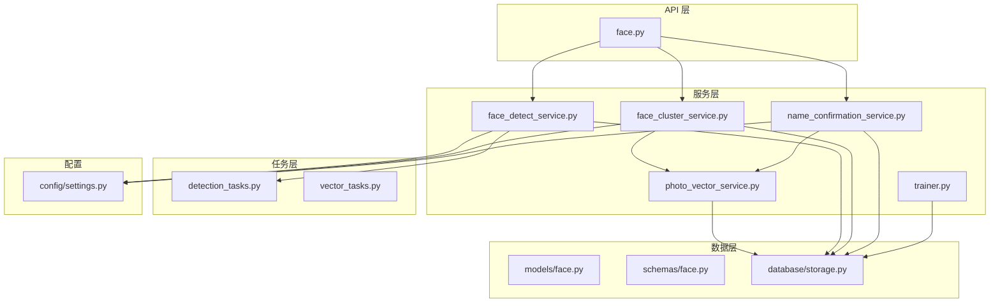
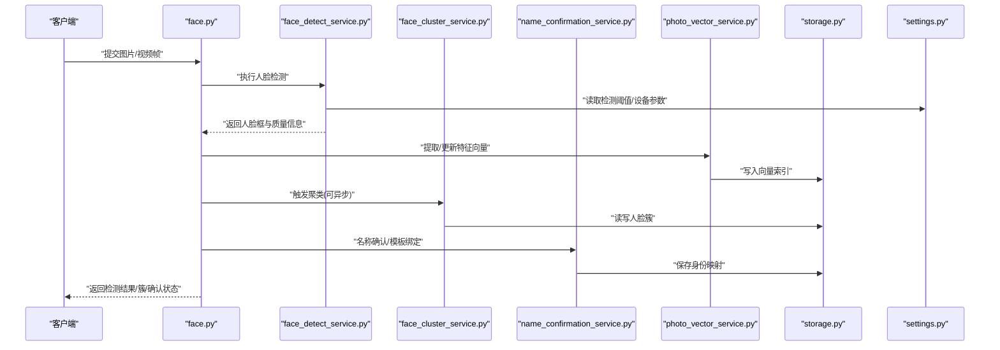
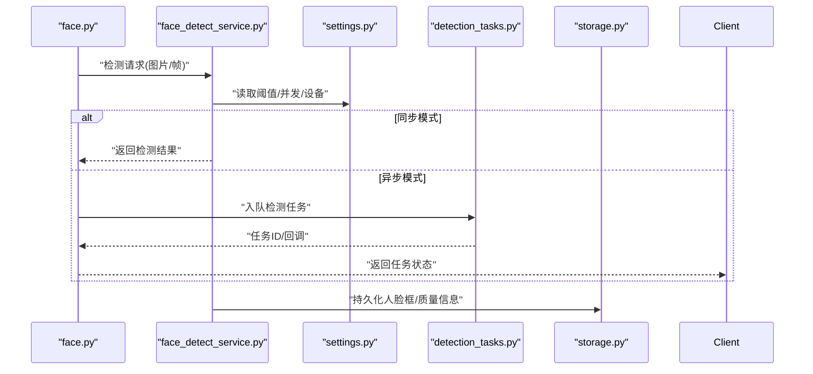
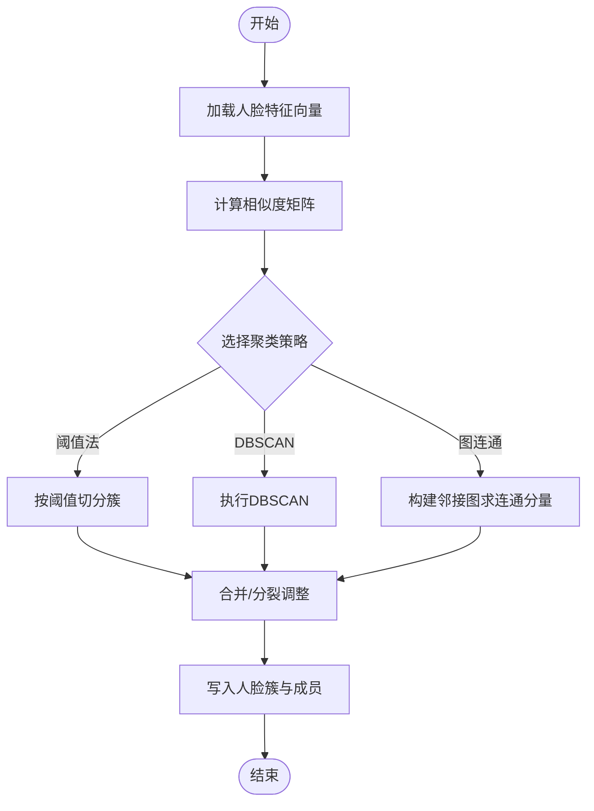
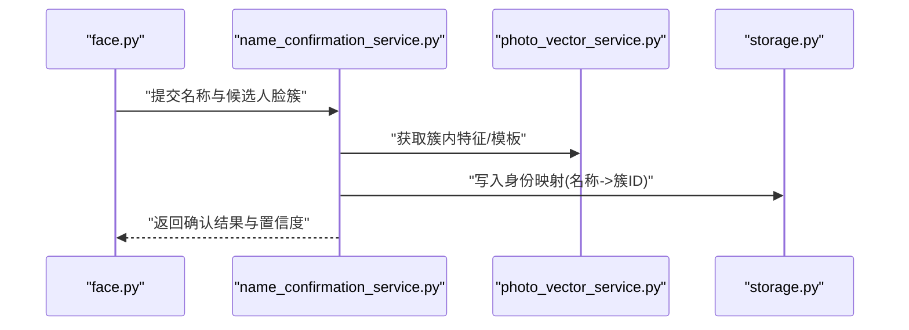
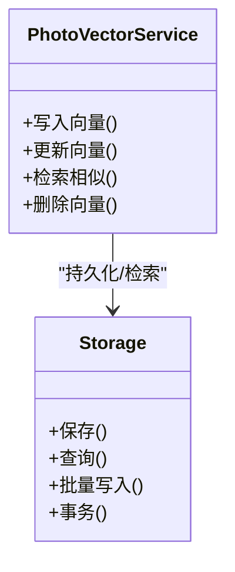
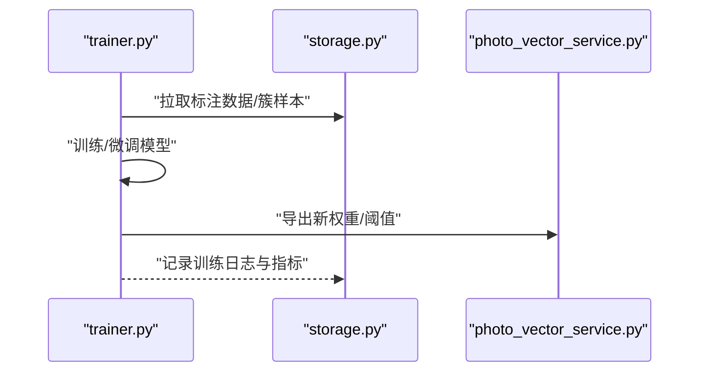
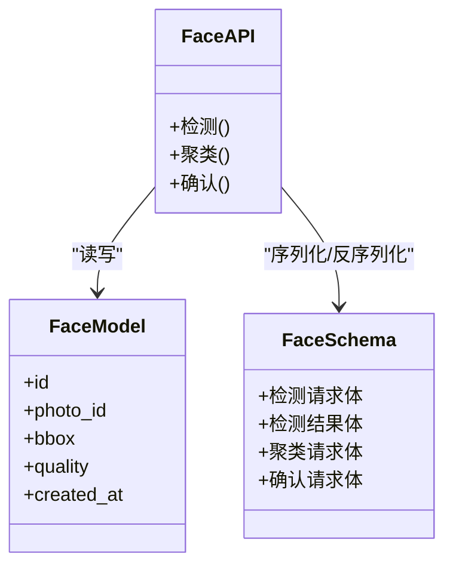
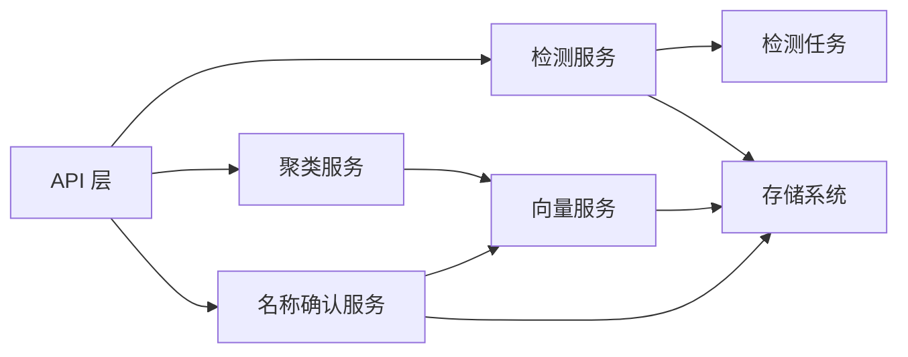

# 人脸处理服务

<cite>
**本文引用的文件**   
- [backend/app/api/face.py](file://backend/app/api/face.py)
- [backend/app/services/face_detect_service.py](file://backend/app/services/face_detect_service.py)
- [backend/app/services/face_cluster_service.py](file://backend/app/services/face_cluster_service.py)
- [backend/app/services/name_confirmation_service.py](file://backend/app/services/name_confirmation_service.py)
- [backend/app/models/face.py](file://backend/app/models/face.py)
- [backend/app/schemas/face.py](file://backend/app/schemas/face.py)
- [backend/app/database/storage.py](file://backend/app/database/storage.py)
- [backend/app/tasks/detection_tasks.py](file://backend/app/tasks/detection_tasks.py)
- [backend/app/tasks/vector_tasks.py](file://backend/app/tasks/vector_tasks.py)
- [backend/app/services/photo_vector_service.py](file://backend/app/services/photo_vector_service.py)
- [backend/app/services/trainer.py](file://backend/app/services/trainer.py)
- [backend/app/config/settings.py](file://backend/app/config/settings.py)
</cite>

## 目录
1. [简介](#简介)
2. [项目结构](#项目结构)
3. [核心组件](#核心组件)
4. [架构总览](#架构总览)
5. [详细组件分析](#详细组件分析)
6. [依赖关系分析](#依赖关系分析)
7. [性能考虑](#性能考虑)
8. [故障排查指南](#故障排查指南)
9. [结论](#结论)
10. [附录](#附录)

## 简介
本文件面向“人脸处理服务”模块，聚焦人脸识别、人脸聚类和身份确认三大能力。文档从系统架构、数据流与算法实现角度，深入解析人脸检测精度优化、聚类策略选择与相似度计算机制，并给出特征提取、模板匹配与批量处理的优化建议。同时提供端到端流程示例（以代码片段路径形式），帮助读者快速理解从检测到识别、再到结果验证的完整链路。

## 项目结构
人脸处理相关代码主要分布在以下层次：
- API 层：对外暴露人脸相关的接口，如检测、聚类、名称确认等
- 服务层：封装具体业务逻辑，包括检测、聚类、名称确认、向量检索等
- 模型与模式：定义数据库实体与请求/响应数据结构
- 任务层：异步执行耗时任务（检测、向量化）
- 存储层：持久化人脸记录、向量索引与图片资源
- 配置层：统一加载运行参数（阈值、并发、设备选择等）

图表来源
- [backend/app/api/face.py](file://backend/app/api/face.py)
- [backend/app/services/face_detect_service.py](file://backend/app/services/face_detect_service.py)
- [backend/app/services/face_cluster_service.py](file://backend/app/services/face_cluster_service.py)
- [backend/app/services/name_confirmation_service.py](file://backend/app/services/name_confirmation_service.py)
- [backend/app/services/photo_vector_service.py](file://backend/app/services/photo_vector_service.py)
- [backend/app/services/trainer.py](file://backend/app/services/trainer.py)
- [backend/app/tasks/detection_tasks.py](file://backend/app/tasks/detection_tasks.py)
- [backend/app/tasks/vector_tasks.py](file://backend/app/tasks/vector_tasks.py)
- [backend/app/models/face.py](file://backend/app/models/face.py)
- [backend/app/schemas/face.py](file://backend/app/schemas/face.py)
- [backend/app/database/storage.py](file://backend/app/database/storage.py)
- [backend/app/config/settings.py](file://backend/app/config/settings.py)

章节来源
- [backend/app/api/face.py](file://backend/app/api/face.py)
- [backend/app/services/face_detect_service.py](file://backend/app/services/face_detect_service.py)
- [backend/app/services/face_cluster_service.py](file://backend/app/services/face_cluster_service.py)
- [backend/app/services/name_confirmation_service.py](file://backend/app/services/name_confirmation_service.py)
- [backend/app/services/photo_vector_service.py](file://backend/app/services/photo_vector_service.py)
- [backend/app/services/trainer.py](file://backend/app/services/trainer.py)
- [backend/app/tasks/detection_tasks.py](file://backend/app/tasks/detection_tasks.py)
- [backend/app/tasks/vector_tasks.py](file://backend/app/tasks/vector_tasks.py)
- [backend/app/models/face.py](file://backend/app/models/face.py)
- [backend/app/schemas/face.py](file://backend/app/schemas/face.py)
- [backend/app/database/storage.py](file://backend/app/database/storage.py)
- [backend/app/config/settings.py](file://backend/app/config/settings.py)

## 核心组件
- 人脸检测服务：负责图像中人脸区域定位、质量评估与裁剪，输出人脸框与可选特征向量
- 人脸聚类服务：基于人脸特征向量进行聚类，生成“人脸簇”，用于去重与分组展示
- 名称确认服务：将人脸簇与用户指定名称绑定，完成身份确认与模板管理
- 向量服务：负责人脸特征向量的持久化、检索与更新
- 训练服务：支持离线或增量训练，提升识别精度与泛化能力
- 任务调度：通过异步任务队列并行执行检测与向量化，提高吞吐

章节来源
- [backend/app/services/face_detect_service.py](file://backend/app/services/face_detect_service.py)
- [backend/app/services/face_cluster_service.py](file://backend/app/services/face_cluster_service.py)
- [backend/app/services/name_confirmation_service.py](file://backend/app/services/name_confirmation_service.py)
- [backend/app/services/photo_vector_service.py](file://backend/app/services/photo_vector_service.py)
- [backend/app/services/trainer.py](file://backend/app/services/trainer.py)
- [backend/app/tasks/detection_tasks.py](file://backend/app/tasks/detection_tasks.py)
- [backend/app/tasks/vector_tasks.py](file://backend/app/tasks/vector_tasks.py)

## 架构总览
整体采用“API 驱动 + 服务编排 + 异步任务 + 向量存储”的分层架构。API 接收请求后交由服务层编排，检测与向量化走异步任务队列，最终落库并返回结构化结果。

图表来源
- [backend/app/api/face.py](file://backend/app/api/face.py)
- [backend/app/services/face_detect_service.py](file://backend/app/services/face_detect_service.py)
- [backend/app/services/face_cluster_service.py](file://backend/app/services/face_cluster_service.py)
- [backend/app/services/name_confirmation_service.py](file://backend/app/services/name_confirmation_service.py)
- [backend/app/services/photo_vector_service.py](file://backend/app/services/photo_vector_service.py)
- [backend/app/database/storage.py](file://backend/app/database/storage.py)
- [backend/app/config/settings.py](file://backend/app/config/settings.py)

## 详细组件分析

### 人脸检测服务
职责与要点
- 输入：原始图像或视频帧；输出：人脸框、置信度、质量评分、可选裁剪图
- 精度优化：多尺度检测、NMS 抑制、质量过滤（模糊、遮挡、侧脸角度）、自适应阈值
- 批量处理：批内并行推理、内存复用、GPU/CPU 设备切换
- 集成点：与任务队列结合，避免阻塞主线程；与向量服务联动，为后续聚类/识别准备特征

关键流程（序列图）

图表来源
- [backend/app/api/face.py](file://backend/app/api/face.py)
- [backend/app/services/face_detect_service.py](file://backend/app/services/face_detect_service.py)
- [backend/app/config/settings.py](file://backend/app/config/settings.py)
- [backend/app/tasks/detection_tasks.py](file://backend/app/tasks/detection_tasks.py)
- [backend/app/database/storage.py](file://backend/app/database/storage.py)

章节来源
- [backend/app/services/face_detect_service.py](file://backend/app/services/face_detect_service.py)
- [backend/app/tasks/detection_tasks.py](file://backend/app/tasks/detection_tasks.py)
- [backend/app/config/settings.py](file://backend/app/config/settings.py)

### 人脸聚类服务
职责与要点
- 输入：人脸特征向量集合；输出：人脸簇（同一人的不同照片归为一组）
- 策略选择：基于距离阈值的层次聚类、DBSCAN、或基于图的连通分量方法
- 相似度计算：余弦相似度、欧氏距离、或经校准后的度量学习距离
- 稳定性：引入簇中心/代表图，动态合并/分裂，避免抖动

聚类流程（流程图）

图表来源
- [backend/app/services/face_cluster_service.py](file://backend/app/services/face_cluster_service.py)
- [backend/app/services/photo_vector_service.py](file://backend/app/services/photo_vector_service.py)
- [backend/app/database/storage.py](file://backend/app/database/storage.py)

章节来源
- [backend/app/services/face_cluster_service.py](file://backend/app/services/face_cluster_service.py)
- [backend/app/services/photo_vector_service.py](file://backend/app/services/photo_vector_service.py)
- [backend/app/database/storage.py](file://backend/app/database/storage.py)

### 名称确认服务（身份确认）
职责与要点
- 目标：将人脸簇与用户指定的名称绑定，形成“身份模板”
- 模板匹配：在簇内选取代表性样本作为模板，与新样本比对时采用阈值判定
- 一致性校验：跨时间/光照/姿态的鲁棒性，必要时触发二次确认或重新训练

身份确认流程（序列图）

图表来源
- [backend/app/api/face.py](file://backend/app/api/face.py)
- [backend/app/services/name_confirmation_service.py](file://backend/app/services/name_confirmation_service.py)
- [backend/app/services/photo_vector_service.py](file://backend/app/services/photo_vector_service.py)
- [backend/app/database/storage.py](file://backend/app/database/storage.py)

章节来源
- [backend/app/services/name_confirmation_service.py](file://backend/app/services/name_confirmation_service.py)
- [backend/app/services/photo_vector_service.py](file://backend/app/services/photo_vector_service.py)
- [backend/app/database/storage.py](file://backend/app/database/storage.py)

### 向量服务与存储
职责与要点
- 向量写入/更新：人脸特征向量入库，支持增量更新与版本控制
- 检索：按相似度召回近邻，支撑识别与推荐
- 存储：与底层存储系统对接，保证高可用与可扩展

图表来源
- [backend/app/services/photo_vector_service.py](file://backend/app/services/photo_vector_service.py)
- [backend/app/database/storage.py](file://backend/app/database/storage.py)

章节来源
- [backend/app/services/photo_vector_service.py](file://backend/app/services/photo_vector_service.py)
- [backend/app/database/storage.py](file://backend/app/database/storage.py)

### 训练服务
职责与要点
- 支持离线/增量训练，优化特征空间，提升区分度
- 与聚类/确认环节联动，持续改进阈值与模板质量

图表来源
- [backend/app/services/trainer.py](file://backend/app/services/trainer.py)
- [backend/app/database/storage.py](file://backend/app/database/storage.py)
- [backend/app/services/photo_vector_service.py](file://backend/app/services/photo_vector_service.py)

章节来源
- [backend/app/services/trainer.py](file://backend/app/services/trainer.py)
- [backend/app/database/storage.py](file://backend/app/database/storage.py)
- [backend/app/services/photo_vector_service.py](file://backend/app/services/photo_vector_service.py)

### API 层与数据模型
- API 层：提供统一的 REST 接口，聚合各服务的能力，负责鉴权、限流与错误码
- 数据模型：定义人脸、簇、任务等实体；模式层定义请求/响应结构，确保前后端契约一致

图表来源
- [backend/app/api/face.py](file://backend/app/api/face.py)
- [backend/app/models/face.py](file://backend/app/models/face.py)
- [backend/app/schemas/face.py](file://backend/app/schemas/face.py)

章节来源
- [backend/app/api/face.py](file://backend/app/api/face.py)
- [backend/app/models/face.py](file://backend/app/models/face.py)
- [backend/app/schemas/face.py](file://backend/app/schemas/face.py)

## 依赖关系分析
- 耦合关系
  - API 层对服务层存在强依赖，服务层之间通过共享的向量与存储接口松耦合
  - 任务层与服务层解耦，通过消息队列/任务 ID 通信
- 外部依赖
  - AI 视觉模型：检测与特征提取由模型驱动，可通过配置切换设备与后端
  - 存储系统：向量与元数据持久化，需保证高可用与扩展性
- 潜在循环依赖
  - 服务层应避免互相直接调用，优先通过事件/任务或共享存储交互

图表来源
- [backend/app/api/face.py](file://backend/app/api/face.py)
- [backend/app/services/face_detect_service.py](file://backend/app/services/face_detect_service.py)
- [backend/app/services/face_cluster_service.py](file://backend/app/services/face_cluster_service.py)
- [backend/app/services/name_confirmation_service.py](file://backend/app/services/name_confirmation_service.py)
- [backend/app/services/photo_vector_service.py](file://backend/app/services/photo_vector_service.py)
- [backend/app/tasks/detection_tasks.py](file://backend/app/tasks/detection_tasks.py)
- [backend/app/database/storage.py](file://backend/app/database/storage.py)

章节来源
- [backend/app/api/face.py](file://backend/app/api/face.py)
- [backend/app/services/face_detect_service.py](file://backend/app/services/face_detect_service.py)
- [backend/app/services/face_cluster_service.py](file://backend/app/services/face_cluster_service.py)
- [backend/app/services/name_confirmation_service.py](file://backend/app/services/name_confirmation_service.py)
- [backend/app/services/photo_vector_service.py](file://backend/app/services/photo_vector_service.py)
- [backend/app/tasks/detection_tasks.py](file://backend/app/tasks/detection_tasks.py)
- [backend/app/database/storage.py](file://backend/app/database/storage.py)

## 性能考虑
- 检测阶段
  - 多尺度与滑动窗口策略平衡召回与速度
  - NMS 抑制重复框，质量门控减少无效样本
  - 批内并行与 GPU 缓存复用降低延迟
- 聚类阶段
  - 大规模场景使用近似最近邻与分层聚类，先粗筛再精排
  - 动态阈值与簇中心更新，避免频繁重组
- 向量检索
  - 索引结构与维度降维，权衡召回率与查询时延
  - 增量写入与批量提交，减少锁竞争
- 任务与并发
  - 异步任务队列削峰填谷，设置合理的重试与超时
  - 监控关键指标：QPS、P99 延迟、错误率、GPU 利用率

[本节为通用指导，不直接分析具体文件]

## 故障排查指南
- 常见问题
  - 检测漏检/误检：检查阈值、质量门控、输入分辨率与光照条件
  - 聚类不稳定：调整相似度阈值、引入簇代表图、增加样本多样性
  - 名称确认失败：核对模板质量、相似度阈值与样本覆盖度
- 诊断手段
  - 查看任务日志与错误堆栈，定位失败节点
  - 抽样可视化人脸框与簇内样本，辅助调参
  - 对比不同阈值下的指标曲线，选择稳健区间
- 恢复策略
  - 失败任务自动重试与死信队列
  - 回滚到上一稳定版本模型/阈值
  - 增量重跑受影响批次，避免全量重建

章节来源
- [backend/app/tasks/detection_tasks.py](file://backend/app/tasks/detection_tasks.py)
- [backend/app/tasks/vector_tasks.py](file://backend/app/tasks/vector_tasks.py)
- [backend/app/services/face_detect_service.py](file://backend/app/services/face_detect_service.py)
- [backend/app/services/face_cluster_service.py](file://backend/app/services/face_cluster_service.py)
- [backend/app/services/name_confirmation_service.py](file://backend/app/services/name_confirmation_service.py)

## 结论
本模块围绕“检测—聚类—确认—检索”的主线，构建了可扩展的人脸处理服务。通过配置驱动的阈值与策略、异步任务与向量存储的解耦设计，系统在精度与性能之间取得良好平衡。建议在生产环境持续收集样本、定期训练与校准阈值，以提升长期稳定性与泛化能力。

[本节为总结性内容，不直接分析具体文件]

## 附录
- 端到端流程示例（以代码片段路径形式）
  - 检测配置与执行：参考 [backend/app/services/face_detect_service.py](file://backend/app/services/face_detect_service.py)、[backend/app/config/settings.py](file://backend/app/config/settings.py)
  - 聚类参数调整与结果验证：参考 [backend/app/services/face_cluster_service.py](file://backend/app/services/face_cluster_service.py)、[backend/app/database/storage.py](file://backend/app/database/storage.py)
  - 名称确认与模板管理：参考 [backend/app/services/name_confirmation_service.py](file://backend/app/services/name_confirmation_service.py)、[backend/app/services/photo_vector_service.py](file://backend/app/services/photo_vector_service.py)
  - 批量处理与任务编排：参考 [backend/app/tasks/detection_tasks.py](file://backend/app/tasks/detection_tasks.py)、[backend/app/tasks/vector_tasks.py](file://backend/app/tasks/vector_tasks.py)
  - API 调用入口与数据结构：参考 [backend/app/api/face.py](file://backend/app/api/face.py)、[backend/app/schemas/face.py](file://backend/app/schemas/face.py)、[backend/app/models/face.py](file://backend/app/models/face.py)
  - 模型训练与迭代：参考 [backend/app/services/trainer.py](file://backend/app/services/trainer.py)

[本节为指引性内容，不直接分析具体文件]