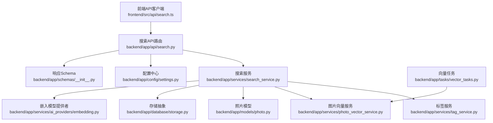
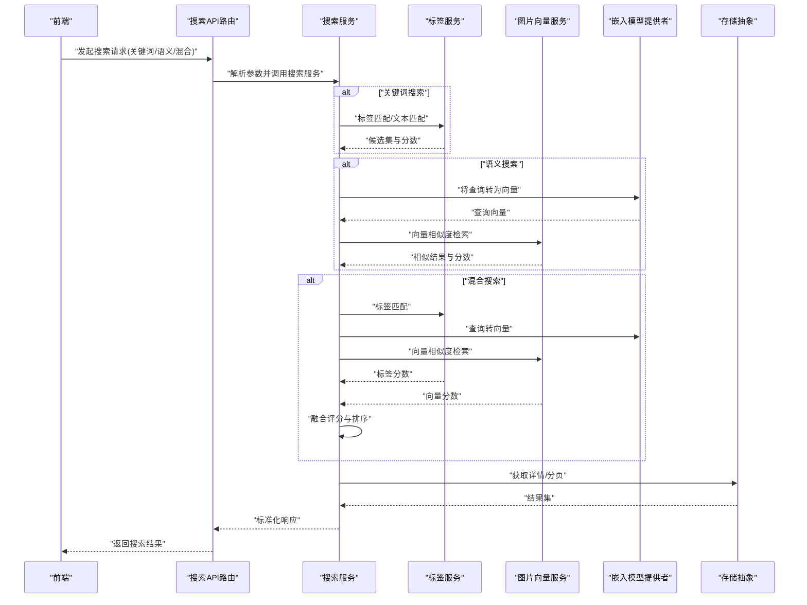
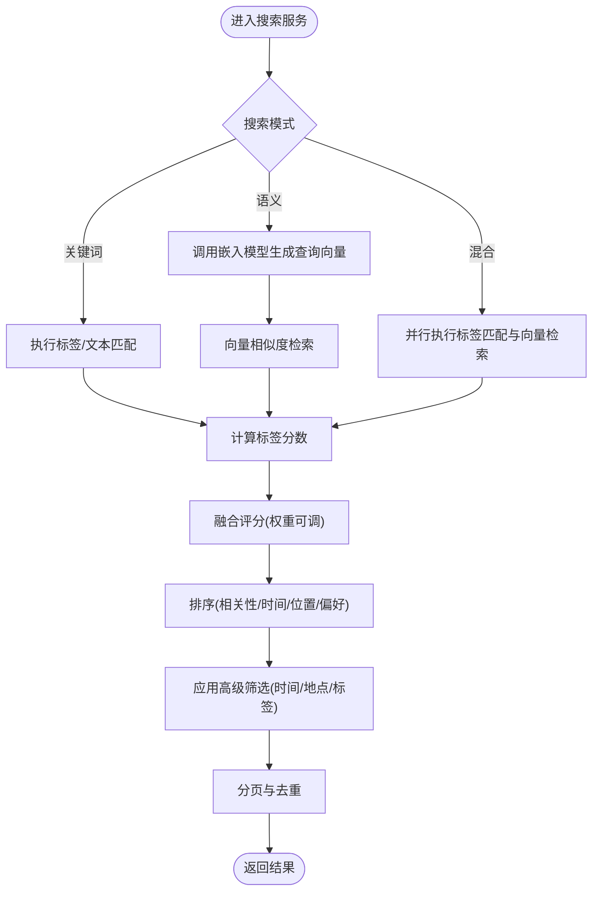
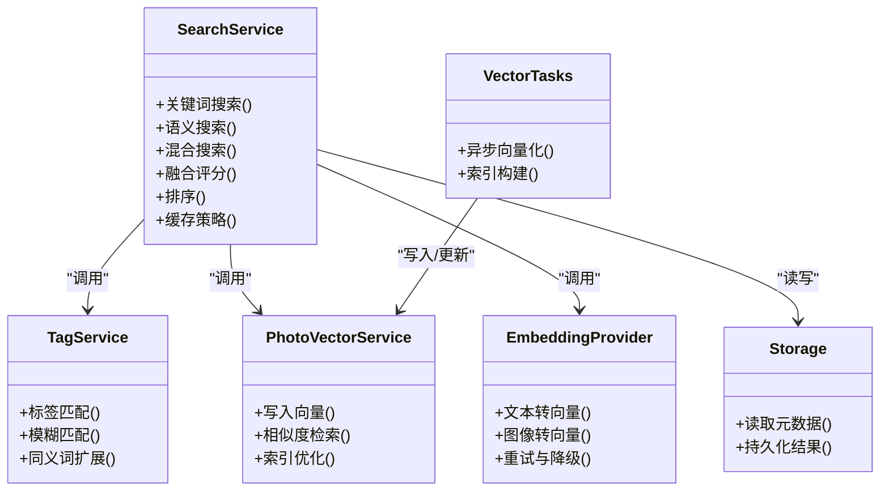

# 搜索服务

<cite>
**本文引用的文件**   
- [backend/app/api/search.py](file://backend/app/api/search.py)
- [backend/app/services/search_service.py](file://backend/app/services/search_service.py)
- [backend/app/services/photo_vector_service.py](file://backend/app/services/photo_vector_service.py)
- [backend/app/services/tag_service.py](file://backend/app/services/tag_service.py)
- [backend/app/models/photo.py](file://backend/app/models/photo.py)
- [backend/app/schemas/__init__.py](file://backend/app/schemas/__init__.py)
- [backend/app/config/settings.py](file://backend/app/config/settings.py)
- [backend/app/database/storage.py](file://backend/app/database/storage.py)
- [backend/app/tasks/vector_tasks.py](file://backend/app/tasks/vector_tasks.py)
- [backend/app/services/ai_providers/embedding.py](file://backend/app/services/ai_providers/embedding.py)
- [frontend/src/api/search.ts](file://frontend/src/api/search.ts)
- [frontend/src/types/search.ts](file://frontend/src/types/search.ts)
</cite>

## 目录
1. [简介](#简介)
2. [项目结构](#项目结构)
3. [核心组件](#核心组件)
4. [架构总览](#架构总览)
5. [详细组件分析](#详细组件分析)
6. [依赖关系分析](#依赖关系分析)
7. [性能考量](#性能考量)
8. [故障排查指南](#故障排查指南)
9. [结论](#结论)
10. [附录](#附录)

## 简介
本文件面向“搜索服务”模块，系统性阐述关键词搜索、语义搜索与混合搜索的实现原理；说明向量检索机制、标签匹配算法与搜索结果排序策略；给出搜索引擎配置、索引优化与缓存策略建议；并提供前端调用示例路径与高级筛选、模糊匹配、性能调优的实践要点。同时解释与向量数据库、全文搜索引擎的集成架构。

## 项目结构
搜索服务在前后端均有对应实现：
- 后端提供 REST API（路由层）、业务逻辑（服务层）、模型与存储抽象、任务编排（异步向量化）以及嵌入模型提供者。
- 前端通过 API 客户端与类型定义进行交互，并在页面中展示搜索结果。

图表来源
- [backend/app/api/search.py](file://backend/app/api/search.py)
- [backend/app/services/search_service.py](file://backend/app/services/search_service.py)
- [backend/app/services/tag_service.py](file://backend/app/services/tag_service.py)
- [backend/app/services/photo_vector_service.py](file://backend/app/services/photo_vector_service.py)
- [backend/app/models/photo.py](file://backend/app/models/photo.py)
- [backend/app/database/storage.py](file://backend/app/database/storage.py)
- [backend/app/services/ai_providers/embedding.py](file://backend/app/services/ai_providers/embedding.py)
- [backend/app/config/settings.py](file://backend/app/config/settings.py)
- [backend/app/schemas/__init__.py](file://backend/app/schemas/__init__.py)
- [backend/app/tasks/vector_tasks.py](file://backend/app/tasks/vector_tasks.py)
- [frontend/src/api/search.ts](file://frontend/src/api/search.ts)

章节来源
- [backend/app/api/search.py](file://backend/app/api/search.py)
- [backend/app/services/search_service.py](file://backend/app/services/search_service.py)
- [backend/app/services/tag_service.py](file://backend/app/services/tag_service.py)
- [backend/app/services/photo_vector_service.py](file://backend/app/services/photo_vector_service.py)
- [backend/app/models/photo.py](file://backend/app/models/photo.py)
- [backend/app/database/storage.py](file://backend/app/database/storage.py)
- [backend/app/services/ai_providers/embedding.py](file://backend/app/services/ai_providers/embedding.py)
- [backend/app/config/settings.py](file://backend/app/config/settings.py)
- [backend/app/schemas/__init__.py](file://backend/app/schemas/__init__.py)
- [backend/app/tasks/vector_tasks.py](file://backend/app/tasks/vector_tasks.py)
- [frontend/src/api/search.ts](file://frontend/src/api/search.ts)
- [frontend/src/types/search.ts](file://frontend/src/types/search.ts)

## 核心组件
- 搜索API路由：暴露搜索接口，解析请求参数，调度搜索服务并返回统一响应格式。
- 搜索服务：封装关键词搜索、语义搜索、混合搜索的核心流程，协调标签服务与向量服务，执行排序与分页。
- 标签服务：负责标签的生成、更新与匹配计算。
- 图片向量服务：负责向量索引的写入、查询与相似度检索。
- 嵌入模型提供者：对外部或本地嵌入模型的调用封装。
- 存储抽象：对底层数据访问的统一抽象（如对象存储、元数据存储）。
- 向量任务：异步处理图片向量化与索引构建。
- 前端API客户端与类型：定义搜索请求/响应结构与调用方式。

章节来源
- [backend/app/api/search.py](file://backend/app/api/search.py)
- [backend/app/services/search_service.py](file://backend/app/services/search_service.py)
- [backend/app/services/tag_service.py](file://backend/app/services/tag_service.py)
- [backend/app/services/photo_vector_service.py](file://backend/app/services/photo_vector_service.py)
- [backend/app/services/ai_providers/embedding.py](file://backend/app/services/ai_providers/embedding.py)
- [backend/app/database/storage.py](file://backend/app/database/storage.py)
- [backend/app/tasks/vector_tasks.py](file://backend/app/tasks/vector_tasks.py)
- [frontend/src/api/search.ts](file://frontend/src/api/search.ts)
- [frontend/src/types/search.ts](file://frontend/src/types/search.ts)

## 架构总览
搜索服务采用分层架构：API层接收请求，服务层编排业务逻辑，外部依赖通过提供者与任务系统解耦。向量检索与标签匹配并行参与评分，最终由排序策略合并结果。

图表来源
- [backend/app/api/search.py](file://backend/app/api/search.py)
- [backend/app/services/search_service.py](file://backend/app/services/search_service.py)
- [backend/app/services/tag_service.py](file://backend/app/services/tag_service.py)
- [backend/app/services/photo_vector_service.py](file://backend/app/services/photo_vector_service.py)
- [backend/app/services/ai_providers/embedding.py](file://backend/app/services/ai_providers/embedding.py)
- [backend/app/database/storage.py](file://backend/app/database/storage.py)

## 详细组件分析

### 搜索API路由
- 职责：定义搜索相关HTTP接口，校验输入参数，调用搜索服务，返回统一响应结构。
- 关键点：支持多种搜索模式（关键词、语义、混合），可携带高级筛选条件（时间范围、地点、标签等），支持分页与排序字段。
- 错误处理：参数校验失败返回明确错误信息；下游服务异常时返回标准错误码与提示。

章节来源
- [backend/app/api/search.py](file://backend/app/api/search.py)
- [backend/app/schemas/__init__.py](file://backend/app/schemas/__init__.py)

### 搜索服务
- 职责：实现关键词搜索、语义搜索、混合搜索的主流程；协调标签服务与向量服务；执行融合评分与排序；处理分页与过滤。
- 关键词搜索：基于标签与文本字段的匹配，计算相关性分数。
- 语义搜索：通过嵌入模型将查询转换为向量，使用向量服务进行相似度检索。
- 混合搜索：并行执行标签匹配与向量检索，按权重融合分数，再排序输出。
- 排序策略：支持多因子排序（相关性、时间、地理位置、用户偏好等），可按权重调整。
- 缓存策略：对高频查询与稳定结果进行缓存，减少重复计算与IO开销。

图表来源
- [backend/app/services/search_service.py](file://backend/app/services/search_service.py)
- [backend/app/services/tag_service.py](file://backend/app/services/tag_service.py)
- [backend/app/services/photo_vector_service.py](file://backend/app/services/photo_vector_service.py)
- [backend/app/services/ai_providers/embedding.py](file://backend/app/services/ai_providers/embedding.py)

章节来源
- [backend/app/services/search_service.py](file://backend/app/services/search_service.py)

### 标签服务
- 职责：维护标签集合，提供标签匹配与打分能力；支持标签更新与增量同步。
- 匹配算法：基于标签词频、共现关系与用户行为进行加权；支持模糊匹配与同义词扩展。
- 性能优化：预计算热门标签索引，缓存中间结果，避免重复计算。

章节来源
- [backend/app/services/tag_service.py](file://backend/app/services/tag_service.py)

### 图片向量服务
- 职责：管理图片向量的写入、更新与查询；提供相似度检索接口；维护向量索引。
- 向量检索机制：支持余弦相似度、内积等距离度量；支持Top-K与阈值过滤；支持批量查询。
- 索引优化：定期重建索引、分片与分区、压缩与降维；冷热数据分离。
- 缓存策略：热点向量与查询结果缓存，降低延迟。

章节来源
- [backend/app/services/photo_vector_service.py](file://backend/app/services/photo_vector_service.py)

### 嵌入模型提供者
- 职责：封装嵌入模型的调用，包括文本到向量与图像到向量的转换；支持多提供商与回退策略。
- 配置项：模型名称、维度、超时、重试次数、批大小等。
- 错误处理：网络异常、模型不可用时的降级与重试。

章节来源
- [backend/app/services/ai_providers/embedding.py](file://backend/app/services/ai_providers/embedding.py)

### 存储抽象
- 职责：统一数据访问接口，屏蔽底层存储差异（对象存储、元数据存储等）。
- 使用场景：读取照片元数据、标签、向量索引元信息等。

章节来源
- [backend/app/database/storage.py](file://backend/app/database/storage.py)

### 向量任务
- 职责：异步处理图片向量化与索引构建，保障高吞吐与稳定性。
- 调度策略：任务队列、重试与死信队列；监控与告警。

章节来源
- [backend/app/tasks/vector_tasks.py](file://backend/app/tasks/vector_tasks.py)

### 前端API客户端与类型
- 职责：封装搜索API调用，定义请求/响应类型，提供便捷方法。
- 使用示例：
  - 关键词搜索：调用搜索接口，传入关键词与筛选条件。
  - 语义搜索：传入自然语言查询，后端自动转向量检索。
  - 混合搜索：同时启用标签与向量检索，设置融合权重。
  - 高级筛选：时间范围、地点、标签组合过滤。
  - 模糊匹配：开启模糊选项，提升召回率。
  - 性能调优：分页大小、排序字段、缓存开关。

章节来源
- [frontend/src/api/search.ts](file://frontend/src/api/search.ts)
- [frontend/src/types/search.ts](file://frontend/src/types/search.ts)

## 依赖关系分析
搜索服务依赖多个内部组件与外部提供者，形成清晰的解耦结构。

图表来源
- [backend/app/services/search_service.py](file://backend/app/services/search_service.py)
- [backend/app/services/tag_service.py](file://backend/app/services/tag_service.py)
- [backend/app/services/photo_vector_service.py](file://backend/app/services/photo_vector_service.py)
- [backend/app/services/ai_providers/embedding.py](file://backend/app/services/ai_providers/embedding.py)
- [backend/app/database/storage.py](file://backend/app/database/storage.py)
- [backend/app/tasks/vector_tasks.py](file://backend/app/tasks/vector_tasks.py)

章节来源
- [backend/app/services/search_service.py](file://backend/app/services/search_service.py)
- [backend/app/services/tag_service.py](file://backend/app/services/tag_service.py)
- [backend/app/services/photo_vector_service.py](file://backend/app/services/photo_vector_service.py)
- [backend/app/services/ai_providers/embedding.py](file://backend/app/services/ai_providers/embedding.py)
- [backend/app/database/storage.py](file://backend/app/database/storage.py)
- [backend/app/tasks/vector_tasks.py](file://backend/app/tasks/vector_tasks.py)

## 性能考量
- 向量检索优化
  - 选择合适的距离度量与Top-K阈值，平衡召回与延迟。
  - 定期重建索引，采用分片与压缩技术，降低I/O压力。
  - 热点向量与查询结果缓存，减少重复计算。
- 标签匹配优化
  - 预计算热门标签索引，缓存中间结果。
  - 使用倒排索引与布隆过滤器加速过滤。
- 并发与异步
  - 向量任务异步处理，避免阻塞主流程。
  - 合理设置批大小与重试次数，提高吞吐。
- 缓存策略
  - 多级缓存：内存缓存+分布式缓存，针对高频查询与稳定结果。
  - 缓存失效策略：基于时间或事件触发，保证一致性。
- 配置调优
  - 根据硬件资源调整线程池、连接池与批处理大小。
  - 监控关键指标（延迟、吞吐、错误率）并动态调整。

[本节为通用指导，不直接分析具体文件]

## 故障排查指南
- 常见问题
  - 向量检索失败：检查向量索引是否完整、距离度量配置是否正确。
  - 嵌入模型不可用：确认模型提供者配置、网络连通性与重试策略。
  - 标签匹配不准：检查标签库质量、同义词扩展与模糊匹配参数。
  - 缓存不一致：确认缓存失效策略与数据同步机制。
- 定位步骤
  - 查看API日志与服务日志，定位异常堆栈。
  - 检查向量任务队列状态与重试记录。
  - 验证配置项（模型、索引、缓存）与实际运行环境一致。
- 恢复措施
  - 重建向量索引或修复损坏数据。
  - 重启任务消费者或服务实例。
  - 调整阈值与权重，重新评估排序效果。

章节来源
- [backend/app/services/search_service.py](file://backend/app/services/search_service.py)
- [backend/app/services/photo_vector_service.py](file://backend/app/services/photo_vector_service.py)
- [backend/app/services/ai_providers/embedding.py](file://backend/app/services/ai_providers/embedding.py)
- [backend/app/tasks/vector_tasks.py](file://backend/app/tasks/vector_tasks.py)

## 结论
搜索服务通过关键词、语义与混合三种模式满足多样化检索需求；向量检索与标签匹配协同工作，结合灵活的排序与缓存策略，实现高性能与高可用。合理的配置与索引优化是保障体验的关键。

[本节为总结性内容，不直接分析具体文件]

## 附录

### 配置项参考
- 嵌入模型配置：模型名称、维度、超时、重试次数、批大小。
- 向量检索配置：距离度量、Top-K、阈值、索引重建周期。
- 标签匹配配置：模糊阈值、同义词词典、权重参数。
- 缓存配置：缓存层级、TTL、失效策略。
- 任务队列配置：并发度、重试策略、死信队列。

章节来源
- [backend/app/config/settings.py](file://backend/app/config/settings.py)

### 前端调用示例路径
- 关键词搜索：参见前端API客户端中的关键词搜索方法。
- 语义搜索：参见前端API客户端中的语义搜索方法。
- 混合搜索：参见前端API客户端中的混合搜索方法。
- 高级筛选与模糊匹配：参见前端API客户端中的筛选与模糊选项。
- 性能调优：参见前端API客户端中的分页与排序参数。

章节来源
- [frontend/src/api/search.ts](file://frontend/src/api/search.ts)
- [frontend/src/types/search.ts](file://frontend/src/types/search.ts)