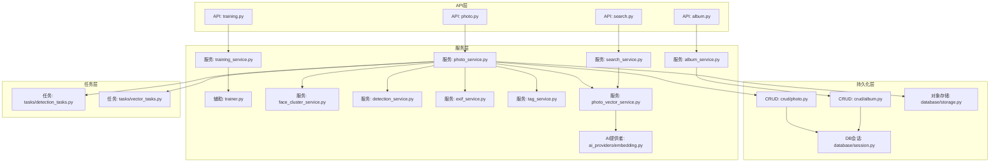
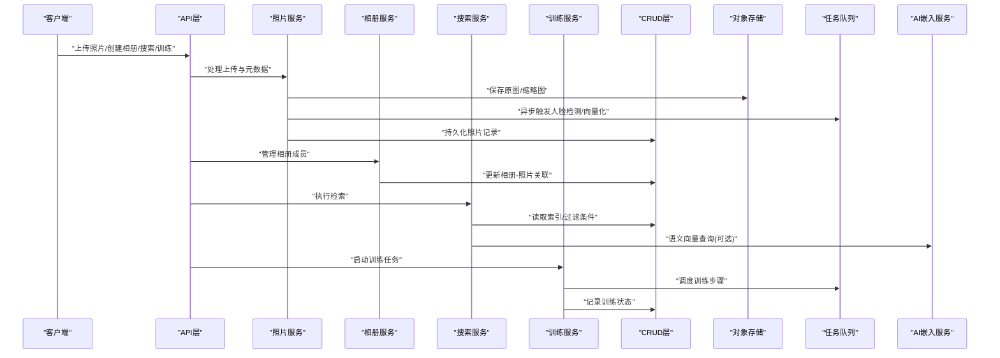
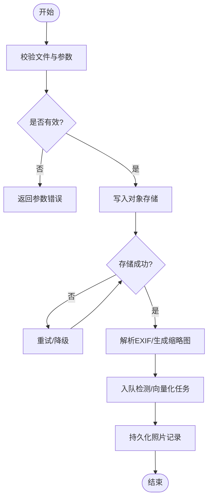
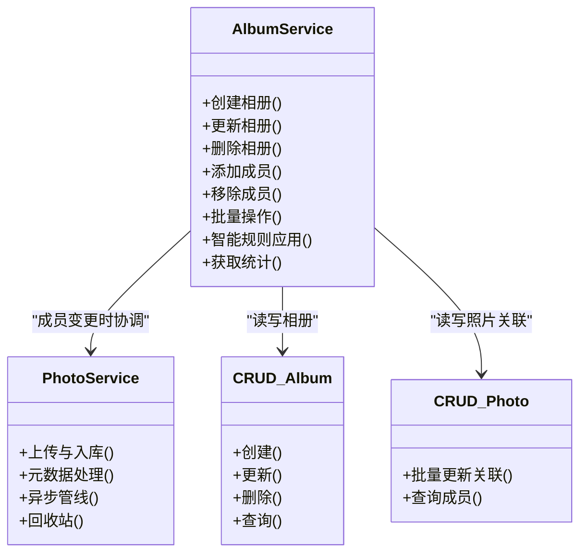
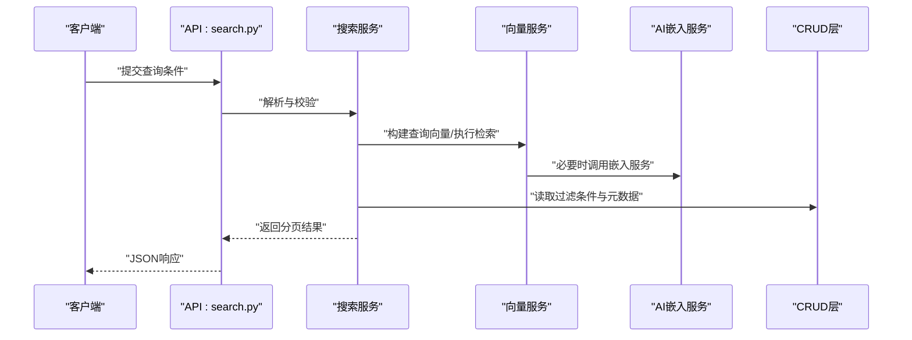
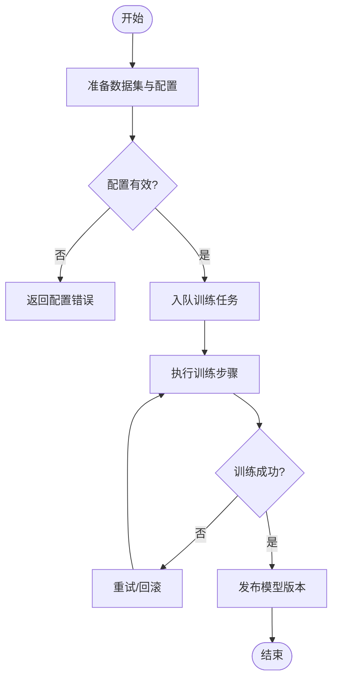
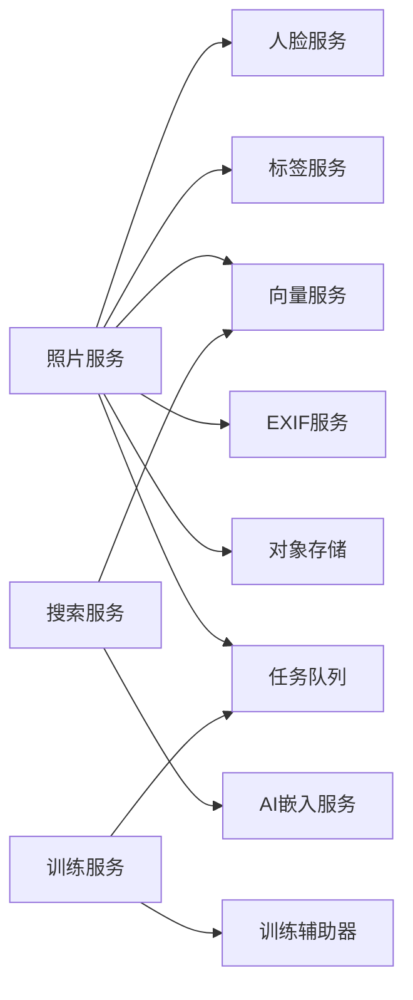

# 核心服务模块

<cite>
**本文引用的文件**   
- [photo_service.py](file://backend/app/services/photo_service.py)
- [album_service.py](file://backend/app/services/album_service.py)
- [search_service.py](file://backend/app/services/search_service.py)
- [training_service.py](file://backend/app/services/training_service.py)
- [trainer.py](file://backend/app/services/trainer.py)
- [face_cluster_service.py](file://backend/app/services/face_cluster_service.py)
- [detection_service.py](file://backend/app/services/detection_service.py)
- [exif_service.py](file://backend/app/services/exif_service.py)
- [tag_service.py](file://backend/app/services/tag_service.py)
- [photo_vector_service.py](file://backend/app/services/photo_vector_service.py)
- [ai_providers/embedding.py](file://backend/app/services/ai_providers/embedding.py)
- [crud/photo.py](file://backend/app/crud/photo.py)
- [crud/album.py](file://backend/app/crud/album.py)
- [models/photo.py](file://backend/app/models/photo.py)
- [models/album.py](file://backend/app/models/album.py)
- [database/session.py](file://backend/app/database/session.py)
- [database/storage.py](file://backend/app/database/storage.py)
- [api/photo.py](file://backend/app/api/photo.py)
- [api/album.py](file://backend/app/api/album.py)
- [api/search.py](file://backend/app/api/search.py)
- [api/training.py](file://backend/app/api/training.py)
- [tasks/detection_tasks.py](file://backend/app/tasks/detection_tasks.py)
- [tasks/vector_tasks.py](file://backend/app/tasks/vector_tasks.py)
</cite>

## 目录
1. [简介](#简介)
2. [项目结构](#项目结构)
3. [核心组件](#核心组件)
4. [架构总览](#架构总览)
5. [详细组件分析](#详细组件分析)
6. [依赖关系分析](#依赖关系分析)
7. [性能考虑](#性能考虑)
8. [故障排查指南](#故障排查指南)
9. [结论](#结论)
10. [附录](#附录)

## 简介
本文件面向AI智能相册管理系统的后端核心服务层，聚焦以下四大服务的实现细节与业务逻辑：照片服务、相册服务、搜索服务、训练服务。文档将阐述各服务的职责边界、接口设计、参数校验与错误处理策略，说明服务间依赖、数据流转与事务管理方式，并提供使用示例路径、异步与批量处理技巧以及与服务层、数据库CRUD层和外部AI服务的集成要点。

## 项目结构
系统采用分层架构：API层负责路由与请求解析；服务层封装业务逻辑；CRUD层提供数据库操作；模型层定义ORM实体；任务层承载异步工作流；存储层对接对象存储；配置与安全贯穿全局。

图表来源
- [api/photo.py](file://backend/app/api/photo.py)
- [api/album.py](file://backend/app/api/album.py)
- [api/search.py](file://backend/app/api/search.py)
- [api/training.py](file://backend/app/api/training.py)
- [photo_service.py](file://backend/app/services/photo_service.py)
- [album_service.py](file://backend/app/services/album_service.py)
- [search_service.py](file://backend/app/services/search_service.py)
- [training_service.py](file://backend/app/services/training_service.py)
- [trainer.py](file://backend/app/services/trainer.py)
- [face_cluster_service.py](file://backend/app/services/face_cluster_service.py)
- [detection_service.py](file://backend/app/services/detection_service.py)
- [exif_service.py](file://backend/app/services/exif_service.py)
- [tag_service.py](file://backend/app/services/tag_service.py)
- [photo_vector_service.py](file://backend/app/services/photo_vector_service.py)
- [ai_providers/embedding.py](file://backend/app/services/ai_providers/embedding.py)
- [crud/photo.py](file://backend/app/crud/photo.py)
- [crud/album.py](file://backend/app/crud/album.py)
- [database/session.py](file://backend/app/database/session.py)
- [database/storage.py](file://backend/app/database/storage.py)
- [tasks/detection_tasks.py](file://backend/app/tasks/detection_tasks.py)
- [tasks/vector_tasks.py](file://backend/app/tasks/vector_tasks.py)

章节来源
- [photo_service.py](file://backend/app/services/photo_service.py)
- [album_service.py](file://backend/app/services/album_service.py)
- [search_service.py](file://backend/app/services/search_service.py)
- [training_service.py](file://backend/app/services/training_service.py)
- [trainer.py](file://backend/app/services/trainer.py)
- [face_cluster_service.py](file://backend/app/services/face_cluster_service.py)
- [detection_service.py](file://backend/app/services/detection_service.py)
- [exif_service.py](file://backend/app/services/exif_service.py)
- [tag_service.py](file://backend/app/services/tag_service.py)
- [photo_vector_service.py](file://backend/app/services/photo_vector_service.py)
- [ai_providers/embedding.py](file://backend/app/services/ai_providers/embedding.py)
- [crud/photo.py](file://backend/app/crud/photo.py)
- [crud/album.py](file://backend/app/crud/album.py)
- [database/session.py](file://backend/app/database/session.py)
- [database/storage.py](file://backend/app/database/storage.py)
- [tasks/detection_tasks.py](file://backend/app/tasks/detection_tasks.py)
- [tasks/vector_tasks.py](file://backend/app/tasks/vector_tasks.py)

## 核心组件
本节概述四大核心服务的职责与协作关系：
- 照片服务：负责照片的上传、元数据处理、人脸检测、标签生成、向量嵌入、缩略图与封面管理、回收站与批量操作等。
- 相册服务：负责相册的创建、成员管理（照片增删）、排序与筛选、智能相册规则应用等。
- 搜索服务：提供文本语义检索、人脸聚类检索、时间/地点/标签过滤、分页与高亮结果组装。
- 训练服务：负责任务编排、数据准备、模型训练流程调用与状态跟踪，并与训练辅助器协同。

章节来源
- [photo_service.py](file://backend/app/services/photo_service.py)
- [album_service.py](file://backend/app/services/album_service.py)
- [search_service.py](file://backend/app/services/search_service.py)
- [training_service.py](file://backend/app/services/training_service.py)

## 架构总览
下图展示从API到服务、CRUD、存储与任务的端到端调用链，并标注关键交互点。

图表来源
- [api/photo.py](file://backend/app/api/photo.py)
- [api/album.py](file://backend/app/api/album.py)
- [api/search.py](file://backend/app/api/search.py)
- [api/training.py](file://backend/app/api/training.py)
- [photo_service.py](file://backend/app/services/photo_service.py)
- [album_service.py](file://backend/app/services/album_service.py)
- [search_service.py](file://backend/app/services/search_service.py)
- [training_service.py](file://backend/app/services/training_service.py)
- [crud/photo.py](file://backend/app/crud/photo.py)
- [crud/album.py](file://backend/app/crud/album.py)
- [database/storage.py](file://backend/app/database/storage.py)
- [tasks/detection_tasks.py](file://backend/app/tasks/detection_tasks.py)
- [tasks/vector_tasks.py](file://backend/app/tasks/vector_tasks.py)
- [ai_providers/embedding.py](file://backend/app/services/ai_providers/embedding.py)

## 详细组件分析

### 照片服务（Photo Service）
职责边界
- 接收上传文件，校验类型/大小/命名规范，落盘至对象存储。
- 解析EXIF信息，生成缩略图与封面图。
- 触发人脸检测与标签提取，生成或更新向量嵌入。
- 维护照片生命周期（软删除、恢复、批量删除）。
- 与相册服务协作，完成照片在相册中的归属管理。

关键方法（概念性描述）
- 上传与入库：校验输入、写入对象存储、创建照片记录、返回访问URL。
- 元数据处理：读取EXIF、地理编码、生成缩略图。
- 异步管线：入队人脸检测与向量计算任务，更新任务状态。
- 批量操作：分批提交任务，控制并发度与重试策略。
- 回收站：标记删除、定时清理、恢复。

参数验证与错误处理
- 文件类型白名单、大小上限、分辨率限制。
- 存储失败重试、网络异常降级、任务失败告警。
- 幂等上传：基于哈希去重，避免重复入库。

与外部系统集成
- 对象存储：分片上传、断点续传、CDN回源。
- AI服务：人脸检测、标签分类、向量嵌入。
- 任务队列：解耦耗时操作，支持重试与死信队列。

图表来源
- [photo_service.py](file://backend/app/services/photo_service.py)
- [database/storage.py](file://backend/app/database/storage.py)
- [tasks/detection_tasks.py](file://backend/app/tasks/detection_tasks.py)
- [tasks/vector_tasks.py](file://backend/app/tasks/vector_tasks.py)
- [exif_service.py](file://backend/app/services/exif_service.py)
- [face_cluster_service.py](file://backend/app/services/face_cluster_service.py)
- [tag_service.py](file://backend/app/services/tag_service.py)
- [photo_vector_service.py](file://backend/app/services/photo_vector_service.py)

章节来源
- [photo_service.py](file://backend/app/services/photo_service.py)
- [exif_service.py](file://backend/app/services/exif_service.py)
- [face_cluster_service.py](file://backend/app/services/face_cluster_service.py)
- [tag_service.py](file://backend/app/services/tag_service.py)
- [photo_vector_service.py](file://backend/app/services/photo_vector_service.py)
- [database/storage.py](file://backend/app/database/storage.py)
- [tasks/detection_tasks.py](file://backend/app/tasks/detection_tasks.py)
- [tasks/vector_tasks.py](file://backend/app/tasks/vector_tasks.py)

### 相册服务（Album Service）
职责边界
- 创建/更新/删除相册，管理相册可见性与权限。
- 添加/移除照片成员，支持批量操作与顺序调整。
- 智能相册：基于规则自动聚合照片（如按人脸、地点、标签）。
- 与照片服务协作，确保成员变更的一致性。

关键方法（概念性描述）
- 创建相册：校验名称、描述、可见性，初始化默认封面。
- 成员管理：批量加入/移出照片，冲突去重与幂等。
- 智能规则：解析规则表达式，触发增量扫描与合并。
- 统计信息：计数、最近更新时间、封面图选择策略。

参数验证与错误处理
- 名称唯一性、长度限制、非法字符过滤。
- 成员ID有效性检查、批量操作的原子性与回滚。
- 智能规则语法校验与执行异常隔离。

图表来源
- [album_service.py](file://backend/app/services/album_service.py)
- [photo_service.py](file://backend/app/services/photo_service.py)
- [crud/album.py](file://backend/app/crud/album.py)
- [crud/photo.py](file://backend/app/crud/photo.py)

章节来源
- [album_service.py](file://backend/app/services/album_service.py)
- [crud/album.py](file://backend/app/crud/album.py)
- [crud/photo.py](file://backend/app/crud/photo.py)

### 搜索服务（Search Service）
职责边界
- 多模态检索：文本语义、人脸相似、时间/地点/标签组合过滤。
- 分页与排序：按时间、相似度、热度等维度排序。
- 结果组装：聚合照片元数据、缩略图URL、匹配片段高亮。
- 与向量服务与AI提供者协作，提升语义检索能力。

关键方法（概念性描述）
- 文本检索：构建查询向量，进行近似最近邻搜索。
- 人脸检索：基于人脸特征向量进行相似匹配。
- 过滤与聚合：按时间范围、地理位置、标签集合过滤。
- 结果优化：缓存热点查询、预取缩略图、延迟加载详情。

参数验证与错误处理
- 查询字符串清洗、向量维度校验、分页参数边界检查。
- 向量库不可用时的降级策略（回退到关键词匹配）。
- 超时与限流保护，防止大查询拖垮系统。

图表来源
- [api/search.py](file://backend/app/api/search.py)
- [search_service.py](file://backend/app/services/search_service.py)
- [photo_vector_service.py](file://backend/app/services/photo_vector_service.py)
- [ai_providers/embedding.py](file://backend/app/services/ai_providers/embedding.py)
- [crud/photo.py](file://backend/app/crud/photo.py)

章节来源
- [search_service.py](file://backend/app/services/search_service.py)
- [photo_vector_service.py](file://backend/app/services/photo_vector_service.py)
- [ai_providers/embedding.py](file://backend/app/services/ai_providers/embedding.py)
- [crud/photo.py](file://backend/app/crud/photo.py)

### 训练服务（Training Service）
职责边界
- 训练任务编排：数据准备、预处理、模型训练、评估与发布。
- 与训练辅助器协同，管理训练配置、日志与中间产物。
- 提供训练进度查询、中断与恢复能力。
- 与任务队列集成，支持分布式训练与资源调度。

关键方法（概念性描述）
- 启动训练：校验数据集、生成训练配置、入队训练任务。
- 进度追踪：轮询任务状态、汇总指标、推送通知。
- 模型版本管理：保存权重、注册模型、灰度发布。
- 失败恢复：断点续训、重试策略、资源释放。

参数验证与错误处理
- 数据集完整性校验、超参合法性检查。
- GPU/CPU资源不足时的排队与抢占。
- 训练异常捕获、日志归档与告警。

图表来源
- [training_service.py](file://backend/app/services/training_service.py)
- [trainer.py](file://backend/app/services/trainer.py)
- [tasks/detection_tasks.py](file://backend/app/tasks/detection_tasks.py)

章节来源
- [training_service.py](file://backend/app/services/training_service.py)
- [trainer.py](file://backend/app/services/trainer.py)
- [tasks/detection_tasks.py](file://backend/app/tasks/detection_tasks.py)

## 依赖关系分析
- 内聚与耦合
  - 照片服务内聚度高，依赖多个子服务（EXIF、人脸、标签、向量），通过任务队列解耦。
  - 相册服务与照片服务存在双向协作，但通过CRUD层保持松耦合。
  - 搜索服务依赖向量服务与AI嵌入服务，具备降级能力。
  - 训练服务与训练辅助器紧密协作，对外暴露统一接口。
- 直接/间接依赖
  - 服务层依赖CRUD层与对象存储；任务层间接依赖AI服务。
  - 外部AI服务为可选依赖，提供开关与降级路径。
- 循环依赖
  - 通过引入CRUD层与任务队列避免服务间直接循环引用。
- 外部集成点
  - 对象存储、AI嵌入/检测服务、任务队列、消息总线。

图表来源
- [photo_service.py](file://backend/app/services/photo_service.py)
- [face_cluster_service.py](file://backend/app/services/face_cluster_service.py)
- [tag_service.py](file://backend/app/services/tag_service.py)
- [photo_vector_service.py](file://backend/app/services/photo_vector_service.py)
- [exif_service.py](file://backend/app/services/exif_service.py)
- [database/storage.py](file://backend/app/database/storage.py)
- [tasks/detection_tasks.py](file://backend/app/tasks/detection_tasks.py)
- [search_service.py](file://backend/app/services/search_service.py)
- [ai_providers/embedding.py](file://backend/app/services/ai_providers/embedding.py)
- [training_service.py](file://backend/app/services/training_service.py)
- [trainer.py](file://backend/app/services/trainer.py)

章节来源
- [photo_service.py](file://backend/app/services/photo_service.py)
- [search_service.py](file://backend/app/services/search_service.py)
- [training_service.py](file://backend/app/services/training_service.py)
- [face_cluster_service.py](file://backend/app/services/face_cluster_service.py)
- [tag_service.py](file://backend/app/services/tag_service.py)
- [photo_vector_service.py](file://backend/app/services/photo_vector_service.py)
- [exif_service.py](file://backend/app/services/exif_service.py)
- [database/storage.py](file://backend/app/database/storage.py)
- [tasks/detection_tasks.py](file://backend/app/tasks/detection_tasks.py)
- [ai_providers/embedding.py](file://backend/app/services/ai_providers/embedding.py)
- [trainer.py](file://backend/app/services/trainer.py)

## 性能考虑
- 异步与批处理
  - 上传后异步执行人脸检测与向量计算，降低首字节响应时间。
  - 批量操作采用分片提交与并发控制，避免内存峰值与数据库锁竞争。
- 缓存与预热
  - 热门查询结果缓存、缩略图预生成、向量索引预热。
- 存储优化
  - 分片上传、压缩与转码、冷热分层存储。
- 资源隔离
  - 训练任务与在线服务分离，GPU/CPU配额与抢占策略。
- 可观测性
  - 关键路径埋点、慢查询监控、AI服务延迟与错误率统计。

[本节为通用指导，不直接分析具体文件]

## 故障排查指南
- 上传失败
  - 检查对象存储连通性与配额；查看重试与降级日志。
- 人脸检测/标签为空
  - 确认AI服务可用性；查看任务队列消费情况与重试次数。
- 搜索无结果
  - 核对向量维度与索引状态；检查过滤条件与分页参数。
- 训练中断
  - 查看训练日志与中间产物；确认资源占用与断点续训配置。

章节来源
- [photo_service.py](file://backend/app/services/photo_service.py)
- [search_service.py](file://backend/app/services/search_service.py)
- [training_service.py](file://backend/app/services/training_service.py)
- [tasks/detection_tasks.py](file://backend/app/tasks/detection_tasks.py)
- [tasks/vector_tasks.py](file://backend/app/tasks/vector_tasks.py)

## 结论
四大核心服务围绕“照片”这一领域模型展开，通过服务层抽象、CRUD层持久化与任务队列解耦，形成高内聚、低耦合的可扩展架构。照片服务作为入口汇聚多种AI能力，相册服务提供组织与聚合，搜索服务提供检索体验，训练服务支撑模型演进。建议持续完善可观测性、容错与性能优化，保障系统在大规模数据与高并发场景下的稳定性。

[本节为总结性内容，不直接分析具体文件]

## 附录
- 使用示例路径（不含代码内容）
  - 上传照片与异步处理：参考 [photo_service.py](file://backend/app/services/photo_service.py)、[tasks/detection_tasks.py](file://backend/app/tasks/detection_tasks.py)、[tasks/vector_tasks.py](file://backend/app/tasks/vector_tasks.py)。
  - 相册成员批量管理：参考 [album_service.py](file://backend/app/services/album_service.py)、[crud/album.py](file://backend/app/crud/album.py)、[crud/photo.py](file://backend/app/crud/photo.py)。
  - 语义检索与人脸检索：参考 [search_service.py](file://backend/app/services/search_service.py)、[photo_vector_service.py](file://backend/app/services/photo_vector_service.py)、[ai_providers/embedding.py](file://backend/app/services/ai_providers/embedding.py)。
  - 训练任务编排与状态追踪：参考 [training_service.py](file://backend/app/services/training_service.py)、[trainer.py](file://backend/app/services/trainer.py)。

章节来源
- [photo_service.py](file://backend/app/services/photo_service.py)
- [album_service.py](file://backend/app/services/album_service.py)
- [search_service.py](file://backend/app/services/search_service.py)
- [training_service.py](file://backend/app/services/training_service.py)
- [trainer.py](file://backend/app/services/trainer.py)
- [face_cluster_service.py](file://backend/app/services/face_cluster_service.py)
- [detection_service.py](file://backend/app/services/detection_service.py)
- [exif_service.py](file://backend/app/services/exif_service.py)
- [tag_service.py](file://backend/app/services/tag_service.py)
- [photo_vector_service.py](file://backend/app/services/photo_vector_service.py)
- [ai_providers/embedding.py](file://backend/app/services/ai_providers/embedding.py)
- [crud/photo.py](file://backend/app/crud/photo.py)
- [crud/album.py](file://backend/app/crud/album.py)
- [database/session.py](file://backend/app/database/session.py)
- [database/storage.py](file://backend/app/database/storage.py)
- [tasks/detection_tasks.py](file://backend/app/tasks/detection_tasks.py)
- [tasks/vector_tasks.py](file://backend/app/tasks/vector_tasks.py)