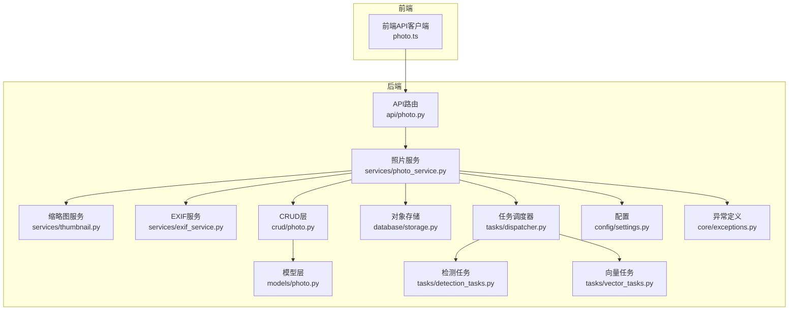
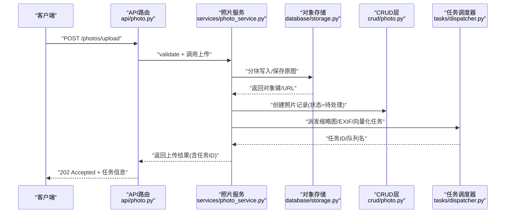
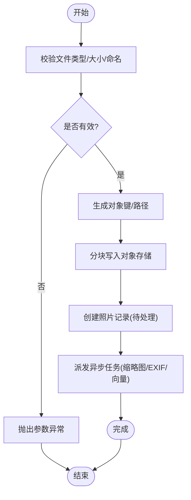
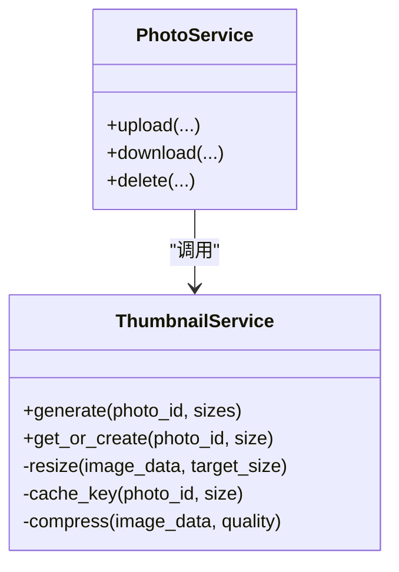
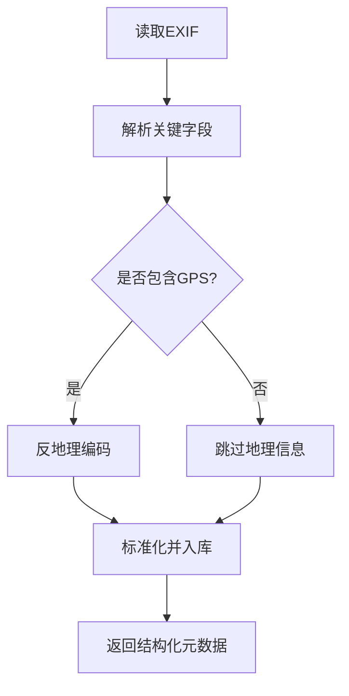
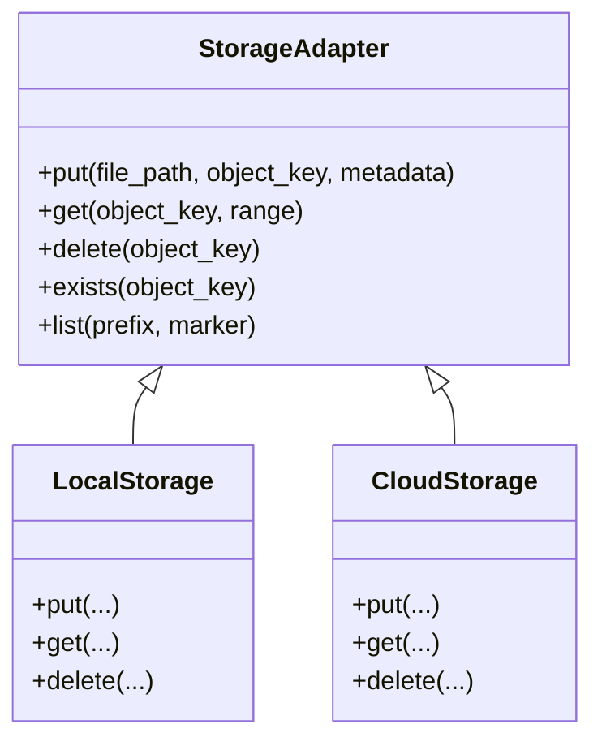
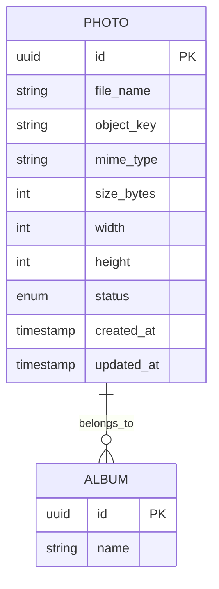
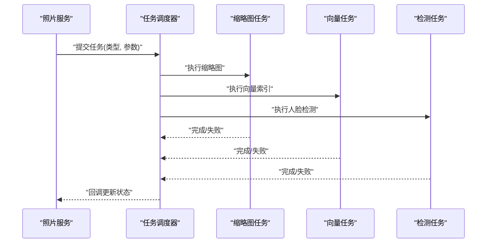
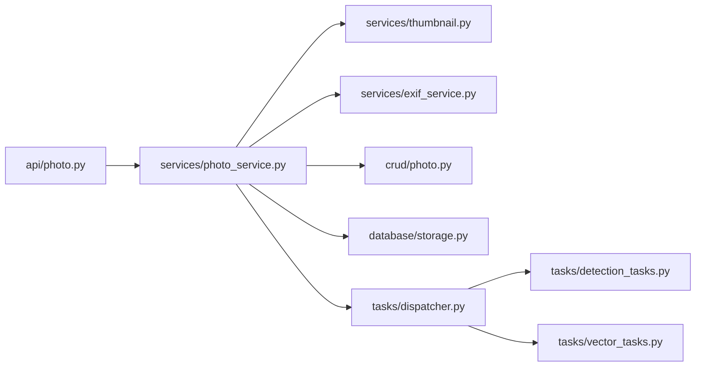

# 照片服务

<cite>
**本文引用的文件**   
- [backend/app/api/photo.py](file://backend/app/api/photo.py)
- [backend/app/services/photo_service.py](file://backend/app/services/photo_service.py)
- [backend/app/services/thumbnail.py](file://backend/app/services/thumbnail.py)
- [backend/app/services/exif_service.py](file://backend/app/services/exif_service.py)
- [backend/app/crud/photo.py](file://backend/app/crud/photo.py)
- [backend/app/models/photo.py](file://backend/app/models/photo.py)
- [backend/app/database/storage.py](file://backend/app/database/storage.py)
- [backend/app/config/settings.py](file://backend/app/config/settings.py)
- [backend/app/core/exceptions.py](file://backend/app/core/exceptions.py)
- [backend/app/tasks/detection_tasks.py](file://backend/app/tasks/detection_tasks.py)
- [backend/app/tasks/vector_tasks.py](file://backend/app/tasks/vector_tasks.py)
- [backend/app/tasks/dispatcher.py](file://backend/app/tasks/dispatcher.py)
- [frontend/src/api/photo.ts](file://frontend/src/api/photo.ts)
</cite>

## 目录
1. [简介](#简介)
2. [项目结构](#项目结构)
3. [核心组件](#核心组件)
4. [架构总览](#架构总览)
5. [详细组件分析](#详细组件分析)
6. [依赖关系分析](#依赖关系分析)
7. [性能考虑](#性能考虑)
8. [故障排查指南](#故障排查指南)
9. [结论](#结论)
10. [附录](#附录)

## 简介
本文件为“照片服务”模块的技术文档，聚焦于照片上传、下载、删除与批量操作，缩略图生成机制，EXIF元数据提取与处理流程，文件存储策略、内存管理优化与错误处理机制。同时给出API调用示例（含异步上传、进度跟踪、异常恢复），并说明与对象存储服务、数据库CRUD层的集成模式。

## 项目结构
照片服务采用分层架构：API层暴露REST接口；服务层封装业务逻辑；CRUD层负责数据库读写；模型层定义ORM实体；存储层对接对象存储；任务层执行耗时任务（如缩略图、向量索引）；配置层提供全局设置；异常层统一错误类型。

图表来源
- [backend/app/api/photo.py](file://backend/app/api/photo.py)
- [backend/app/services/photo_service.py](file://backend/app/services/photo_service.py)
- [backend/app/services/thumbnail.py](file://backend/app/services/thumbnail.py)
- [backend/app/services/exif_service.py](file://backend/app/services/exif_service.py)
- [backend/app/crud/photo.py](file://backend/app/crud/photo.py)
- [backend/app/models/photo.py](file://backend/app/models/photo.py)
- [backend/app/database/storage.py](file://backend/app/database/storage.py)
- [backend/app/tasks/dispatcher.py](file://backend/app/tasks/dispatcher.py)
- [backend/app/tasks/detection_tasks.py](file://backend/app/tasks/detection_tasks.py)
- [backend/app/tasks/vector_tasks.py](file://backend/app/tasks/vector_tasks.py)
- [backend/app/config/settings.py](file://backend/app/config/settings.py)
- [backend/app/core/exceptions.py](file://backend/app/core/exceptions.py)

章节来源
- [backend/app/api/photo.py](file://backend/app/api/photo.py)
- [backend/app/services/photo_service.py](file://backend/app/services/photo_service.py)
- [backend/app/services/thumbnail.py](file://backend/app/services/thumbnail.py)
- [backend/app/services/exif_service.py](file://backend/app/services/exif_service.py)
- [backend/app/crud/photo.py](file://backend/app/crud/photo.py)
- [backend/app/models/photo.py](file://backend/app/models/photo.py)
- [backend/app/database/storage.py](file://backend/app/database/storage.py)
- [backend/app/tasks/dispatcher.py](file://backend/app/tasks/dispatcher.py)
- [backend/app/tasks/detection_tasks.py](file://backend/app/tasks/detection_tasks.py)
- [backend/app/tasks/vector_tasks.py](file://backend/app/tasks/vector_tasks.py)
- [backend/app/config/settings.py](file://backend/app/config/settings.py)
- [backend/app/core/exceptions.py](file://backend/app/core/exceptions.py)

## 核心组件
- 照片API路由：提供上传、下载、删除、批量删除、列表查询等HTTP端点，负责参数校验、鉴权、响应封装。
- 照片服务：编排上传、下载、删除、批量操作、缩略图生成、EXIF解析、任务派发等业务流程。
- 缩略图服务：根据原图尺寸与配置生成不同规格缩略图，支持缓存与覆盖策略。
- EXIF服务：读取并标准化EXIF字段（拍摄时间、设备、GPS等），用于检索与展示。
- CRUD层：对照片记录进行增删改查，维护状态机（如待处理、已就绪、失败）。
- 对象存储：抽象文件存取接口，支持本地磁盘或云对象存储，提供分块写入、断点续传能力。
- 任务调度：将耗时任务（缩略图、向量索引、人脸检测等）异步化，提高吞吐与稳定性。
- 配置与异常：集中管理阈值、路径、并发度等；统一异常类型便于前端处理。

章节来源
- [backend/app/api/photo.py](file://backend/app/api/photo.py)
- [backend/app/services/photo_service.py](file://backend/app/services/photo_service.py)
- [backend/app/services/thumbnail.py](file://backend/app/services/thumbnail.py)
- [backend/app/services/exif_service.py](file://backend/app/services/exif_service.py)
- [backend/app/crud/photo.py](file://backend/app/crud/photo.py)
- [backend/app/database/storage.py](file://backend/app/database/storage.py)
- [backend/app/tasks/dispatcher.py](file://backend/app/tasks/dispatcher.py)
- [backend/app/config/settings.py](file://backend/app/config/settings.py)
- [backend/app/core/exceptions.py](file://backend/app/core/exceptions.py)

## 架构总览
照片服务在请求生命周期中的关键交互如下：

图表来源
- [backend/app/api/photo.py](file://backend/app/api/photo.py)
- [backend/app/services/photo_service.py](file://backend/app/services/photo_service.py)
- [backend/app/database/storage.py](file://backend/app/database/storage.py)
- [backend/app/crud/photo.py](file://backend/app/crud/photo.py)
- [backend/app/tasks/dispatcher.py](file://backend/app/tasks/dispatcher.py)

## 详细组件分析

### 照片API路由
- 职责：接收前端请求，校验入参，调用服务层，返回统一响应格式。
- 关键端点：
  - 上传：支持单文件与多文件，支持分块上传与断点续传。
  - 下载：按ID获取原图或缩略图，支持范围请求。
  - 删除：单条删除与批量删除，软删除至回收站。
  - 列表/搜索：分页、过滤、排序。
- 安全与限流：鉴权中间件、频率限制、大小限制。

章节来源
- [backend/app/api/photo.py](file://backend/app/api/photo.py)

### 照片服务
- 上传流程：
  - 校验文件类型、大小、命名规范。
  - 生成唯一对象键（含哈希、日期、版本）。
  - 调用对象存储写入，支持分块与并发。
  - 持久化照片记录，初始状态为“待处理”。
  - 派发异步任务：缩略图、EXIF、向量索引、人脸检测。
- 下载流程：
  - 校验权限与存在性。
  - 从对象存储拉取原图或缩略图，支持Range头。
- 删除流程：
  - 标记为软删除，延迟清理对象存储。
  - 批量删除时采用事务与幂等设计。
- 缩略图与EXIF：
  - 若未命中缓存则触发生成。
  - EXIF解析失败时回退到默认值并记录日志。
- 错误处理：
  - 使用统一异常类型，区分网络、存储、业务错误。
  - 重试与补偿：失败任务进入死信队列，支持人工重放。

图表来源
- [backend/app/services/photo_service.py](file://backend/app/services/photo_service.py)
- [backend/app/database/storage.py](file://backend/app/database/storage.py)
- [backend/app/crud/photo.py](file://backend/app/crud/photo.py)
- [backend/app/core/exceptions.py](file://backend/app/core/exceptions.py)

章节来源
- [backend/app/services/photo_service.py](file://backend/app/services/photo_service.py)
- [backend/app/core/exceptions.py](file://backend/app/core/exceptions.py)

### 缩略图服务
- 生成策略：
  - 基于原图尺寸与配置输出多种规格（小/中/大）。
  - 支持质量压缩、格式转换（如WebP）、白名单格式。
  - 缓存命中优先，避免重复计算。
- 并发与内存：
  - 控制并发度，避免OOM。
  - 流式解码与编码，减少峰值内存。
- 失败与重试：
  - 记录失败原因，支持指数退避重试。
  - 过期清理策略，定期扫描缺失缩略图。

图表来源
- [backend/app/services/thumbnail.py](file://backend/app/services/thumbnail.py)
- [backend/app/services/photo_service.py](file://backend/app/services/photo_service.py)

章节来源
- [backend/app/services/thumbnail.py](file://backend/app/services/thumbnail.py)

### EXIF服务
- 功能：
  - 读取拍摄时间、相机型号、镜头、曝光、ISO、GPS等。
  - 坐标反地理编码（可选），将经纬度转换为地址。
  - 规范化字段，去除无效/非法值。
- 容错：
  - 解析失败不阻断主流程，记录警告并降级。
  - 增量更新：仅当原图变更时重新解析。

图表来源
- [backend/app/services/exif_service.py](file://backend/app/services/exif_service.py)

章节来源
- [backend/app/services/exif_service.py](file://backend/app/services/exif_service.py)

### 对象存储与文件策略
- 存储抽象：
  - 统一接口：put/get/delete/list/head。
  - 支持本地磁盘与云对象存储（如S3兼容）。
- 分块与续传：
  - 大文件分块上传，合并后校验MD5/CRC。
  - 断点续传：记录已上传分块，失败可恢复。
- 命名与分区：
  - 按日期/相册/用户维度分区，降低单目录文件数。
  - 对象键包含哈希前缀，提升分布均匀性。
- 生命周期：
  - 软删除后延迟清理，支持回收站恢复。
  - 缩略图与原图一致性校验。

图表来源
- [backend/app/database/storage.py](file://backend/app/database/storage.py)

章节来源
- [backend/app/database/storage.py](file://backend/app/database/storage.py)
- [backend/app/config/settings.py](file://backend/app/config/settings.py)

### 数据库CRUD与模型
- 模型字段：
  - 标识、文件名、对象键、MIME类型、大小、宽高、状态、创建/更新时间。
  - 关联相册、上传者、标签、描述等扩展表。
- CRUD操作：
  - 创建：初始状态“待处理”，记录对象键与元数据占位。
  - 更新：缩略图URL、EXIF、向量ID、人脸检测结果。
  - 删除：软删除标记，延迟物理删除。
  - 查询：分页、过滤、排序、全文/向量检索。
- 事务与幂等：
  - 上传与任务派发在同一事务边界内，保证一致性。
  - 幂等键防止重复插入。

图表来源
- [backend/app/models/photo.py](file://backend/app/models/photo.py)
- [backend/app/crud/photo.py](file://backend/app/crud/photo.py)

章节来源
- [backend/app/models/photo.py](file://backend/app/models/photo.py)
- [backend/app/crud/photo.py](file://backend/app/crud/photo.py)

### 任务调度与异步处理
- 调度器：
  - 统一入口，支持优先级、重试、超时、死信队列。
  - 任务类型：缩略图生成、EXIF解析、向量索引、人脸检测。
- 任务实现：
  - 缩略图任务：调用缩略图服务，落盘并更新记录。
  - 向量任务：调用嵌入服务，写入向量库。
  - 检测任务：调用检测服务，写入人脸框与属性。
- 监控与告警：
  - 指标上报（成功/失败/耗时）。
  - 失败重试策略与人工干预入口。

图表来源
- [backend/app/tasks/dispatcher.py](file://backend/app/tasks/dispatcher.py)
- [backend/app/tasks/detection_tasks.py](file://backend/app/tasks/detection_tasks.py)
- [backend/app/tasks/vector_tasks.py](file://backend/app/tasks/vector_tasks.py)
- [backend/app/services/photo_service.py](file://backend/app/services/photo_service.py)

章节来源
- [backend/app/tasks/dispatcher.py](file://backend/app/tasks/dispatcher.py)
- [backend/app/tasks/detection_tasks.py](file://backend/app/tasks/detection_tasks.py)
- [backend/app/tasks/vector_tasks.py](file://backend/app/tasks/vector_tasks.py)

### 前端API调用示例
- 上传（分块+进度）：
  - 将文件切分为固定大小分块，逐个POST上传，携带分块序号与总块数。
  - 监听XMLHttpRequest的progress事件，实时更新进度条。
  - 全部上传完成后发送合并请求，触发异步任务。
- 下载：
  - GET /photos/{id}/thumbnail?size=medium，支持Range头实现视频/大图分段加载。
- 删除与批量删除：
  - DELETE /photos/{id}，DELETE /photos/batch，传入ID数组。
- 异常恢复：
  - 捕获网络错误与服务器错误，自动重试（指数退避）。
  - 上传中断后从最后一个成功分块继续。

章节来源
- [frontend/src/api/photo.ts](file://frontend/src/api/photo.ts)

## 依赖关系分析
- 耦合与内聚：
  - API层仅做参数校验与响应封装，业务集中在服务层，内聚度高。
  - 服务层通过适配器访问存储与任务系统，松耦合。
- 外部依赖：
  - 对象存储SDK、图像处理库、EXIF解析库、向量数据库、消息队列。
- 循环依赖：
  - 通过接口与任务回调解耦，避免直接循环引用。

图表来源
- [backend/app/api/photo.py](file://backend/app/api/photo.py)
- [backend/app/services/photo_service.py](file://backend/app/services/photo_service.py)
- [backend/app/services/thumbnail.py](file://backend/app/services/thumbnail.py)
- [backend/app/services/exif_service.py](file://backend/app/services/exif_service.py)
- [backend/app/crud/photo.py](file://backend/app/crud/photo.py)
- [backend/app/database/storage.py](file://backend/app/database/storage.py)
- [backend/app/tasks/dispatcher.py](file://backend/app/tasks/dispatcher.py)
- [backend/app/tasks/detection_tasks.py](file://backend/app/tasks/detection_tasks.py)
- [backend/app/tasks/vector_tasks.py](file://backend/app/tasks/vector_tasks.py)

章节来源
- [backend/app/api/photo.py](file://backend/app/api/photo.py)
- [backend/app/services/photo_service.py](file://backend/app/services/photo_service.py)
- [backend/app/database/storage.py](file://backend/app/database/storage.py)
- [backend/app/tasks/dispatcher.py](file://backend/app/tasks/dispatcher.py)

## 性能考虑
- 上传：
  - 分块并行上传，合理设置分块大小与并发度。
  - 启用服务端缓存与CDN加速静态资源。
- 缩略图：
  - 按需生成，命中缓存优先。
  - 控制并发与内存占用，避免OOM。
- 存储：
  - 对象键分区，避免热点目录。
  - 使用预签名URL直传，减轻应用服务器压力。
- 任务：
  - 任务队列削峰填谷，按优先级调度。
  - 失败重试与死信队列，保障最终一致性。
- 数据库：
  - 读写分离，索引优化（按时间、相册、标签）。
  - 批量写入与事务合并，减少锁竞争。

[本节为通用指导，无需具体文件分析]

## 故障排查指南
- 常见问题：
  - 上传失败：检查文件大小限制、MIME类型白名单、对象存储连通性。
  - 缩略图缺失：查看任务队列积压与失败日志，确认图片格式是否受支持。
  - EXIF为空：部分格式不支持EXIF，属预期行为；检查解析库版本。
  - 删除后仍可见：确认软删除与延迟清理策略，检查回收站任务。
- 定位方法：
  - 查看任务执行日志与指标，关注失败堆栈与重试次数。
  - 核对对象存储中是否存在对应对象键，验证命名规则。
  - 检查数据库记录状态机流转是否符合预期。
- 恢复手段：
  - 手动重放失败任务，修复脏数据后重试。
  - 清理过期缩略图，触发重建。
  - 调整并发与超时参数，缓解资源瓶颈。

章节来源
- [backend/app/core/exceptions.py](file://backend/app/core/exceptions.py)
- [backend/app/tasks/dispatcher.py](file://backend/app/tasks/dispatcher.py)
- [backend/app/services/thumbnail.py](file://backend/app/services/thumbnail.py)
- [backend/app/services/exif_service.py](file://backend/app/services/exif_service.py)

## 结论
照片服务以清晰的分层与松耦合设计，实现了高可用、可扩展的照片管理能力。通过分块上传、缩略图缓存、EXIF标准化、任务异步化与对象存储适配，兼顾了性能与稳定性。建议在生产环境完善监控告警、容量规划与灾备策略，持续优化任务队列与存储布局。

[本节为总结，无需具体文件分析]

## 附录
- API参考（摘要）：
  - POST /photos/upload：上传单/多文件，返回任务ID。
  - GET /photos/{id}：获取原图信息。
  - GET /photos/{id}/thumbnail?size={small|medium|large}：获取缩略图。
  - DELETE /photos/{id}：删除单张照片。
  - DELETE /photos/batch：批量删除。
  - GET /photos：分页列表与筛选。
- 配置项（示例）：
  - 最大文件大小、分块大小、并发度、缩略图尺寸与质量、EXIF解析开关、对象存储后端与密钥、任务队列连接串。

章节来源
- [backend/app/config/settings.py](file://backend/app/config/settings.py)
- [backend/app/api/photo.py](file://backend/app/api/photo.py)