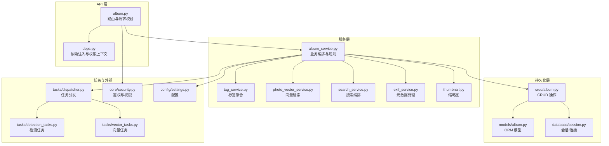
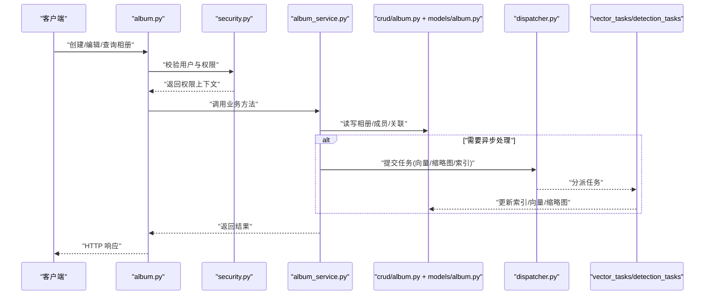
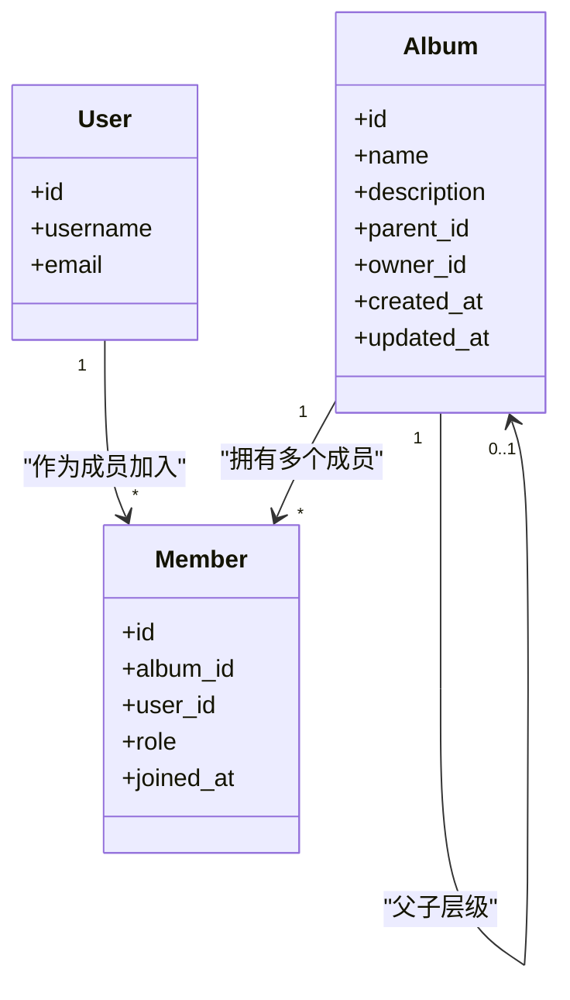
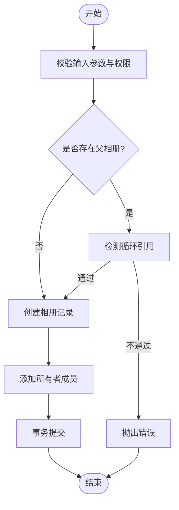
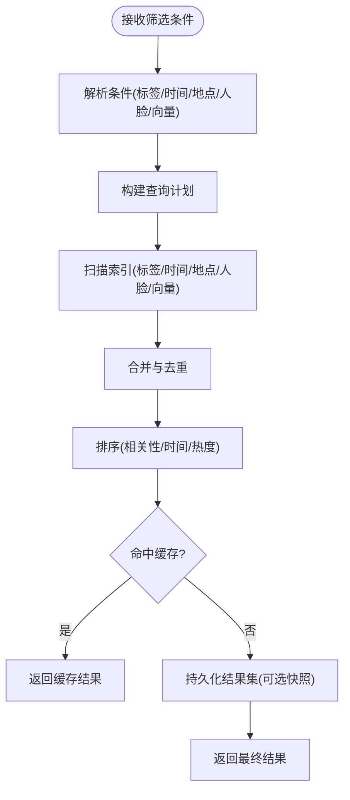
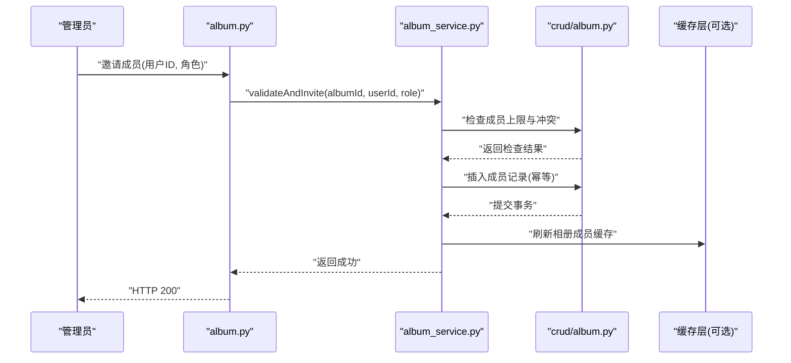
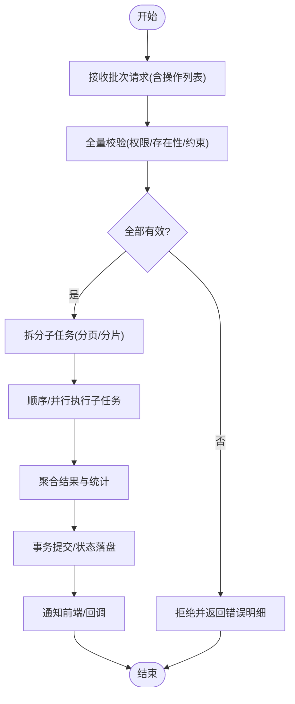
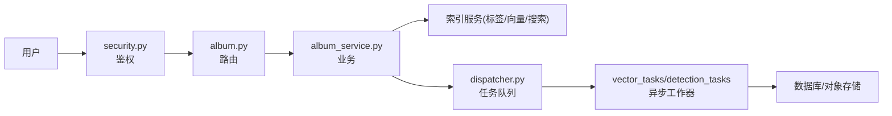
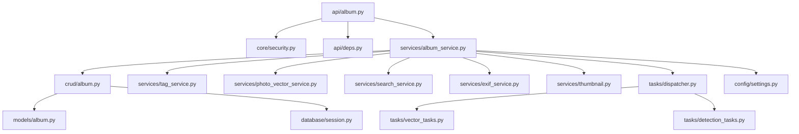

# 相册服务

<cite>
**本文引用的文件**   
- [backend/app/api/album.py](file://backend/app/api/album.py)
- [backend/app/crud/album.py](file://backend/app/crud/album.py)
- [backend/app/models/album.py](file://backend/app/models/album.py)
- [backend/app/schemas/album.py](file://backend/app/schemas/album.py)
- [backend/app/services/album_service.py](file://backend/app/services/album_service.py)
- [backend/app/core/security.py](file://backend/app/core/security.py)
- [backend/app/database/session.py](file://backend/app/database/session.py)
- [backend/app/tasks/dispatcher.py](file://backend/app/tasks/dispatcher.py)
- [backend/app/tasks/detection_tasks.py](file://backend/app/tasks/detection_tasks.py)
- [backend/app/tasks/vector_tasks.py](file://backend/app/tasks/vector_tasks.py)
- [backend/app/services/photo_vector_service.py](file://backend/app/services/photo_vector_service.py)
- [backend/app/services/search_service.py](file://backend/app/services/search_service.py)
- [backend/app/services/tag_service.py](file://backend/app/services/tag_service.py)
- [backend/app/services/exif_service.py](file://backend/app/services/exif_service.py)
- [backend/app/services/thumbnail.py](file://backend/app/services/thumbnail.py)
- [backend/app/api/deps.py](file://backend/app/api/deps.py)
- [backend/app/config/settings.py](file://backend/app/config/settings.py)
</cite>

## 目录
1. [简介](#简介)
2. [项目结构](#项目结构)
3. [核心组件](#核心组件)
4. [架构总览](#架构总览)
5. [详细组件分析](#详细组件分析)
6. [依赖关系分析](#依赖关系分析)
7. [性能考虑](#性能考虑)
8. [故障排查指南](#故障排查指南)
9. [结论](#结论)
10. [附录](#附录)

## 简介
本文件面向“相册服务模块”，系统性梳理其业务逻辑与实现细节，覆盖以下关键能力：
- 相册创建、编辑、删除与层级（嵌套）管理
- 成员管理与权限控制（所有者、协作者、访客等）
- 智能相册（基于标签、时间、地点、人脸、向量检索的动态筛选）
- 共享机制与批量操作处理
- 分类算法与智能推荐逻辑
- 数据一致性保证（事务、幂等、任务队列）
- 与用户权限系统、照片索引的集成关系
- 典型使用场景与代码示例路径（以源码位置标注代替具体代码片段）

## 项目结构
相册服务采用分层架构：API 层负责路由与鉴权校验；服务层封装业务逻辑；CRUD 层负责数据库访问；模型与模式定义数据结构；任务调度用于异步处理（如向量化、缩略图生成、搜索索引更新）。

图示来源
- [backend/app/api/album.py](file://backend/app/api/album.py)
- [backend/app/services/album_service.py](file://backend/app/services/album_service.py)
- [backend/app/crud/album.py](file://backend/app/crud/album.py)
- [backend/app/models/album.py](file://backend/app/models/album.py)
- [backend/app/database/session.py](file://backend/app/database/session.py)
- [backend/app/tasks/dispatcher.py](file://backend/app/tasks/dispatcher.py)
- [backend/app/tasks/detection_tasks.py](file://backend/app/tasks/detection_tasks.py)
- [backend/app/tasks/vector_tasks.py](file://backend/app/tasks/vector_tasks.py)
- [backend/app/services/tag_service.py](file://backend/app/services/tag_service.py)
- [backend/app/services/photo_vector_service.py](file://backend/app/services/photo_vector_service.py)
- [backend/app/services/search_service.py](file://backend/app/services/search_service.py)
- [backend/app/services/exif_service.py](file://backend/app/services/exif_service.py)
- [backend/app/services/thumbnail.py](file://backend/app/services/thumbnail.py)
- [backend/app/core/security.py](file://backend/app/core/security.py)
- [backend/app/config/settings.py](file://backend/app/config/settings.py)

章节来源
- [backend/app/api/album.py](file://backend/app/api/album.py)
- [backend/app/services/album_service.py](file://backend/app/services/album_service.py)
- [backend/app/crud/album.py](file://backend/app/crud/album.py)
- [backend/app/models/album.py](file://backend/app/models/album.py)
- [backend/app/database/session.py](file://backend/app/database/session.py)
- [backend/app/tasks/dispatcher.py](file://backend/app/tasks/dispatcher.py)
- [backend/app/tasks/detection_tasks.py](file://backend/app/tasks/detection_tasks.py)
- [backend/app/tasks/vector_tasks.py](file://backend/app/tasks/vector_tasks.py)
- [backend/app/services/tag_service.py](file://backend/app/services/tag_service.py)
- [backend/app/services/photo_vector_service.py](file://backend/app/services/photo_vector_service.py)
- [backend/app/services/search_service.py](file://backend/app/services/search_service.py)
- [backend/app/services/exif_service.py](file://backend/app/services/exif_service.py)
- [backend/app/services/thumbnail.py](file://backend/app/services/thumbnail.py)
- [backend/app/core/security.py](file://backend/app/core/security.py)
- [backend/app/config/settings.py](file://backend/app/config/settings.py)

## 核心组件
- API 路由与鉴权
  - 提供相册 CRUD、成员管理、智能相册查询、批量操作等接口。
  - 通过依赖注入获取当前用户与权限上下文，统一进行访问控制。
- 服务层（AlbumService）
  - 编排相册生命周期、成员变更、智能相册构建、批量操作与事件触发。
  - 协调标签、向量、搜索、EXIF、缩略图等子服务。
- CRUD 与模型
  - 定义相册、成员、关联表等 ORM 模型及增删改查方法。
  - 维护相册层级（父相册/子相册）与成员角色。
- 任务与异步
  - 将耗时操作（向量计算、缩略图生成、索引重建）放入任务队列，避免阻塞主流程。
- 配置与安全
  - 集中读取配置项（存储路径、任务队列参数等）。
  - 提供鉴权中间件与权限判定工具。

章节来源
- [backend/app/api/album.py](file://backend/app/api/album.py)
- [backend/app/services/album_service.py](file://backend/app/services/album_service.py)
- [backend/app/crud/album.py](file://backend/app/crud/album.py)
- [backend/app/models/album.py](file://backend/app/models/album.py)
- [backend/app/database/session.py](file://backend/app/database/session.py)
- [backend/app/tasks/dispatcher.py](file://backend/app/tasks/dispatcher.py)
- [backend/app/core/security.py](file://backend/app/core/security.py)
- [backend/app/config/settings.py](file://backend/app/config/settings.py)

## 架构总览
相册服务在请求进入后，先由 API 层完成鉴权与入参校验，随后交由服务层执行复杂业务逻辑。涉及跨资源或耗时操作时，服务层会派发任务到后台队列，确保响应及时性与系统稳定性。

图示来源
- [backend/app/api/album.py](file://backend/app/api/album.py)
- [backend/app/core/security.py](file://backend/app/core/security.py)
- [backend/app/services/album_service.py](file://backend/app/services/album_service.py)
- [backend/app/crud/album.py](file://backend/app/crud/album.py)
- [backend/app/models/album.py](file://backend/app/models/album.py)
- [backend/app/tasks/dispatcher.py](file://backend/app/tasks/dispatcher.py)
- [backend/app/tasks/vector_tasks.py](file://backend/app/tasks/vector_tasks.py)
- [backend/app/tasks/detection_tasks.py](file://backend/app/tasks/detection_tasks.py)

## 详细组件分析

### 相册实体与权限模型
- 实体关系
  - 相册支持父子层级，形成树形结构。
  - 成员包含角色（所有者、协作者、访客），不同角色具备不同权限。
- 权限矩阵（概念性说明）
  - 所有者：完整读写、成员管理、删除相册。
  - 协作者：读写相册内容、添加/移除成员（受限）、不可删除相册。
  - 访客：只读浏览。
- 一致性策略
  - 成员变更与相册属性更新在同一事务中提交，失败回滚。
  - 对重复成员加入做幂等处理，避免重复记录。

图示来源
- [backend/app/models/album.py](file://backend/app/models/album.py)
- [backend/app/crud/album.py](file://backend/app/crud/album.py)

章节来源
- [backend/app/models/album.py](file://backend/app/models/album.py)
- [backend/app/crud/album.py](file://backend/app/crud/album.py)

### 相册服务（AlbumService）
职责范围
- 创建/更新/删除相册，校验层级约束（禁止循环引用）。
- 成员管理：邀请、移除、角色变更，并触发权限检查。
- 智能相册：根据条件动态筛选照片集合（标签、时间、地点、人脸、向量相似度）。
- 批量操作：批量添加/移除照片、批量移动至其他相册、批量修改成员。
- 事件驱动：在相册变更后触发相关索引与缓存更新任务。

关键流程（创建相册）

图示来源
- [backend/app/services/album_service.py](file://backend/app/services/album_service.py)
- [backend/app/crud/album.py](file://backend/app/crud/album.py)
- [backend/app/models/album.py](file://backend/app/models/album.py)

章节来源
- [backend/app/services/album_service.py](file://backend/app/services/album_service.py)
- [backend/app/crud/album.py](file://backend/app/crud/album.py)
- [backend/app/models/album.py](file://backend/app/models/album.py)

### 智能相册与分类算法
- 分类维度
  - 标签聚合：结合 EXIF、人脸、OCR 等标签进行多源融合。
  - 时间窗口：按年/月/日或自定义时间段筛选。
  - 地理位置：按城市、国家或坐标范围筛选。
  - 人脸聚类：基于人脸特征聚合相似人物。
  - 向量检索：基于图片向量相似度进行语义检索。
- 智能推荐逻辑
  - 依据用户历史行为（查看、收藏、分享）与相册活跃度，推荐相关主题或相似相册。
  - 结合标签热度与最近新增照片趋势，生成“为你推荐”列表。
- 动态筛选
  - 支持组合条件（AND/OR）与权重排序，返回实时结果集。
  - 对高频查询可引入缓存层（例如 Redis）以提升性能。

图示来源
- [backend/app/services/album_service.py](file://backend/app/services/album_service.py)
- [backend/app/services/tag_service.py](file://backend/app/services/tag_service.py)
- [backend/app/services/exif_service.py](file://backend/app/services/exif_service.py)
- [backend/app/services/photo_vector_service.py](file://backend/app/services/photo_vector_service.py)
- [backend/app/services/search_service.py](file://backend/app/services/search_service.py)

章节来源
- [backend/app/services/album_service.py](file://backend/app/services/album_service.py)
- [backend/app/services/tag_service.py](file://backend/app/services/tag_service.py)
- [backend/app/services/exif_service.py](file://backend/app/services/exif_service.py)
- [backend/app/services/photo_vector_service.py](file://backend/app/services/photo_vector_service.py)
- [backend/app/services/search_service.py](file://backend/app/services/search_service.py)

### 成员管理与共享机制
- 成员角色与权限
  - 通过角色控制操作边界（读/写/管理）。
  - 继承策略：子相册默认继承父相册成员，但允许覆盖特定成员的权限。
- 共享流程
  - 邀请成员：校验目标用户存在与权限上限，写入成员表并提交事务。
  - 撤销共享：移除成员或降级角色，同时清理其临时缓存。
- 批量成员操作
  - 支持批量添加/移除成员，内部采用分批事务与重试机制，保证部分失败不影响整体一致性。

图示来源
- [backend/app/api/album.py](file://backend/app/api/album.py)
- [backend/app/services/album_service.py](file://backend/app/services/album_service.py)
- [backend/app/crud/album.py](file://backend/app/crud/album.py)

章节来源
- [backend/app/api/album.py](file://backend/app/api/album.py)
- [backend/app/services/album_service.py](file://backend/app/services/album_service.py)
- [backend/app/crud/album.py](file://backend/app/crud/album.py)

### 批量操作处理
- 设计原则
  - 原子性：同一批次的操作要么全部成功，要么全部回滚。
  - 幂等性：重复提交不会产生副作用（通过唯一键或版本号控制）。
  - 可观测性：记录批次 ID 与进度，便于追踪与重试。
- 常见场景
  - 批量添加/移除照片到相册。
  - 批量移动照片到其他相册。
  - 批量修改成员角色。
- 任务化拆分
  - 超大批次拆分为子任务，逐个执行并汇总结果，避免长时间持有锁。

图示来源
- [backend/app/services/album_service.py](file://backend/app/services/album_service.py)
- [backend/app/tasks/dispatcher.py](file://backend/app/tasks/dispatcher.py)

章节来源
- [backend/app/services/album_service.py](file://backend/app/services/album_service.py)
- [backend/app/tasks/dispatcher.py](file://backend/app/tasks/dispatcher.py)

### 与用户权限系统与照片索引的集成
- 权限系统
  - 通过安全模块校验当前用户身份与角色，决定能否访问相册或执行敏感操作。
  - 依赖注入提供统一的权限上下文，贯穿 API 与服务层。
- 照片索引
  - 当相册成员或内容发生变更时，触发索引更新任务（标签、向量、缩略图、搜索索引）。
  - 索引更新采用异步任务队列，避免影响主流程响应时间。

图示来源
- [backend/app/core/security.py](file://backend/app/core/security.py)
- [backend/app/api/album.py](file://backend/app/api/album.py)
- [backend/app/services/album_service.py](file://backend/app/services/album_service.py)
- [backend/app/tasks/dispatcher.py](file://backend/app/tasks/dispatcher.py)
- [backend/app/tasks/vector_tasks.py](file://backend/app/tasks/vector_tasks.py)
- [backend/app/tasks/detection_tasks.py](file://backend/app/tasks/detection_tasks.py)

章节来源
- [backend/app/core/security.py](file://backend/app/core/security.py)
- [backend/app/api/album.py](file://backend/app/api/album.py)
- [backend/app/services/album_service.py](file://backend/app/services/album_service.py)
- [backend/app/tasks/dispatcher.py](file://backend/app/tasks/dispatcher.py)
- [backend/app/tasks/vector_tasks.py](file://backend/app/tasks/vector_tasks.py)
- [backend/app/tasks/detection_tasks.py](file://backend/app/tasks/detection_tasks.py)

### 典型使用场景与示例路径
- 创建嵌套相册
  - 参考路径：[创建相册逻辑](file://backend/app/services/album_service.py)
- 编辑相册信息与成员
  - 参考路径：[编辑与成员管理](file://backend/app/services/album_service.py)
- 智能相册动态筛选
  - 参考路径：[智能相册构建](file://backend/app/services/album_service.py)
- 批量添加照片到相册
  - 参考路径：[批量操作编排](file://backend/app/services/album_service.py)
- 共享与权限控制
  - 参考路径：[权限校验与成员变更](file://backend/app/api/album.py), [安全模块](file://backend/app/core/security.py)
- 性能优化技巧
  - 参考路径：[任务队列与异步处理](file://backend/app/tasks/dispatcher.py), [向量服务](file://backend/app/services/photo_vector_service.py), [缩略图服务](file://backend/app/services/thumbnail.py)

## 依赖关系分析
- 内聚与耦合
  - 服务层高度内聚于相册业务，对外仅暴露必要接口；与 CRUd、任务队列、外部服务的耦合清晰。
- 直接依赖
  - API 依赖安全模块与依赖注入；服务依赖 CRUD、标签、向量、搜索、EXIF、缩略图等服务；CRUD 依赖模型与会话。
- 间接依赖
  - 任务队列与工作器间接影响索引与存储层；配置模块为各层提供运行时参数。
- 潜在循环依赖
  - 通过明确分层与接口隔离避免循环依赖；服务层不反向依赖 API 层。

图示来源
- [backend/app/api/album.py](file://backend/app/api/album.py)
- [backend/app/api/deps.py](file://backend/app/api/deps.py)
- [backend/app/core/security.py](file://backend/app/core/security.py)
- [backend/app/services/album_service.py](file://backend/app/services/album_service.py)
- [backend/app/crud/album.py](file://backend/app/crud/album.py)
- [backend/app/models/album.py](file://backend/app/models/album.py)
- [backend/app/database/session.py](file://backend/app/database/session.py)
- [backend/app/services/tag_service.py](file://backend/app/services/tag_service.py)
- [backend/app/services/photo_vector_service.py](file://backend/app/services/photo_vector_service.py)
- [backend/app/services/search_service.py](file://backend/app/services/search_service.py)
- [backend/app/services/exif_service.py](file://backend/app/services/exif_service.py)
- [backend/app/services/thumbnail.py](file://backend/app/services/thumbnail.py)
- [backend/app/tasks/dispatcher.py](file://backend/app/tasks/dispatcher.py)
- [backend/app/tasks/vector_tasks.py](file://backend/app/tasks/vector_tasks.py)
- [backend/app/tasks/detection_tasks.py](file://backend/app/tasks/detection_tasks.py)
- [backend/app/config/settings.py](file://backend/app/config/settings.py)

章节来源
- [backend/app/api/album.py](file://backend/app/api/album.py)
- [backend/app/api/deps.py](file://backend/app/api/deps.py)
- [backend/app/core/security.py](file://backend/app/core/security.py)
- [backend/app/services/album_service.py](file://backend/app/services/album_service.py)
- [backend/app/crud/album.py](file://backend/app/crud/album.py)
- [backend/app/models/album.py](file://backend/app/models/album.py)
- [backend/app/database/session.py](file://backend/app/database/session.py)
- [backend/app/services/tag_service.py](file://backend/app/services/tag_service.py)
- [backend/app/services/photo_vector_service.py](file://backend/app/services/photo_vector_service.py)
- [backend/app/services/search_service.py](file://backend/app/services/search_service.py)
- [backend/app/services/exif_service.py](file://backend/app/services/exif_service.py)
- [backend/app/services/thumbnail.py](file://backend/app/services/thumbnail.py)
- [backend/app/tasks/dispatcher.py](file://backend/app/tasks/dispatcher.py)
- [backend/app/tasks/vector_tasks.py](file://backend/app/tasks/vector_tasks.py)
- [backend/app/tasks/detection_tasks.py](file://backend/app/tasks/detection_tasks.py)
- [backend/app/config/settings.py](file://backend/app/config/settings.py)

## 性能考虑
- 异步化
  - 将向量计算、缩略图生成、索引重建等耗时操作放入任务队列，降低请求延迟。
- 缓存
  - 对热点相册成员、智能相册结果进行缓存，设置合理过期策略。
- 分页与游标
  - 大列表采用分页与游标，减少单次传输与内存占用。
- 批量与批处理
  - 大批次操作拆分为子任务，提高吞吐与容错性。
- 索引优化
  - 针对常用筛选维度建立复合索引，提升查询效率。
- 资源限制
  - 对并发任务数、队列长度、超时时间进行限流与熔断保护。

## 故障排查指南
- 常见问题
  - 权限不足：检查当前用户角色与相册成员关系。
  - 循环引用：创建嵌套相册时检测到环状依赖，需调整父相册选择。
  - 任务堆积：监控任务队列长度与工作器健康状态。
  - 索引不一致：对比相册内容与索引状态，必要时触发重建。
- 定位步骤
  - 查看 API 日志与错误码，确认请求链路。
  - 检查服务层异常堆栈与事务回滚原因。
  - 核对任务队列状态与工作器输出日志。
  - 验证数据库约束与索引完整性。
- 恢复建议
  - 重试失败任务（带退避策略）。
  - 清理无效缓存与临时文件。
  - 重新构建索引并校验一致性。

章节来源
- [backend/app/core/security.py](file://backend/app/core/security.py)
- [backend/app/services/album_service.py](file://backend/app/services/album_service.py)
- [backend/app/tasks/dispatcher.py](file://backend/app/tasks/dispatcher.py)

## 结论
相册服务通过清晰的分层设计与任务化异步处理，实现了高可用与可扩展的相册管理能力。其智能相册与批量操作能力满足复杂业务场景，配合完善的权限控制与一致性保障，为用户提供稳定高效的相册体验。后续可在缓存策略、索引优化与监控告警方面持续改进。

## 附录
- 术语
  - 智能相册：基于多维条件动态生成的相册视图。
  - 向量检索：基于图片向量相似度进行语义匹配。
  - 幂等：重复执行不会产生额外副作用。
- 参考路径
  - API 路由：[backend/app/api/album.py](file://backend/app/api/album.py)
  - 服务编排：[backend/app/services/album_service.py](file://backend/app/services/album_service.py)
  - 数据模型：[backend/app/models/album.py](file://backend/app/models/album.py)
  - 任务调度：[backend/app/tasks/dispatcher.py](file://backend/app/tasks/dispatcher.py)
  - 安全与配置：[backend/app/core/security.py](file://backend/app/core/security.py), [backend/app/config/settings.py](file://backend/app/config/settings.py)