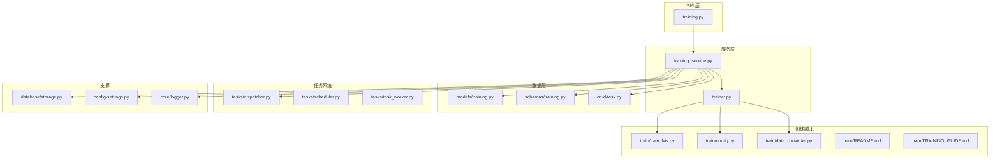
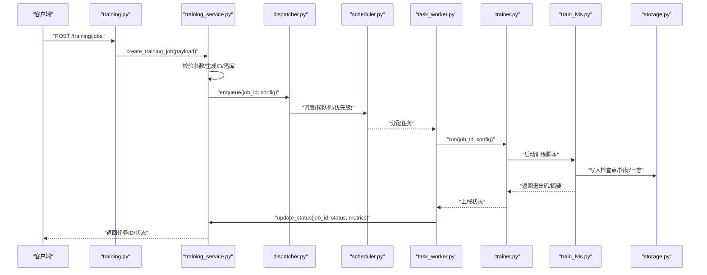
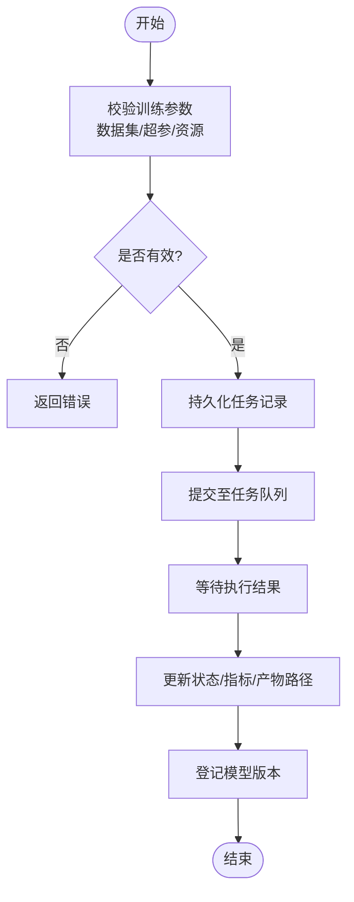
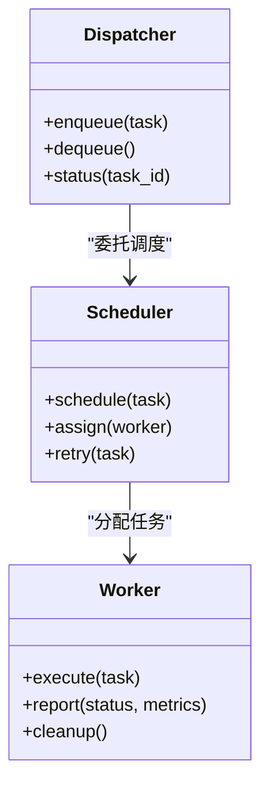
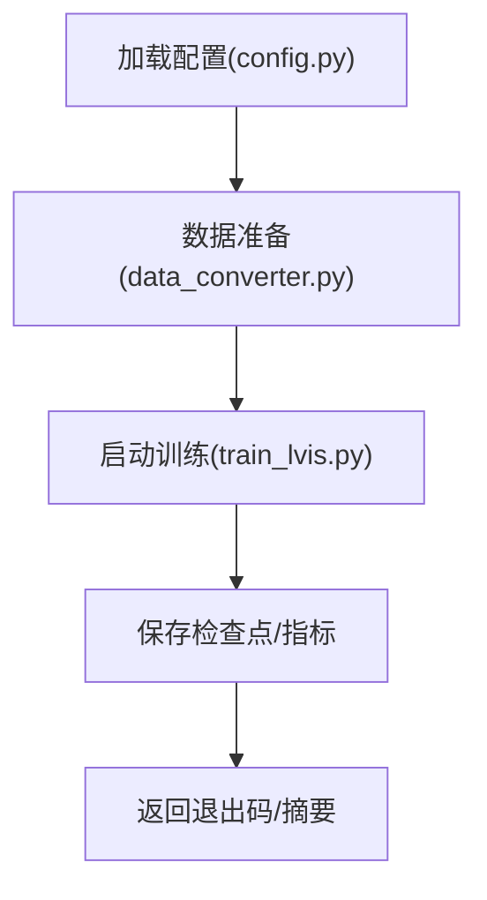
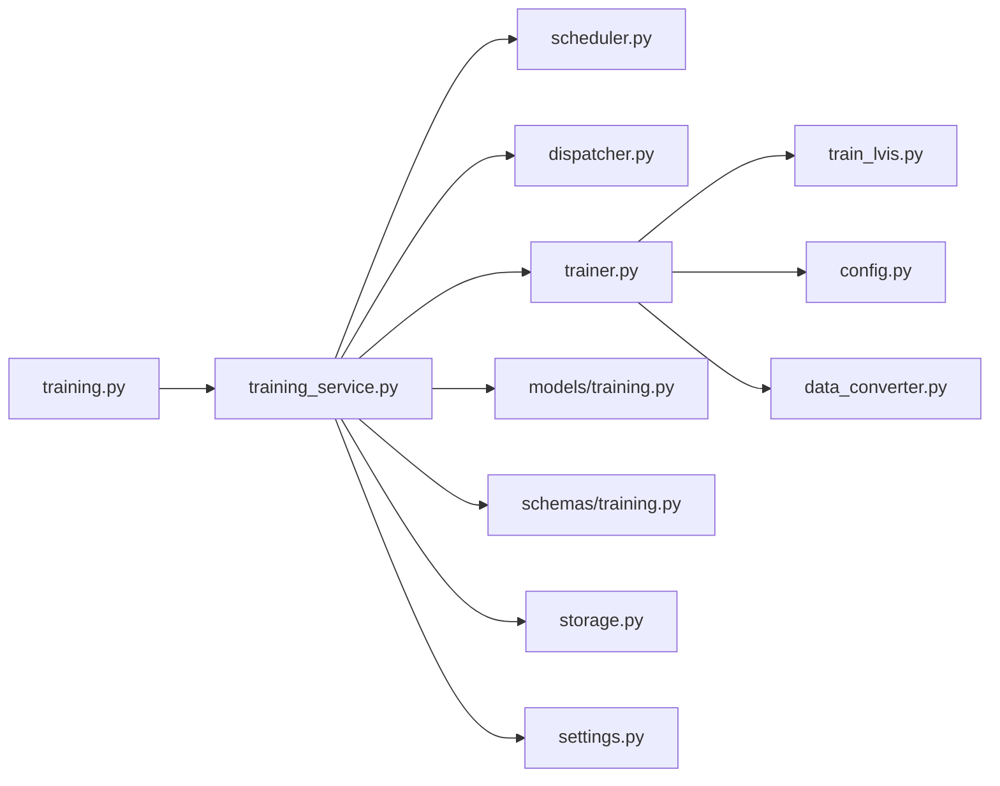

# 训练服务

<cite>
**本文引用的文件**   
- [backend/app/api/training.py](file://backend/app/api/training.py)
- [backend/app/services/training_service.py](file://backend/app/services/training_service.py)
- [backend/app/services/trainer.py](file://backend/app/services/trainer.py)
- [backend/app/models/training.py](file://backend/app/models/training.py)
- [backend/app/schemas/training.py](file://backend/app/schemas/training.py)
- [backend/app/crud/task.py](file://backend/app/crud/task.py)
- [backend/app/tasks/dispatcher.py](file://backend/app/tasks/dispatcher.py)
- [backend/app/tasks/scheduler.py](file://backend/app/tasks/scheduler.py)
- [backend/app/tasks/task_worker.py](file://backend/app/tasks/task_worker.py)
- [backend/app/database/storage.py](file://backend/app/database/storage.py)
- [backend/app/config/settings.py](file://backend/app/config/settings.py)
- [backend/app/core/logger.py](file://backend/app/core/logger.py)
- [backend/app/services/train/README.md](file://backend/app/services/train/README.md)
- [backend/app/services/train/TRAINING_GUIDE.md](file://backend/app/services/train/TRAINING_GUIDE.md)
- [backend/app/services/train/config.py](file://backend/app/services/train/config.py)
- [backend/app/services/train/data_converter.py](file://backend/app/services/train/data_converter.py)
- [backend/app/services/train/train_lvis.py](file://backend/app/services/train/train_lvis.py)
</cite>

## 目录
1. [简介](#简介)
2. [项目结构](#项目结构)
3. [核心组件](#核心组件)
4. [架构总览](#架构总览)
5. [详细组件分析](#详细组件分析)
6. [依赖关系分析](#依赖关系分析)
7. [性能与资源管理](#性能与资源管理)
8. [故障排查指南](#故障排查指南)
9. [结论](#结论)
10. [附录：API 与使用示例](#附录api-与使用示例)

## 简介
本文件面向“训练服务”模块，系统性阐述其在数据集管理、训练任务调度、模型版本控制、配置与参数调优、监控与可观测性、分布式训练支持、资源管理与错误恢复等方面的设计与实现。文档同时提供端到端的使用示例（创建、监控与管理训练任务），并说明与 GPU 资源管理、存储系统的集成模式。

## 项目结构
训练服务位于后端应用内，采用分层组织：
- API 层：对外暴露训练相关接口（如创建任务、查询状态、列出模型等）
- 服务层：编排训练流程、持久化状态、协调任务调度与执行
- 数据模型与模式：定义数据库实体与请求/响应结构
- 任务系统：基于调度器与分发器的异步任务执行框架
- 训练脚本与工具：数据转换、训练入口、配置管理等
- 配置与日志：全局设置与结构化日志

图表来源
- [backend/app/api/training.py](file://backend/app/api/training.py)
- [backend/app/services/training_service.py](file://backend/app/services/training_service.py)
- [backend/app/services/trainer.py](file://backend/app/services/trainer.py)
- [backend/app/models/training.py](file://backend/app/models/training.py)
- [backend/app/schemas/training.py](file://backend/app/schemas/training.py)
- [backend/app/crud/task.py](file://backend/app/crud/task.py)
- [backend/app/tasks/dispatcher.py](file://backend/app/tasks/dispatcher.py)
- [backend/app/tasks/scheduler.py](file://backend/app/tasks/scheduler.py)
- [backend/app/tasks/task_worker.py](file://backend/app/tasks/task_worker.py)
- [backend/app/services/train/train_lvis.py](file://backend/app/services/train/train_lvis.py)
- [backend/app/services/train/config.py](file://backend/app/services/train/config.py)
- [backend/app/services/train/data_converter.py](file://backend/app/services/train/data_converter.py)
- [backend/app/database/storage.py](file://backend/app/database/storage.py)
- [backend/app/config/settings.py](file://backend/app/config/settings.py)
- [backend/app/core/logger.py](file://backend/app/core/logger.py)

章节来源
- [backend/app/api/training.py](file://backend/app/api/training.py)
- [backend/app/services/training_service.py](file://backend/app/services/training_service.py)
- [backend/app/services/trainer.py](file://backend/app/services/trainer.py)
- [backend/app/models/training.py](file://backend/app/models/training.py)
- [backend/app/schemas/training.py](file://backend/app/schemas/training.py)
- [backend/app/crud/task.py](file://backend/app/crud/task.py)
- [backend/app/tasks/dispatcher.py](file://backend/app/tasks/dispatcher.py)
- [backend/app/tasks/scheduler.py](file://backend/app/tasks/scheduler.py)
- [backend/app/tasks/task_worker.py](file://backend/app/tasks/task_worker.py)
- [backend/app/services/train/train_lvis.py](file://backend/app/services/train/train_lvis.py)
- [backend/app/services/train/config.py](file://backend/app/services/train/config.py)
- [backend/app/services/train/data_converter.py](file://backend/app/services/train/data_converter.py)
- [backend/app/database/storage.py](file://backend/app/database/storage.py)
- [backend/app/config/settings.py](file://backend/app/config/settings.py)
- [backend/app/core/logger.py](file://backend/app/core/logger.py)

## 核心组件
- 训练服务（TrainingService）：负责训练任务的创建、生命周期管理、状态同步、结果归档与模型版本登记；与任务调度器协作，驱动训练工作流。
- 训练器（Trainer）：封装具体训练逻辑的调用（包括数据准备、训练脚本启动、指标收集、检查点保存）。
- 任务调度与分发（Scheduler/Dispatcher/Worker）：将训练任务入队、按策略调度到可用 Worker，并在失败时重试或回滚。
- 数据模型与模式（Model/Schema）：持久化训练任务、数据集、模型版本、运行元数据；约束输入输出格式。
- 存储与配置（Storage/Settings）：统一访问对象存储（如本地磁盘或云存储），集中管理训练相关配置项。
- 训练脚本与工具（train/*）：数据转换、训练入口、配置加载等，供 Trainer 调用。

章节来源
- [backend/app/services/training_service.py](file://backend/app/services/training_service.py)
- [backend/app/services/trainer.py](file://backend/app/services/trainer.py)
- [backend/app/tasks/dispatcher.py](file://backend/app/tasks/dispatcher.py)
- [backend/app/tasks/scheduler.py](file://backend/app/tasks/scheduler.py)
- [backend/app/tasks/task_worker.py](file://backend/app/tasks/task_worker.py)
- [backend/app/models/training.py](file://backend/app/models/training.py)
- [backend/app/schemas/training.py](file://backend/app/schemas/training.py)
- [backend/app/database/storage.py](file://backend/app/database/storage.py)
- [backend/app/config/settings.py](file://backend/app/config/settings.py)

## 架构总览
训练服务通过 REST API 接收训练请求，服务层校验并持久化任务记录，随后将任务提交至任务系统。调度器根据资源可用性选择 Worker，Worker 拉取任务并调用 Trainer 执行训练脚本。训练过程中产生的检查点、日志与评估指标写入存储系统，最终由服务层更新任务状态并登记模型版本。

图表来源
- [backend/app/api/training.py](file://backend/app/api/training.py)
- [backend/app/services/training_service.py](file://backend/app/services/training_service.py)
- [backend/app/tasks/dispatcher.py](file://backend/app/tasks/dispatcher.py)
- [backend/app/tasks/scheduler.py](file://backend/app/tasks/scheduler.py)
- [backend/app/tasks/task_worker.py](file://backend/app/tasks/task_worker.py)
- [backend/app/services/trainer.py](file://backend/app/services/trainer.py)
- [backend/app/services/train/train_lvis.py](file://backend/app/services/train/train_lvis.py)
- [backend/app/database/storage.py](file://backend/app/database/storage.py)

## 详细组件分析

### 训练服务（TrainingService）
职责
- 接收并校验训练请求（数据集、超参、资源需求等）
- 维护训练任务的生命周期（新建、排队、运行、完成、失败）
- 与任务系统交互，提交和查询任务状态
- 汇总训练产物（检查点、指标、日志）并登记模型版本
- 提供查询接口（任务列表、详情、进度、指标）

关键流程
- 创建任务：校验输入 -> 持久化任务记录 -> 入队
- 状态同步：轮询或事件回调更新任务状态与指标
- 模型版本：训练成功后，依据约定路径注册新版本，并关联任务元数据

图表来源
- [backend/app/services/training_service.py](file://backend/app/services/training_service.py)
- [backend/app/schemas/training.py](file://backend/app/schemas/training.py)
- [backend/app/models/training.py](file://backend/app/models/training.py)
- [backend/app/tasks/dispatcher.py](file://backend/app/tasks/dispatcher.py)
- [backend/app/database/storage.py](file://backend/app/database/storage.py)

章节来源
- [backend/app/services/training_service.py](file://backend/app/services/training_service.py)
- [backend/app/schemas/training.py](file://backend/app/schemas/training.py)
- [backend/app/models/training.py](file://backend/app/models/training.py)
- [backend/app/tasks/dispatcher.py](file://backend/app/tasks/dispatcher.py)
- [backend/app/database/storage.py](file://backend/app/database/storage.py)

### 训练器（Trainer）
职责
- 封装训练脚本的启动与参数注入
- 管理训练进程生命周期（超时、中断、清理）
- 采集训练指标与日志，写入存储
- 处理异常与错误码，向上报告状态

关键点
- 参数映射：将高层配置转换为训练脚本所需参数
- 资源隔离：为每个任务分配独立的工作目录与临时空间
- 可观测性：结构化日志与指标上报

章节来源
- [backend/app/services/trainer.py](file://backend/app/services/trainer.py)
- [backend/app/services/train/train_lvis.py](file://backend/app/services/train/train_lvis.py)
- [backend/app/services/train/config.py](file://backend/app/services/train/config.py)
- [backend/app/core/logger.py](file://backend/app/core/logger.py)

### 任务调度与执行（Scheduler/Dispatcher/Worker）
职责
- Dispatcher：统一的任务入队与出队接口
- Scheduler：根据策略（FIFO/优先级/资源亲和）选择 Worker
- Worker：实际执行任务，调用 Trainer，汇报状态

图表来源
- [backend/app/tasks/dispatcher.py](file://backend/app/tasks/dispatcher.py)
- [backend/app/tasks/scheduler.py](file://backend/app/tasks/scheduler.py)
- [backend/app/tasks/task_worker.py](file://backend/app/tasks/task_worker.py)

章节来源
- [backend/app/tasks/dispatcher.py](file://backend/app/tasks/dispatcher.py)
- [backend/app/tasks/scheduler.py](file://backend/app/tasks/scheduler.py)
- [backend/app/tasks/task_worker.py](file://backend/app/tasks/task_worker.py)

### 数据模型与模式（Model/Schema）
职责
- Model：定义训练任务、数据集、模型版本等实体的字段与关系
- Schema：定义 API 请求/响应的数据结构与校验规则

要点
- 任务状态机：新建、排队、运行、成功、失败、取消
- 指标与产物：训练指标、检查点路径、日志路径、评估结果
- 版本信息：模型名称、版本号、基线版本、关联任务

章节来源
- [backend/app/models/training.py](file://backend/app/models/training.py)
- [backend/app/schemas/training.py](file://backend/app/schemas/training.py)

### 训练脚本与工具（train/*）
职责
- train_lvis.py：训练主入口，读取配置，执行训练循环，保存检查点与指标
- config.py：集中管理训练配置（学习率、批次大小、优化器、设备、路径等）
- data_converter.py：数据集预处理与格式转换，确保训练数据一致性
- README.md / TRAINING_GUIDE.md：使用说明与最佳实践

图表来源
- [backend/app/services/train/config.py](file://backend/app/services/train/config.py)
- [backend/app/services/train/data_converter.py](file://backend/app/services/train/data_converter.py)
- [backend/app/services/train/train_lvis.py](file://backend/app/services/train/train_lvis.py)

章节来源
- [backend/app/services/train/train_lvis.py](file://backend/app/services/train/train_lvis.py)
- [backend/app/services/train/config.py](file://backend/app/services/train/config.py)
- [backend/app/services/train/data_converter.py](file://backend/app/services/train/data_converter.py)
- [backend/app/services/train/README.md](file://backend/app/services/train/README.md)
- [backend/app/services/train/TRAINING_GUIDE.md](file://backend/app/services/train/TRAINING_GUIDE.md)

## 依赖关系分析
- API 层依赖服务层进行业务编排
- 服务层依赖数据模型/模式进行持久化与校验
- 服务层依赖任务系统进行异步执行
- 训练器依赖训练脚本与配置
- 所有组件共享存储与配置中心

图表来源
- [backend/app/api/training.py](file://backend/app/api/training.py)
- [backend/app/services/training_service.py](file://backend/app/services/training_service.py)
- [backend/app/tasks/scheduler.py](file://backend/app/tasks/scheduler.py)
- [backend/app/tasks/dispatcher.py](file://backend/app/tasks/dispatcher.py)
- [backend/app/services/trainer.py](file://backend/app/services/trainer.py)
- [backend/app/services/train/train_lvis.py](file://backend/app/services/train/train_lvis.py)
- [backend/app/services/train/config.py](file://backend/app/services/train/config.py)
- [backend/app/services/train/data_converter.py](file://backend/app/services/train/data_converter.py)
- [backend/app/models/training.py](file://backend/app/models/training.py)
- [backend/app/schemas/training.py](file://backend/app/schemas/training.py)
- [backend/app/database/storage.py](file://backend/app/database/storage.py)
- [backend/app/config/settings.py](file://backend/app/config/settings.py)

章节来源
- [backend/app/api/training.py](file://backend/app/api/training.py)
- [backend/app/services/training_service.py](file://backend/app/services/training_service.py)
- [backend/app/tasks/scheduler.py](file://backend/app/tasks/scheduler.py)
- [backend/app/tasks/dispatcher.py](file://backend/app/tasks/dispatcher.py)
- [backend/app/services/trainer.py](file://backend/app/services/trainer.py)
- [backend/app/services/train/train_lvis.py](file://backend/app/services/train/train_lvis.py)
- [backend/app/services/train/config.py](file://backend/app/services/train/config.py)
- [backend/app/services/train/data_converter.py](file://backend/app/services/train/data_converter.py)
- [backend/app/models/training.py](file://backend/app/models/training.py)
- [backend/app/schemas/training.py](file://backend/app/schemas/training.py)
- [backend/app/database/storage.py](file://backend/app/database/storage.py)
- [backend/app/config/settings.py](file://backend/app/config/settings.py)

## 性能与资源管理
- 并发与队列：通过调度器与 Worker 池提升吞吐，避免单点瓶颈
- 资源配额：在任务级别限制 CPU/GPU/内存，防止资源争用
- 检查点与断点续训：周期性保存中间状态，缩短失败恢复时间
- 指标采样：对高频指标进行降采样，降低 IO 压力
- 存储优化：批量写入与压缩，减少小文件开销

[本节为通用指导，不直接分析具体文件]

## 故障排查指南
常见问题与定位建议
- 任务无法入队：检查调度器与队列状态、权限与存储可达性
- 训练进程崩溃：查看 Worker 日志与训练脚本输出，确认参数与数据完整性
- 指标缺失：核对指标写入路径与权限，确认训练脚本是否正确上报
- 模型版本未登记：检查训练成功后的版本登记流程与产物路径

定位步骤
- 从 API 获取任务 ID，查询任务状态与最近日志
- 在 Worker 侧检索对应任务的工作目录与临时文件
- 检查存储系统中检查点与指标文件的完整性
- 结合配置项与运行时环境变量，复现问题

章节来源
- [backend/app/core/logger.py](file://backend/app/core/logger.py)
- [backend/app/tasks/task_worker.py](file://backend/app/tasks/task_worker.py)
- [backend/app/database/storage.py](file://backend/app/database/storage.py)

## 结论
训练服务以“服务编排 + 任务调度 + 脚本执行”的分层架构，实现了从数据集管理、任务调度、训练执行到模型版本登记的完整闭环。通过统一的配置与存储抽象，系统具备良好的可扩展性与可观测性。配合合理的资源管理与错误恢复策略，可在多 GPU 与分布式环境下稳定运行。

[本节为总结性内容，不直接分析具体文件]

## 附录：API 与使用示例

### 典型 API 能力
- 创建训练任务：提交数据集、超参与资源需求
- 查询任务状态：实时获取运行状态、进度与指标
- 列出模型版本：查看历史版本与关联任务
- 停止/取消任务：主动终止正在运行的任务

章节来源
- [backend/app/api/training.py](file://backend/app/api/training.py)
- [backend/app/schemas/training.py](file://backend/app/schemas/training.py)

### 创建训练任务（示例流程）
- 准备数据集：上传或引用已有数据集，确保路径与格式正确
- 构造训练配置：指定学习率、批次大小、优化器、设备与输出路径
- 调用 API 创建任务：获得任务 ID
- 轮询任务状态：观察状态变化与指标更新
- 训练完成后：下载检查点与评估指标，登记模型版本

章节来源
- [backend/app/api/training.py](file://backend/app/api/training.py)
- [backend/app/services/training_service.py](file://backend/app/services/training_service.py)
- [backend/app/services/trainer.py](file://backend/app/services/trainer.py)
- [backend/app/services/train/train_lvis.py](file://backend/app/services/train/train_lvis.py)

### 自定义训练脚本与评估指标
- 在训练脚本中读取配置，执行训练循环
- 定期保存检查点与指标，遵循约定的目录结构
- 在退出前返回明确的退出码与摘要，便于上层解析

章节来源
- [backend/app/services/train/train_lvis.py](file://backend/app/services/train/train_lvis.py)
- [backend/app/services/train/config.py](file://backend/app/services/train/config.py)
- [backend/app/services/train/data_converter.py](file://backend/app/services/train/data_converter.py)

### 分布式训练与 GPU 资源管理
- 分布式：通过环境变量或配置文件指定节点与端口，训练脚本内部实现通信
- GPU 管理：在任务级别绑定 GPU 资源，避免冲突；支持多卡并行
- 资源监控：上报 GPU 利用率、显存占用与温度，辅助容量规划

章节来源
- [backend/app/config/settings.py](file://backend/app/config/settings.py)
- [backend/app/tasks/scheduler.py](file://backend/app/tasks/scheduler.py)
- [backend/app/tasks/task_worker.py](file://backend/app/tasks/task_worker.py)

### 存储系统集成模式
- 统一存储抽象：通过存储服务访问本地或云端存储
- 产物组织：按任务 ID 划分目录，包含检查点、指标、日志与元数据
- 生命周期：训练结束后归档产物，清理临时文件

章节来源
- [backend/app/database/storage.py](file://backend/app/database/storage.py)
- [backend/app/services/training_service.py](file://backend/app/services/training_service.py)