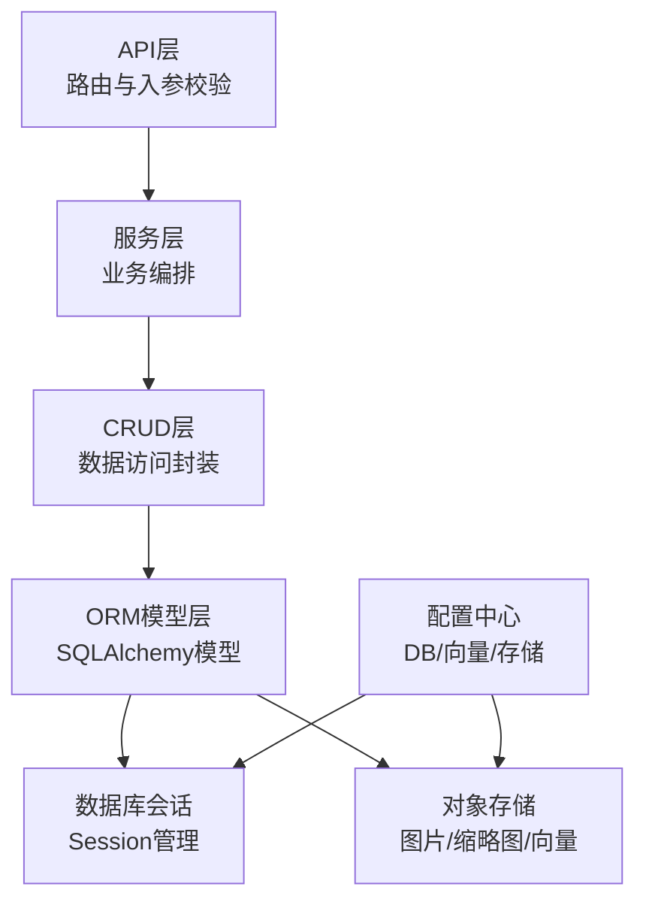
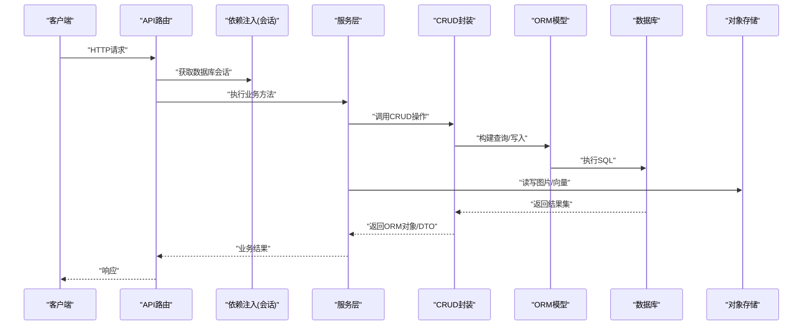
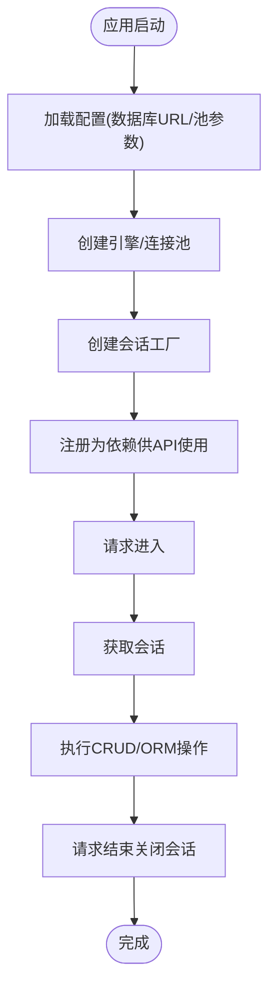
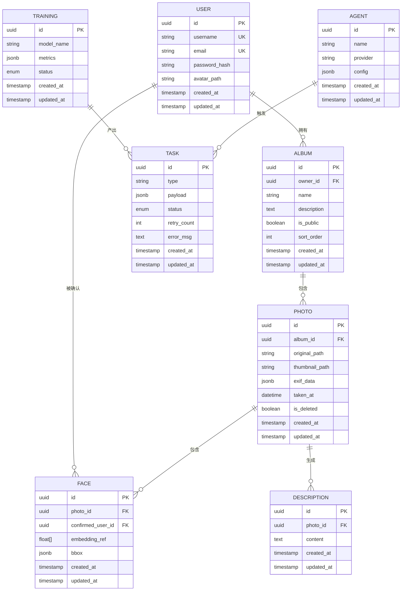
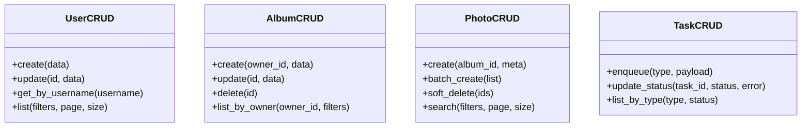
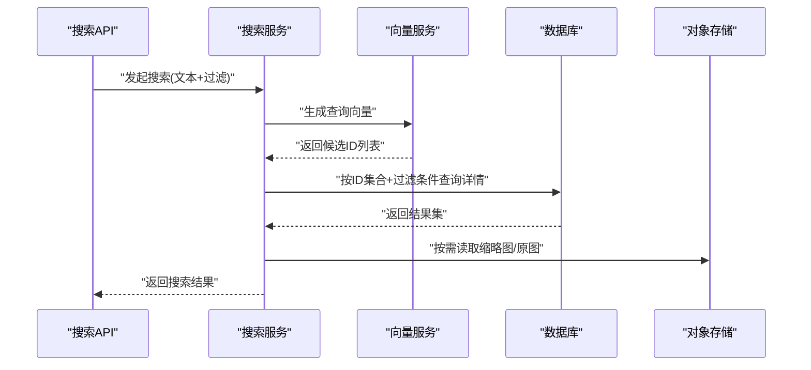
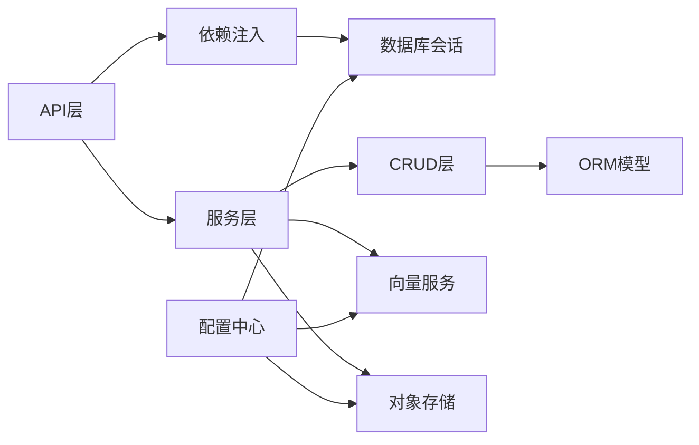

# 数据架构设计

<cite>
**本文引用的文件**   
- [backend/app/database/session.py](file://backend/app/database/session.py)
- [backend/app/database/storage.py](file://backend/app/database/storage.py)
- [backend/app/models/__init__.py](file://backend/app/models/__init__.py)
- [backend/app/models/user.py](file://backend/app/models/user.py)
- [backend/app/models/album.py](file://backend/app/models/album.py)
- [backend/app/models/photo.py](file://backend/app/models/photo.py)
- [backend/app/models/face.py](file://backend/app/models/face.py)
- [backend/app/models/task.py](file://backend/app/models/task.py)
- [backend/app/models/agent.py](file://backend/app/models/agent.py)
- [backend/app/models/description.py](file://backend/app/models/description.py)
- [backend/app/models/training.py](file://backend/app/models/training.py)
- [backend/app/crud/user.py](file://backend/app/crud/user.py)
- [backend/app/crud/album.py](file://backend/app/crud/album.py)
- [backend/app/crud/photo.py](file://backend/app/crud/photo.py)
- [backend/app/crud/task.py](file://backend/app/crud/task.py)
- [backend/app/api/deps.py](file://backend/app/api/deps.py)
- [backend/app/api/album.py](file://backend/app/api/album.py)
- [backend/app/api/photo.py](file://backend/app/api/photo.py)
- [backend/app/api/search.py](file://backend/app/api/search.py)
- [backend/app/services/search_service.py](file://backend/app/services/search_service.py)
- [backend/app/services/photo_vector_service.py](file://backend/app/services/photo_vector_service.py)
- [backend/app/config/settings.py](file://backend/app/config/settings.py)
</cite>

## 目录
1. [简介](#简介)
2. [项目结构](#项目结构)
3. [核心组件](#核心组件)
4. [架构总览](#架构总览)
5. [详细组件分析](#详细组件分析)
6. [依赖关系分析](#依赖关系分析)
7. [性能与索引优化](#性能与索引优化)
8. [事务、一致性与并发控制](#事务一致性与并发控制)
9. [数据迁移策略](#数据迁移策略)
10. [备份与恢复方案](#备份与恢复方案)
11. [故障排查指南](#故障排查指南)
12. [结论](#结论)

## 简介
本文件面向AI智能相册管理系统的数据层，系统性阐述数据库设计原则、ORM模型定义、数据访问模式与CRUD封装；说明SQLAlchemy的使用方式、事务与一致性保障、并发控制机制；并提供索引优化、查询调优以及备份恢复策略。文档同时给出典型数据模型示例与常见查询模式的实现路径，帮助读者快速理解并扩展系统的数据能力。

## 项目结构
后端采用分层架构：API层负责路由与参数校验，服务层编排业务逻辑，CRUD层封装数据访问，Models层定义SQLAlchemy ORM实体，Database层提供会话与存储抽象。配置集中于settings模块，统一数据库连接与向量检索相关设置。

图表来源
- [backend/app/api/deps.py](file://backend/app/api/deps.py)
- [backend/app/database/session.py](file://backend/app/database/session.py)
- [backend/app/database/storage.py](file://backend/app/database/storage.py)
- [backend/app/config/settings.py](file://backend/app/config/settings.py)

章节来源
- [backend/app/api/deps.py](file://backend/app/api/deps.py)
- [backend/app/database/session.py](file://backend/app/database/session.py)
- [backend/app/database/storage.py](file://backend/app/database/storage.py)
- [backend/app/config/settings.py](file://backend/app/config/settings.py)

## 核心组件
- 数据库会话与会话生命周期管理：集中创建、注入与释放，确保请求级隔离与资源回收。
- ORM模型定义：用户、相册、照片、人脸、任务、Agent、描述、训练等实体，明确字段类型、约束与关联。
- CRUD封装：按领域划分（用户、相册、照片、任务），统一增删改查入口，便于测试与复用。
- 存储抽象：对象存储接口用于图片、缩略图、特征向量等二进制或大对象存取。
- 配置中心：数据库URL、池化参数、向量检索后端、存储后端等集中配置。

章节来源
- [backend/app/database/session.py](file://backend/app/database/session.py)
- [backend/app/models/__init__.py](file://backend/app/models/__init__.py)
- [backend/app/models/user.py](file://backend/app/models/user.py)
- [backend/app/models/album.py](file://backend/app/models/album.py)
- [backend/app/models/photo.py](file://backend/app/models/photo.py)
- [backend/app/models/face.py](file://backend/app/models/face.py)
- [backend/app/models/task.py](file://backend/app/models/task.py)
- [backend/app/models/agent.py](file://backend/app/models/agent.py)
- [backend/app/models/description.py](file://backend/app/models/description.py)
- [backend/app/models/training.py](file://backend/app/models/training.py)
- [backend/app/crud/user.py](file://backend/app/crud/user.py)
- [backend/app/crud/album.py](file://backend/app/crud/album.py)
- [backend/app/crud/photo.py](file://backend/app/crud/photo.py)
- [backend/app/crud/task.py](file://backend/app/crud/task.py)
- [backend/app/database/storage.py](file://backend/app/database/storage.py)
- [backend/app/config/settings.py](file://backend/app/config/settings.py)

## 架构总览
下图展示从API到数据库的完整调用链，包括依赖注入、CRUD调用、ORM映射与存储交互。

图表来源
- [backend/app/api/deps.py](file://backend/app/api/deps.py)
- [backend/app/api/album.py](file://backend/app/api/album.py)
- [backend/app/api/photo.py](file://backend/app/api/photo.py)
- [backend/app/api/search.py](file://backend/app/api/search.py)
- [backend/app/crud/album.py](file://backend/app/crud/album.py)
- [backend/app/crud/photo.py](file://backend/app/crud/photo.py)
- [backend/app/services/search_service.py](file://backend/app/services/search_service.py)
- [backend/app/services/photo_vector_service.py](file://backend/app/services/photo_vector_service.py)
- [backend/app/database/session.py](file://backend/app/database/session.py)
- [backend/app/database/storage.py](file://backend/app/database/storage.py)

## 详细组件分析

### 数据库会话与连接管理
- 会话工厂：基于引擎与连接池参数创建会话，支持异步/同步两种模式（以实际实现为准）。
- 依赖注入：在API层通过依赖注入提供会话，保证每个请求拥有独立会话并在请求结束时关闭。
- 连接池与超时：通过配置项控制最大连接数、空闲超时、重连策略等。

图表来源
- [backend/app/database/session.py](file://backend/app/database/session.py)
- [backend/app/config/settings.py](file://backend/app/config/settings.py)
- [backend/app/api/deps.py](file://backend/app/api/deps.py)

章节来源
- [backend/app/database/session.py](file://backend/app/database/session.py)
- [backend/app/config/settings.py](file://backend/app/config/settings.py)
- [backend/app/api/deps.py](file://backend/app/api/deps.py)

### ORM模型与关系设计
- 用户模型：包含身份标识、认证信息、头像存储路径等。
- 相册模型：归属用户、名称、描述、可见性、排序等。
- 照片模型：归属相册、原始路径、缩略图路径、EXIF元数据、时间戳、软删除标记等。
- 人脸模型：与照片多对一、与用户一对多（经确认）的关系，含特征向量引用。
- 任务模型：处理队列、状态机、重试计数、错误信息等。
- Agent/描述/训练模型：记录AI处理过程、描述文本、训练任务与指标。

图表来源
- [backend/app/models/user.py](file://backend/app/models/user.py)
- [backend/app/models/album.py](file://backend/app/models/album.py)
- [backend/app/models/photo.py](file://backend/app/models/photo.py)
- [backend/app/models/face.py](file://backend/app/models/face.py)
- [backend/app/models/task.py](file://backend/app/models/task.py)
- [backend/app/models/agent.py](file://backend/app/models/agent.py)
- [backend/app/models/description.py](file://backend/app/models/description.py)
- [backend/app/models/training.py](file://backend/app/models/training.py)

章节来源
- [backend/app/models/user.py](file://backend/app/models/user.py)
- [backend/app/models/album.py](file://backend/app/models/album.py)
- [backend/app/models/photo.py](file://backend/app/models/photo.py)
- [backend/app/models/face.py](file://backend/app/models/face.py)
- [backend/app/models/task.py](file://backend/app/models/task.py)
- [backend/app/models/agent.py](file://backend/app/models/agent.py)
- [backend/app/models/description.py](file://backend/app/models/description.py)
- [backend/app/models/training.py](file://backend/app/models/training.py)

### CRUD封装与数据访问模式
- 用户CRUD：创建用户、更新资料、按条件查询、分页与过滤。
- 相册CRUD：创建/更新/删除相册，列出用户相册，按可见性与排序筛选。
- 照片CRUD：上传后落库、批量导入、软删除、按相册/时间/标签检索。
- 任务CRUD：创建任务、更新状态、失败重试、按类型与状态查询。

图表来源
- [backend/app/crud/user.py](file://backend/app/crud/user.py)
- [backend/app/crud/album.py](file://backend/app/crud/album.py)
- [backend/app/crud/photo.py](file://backend/app/crud/photo.py)
- [backend/app/crud/task.py](file://backend/app/crud/task.py)

章节来源
- [backend/app/crud/user.py](file://backend/app/crud/user.py)
- [backend/app/crud/album.py](file://backend/app/crud/album.py)
- [backend/app/crud/photo.py](file://backend/app/crud/photo.py)
- [backend/app/crud/task.py](file://backend/app/crud/task.py)

### 搜索与向量检索集成
- 语义搜索：将自然语言查询转换为向量，结合照片/人脸/相册等多模态索引进行相似度检索。
- 向量服务：封装向量嵌入生成、持久化与检索接口，与ORM解耦。
- 搜索服务：协调向量检索与结构化过滤（时间、相册、可见性等），合并排序与分页。

图表来源
- [backend/app/api/search.py](file://backend/app/api/search.py)
- [backend/app/services/search_service.py](file://backend/app/services/search_service.py)
- [backend/app/services/photo_vector_service.py](file://backend/app/services/photo_vector_service.py)
- [backend/app/database/session.py](file://backend/app/database/session.py)
- [backend/app/database/storage.py](file://backend/app/database/storage.py)

章节来源
- [backend/app/api/search.py](file://backend/app/api/search.py)
- [backend/app/services/search_service.py](file://backend/app/services/search_service.py)
- [backend/app/services/photo_vector_service.py](file://backend/app/services/photo_vector_service.py)

## 依赖关系分析
- API层依赖依赖注入器获取数据库会话，再调用服务层。
- 服务层组合多个CRUD与外部服务（如向量服务、存储）。
- CRUD层直接操作ORM模型，不感知网络与存储细节。
- 模型层仅关注数据结构与关系，不耦合业务逻辑。
- 配置中心贯穿会话、存储与向量服务初始化。

图表来源
- [backend/app/api/deps.py](file://backend/app/api/deps.py)
- [backend/app/database/session.py](file://backend/app/database/session.py)
- [backend/app/database/storage.py](file://backend/app/database/storage.py)
- [backend/app/config/settings.py](file://backend/app/config/settings.py)

章节来源
- [backend/app/api/deps.py](file://backend/app/api/deps.py)
- [backend/app/database/session.py](file://backend/app/database/session.py)
- [backend/app/database/storage.py](file://backend/app/database/storage.py)
- [backend/app/config/settings.py](file://backend/app/config/settings.py)

## 性能与索引优化
- 常用查询路径建议索引
  - 相册：按所有者与可见性过滤，建议在“所有者ID+可见性”上建立复合索引。
  - 照片：按相册ID、拍摄时间、软删除标记过滤，建议在“相册ID+拍摄时间”、“相册ID+软删除标记”建立索引。
  - 人脸：按照片ID与确认用户ID检索，建议在“照片ID”、“确认用户ID”建立索引。
  - 任务：按类型与状态查询，建议在“类型+状态”建立复合索引。
- 查询优化要点
  - 避免N+1查询：使用预加载或显式JOIN减少往返。
  - 分页与游标：大数据量场景优先使用基于主键或时间戳的游标分页。
  - 只取必要字段：减少列宽与JSONB体积，降低序列化开销。
  - 合理使用物化视图或汇总表：对热点聚合查询可考虑冗余字段或定时刷新表。
- 向量检索优化
  - 增量更新：新照片/人脸入库时异步生成并缓存向量。
  - 近似最近邻索引：在高维向量空间使用ANN索引提升召回速度。
  - 混合检索：先向量召回Top-K，再用结构化条件精排。

[本节为通用性能指导，无需特定文件来源]

## 事务、一致性与并发控制
- 事务边界
  - 单请求内默认开启事务，CRUD操作在同一会话中提交或回滚。
  - 跨服务调用（如向量生成、存储写入）建议使用补偿或消息队列保证最终一致。
- 并发控制
  - 乐观锁：在频繁更新的实体（如任务状态、计数器）引入版本号字段，更新时检查版本。
  - 悲观锁：对关键写路径使用行级锁或唯一约束防止重复写入。
- 幂等性
  - 任务与上传接口需具备幂等键，避免重复消费导致数据不一致。
- 异常与回滚
  - 捕获数据库异常并转换为统一错误码，确保事务正确回滚与日志记录。

章节来源
- [backend/app/database/session.py](file://backend/app/database/session.py)
- [backend/app/crud/task.py](file://backend/app/crud/task.py)
- [backend/app/crud/photo.py](file://backend/app/crud/photo.py)

## 数据迁移策略
- 版本化管理：所有DDL变更通过迁移脚本管理，禁止在生产环境手工执行SQL。
- 迁移流程：开发分支编写迁移→本地验证→CI自动运行迁移→灰度发布。
- 回滚策略：为每次迁移编写反向迁移，确保可回滚；复杂变更采用双写与逐步切换。
- 数据校验：迁移后执行数据完整性校验脚本，确保无脏数据。

[本节为通用迁移策略，无需特定文件来源]

## 备份与恢复方案
- 全量备份：定期快照数据库与对象存储中的静态资源。
- 增量备份：启用WAL/Binlog级别增量备份，缩短RPO。
- 恢复演练：定期进行恢复演练，验证RTO与数据一致性。
- 冷热分层：历史相册与低频照片归档至低成本存储，热数据保留高性能存储。

[本节为通用备份策略，无需特定文件来源]

## 故障排查指南
- 常见问题定位
  - 连接池耗尽：检查最大连接数与慢查询，必要时扩容或优化SQL。
  - 死锁与锁等待：查看锁等待图与长事务，拆分大事务或调整隔离级别。
  - 向量检索延迟：检查向量索引健康度与内存占用，必要时重建索引。
  - 存储IO瓶颈：监控对象存储吞吐与延迟，调整分片与CDN缓存。
- 诊断工具
  - 数据库慢查询日志与执行计划分析。
  - 分布式追踪：串联API→服务→CRUD→DB/存储链路。
  - 告警规则：连接池使用率、事务时长、错误率阈值告警。

章节来源
- [backend/app/database/session.py](file://backend/app/database/session.py)
- [backend/app/database/storage.py](file://backend/app/database/storage.py)
- [backend/app/config/settings.py](file://backend/app/config/settings.py)

## 结论
本数据架构以清晰的层次划分与明确的职责边界为基础，结合SQLAlchemy ORM与统一的CRUD封装，实现了可扩展、可维护的数据访问能力。通过合理的索引设计与查询优化、完善的事务与并发控制、规范的迁移与备份恢复策略，系统在性能、一致性与可靠性方面达到生产可用水平。后续可在向量检索、物化视图与读写分离等方面持续演进，进一步提升大规模多媒体数据的处理能力。