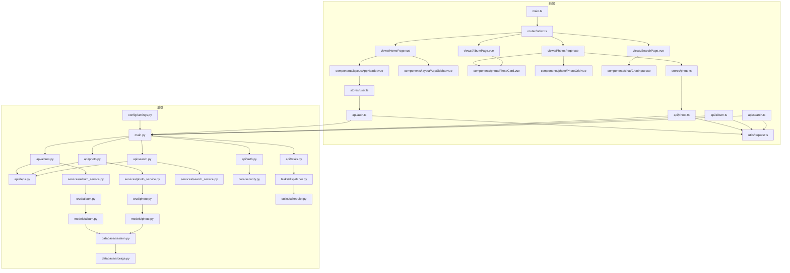
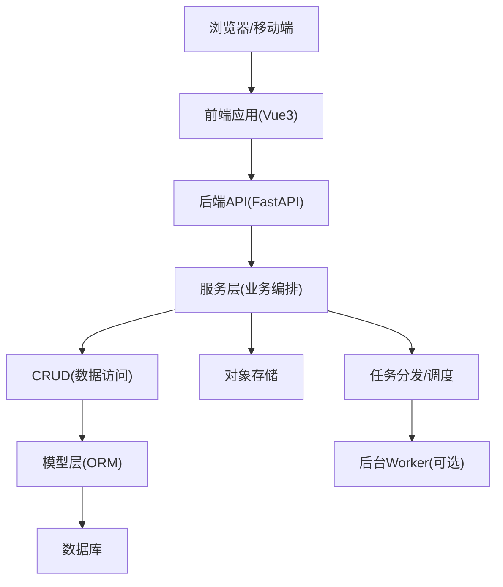
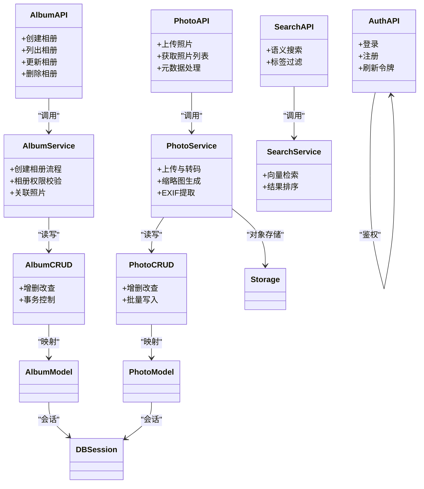
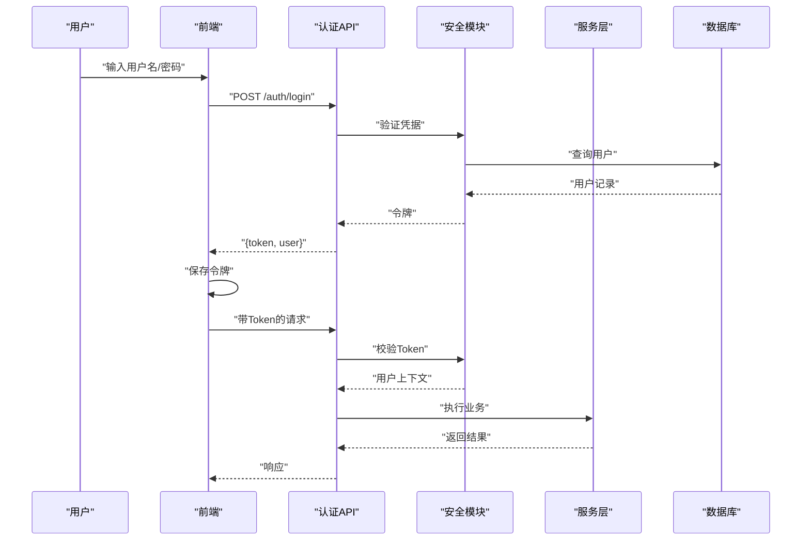
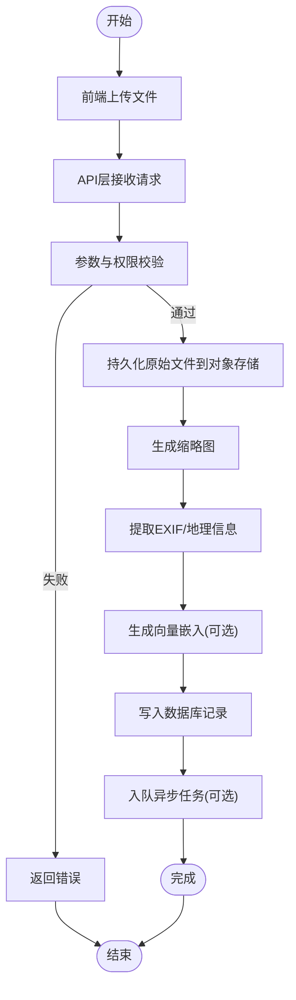
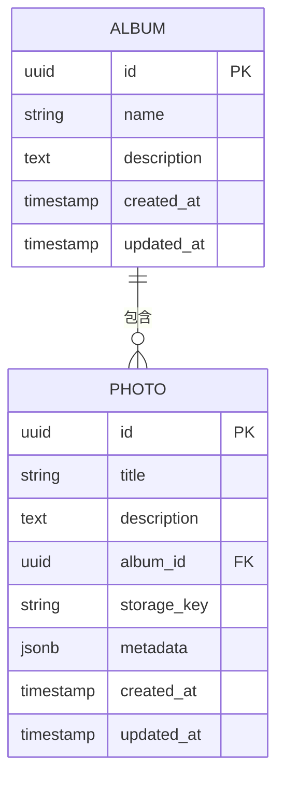
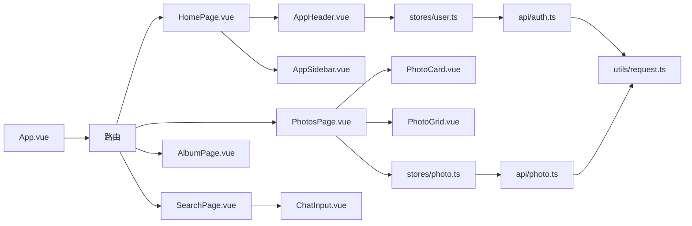
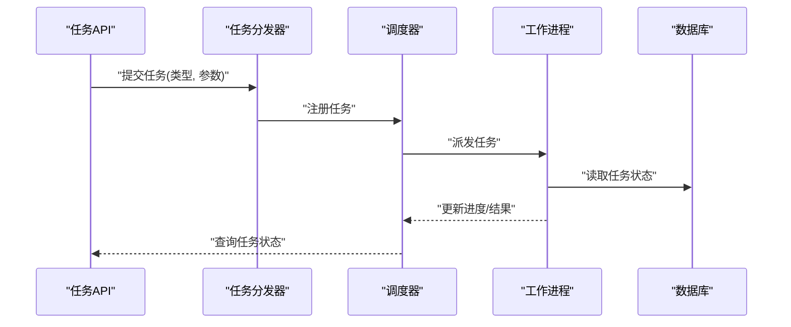
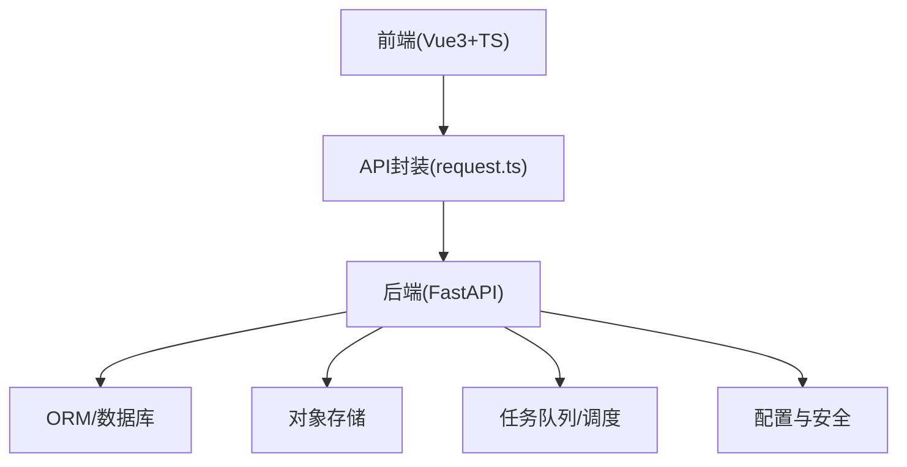

# 系统架构

<cite>
**本文引用的文件**   
- [backend/main.py](file://backend/main.py)
- [backend/app/api/album.py](file://backend/app/api/album.py)
- [backend/app/api/auth.py](file://backend/app/api/auth.py)
- [backend/app/api/photo.py](file://backend/app/api/photo.py)
- [backend/app/api/search.py](file://backend/app/api/search.py)
- [backend/app/api/tasks.py](file://backend/app/api/tasks.py)
- [backend/app/api/deps.py](file://backend/app/api/deps.py)
- [backend/app/services/album_service.py](file://backend/app/services/album_service.py)
- [backend/app/services/photo_service.py](file://backend/app/services/photo_service.py)
- [backend/app/services/search_service.py](file://backend/app/services/search_service.py)
- [backend/app/crud/album.py](file://backend/app/crud/album.py)
- [backend/app/crud/photo.py](file://backend/app/crud/photo.py)
- [backend/app/models/album.py](file://backend/app/models/album.py)
- [backend/app/models/photo.py](file://backend/app/models/photo.py)
- [backend/app/database/session.py](file://backend/app/database/session.py)
- [backend/app/database/storage.py](file://backend/app/database/storage.py)
- [backend/app/core/security.py](file://backend/app/core/security.py)
- [backend/app/config/settings.py](file://backend/app/config/settings.py)
- [backend/app/tasks/dispatcher.py](file://backend/app/tasks/dispatcher.py)
- [backend/app/tasks/scheduler.py](file://backend/app/tasks/scheduler.py)
- [frontend/src/main.ts](file://frontend/src/main.ts)
- [frontend/src/router/index.ts](file://frontend/src/router/index.ts)
- [frontend/src/views/HomePage.vue](file://frontend/src/views/HomePage.vue)
- [frontend/src/views/PhotosPage.vue](file://frontend/src/views/PhotosPage.vue)
- [frontend/src/views/AlbumPage.vue](file://frontend/src/views/AlbumPage.vue)
- [frontend/src/views/SearchPage.vue](file://frontend/src/views/SearchPage.vue)
- [frontend/src/components/layout/AppHeader.vue](file://frontend/src/components/layout/AppHeader.vue)
- [frontend/src/components/layout/AppSidebar.vue](file://frontend/src/components/layout/AppSidebar.vue)
- [frontend/src/components/photo/PhotoCard.vue](file://frontend/src/components/photo/PhotoCard.vue)
- [frontend/src/components/photo/PhotoGrid.vue](file://frontend/src/components/photo/PhotoGrid.vue)
- [frontend/src/components/chat/ChatInput.vue](file://frontend/src/components/chat/ChatInput.vue)
- [frontend/src/stores/user.ts](file://frontend/src/stores/user.ts)
- [frontend/src/stores/photo.ts](file://frontend/src/stores/photo.ts)
- [frontend/src/api/auth.ts](file://frontend/src/api/auth.ts)
- [frontend/src/api/photo.ts](file://frontend/src/api/photo.ts)
- [frontend/src/api/album.ts](file://frontend/src/api/album.ts)
- [frontend/src/api/search.ts](file://frontend/src/api/search.ts)
- [frontend/src/utils/request.ts](file://frontend/src/utils/request.ts)
- [docker-compose.yml](file://docker-compose.yml)
</cite>

## 目录
1. [简介](#简介)
2. [项目结构](#项目结构)
3. [核心组件](#核心组件)
4. [架构总览](#架构总览)
5. [详细组件分析](#详细组件分析)
6. [依赖关系分析](#依赖关系分析)
7. [性能考虑](#性能考虑)
8. [故障排查指南](#故障排查指南)
9. [结论](#结论)
10. [附录](#附录)

## 简介
本架构文档面向AI智能相册管理系统，覆盖前后端分离、分层与微服务化设计原则、数据流与集成模式。后端采用FastAPI的分层架构（API层、服务层、模型层），前端基于Vue 3的组件化架构。文档提供系统上下文图与组件分解图，说明基础设施要求与可扩展性考量，并给出关键交互序列与流程图，帮助读者快速理解系统边界、技术选型理由与架构权衡。

## 项目结构
仓库采用前后端分离组织：
- 后端 backend：FastAPI应用，按功能域划分api、services、crud、models、database、tasks等模块；配置与安全在core与config中集中管理。
- 前端 frontend：Vue 3 + TypeScript + Vite，路由、视图、组件、状态管理与API封装清晰分层。
- 部署 docker-compose.yml 编排容器化服务。

图表来源
- [backend/main.py](file://backend/main.py)
- [frontend/src/main.ts](file://frontend/src/main.ts)
- [frontend/src/router/index.ts](file://frontend/src/router/index.ts)
- [frontend/src/views/HomePage.vue](file://frontend/src/views/HomePage.vue)
- [frontend/src/views/PhotosPage.vue](file://frontend/src/views/PhotosPage.vue)
- [frontend/src/views/AlbumPage.vue](file://frontend/src/views/AlbumPage.vue)
- [frontend/src/views/SearchPage.vue](file://frontend/src/views/SearchPage.vue)
- [frontend/src/components/layout/AppHeader.vue](file://frontend/src/components/layout/AppHeader.vue)
- [frontend/src/components/layout/AppSidebar.vue](file://frontend/src/components/layout/AppSidebar.vue)
- [frontend/src/components/photo/PhotoCard.vue](file://frontend/src/components/photo/PhotoCard.vue)
- [frontend/src/components/photo/PhotoGrid.vue](file://frontend/src/components/photo/PhotoGrid.vue)
- [frontend/src/components/chat/ChatInput.vue](file://frontend/src/components/chat/ChatInput.vue)
- [frontend/src/stores/user.ts](file://frontend/src/stores/user.ts)
- [frontend/src/stores/photo.ts](file://frontend/src/stores/photo.ts)
- [frontend/src/api/auth.ts](file://frontend/src/api/auth.ts)
- [frontend/src/api/photo.ts](file://frontend/src/api/photo.ts)
- [frontend/src/api/album.ts](file://frontend/src/api/album.ts)
- [frontend/src/api/search.ts](file://frontend/src/api/search.ts)
- [frontend/src/utils/request.ts](file://frontend/src/utils/request.ts)
- [backend/app/api/album.py](file://backend/app/api/album.py)
- [backend/app/api/auth.py](file://backend/app/api/auth.py)
- [backend/app/api/photo.py](file://backend/app/api/photo.py)
- [backend/app/api/search.py](file://backend/app/api/search.py)
- [backend/app/api/tasks.py](file://backend/app/api/tasks.py)
- [backend/app/api/deps.py](file://backend/app/api/deps.py)
- [backend/app/services/album_service.py](file://backend/app/services/album_service.py)
- [backend/app/services/photo_service.py](file://backend/app/services/photo_service.py)
- [backend/app/services/search_service.py](file://backend/app/services/search_service.py)
- [backend/app/crud/album.py](file://backend/app/crud/album.py)
- [backend/app/crud/photo.py](file://backend/app/crud/photo.py)
- [backend/app/models/album.py](file://backend/app/models/album.py)
- [backend/app/models/photo.py](file://backend/app/models/photo.py)
- [backend/app/database/session.py](file://backend/app/database/session.py)
- [backend/app/database/storage.py](file://backend/app/database/storage.py)
- [backend/app/core/security.py](file://backend/app/core/security.py)
- [backend/app/config/settings.py](file://backend/app/config/settings.py)
- [backend/app/tasks/dispatcher.py](file://backend/app/tasks/dispatcher.py)
- [backend/app/tasks/scheduler.py](file://backend/app/tasks/scheduler.py)

章节来源
- [docker-compose.yml](file://docker-compose.yml)

## 核心组件
- 后端FastAPI应用入口与路由挂载，统一注册API路由与中间件，加载配置与安全策略。
- API层负责请求解析、鉴权校验、参数校验与响应包装，调用服务层完成业务编排。
- 服务层实现领域逻辑与跨模块协作，协调CRUD、外部AI能力与任务调度。
- CRUD层封装数据库访问，模型层定义ORM实体与关系。
- 数据库会话与存储抽象统一管理连接与对象存储。
- 任务分发器与调度器支撑异步处理（如人脸检测、向量检索）。
- 前端以Vue 3构建，路由驱动页面，组件复用，Pinia状态管理，统一的HTTP客户端封装。

章节来源
- [backend/main.py](file://backend/main.py)
- [backend/app/api/album.py](file://backend/app/api/album.py)
- [backend/app/api/auth.py](file://backend/app/api/auth.py)
- [backend/app/api/photo.py](file://backend/app/api/photo.py)
- [backend/app/api/search.py](file://backend/app/api/search.py)
- [backend/app/api/tasks.py](file://backend/app/api/tasks.py)
- [backend/app/api/deps.py](file://backend/app/api/deps.py)
- [backend/app/services/album_service.py](file://backend/app/services/album_service.py)
- [backend/app/services/photo_service.py](file://backend/app/services/photo_service.py)
- [backend/app/services/search_service.py](file://backend/app/services/search_service.py)
- [backend/app/crud/album.py](file://backend/app/crud/album.py)
- [backend/app/crud/photo.py](file://backend/app/crud/photo.py)
- [backend/app/models/album.py](file://backend/app/models/album.py)
- [backend/app/models/photo.py](file://backend/app/models/photo.py)
- [backend/app/database/session.py](file://backend/app/database/session.py)
- [backend/app/database/storage.py](file://backend/app/database/storage.py)
- [backend/app/core/security.py](file://backend/app/core/security.py)
- [backend/app/config/settings.py](file://backend/app/config/settings.py)
- [backend/app/tasks/dispatcher.py](file://backend/app/tasks/dispatcher.py)
- [backend/app/tasks/scheduler.py](file://backend/app/tasks/scheduler.py)
- [frontend/src/main.ts](file://frontend/src/main.ts)
- [frontend/src/router/index.ts](file://frontend/src/router/index.ts)
- [frontend/src/views/HomePage.vue](file://frontend/src/views/HomePage.vue)
- [frontend/src/views/PhotosPage.vue](file://frontend/src/views/PhotosPage.vue)
- [frontend/src/views/AlbumPage.vue](file://frontend/src/views/AlbumPage.vue)
- [frontend/src/views/SearchPage.vue](file://frontend/src/views/SearchPage.vue)
- [frontend/src/components/layout/AppHeader.vue](file://frontend/src/components/layout/AppHeader.vue)
- [frontend/src/components/layout/AppSidebar.vue](file://frontend/src/components/layout/AppSidebar.vue)
- [frontend/src/components/photo/PhotoCard.vue](file://frontend/src/components/photo/PhotoCard.vue)
- [frontend/src/components/photo/PhotoGrid.vue](file://frontend/src/components/photo/PhotoGrid.vue)
- [frontend/src/components/chat/ChatInput.vue](file://frontend/src/components/chat/ChatInput.vue)
- [frontend/src/stores/user.ts](file://frontend/src/stores/user.ts)
- [frontend/src/stores/photo.ts](file://frontend/src/stores/photo.ts)
- [frontend/src/api/auth.ts](file://frontend/src/api/auth.ts)
- [frontend/src/api/photo.ts](file://frontend/src/api/photo.ts)
- [frontend/src/api/album.ts](file://frontend/src/api/album.ts)
- [frontend/src/api/search.ts](file://frontend/src/api/search.ts)
- [frontend/src/utils/request.ts](file://frontend/src/utils/request.ts)

## 架构总览
系统采用前后端分离与分层架构：
- 前端通过REST API与后端通信，使用统一请求封装进行鉴权、错误处理与重试。
- 后端API层仅做协议适配与权限校验，业务逻辑下沉至服务层，数据持久化由CRUD与模型层承担。
- 异步任务通过任务分发器与调度器解耦耗时操作（如AI推理、向量化）。
- 配置与安全策略集中管理，便于多环境部署与扩展。

图表来源
- [backend/main.py](file://backend/main.py)
- [backend/app/api/album.py](file://backend/app/api/album.py)
- [backend/app/services/album_service.py](file://backend/app/services/album_service.py)
- [backend/app/crud/album.py](file://backend/app/crud/album.py)
- [backend/app/models/album.py](file://backend/app/models/album.py)
- [backend/app/database/session.py](file://backend/app/database/session.py)
- [backend/app/database/storage.py](file://backend/app/database/storage.py)
- [backend/app/tasks/dispatcher.py](file://backend/app/tasks/dispatcher.py)
- [backend/app/tasks/scheduler.py](file://backend/app/tasks/scheduler.py)
- [frontend/src/main.ts](file://frontend/src/main.ts)
- [frontend/src/utils/request.ts](file://frontend/src/utils/request.ts)

## 详细组件分析

### 后端分层架构（API层、服务层、模型层）
- API层：路由定义、请求/响应模型、鉴权与依赖注入。
- 服务层：聚合多个CRUD与外部能力，编排业务流程。
- 模型层：ORM实体定义与关系映射，配合数据库会话与存储抽象。

图表来源
- [backend/app/api/album.py](file://backend/app/api/album.py)
- [backend/app/api/photo.py](file://backend/app/api/photo.py)
- [backend/app/api/search.py](file://backend/app/api/search.py)
- [backend/app/api/auth.py](file://backend/app/api/auth.py)
- [backend/app/services/album_service.py](file://backend/app/services/album_service.py)
- [backend/app/services/photo_service.py](file://backend/app/services/photo_service.py)
- [backend/app/services/search_service.py](file://backend/app/services/search_service.py)
- [backend/app/crud/album.py](file://backend/app/crud/album.py)
- [backend/app/crud/photo.py](file://backend/app/crud/photo.py)
- [backend/app/models/album.py](file://backend/app/models/album.py)
- [backend/app/models/photo.py](file://backend/app/models/photo.py)
- [backend/app/database/session.py](file://backend/app/database/session.py)
- [backend/app/database/storage.py](file://backend/app/database/storage.py)

章节来源
- [backend/app/api/album.py](file://backend/app/api/album.py)
- [backend/app/api/photo.py](file://backend/app/api/photo.py)
- [backend/app/api/search.py](file://backend/app/api/search.py)
- [backend/app/api/auth.py](file://backend/app/api/auth.py)
- [backend/app/services/album_service.py](file://backend/app/services/album_service.py)
- [backend/app/services/photo_service.py](file://backend/app/services/photo_service.py)
- [backend/app/services/search_service.py](file://backend/app/services/search_service.py)
- [backend/app/crud/album.py](file://backend/app/crud/album.py)
- [backend/app/crud/photo.py](file://backend/app/crud/photo.py)
- [backend/app/models/album.py](file://backend/app/models/album.py)
- [backend/app/models/photo.py](file://backend/app/models/photo.py)
- [backend/app/database/session.py](file://backend/app/database/session.py)
- [backend/app/database/storage.py](file://backend/app/database/storage.py)

### 认证与授权流程（鉴权）
- 前端登录后保存令牌，后续请求携带令牌。
- 后端API层通过依赖注入获取当前用户，服务层执行权限校验。

图表来源
- [backend/app/api/auth.py](file://backend/app/api/auth.py)
- [backend/app/core/security.py](file://backend/app/core/security.py)
- [frontend/src/api/auth.ts](file://frontend/src/api/auth.ts)
- [frontend/src/stores/user.ts](file://frontend/src/stores/user.ts)
- [frontend/src/utils/request.ts](file://frontend/src/utils/request.ts)

章节来源
- [backend/app/api/auth.py](file://backend/app/api/auth.py)
- [backend/app/core/security.py](file://backend/app/core/security.py)
- [frontend/src/api/auth.ts](file://frontend/src/api/auth.ts)
- [frontend/src/stores/user.ts](file://frontend/src/stores/user.ts)
- [frontend/src/utils/request.ts](file://frontend/src/utils/request.ts)

### 照片上传与处理流水线
- 前端选择文件后发起上传，后端接收并触发服务层处理（缩略图、EXIF、向量等），必要时入队异步任务。

图表来源
- [backend/app/api/photo.py](file://backend/app/api/photo.py)
- [backend/app/services/photo_service.py](file://backend/app/services/photo_service.py)
- [backend/app/crud/photo.py](file://backend/app/crud/photo.py)
- [backend/app/models/photo.py](file://backend/app/models/photo.py)
- [backend/app/database/storage.py](file://backend/app/database/storage.py)
- [backend/app/tasks/dispatcher.py](file://backend/app/tasks/dispatcher.py)
- [frontend/src/api/photo.ts](file://frontend/src/api/photo.ts)
- [frontend/src/components/photo/UploadDialog.vue](file://frontend/src/components/photo/UploadDialog.vue)

章节来源
- [backend/app/api/photo.py](file://backend/app/api/photo.py)
- [backend/app/services/photo_service.py](file://backend/app/services/photo_service.py)
- [backend/app/crud/photo.py](file://backend/app/crud/photo.py)
- [backend/app/models/photo.py](file://backend/app/models/photo.py)
- [backend/app/database/storage.py](file://backend/app/database/storage.py)
- [backend/app/tasks/dispatcher.py](file://backend/app/tasks/dispatcher.py)
- [frontend/src/api/photo.ts](file://frontend/src/api/photo.ts)

### 相册与照片关系建模
- 相册包含多张照片，支持分组、标签与元数据。
- 模型层定义相册与照片的关系，CRUD层提供事务性操作。

图表来源
- [backend/app/models/album.py](file://backend/app/models/album.py)
- [backend/app/models/photo.py](file://backend/app/models/photo.py)

章节来源
- [backend/app/models/album.py](file://backend/app/models/album.py)
- [backend/app/models/photo.py](file://backend/app/models/photo.py)

### 前端组件化架构
- 布局组件：头部与侧边栏提供导航与全局状态。
- 页面组件：首页、照片页、相册页、搜索页承载业务视图。
- 通用组件：照片卡片、网格、聊天输入等可复用单元。
- 状态管理：用户与照片相关状态集中管理，API封装统一处理请求与错误。

图表来源
- [frontend/src/main.ts](file://frontend/src/main.ts)
- [frontend/src/router/index.ts](file://frontend/src/router/index.ts)
- [frontend/src/views/HomePage.vue](file://frontend/src/views/HomePage.vue)
- [frontend/src/views/PhotosPage.vue](file://frontend/src/views/PhotosPage.vue)
- [frontend/src/views/AlbumPage.vue](file://frontend/src/views/AlbumPage.vue)
- [frontend/src/views/SearchPage.vue](file://frontend/src/views/SearchPage.vue)
- [frontend/src/components/layout/AppHeader.vue](file://frontend/src/components/layout/AppHeader.vue)
- [frontend/src/components/layout/AppSidebar.vue](file://frontend/src/components/layout/AppSidebar.vue)
- [frontend/src/components/photo/PhotoCard.vue](file://frontend/src/components/photo/PhotoCard.vue)
- [frontend/src/components/photo/PhotoGrid.vue](file://frontend/src/components/photo/PhotoGrid.vue)
- [frontend/src/components/chat/ChatInput.vue](file://frontend/src/components/chat/ChatInput.vue)
- [frontend/src/stores/user.ts](file://frontend/src/stores/user.ts)
- [frontend/src/stores/photo.ts](file://frontend/src/stores/photo.ts)
- [frontend/src/api/auth.ts](file://frontend/src/api/auth.ts)
- [frontend/src/api/photo.ts](file://frontend/src/api/photo.ts)
- [frontend/src/utils/request.ts](file://frontend/src/utils/request.ts)

章节来源
- [frontend/src/main.ts](file://frontend/src/main.ts)
- [frontend/src/router/index.ts](file://frontend/src/router/index.ts)
- [frontend/src/views/HomePage.vue](file://frontend/src/views/HomePage.vue)
- [frontend/src/views/PhotosPage.vue](file://frontend/src/views/PhotosPage.vue)
- [frontend/src/views/AlbumPage.vue](file://frontend/src/views/AlbumPage.vue)
- [frontend/src/views/SearchPage.vue](file://frontend/src/views/SearchPage.vue)
- [frontend/src/components/layout/AppHeader.vue](file://frontend/src/components/layout/AppHeader.vue)
- [frontend/src/components/layout/AppSidebar.vue](file://frontend/src/components/layout/AppSidebar.vue)
- [frontend/src/components/photo/PhotoCard.vue](file://frontend/src/components/photo/PhotoCard.vue)
- [frontend/src/components/photo/PhotoGrid.vue](file://frontend/src/components/photo/PhotoGrid.vue)
- [frontend/src/components/chat/ChatInput.vue](file://frontend/src/components/chat/ChatInput.vue)
- [frontend/src/stores/user.ts](file://frontend/src/stores/user.ts)
- [frontend/src/stores/photo.ts](file://frontend/src/stores/photo.ts)
- [frontend/src/api/auth.ts](file://frontend/src/api/auth.ts)
- [frontend/src/api/photo.ts](file://frontend/src/api/photo.ts)
- [frontend/src/utils/request.ts](file://frontend/src/utils/request.ts)

### 任务调度与异步处理
- 任务分发器负责将耗时任务入队，调度器周期性或事件驱动地执行。
- 适合场景：人脸检测、向量嵌入、批量重采样等。

图表来源
- [backend/app/api/tasks.py](file://backend/app/api/tasks.py)
- [backend/app/tasks/dispatcher.py](file://backend/app/tasks/dispatcher.py)
- [backend/app/tasks/scheduler.py](file://backend/app/tasks/scheduler.py)

章节来源
- [backend/app/api/tasks.py](file://backend/app/api/tasks.py)
- [backend/app/tasks/dispatcher.py](file://backend/app/tasks/dispatcher.py)
- [backend/app/tasks/scheduler.py](file://backend/app/tasks/scheduler.py)

## 依赖关系分析
- 前端依赖：Vue 3生态（路由、状态管理）、Vite构建、Tailwind样式。
- 后端依赖：FastAPI、ORM、对象存储、任务队列（可选）、配置与安全库。
- 部署依赖：Docker与Compose编排，Nginx静态资源托管（前端）。

图表来源
- [frontend/src/utils/request.ts](file://frontend/src/utils/request.ts)
- [backend/main.py](file://backend/main.py)
- [backend/app/config/settings.py](file://backend/app/config/settings.py)
- [backend/app/database/session.py](file://backend/app/database/session.py)
- [backend/app/database/storage.py](file://backend/app/database/storage.py)
- [backend/app/tasks/dispatcher.py](file://backend/app/tasks/dispatcher.py)
- [backend/app/tasks/scheduler.py](file://backend/app/tasks/scheduler.py)

章节来源
- [docker-compose.yml](file://docker-compose.yml)
- [backend/app/config/settings.py](file://backend/app/config/settings.py)

## 性能考虑
- 前端：图片懒加载、分页与虚拟滚动、缓存策略与并发限制。
- 后端：连接池与异步I/O、分片上传与断点续传、缩略图与按需转码、向量索引与近似检索优化。
- 任务：批处理与限流、幂等性与重试机制、监控与告警。
- 存储：冷热分层、CDN加速、压缩与格式转换。

[本节为通用指导，不直接分析具体文件]

## 故障排查指南
- 鉴权失败：检查令牌有效期、刷新流程与CORS设置。
- 上传失败：确认对象存储连通性、文件大小限制与MIME类型。
- 任务卡住：查看任务队列状态、日志与重试次数。
- 数据库异常：检查连接池、慢查询与锁等待。

章节来源
- [backend/app/core/security.py](file://backend/app/core/security.py)
- [backend/app/database/session.py](file://backend/app/database/session.py)
- [backend/app/database/storage.py](file://backend/app/database/storage.py)
- [backend/app/tasks/dispatcher.py](file://backend/app/tasks/dispatcher.py)
- [backend/app/tasks/scheduler.py](file://backend/app/tasks/scheduler.py)
- [frontend/src/utils/request.ts](file://frontend/src/utils/request.ts)

## 结论
本系统通过前后端分离与分层架构实现了高内聚低耦合的设计目标。后端以FastAPI为核心，结合服务层与CRUD/模型层，确保业务逻辑清晰与数据一致性；前端以Vue 3组件化提升可维护性与用户体验。任务调度与对象存储使系统具备良好扩展性，适合AI能力的持续集成与演进。

[本节为总结，不直接分析具体文件]

## 附录
- 系统边界：前端浏览器/移动端、后端API与服务、数据库与对象存储、任务队列与外部AI服务。
- 技术栈选择理由：FastAPI高性能与类型友好；Vue 3生态成熟且组件化强；Docker简化部署与环境一致性。
- 架构决策权衡：同步与异步任务的取舍、集中式与分布式任务队列的复杂度与收益、对象存储与数据库的职责划分。

[本节为补充说明，不直接分析具体文件]