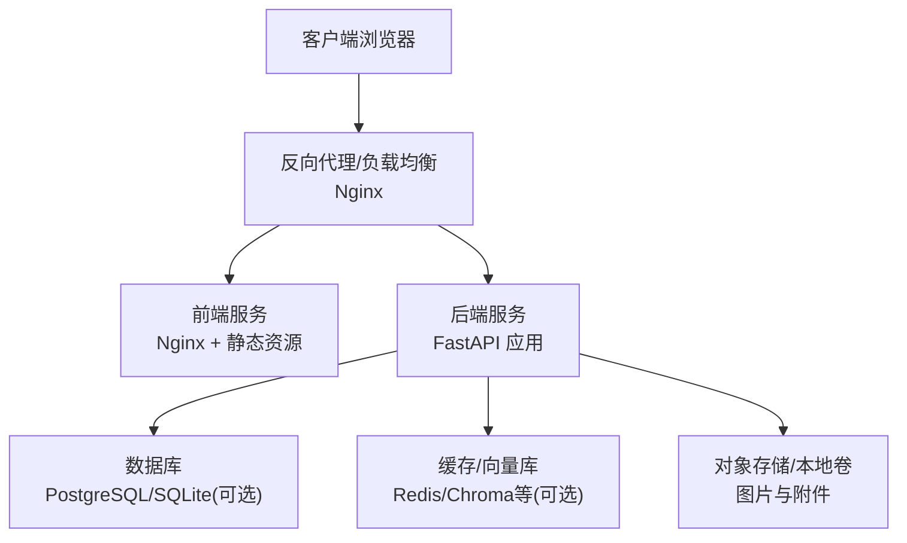
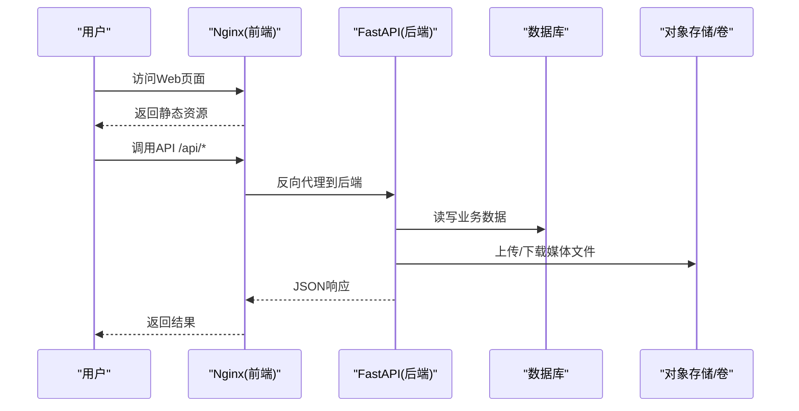
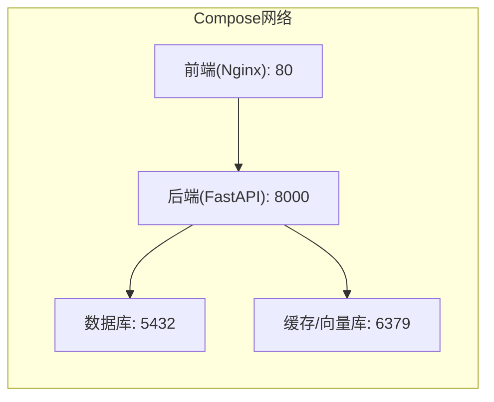
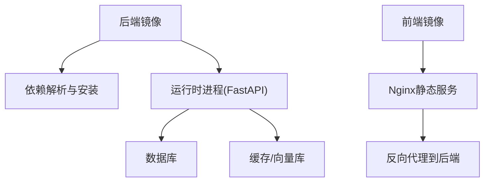

# 部署架构设计

<cite>
**本文引用的文件**   
- [docker-compose.yml](file://docker-compose.yml)
- [backend/Dockerfile](file://backend/Dockerfile)
- [frontend/Dockerfile](file://frontend/Dockerfile)
- [frontend/nginx.conf](file://frontend/nginx.conf)
- [backend/.dockerignore](file://backend/.dockerignore)
- [backend/main.py](file://backend/main.py)
- [backend/app/config/settings.py](file://backend/app/config/settings.py)
- [backend/pyproject.toml](file://backend/pyproject.toml)
- [README.md](file://README.md)
</cite>

## 目录
1. [简介](#简介)
2. [项目结构](#项目结构)
3. [核心组件](#核心组件)
4. [架构总览](#架构总览)
5. [详细组件分析](#详细组件分析)
6. [依赖关系分析](#依赖关系分析)
7. [性能与可扩展性](#性能与可扩展性)
8. [故障排查指南](#故障排查指南)
9. [结论](#结论)
10. [附录](#附录)

## 简介
本文件面向AI智能相册管理系统的生产级部署，聚焦Docker容器化策略、多服务编排、镜像构建优化、容器间通信、负载均衡与高可用设计、环境变量与密钥管理、CI/CD流水线与自动化测试、发布策略，以及可操作的部署脚本与环境配置模板。文档以仓库现有Docker与Nginx配置为基础，结合通用生产最佳实践给出落地方案。

## 项目结构
系统采用前后端分离架构：
- 后端：Python FastAPI应用，提供REST API、任务调度与AI能力集成。
- 前端：Vue/Vite静态资源，由Nginx提供服务。
- 编排：使用docker-compose进行本地与开发环境的多服务编排；生产环境建议迁移至Kubernetes或容器编排平台。

图表来源
- [docker-compose.yml](file://docker-compose.yml)
- [frontend/nginx.conf](file://frontend/nginx.conf)
- [backend/main.py](file://backend/main.py)

章节来源
- [README.md](file://README.md)
- [docker-compose.yml](file://docker-compose.yml)

## 核心组件
- 后端服务（FastAPI）
  - 入口与路由注册位于后端主程序文件。
  - 配置通过环境变量注入，集中读取自配置文件模块。
  - 依赖声明在包管理文件中，用于构建镜像时安装依赖。
- 前端服务（Nginx）
  - 构建产物为静态资源，由Nginx对外暴露。
  - Nginx配置负责静态资源缓存、压缩、跨域与反向代理到后端API。
- 编排与数据持久化
  - docker-compose定义多服务、网络、卷挂载与启动顺序。
  - 数据卷用于数据库与媒体文件的持久化。

章节来源
- [backend/main.py](file://backend/main.py)
- [backend/app/config/settings.py](file://backend/app/config/settings.py)
- [backend/pyproject.toml](file://backend/pyproject.toml)
- [frontend/nginx.conf](file://frontend/nginx.conf)
- [docker-compose.yml](file://docker-compose.yml)

## 架构总览
下图展示从请求进入端到数据落盘的全链路，包括反向代理、前后端服务、数据库与对象存储的交互。

图表来源
- [frontend/nginx.conf](file://frontend/nginx.conf)
- [backend/main.py](file://backend/main.py)
- [docker-compose.yml](file://docker-compose.yml)

## 详细组件分析

### 容器化与镜像构建优化
- 多阶段构建
  - 后端：分阶段安装依赖并仅拷贝运行所需文件，减小镜像体积。
  - 前端：先构建静态资源，再拷贝到轻量Nginx镜像。
- 层缓存优化
  - 将依赖安装与源码复制分层，利用Docker层缓存加速重复构建。
- 忽略无关文件
  - 使用.dockerignore排除不必要的上下文文件，减少构建上下文大小。
- 安全加固
  - 非root用户运行、最小权限原则、定期更新基础镜像。

章节来源
- [backend/Dockerfile](file://backend/Dockerfile)
- [frontend/Dockerfile](file://frontend/Dockerfile)
- [backend/.dockerignore](file://backend/.dockerignore)

### 多服务编排与容器间通信
- 服务划分
  - 前端服务：Nginx提供静态资源与反向代理。
  - 后端服务：FastAPI应用，暴露HTTP接口。
  - 数据库与缓存：按需要引入独立容器。
- 网络与端口
  - 容器间通过Compose网络互通，外部仅暴露Nginx端口。
- 启动顺序与健康检查
  - 使用depends_on与healthcheck确保依赖就绪后再启动上游服务。
- 数据持久化
  - 使用命名卷挂载数据库与媒体目录，避免数据丢失。

图表来源
- [docker-compose.yml](file://docker-compose.yml)

章节来源
- [docker-compose.yml](file://docker-compose.yml)

### 反向代理与负载均衡
- 反向代理
  - Nginx将/api路径转发至后端服务，其余路径提供静态资源。
- 负载均衡
  - 多实例后端可通过Nginx upstream实现轮询或加权分发。
- 静态资源优化
  - 启用Gzip/Brotli、缓存头、长缓存策略。
- 安全头与限流
  - 添加安全响应头、速率限制与访问控制。

章节来源
- [frontend/nginx.conf](file://frontend/nginx.conf)

### 环境变量管理与配置组织
- 配置来源
  - 后端通过环境变量加载配置项，集中读取自配置模块。
- 推荐变量
  - 数据库连接串、缓存地址、存储路径、日志级别、CORS白名单、第三方API密钥等。
- 安全建议
  - 使用Secrets管理敏感信息，避免硬编码；不同环境使用不同.env或Secrets映射。

章节来源
- [backend/app/config/settings.py](file://backend/app/config/settings.py)

### 密钥安全管理
- 本地开发
  - 使用.env文件配合docker-compose env_file注入。
- 生产环境
  - 使用平台原生Secrets（如Kubernetes Secrets、云厂商密钥管理服务）。
- 最小权限
  - 仅授予必要权限，定期轮换密钥，审计访问日志。

章节来源
- [docker-compose.yml](file://docker-compose.yml)

### CI/CD流水线设计与自动化测试
- 流水线阶段
  - 代码拉取 -> 依赖安装 -> 单元测试 -> 构建镜像 -> 推送镜像 -> 部署。
- 缓存与并行
  - 缓存依赖层与构建产物，提升流水线速度。
- 质量门禁
  - 静态检查、安全扫描、镜像签名与漏洞扫描。
- 灰度与回滚
  - 蓝绿/金丝雀发布，失败自动回滚。

章节来源
- [backend/pyproject.toml](file://backend/pyproject.toml)
- [backend/Dockerfile](file://backend/Dockerfile)
- [frontend/Dockerfile](file://frontend/Dockerfile)

### 发布策略
- 版本标签
  - 使用语义化版本与Git标签作为镜像标签。
- 多环境
  - dev/staging/prod三套配置，严格隔离。
- 变更追踪
  - 记录每次发布的镜像Digest与变更清单。

章节来源
- [docker-compose.yml](file://docker-compose.yml)

## 依赖关系分析
- 运行时依赖
  - 后端依赖声明于包管理文件，镜像构建时安装。
- 服务依赖
  - 前端依赖Nginx；后端依赖数据库与可选缓存/向量库。
- 外部依赖
  - 第三方AI服务、对象存储、地理编码等，通过环境变量接入。

图表来源
- [backend/pyproject.toml](file://backend/pyproject.toml)
- [backend/Dockerfile](file://backend/Dockerfile)
- [frontend/Dockerfile](file://frontend/Dockerfile)
- [docker-compose.yml](file://docker-compose.yml)

章节来源
- [backend/pyproject.toml](file://backend/pyproject.toml)
- [backend/Dockerfile](file://backend/Dockerfile)
- [frontend/Dockerfile](file://frontend/Dockerfile)
- [docker-compose.yml](file://docker-compose.yml)

## 性能与可扩展性
- 水平扩展
  - 后端无状态化，支持多副本；Nginx做负载均衡。
- 缓存与向量化
  - 引入缓存层与向量检索库，降低数据库压力，提升搜索性能。
- I/O优化
  - 媒体文件走对象存储或高性能卷；开启异步I/O与连接池。
- 监控与可观测性
  - 指标采集、结构化日志、分布式追踪与告警。

[本节为通用指导，不直接分析具体文件]

## 故障排查指南
- 常见问题
  - 端口冲突：检查宿主机与容器端口映射。
  - 健康检查失败：确认依赖服务已就绪且可达。
  - 权限问题：确认卷挂载权限与运行用户。
  - 环境变量缺失：核对必需变量是否注入。
- 定位方法
  - 查看容器日志与编排平台事件。
  - 使用调试工具连通性与端口探测。
  - 逐步缩小范围：直连后端/Nginx/数据库验证。

章节来源
- [docker-compose.yml](file://docker-compose.yml)
- [frontend/nginx.conf](file://frontend/nginx.conf)

## 结论
通过Docker容器化与多服务编排，系统实现了清晰的边界与良好的可移植性。结合Nginx反向代理与负载均衡、环境变量与密钥管理、CI/CD流水线与灰度发布策略，可在生产环境获得高可用与易运维的交付能力。建议在大规模场景下迁移至Kubernetes以获得更强的弹性与治理能力。

[本节为总结性内容，不直接分析具体文件]

## 附录

### 部署脚本示例（概念性步骤）
- 构建与推送镜像
  - 构建后端与前端镜像，打标签并推送到镜像仓库。
- 部署到集群
  - 使用编排平台拉取最新镜像并滚动更新。
- 健康检查与回滚
  - 执行健康检查，失败则自动回滚到上一稳定版本。

[本节为通用流程说明，不直接分析具体文件]

### 环境配置模板（字段清单）
- 后端
  - 数据库连接串、用户名、密码、主机、端口、数据库名
  - 缓存/向量库地址与端口
  - 存储根路径、最大上传大小、并发参数
  - CORS白名单、日志级别、时区
  - 第三方AI服务API密钥与端点
- 前端
  - 后端API基础URL、静态资源缓存策略
- 安全
  - 会话密钥、JWT密钥、加密盐值

[本节为通用配置清单，不直接分析具体文件]