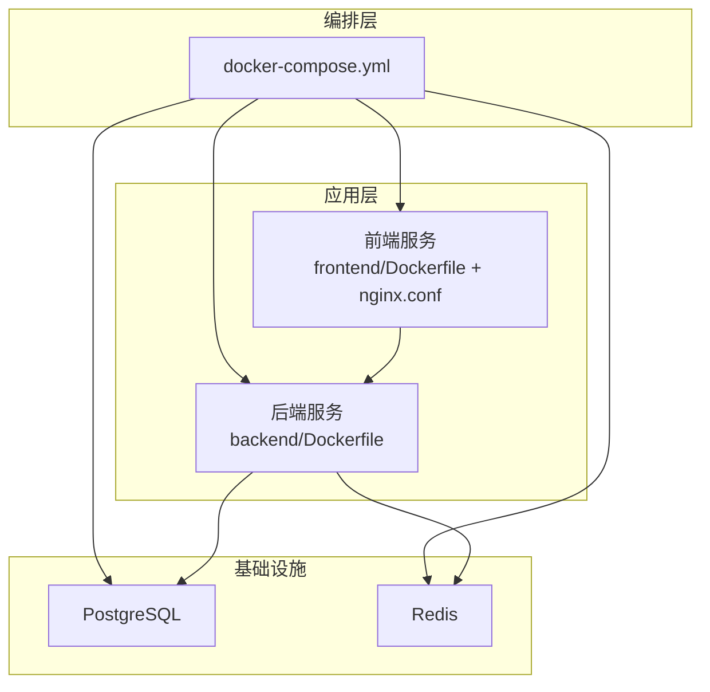
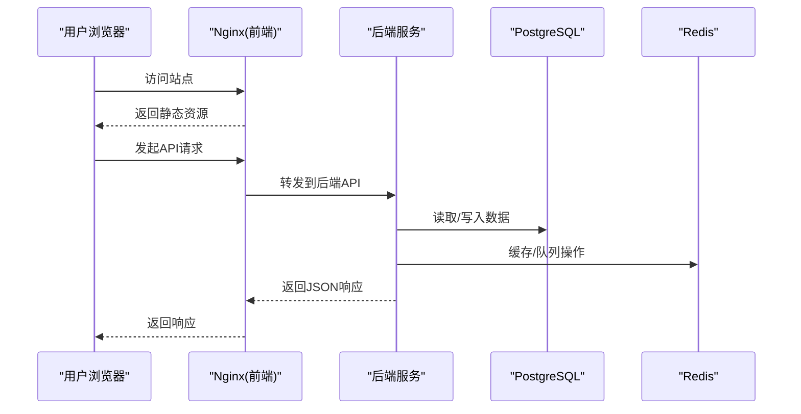
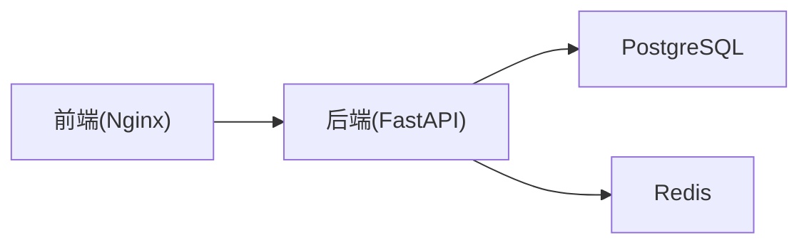

# Docker容器化部署

<cite>
**本文引用的文件**   
- [docker-compose.yml](file://docker-compose.yml)
- [backend/Dockerfile](file://backend/Dockerfile)
- [frontend/Dockerfile](file://frontend/Dockerfile)
- [frontend/nginx.conf](file://frontend/nginx.conf)
- [backend/.dockerignore](file://backend/.dockerignore)
- [backend/pyproject.toml](file://backend/pyproject.toml)
- [backend/main.py](file://backend/main.py)
- [backend/app/config/settings.py](file://backend/app/config/settings.py)
- [backend/app/database/session.py](file://backend/app/database/session.py)
- [backend/app/database/storage.py](file://backend/app/database/storage.py)
- [backend/app/core/logger.py](file://backend/app/core/logger.py)
- [backend/app/services/README.md](file://backend/app/services/README.md)
</cite>

## 目录
1. [简介](#简介)
2. [项目结构](#项目结构)
3. [核心组件](#核心组件)
4. [架构总览](#架构总览)
5. [详细组件分析](#详细组件分析)
6. [依赖关系分析](#依赖关系分析)
7. [性能与优化](#性能与优化)
8. [故障排查指南](#故障排查指南)
9. [结论](#结论)
10. [附录](#附录)

## 简介
本文件面向AI相册项目的Docker容器化部署，覆盖后端Python应用与前端Vue应用的镜像构建、服务编排、网络与数据卷策略、环境变量与健康检查、日志收集方案，以及本地开发与生产环境的差异化配置。文档同时提供多阶段构建、镜像体积优化与安全最佳实践建议，帮助读者快速搭建可维护、可扩展的容器化环境。

## 项目结构
仓库采用前后端分离结构：
- 后端：基于Python（FastAPI）的服务，位于 backend 目录，包含应用代码、依赖声明与Dockerfile。
- 前端：基于Vue/Vite的前端静态资源，位于 frontend 目录，包含Dockerfile与Nginx配置。
- 根目录：docker-compose.yml 用于编排数据库、缓存、反向代理与应用服务。

图表来源
- [docker-compose.yml](file://docker-compose.yml)
- [backend/Dockerfile](file://backend/Dockerfile)
- [frontend/Dockerfile](file://frontend/Dockerfile)
- [frontend/nginx.conf](file://frontend/nginx.conf)

章节来源
- [docker-compose.yml](file://docker-compose.yml)
- [backend/Dockerfile](file://backend/Dockerfile)
- [frontend/Dockerfile](file://frontend/Dockerfile)
- [frontend/nginx.conf](file://frontend/nginx.conf)

## 核心组件
- 后端服务：Python应用，暴露REST API，连接PostgreSQL与Redis，使用任务调度处理异步工作。
- 前端服务：Vite构建产物由Nginx托管，作为反向代理对外提供静态资源与API转发能力。
- 数据库：PostgreSQL持久化业务数据。
- 缓存：Redis用于会话、缓存或任务队列等场景。
- 反向代理：Nginx统一入口，负责静态资源与API路由。

章节来源
- [backend/main.py](file://backend/main.py)
- [backend/app/config/settings.py](file://backend/app/config/settings.py)
- [backend/app/database/session.py](file://backend/app/database/session.py)
- [backend/app/database/storage.py](file://backend/app/database/storage.py)
- [backend/app/core/logger.py](file://backend/app/core/logger.py)
- [backend/app/services/README.md](file://backend/app/services/README.md)

## 架构总览
下图展示了容器间通信路径与职责划分：浏览器访问Nginx，Nginx将静态请求直接返回，API请求转发至后端；后端读写PostgreSQL与Redis，并执行后台任务。

图表来源
- [docker-compose.yml](file://docker-compose.yml)
- [frontend/nginx.conf](file://frontend/nginx.conf)
- [backend/main.py](file://backend/main.py)
- [backend/app/database/session.py](file://backend/app/database/session.py)
- [backend/app/database/storage.py](file://backend/app/database/storage.py)

## 详细组件分析

### 后端镜像构建与优化（backend/Dockerfile）
- 多阶段构建：建议使用“构建阶段”安装依赖与编译扩展，“运行阶段”仅包含运行时所需的最小依赖，显著减小镜像体积。
- 依赖管理：结合 pyproject.toml 与 uv.lock 进行确定性构建，避免重复下载与缓存污染。
- 非root运行：在运行阶段创建非特权用户，提升安全性。
- 健康检查：在后端启动后暴露健康检查接口，供编排系统探测。
- 日志输出：将日志输出到标准输出，便于容器平台统一收集。

章节来源
- [backend/Dockerfile](file://backend/Dockerfile)
- [backend/pyproject.toml](file://backend/pyproject.toml)
- [backend/.dockerignore](file://backend/.dockerignore)
- [backend/app/core/logger.py](file://backend/app/core/logger.py)

### 前端镜像构建与Nginx配置（frontend/Dockerfile + nginx.conf）
- 多阶段构建：第一阶段使用Node镜像构建Vue应用，第二阶段使用轻量Nginx镜像托管构建产物。
- 静态资源优化：启用Gzip/Brotli压缩、缓存头设置，减少带宽与提升加载速度。
- 反向代理：将 /api 请求转发到后端服务域名与端口，实现同域访问与跨域规避。
- 安全加固：关闭不必要的HTTP方法、限制请求体大小、隐藏版本信息。

章节来源
- [frontend/Dockerfile](file://frontend/Dockerfile)
- [frontend/nginx.conf](file://frontend/nginx.conf)

### 服务编排（docker-compose.yml）
- 服务定义：
  - 后端服务：挂载源码或只读构建产物，注入环境变量，暴露API端口，设置健康检查与重启策略。
  - 前端服务：挂载Nginx配置与构建产物，暴露80/443端口，设置健康检查。
  - PostgreSQL：设置数据卷持久化，初始化参数与密码通过环境变量注入。
  - Redis：设置数据卷持久化（可选），内存与最大连接数等参数。
- 网络：默认桥接网络，服务间通过服务名解析通信。
- 依赖：使用 depends_on 与条件健康检查确保启动顺序。
- 日志：为各服务指定日志驱动与轮转策略，集中收集。

章节来源
- [docker-compose.yml](file://docker-compose.yml)

### 数据库与存储（PostgreSQL与Redis）
- 数据持久化：为PostgreSQL与Redis分别定义命名卷，避免容器重建导致数据丢失。
- 初始化：可通过初始化脚本或外部工具完成库表结构与种子数据。
- 连接参数：通过环境变量注入主机、端口、用户名、密码与数据库名。

章节来源
- [docker-compose.yml](file://docker-compose.yml)
- [backend/app/database/session.py](file://backend/app/database/session.py)
- [backend/app/database/storage.py](file://backend/app/database/storage.py)

### 环境变量与配置中心
- 后端配置：从环境变量加载数据库连接、Redis连接、密钥与功能开关，避免硬编码。
- 前端配置：构建时注入API基础地址，或通过Nginx变量动态转发。
- 敏感信息：使用Compose secrets或外部密钥管理服务注入敏感值。

章节来源
- [backend/app/config/settings.py](file://backend/app/config/settings.py)
- [frontend/nginx.conf](file://frontend/nginx.conf)

### 健康检查与就绪探针
- 后端：提供 /health 或类似接口，返回状态码与关键依赖可用性。
- 前端：Nginx默认健康检查即可。
- 编排：在compose中为服务配置 healthcheck，失败则自动重启或标记不健康。

章节来源
- [docker-compose.yml](file://docker-compose.yml)
- [backend/main.py](file://backend/main.py)

### 日志收集方案
- 应用日志：后端输出结构化JSON到stdout/stderr，便于采集。
- 容器日志：使用json-file或gelf/fluentd驱动，配合轮转与保留策略。
- 聚合：可将日志转发至ELK/EFK或云厂商日志服务。

章节来源
- [backend/app/core/logger.py](file://backend/app/core/logger.py)
- [docker-compose.yml](file://docker-compose.yml)

## 依赖关系分析
- 服务耦合：
  - 前端依赖后端API，通过Nginx反向代理解耦。
  - 后端依赖PostgreSQL与Redis，需保证连接可用。
- 启动顺序：
  - 数据库与缓存优先启动并完成健康检查。
  - 后端等待依赖就绪后再启动。
  - 前端最后启动，提供统一入口。

图表来源
- [docker-compose.yml](file://docker-compose.yml)
- [frontend/nginx.conf](file://frontend/nginx.conf)
- [backend/app/database/session.py](file://backend/app/database/session.py)
- [backend/app/database/storage.py](file://backend/app/database/storage.py)

章节来源
- [docker-compose.yml](file://docker-compose.yml)

## 性能与优化
- 镜像体积优化
  - 多阶段构建：构建期与运行期分离，仅打包必要二进制与依赖。
  - 清理缓存：在单RUN指令中合并apt/yarn/pip/uv清理步骤，减少层数与体积。
  - .dockerignore：排除无关文件（测试、日志、临时文件）。
- 运行时优化
  - 并发模型：根据CPU核数调整后端进程/线程数。
  - 缓存策略：合理设置Redis过期时间与命中率。
  - 静态资源：开启CDN或边缘缓存，启用压缩与长缓存头。
- 资源限制
  - 为各服务设置CPU与内存上限，防止资源争用。
- 安全加固
  - 非root运行、最小权限原则、定期更新基础镜像。
  - 扫描镜像漏洞，禁用不必要包与端口。

[本节为通用指导，无需特定文件引用]

## 故障排查指南
- 常见错误定位
  - 数据库连接失败：检查环境变量、网络连通性与认证信息。
  - Redis不可用：确认端口、密码与内存限制。
  - 前端无法访问API：核对Nginx转发规则与后端服务名。
- 日志与调试
  - 查看容器日志：按服务过滤，关注健康检查失败原因。
  - 进入容器调试：使用exec命令进入容器内部验证配置。
- 回滚与恢复
  - 数据卷备份：对PostgreSQL与Redis数据卷定期快照。
  - 镜像版本固定：锁定镜像标签，避免意外升级。

章节来源
- [docker-compose.yml](file://docker-compose.yml)
- [backend/app/core/logger.py](file://backend/app/core/logger.py)

## 结论
通过多阶段构建、合理的编排与健康检查、完善的日志与监控策略，本项目可在本地与生产环境中稳定运行。遵循安全与性能最佳实践，有助于降低运维成本并提升用户体验。

[本节为总结性内容，无需特定文件引用]

## 附录

### 本地开发环境与生产环境差异
- 本地开发
  - 使用源码热重载与调试模式。
  - 关闭严格的安全限制，允许跨域与详细错误信息。
  - 使用本地数据卷或临时容器。
- 生产环境
  - 使用只读构建产物与最小镜像。
  - 启用HTTPS、限流与访问控制。
  - 配置集中式日志与告警。
  - 使用滚动更新与蓝绿发布策略。

[本节为概念性说明，无需特定文件引用]