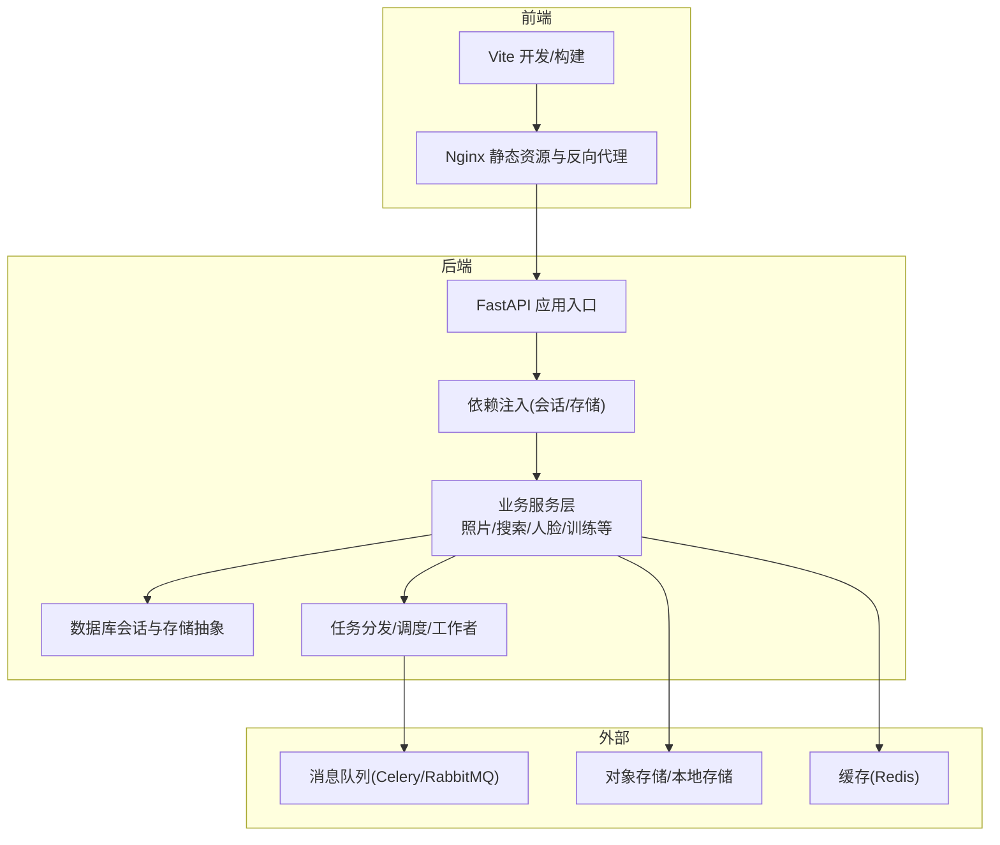
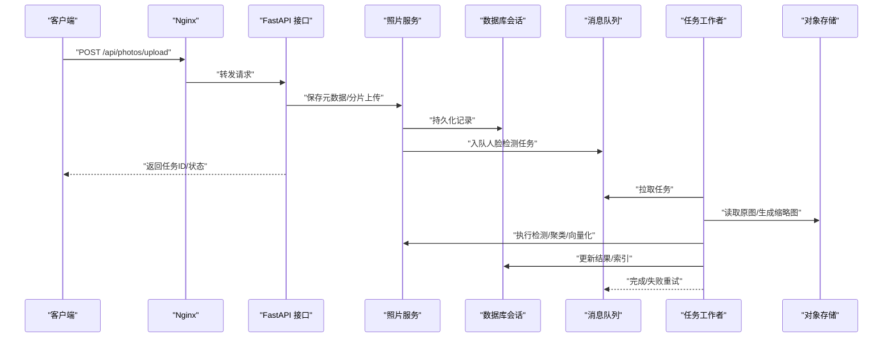
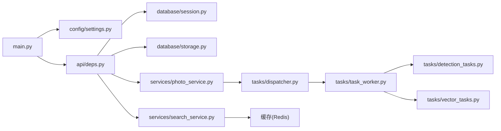

# 性能优化与调优

<cite>
**本文引用的文件**   
- [backend/main.py](file://backend/main.py)
- [backend/app/config/settings.py](file://backend/app/config/settings.py)
- [backend/app/database/session.py](file://backend/app/database/session.py)
- [backend/app/database/storage.py](file://backend/app/database/storage.py)
- [backend/app/api/deps.py](file://backend/app/api/deps.py)
- [backend/app/api/tasks.py](file://backend/app/api/tasks.py)
- [backend/app/services/photo_service.py](file://backend/app/services/photo_service.py)
- [backend/app/services/search_service.py](file://backend/app/services/search_service.py)
- [backend/app/services/face_cluster_service.py](file://backend/app/services/face_cluster_service.py)
- [backend/app/services/training_service.py](file://backend/app/services/training_service.py)
- [backend/app/tasks/dispatcher.py](file://backend/app/tasks/dispatcher.py)
- [backend/app/tasks/task_worker.py](file://backend/app/tasks/task_worker.py)
- [backend/app/tasks/scheduler.py](file://backend/app/tasks/scheduler.py)
- [backend/app/tasks/detection_tasks.py](file://backend/app/tasks/detection_tasks.py)
- [backend/app/tasks/vector_tasks.py](file://backend/app/tasks/vector_tasks.py)
- [frontend/vite.config.ts](file://frontend/vite.config.ts)
- [frontend/nginx.conf](file://frontend/nginx.conf)
- [docker-compose.yml](file://docker-compose.yml)
</cite>

## 目录
1. [简介](#简介)
2. [项目结构](#项目结构)
3. [核心组件](#核心组件)
4. [架构总览](#架构总览)
5. [详细组件分析](#详细组件分析)
6. [依赖关系分析](#依赖关系分析)
7. [性能考量](#性能考量)
8. [故障排查指南](#故障排查指南)
9. [结论](#结论)
10. [附录](#附录)

## 简介
本指南面向AI相册项目的后端、前端与基础设施，提供系统化的性能优化与调优方案。内容覆盖数据库慢查询分析与索引优化、API响应时间与批量处理、缓存策略设计、异步任务（Celery）工作进程配置与队列管理、前端静态资源压缩与懒加载、内存管理与流式传输、并发连接池与负载均衡、性能测试与基准方法，以及容量规划与扩展性原则。目标是帮助团队在真实业务场景下稳定提升吞吐、降低延迟并控制成本。

## 项目结构
本项目采用前后端分离架构：
- 后端基于FastAPI，使用SQLAlchemy进行数据访问，结合自定义任务调度器与检测/向量任务模块；
- 前端基于Vue/Vite构建，通过Nginx对外提供服务；
- 容器编排通过docker-compose统一管理服务。

图表来源
- [backend/main.py](file://backend/main.py)
- [backend/app/api/deps.py](file://backend/app/api/deps.py)
- [backend/app/database/session.py](file://backend/app/database/session.py)
- [backend/app/database/storage.py](file://backend/app/database/storage.py)
- [backend/app/tasks/dispatcher.py](file://backend/app/tasks/dispatcher.py)
- [frontend/nginx.conf](file://frontend/nginx.conf)
- [frontend/vite.config.ts](file://frontend/vite.config.ts)

章节来源
- [backend/main.py](file://backend/main.py)
- [backend/app/api/deps.py](file://backend/app/api/deps.py)
- [backend/app/database/session.py](file://backend/app/database/session.py)
- [backend/app/database/storage.py](file://backend/app/database/storage.py)
- [backend/app/tasks/dispatcher.py](file://backend/app/tasks/dispatcher.py)
- [frontend/nginx.conf](file://frontend/nginx.conf)
- [frontend/vite.config.ts](file://frontend/vite.config.ts)

## 核心组件
- 应用入口与中间件：负责路由注册、全局异常、CORS、请求日志与限流等；建议开启Gzip/Brotli压缩与请求体大小限制。
- 依赖注入：集中管理数据库会话、存储客户端、缓存客户端，确保生命周期可控与连接复用。
- 数据访问层：封装ORM会话、事务边界、分页与批量写入；避免N+1查询与过度抓取。
- 业务服务层：聚合领域逻辑，协调多源数据与外部调用；对耗时操作下沉至异步任务。
- 任务系统：统一的任务分发、调度与执行器，支持重试、超时与幂等；按CPU/IO类型拆分队列。
- 前端构建与CDN：启用资源压缩、Tree-shaking、代码分割与浏览器缓存；图片按需生成缩略图与WebP。

章节来源
- [backend/main.py](file://backend/main.py)
- [backend/app/api/deps.py](file://backend/app/api/deps.py)
- [backend/app/database/session.py](file://backend/app/database/session.py)
- [backend/app/database/storage.py](file://backend/app/database/storage.py)
- [backend/app/tasks/dispatcher.py](file://backend/app/tasks/dispatcher.py)

## 架构总览
下图展示一次典型“上传并触发人脸检测”的请求链路，包括同步接口与异步任务的协作。

图表来源
- [backend/app/api/tasks.py](file://backend/app/api/tasks.py)
- [backend/app/services/photo_service.py](file://backend/app/services/photo_service.py)
- [backend/app/tasks/dispatcher.py](file://backend/app/tasks/dispatcher.py)
- [backend/app/tasks/task_worker.py](file://backend/app/tasks/task_worker.py)
- [backend/app/tasks/detection_tasks.py](file://backend/app/tasks/detection_tasks.py)

## 详细组件分析

### 数据库性能优化
- 慢查询分析
  - 开启慢查询日志与执行计划导出，定位全表扫描与回表热点。
  - 针对高频过滤条件建立复合索引，遵循最左前缀原则；避免在索引列上使用函数或隐式类型转换。
  - 将大字段与热路径分离，减少主表体积与I/O。
- 查询计划调优
  - 定期ANALYZE/统计信息收集，避免计划退化。
  - 对复杂JOIN使用物化视图或预聚合表；必要时引入只读副本分担分析型负载。
- 连接池与事务
  - 合理设置连接池大小与空闲回收，避免连接风暴与泄漏。
  - 明确事务边界，短事务优先；批量写入使用分批提交。
- ORM最佳实践
  - 关闭自动加载关联，显式选择需要的字段；使用selectin/joined策略避免N+1。
  - 分页采用游标或键集分页替代OFFSET深翻页。

章节来源
- [backend/app/database/session.py](file://backend/app/database/session.py)
- [backend/app/database/storage.py](file://backend/app/database/storage.py)

### API接口性能优化
- 响应时间优化
  - 启用HTTP压缩、ETag/Last-Modified、缓存头；对静态与半静态数据使用强缓存。
  - 接口瘦身：仅返回必要字段，服务端裁剪大图，按需加载详情。
- 批量操作
  - 提供批量创建/更新接口，合并多次往返；对写放大高的场景采用事件溯源或批处理窗口。
- 缓存策略
  - 多级缓存：浏览器→CDN/Nginx→Redis→数据库；注意缓存失效与一致性策略。
  - 热点数据加锁防击穿，冷数据可容忍短暂不一致。
- 限流与降级
  - 接口级令牌桶/漏桶限流；对非关键路径做熔断与降级。

章节来源
- [backend/app/api/tasks.py](file://backend/app/api/tasks.py)
- [backend/app/services/photo_service.py](file://backend/app/services/photo_service.py)
- [backend/app/services/search_service.py](file://backend/app/services/search_service.py)

### 异步任务处理优化（Celery）
- 工作进程配置
  - 根据任务类型拆分队列（CPU密集型如人脸检测、IO密集型如向量检索），分别配置worker数量与并发度。
  - 为长耗时任务设置超时与重试策略，保证幂等与去重。
- 队列管理
  - 优先级队列区分实时与离线任务；死信队列捕获失败任务便于人工干预。
  - 监控队列长度、消费速率与堆积告警。
- 资源分配
  - CPU密集型任务绑定CPU亲和与限制内存上限；IO密集型提高并发。
  - 使用容器资源配额与HPA实现弹性伸缩。

章节来源
- [backend/app/tasks/dispatcher.py](file://backend/app/tasks/dispatcher.py)
- [backend/app/tasks/task_worker.py](file://backend/app/tasks/task_worker.py)
- [backend/app/tasks/detection_tasks.py](file://backend/app/tasks/detection_tasks.py)
- [backend/app/tasks/vector_tasks.py](file://backend/app/tasks/vector_tasks.py)

### 前端性能优化
- 静态资源压缩
  - 构建阶段启用Brotli/Gzip、Tree-shaking、代码分割与懒加载；图片转WebP/AVIF并生成多尺寸缩略图。
- 浏览器缓存
  - 利用版本化文件名与强缓存；对HTML采用协商缓存；CDN边缘缓存热点资源。
- 渲染优化
  - 虚拟列表/网格、IntersectionObserver懒加载、骨架屏与增量加载。
- 网络优化
  - HTTP/2或多路复用、预连接与DNS预热；关键CSS内联、非关键JS异步加载。

章节来源
- [frontend/vite.config.ts](file://frontend/vite.config.ts)
- [frontend/nginx.conf](file://frontend/nginx.conf)

### 内存管理与流式传输
- Python垃圾回收调优
  - 调整GC阈值与代际参数，避免频繁STW；对周期性大批量对象使用弱引用或对象池。
- 大文件处理
  - 分块上传/下载、断点续传；服务端流式读写，避免一次性载入内存。
- 流式传输
  - 对视频/音频/大报表使用Server-Sent Events或分块响应；前端边接收边渲染。

章节来源
- [backend/app/database/storage.py](file://backend/app/database/storage.py)
- [backend/app/services/photo_service.py](file://backend/app/services/photo_service.py)

### 并发处理优化
- 连接池配置
  - 数据库连接池大小=并发数×每协程最大并发；设置最小/最大连接与空闲回收。
- 线程池设置
  - IO阻塞调用放入线程池隔离，避免阻塞事件循环；合理设置队列长度与拒绝策略。
- 负载均衡
  - 多实例部署+反向代理轮询/加权；健康检查与优雅下线；跨可用区容灾。

章节来源
- [backend/app/api/deps.py](file://backend/app/api/deps.py)
- [docker-compose.yml](file://docker-compose.yml)

## 依赖关系分析

图表来源
- [backend/main.py](file://backend/main.py)
- [backend/app/config/settings.py](file://backend/app/config/settings.py)
- [backend/app/api/deps.py](file://backend/app/api/deps.py)
- [backend/app/database/session.py](file://backend/app/database/session.py)
- [backend/app/database/storage.py](file://backend/app/database/storage.py)
- [backend/app/services/photo_service.py](file://backend/app/services/photo_service.py)
- [backend/app/services/search_service.py](file://backend/app/services/search_service.py)
- [backend/app/tasks/dispatcher.py](file://backend/app/tasks/dispatcher.py)
- [backend/app/tasks/task_worker.py](file://backend/app/tasks/task_worker.py)
- [backend/app/tasks/detection_tasks.py](file://backend/app/tasks/detection_tasks.py)
- [backend/app/tasks/vector_tasks.py](file://backend/app/tasks/vector_tasks.py)

章节来源
- [backend/main.py](file://backend/main.py)
- [backend/app/config/settings.py](file://backend/app/config/settings.py)
- [backend/app/api/deps.py](file://backend/app/api/deps.py)
- [backend/app/database/session.py](file://backend/app/database/session.py)
- [backend/app/database/storage.py](file://backend/app/database/storage.py)
- [backend/app/services/photo_service.py](file://backend/app/services/photo_service.py)
- [backend/app/services/search_service.py](file://backend/app/services/search_service.py)
- [backend/app/tasks/dispatcher.py](file://backend/app/tasks/dispatcher.py)
- [backend/app/tasks/task_worker.py](file://backend/app/tasks/task_worker.py)
- [backend/app/tasks/detection_tasks.py](file://backend/app/tasks/detection_tasks.py)
- [backend/app/tasks/vector_tasks.py](file://backend/app/tasks/vector_tasks.py)

## 性能考量
- 容量规划
  - 以峰值QPS、平均/尾延迟、存储增长率为基线，计算CPU/内存/磁盘/带宽需求；预留30%~50%冗余。
- 扩展性设计
  - 无状态服务水平扩展；有状态组件（DB/缓存/队列）垂直扩容+读写分离+分区。
  - 事件驱动解耦，任务可横向扩展；冷热数据分层存储。
- 观测与治理
  - 指标（请求量、延迟分布、错误率）、日志（结构化、采样）、追踪（端到端）三位一体；SLO/SLI驱动迭代。
- 成本优化
  - 按需扩缩容、Spot实例承载离线任务；对象存储生命周期策略归档冷数据。

[本节为通用指导，不直接分析具体文件]

## 故障排查指南
- 常见症状与定位
  - 高延迟：查看慢查询、CPU/IO瓶颈、GC停顿、队列堆积与外部依赖超时。
  - 内存泄漏：关注大对象未释放、循环引用、连接未关闭；使用内存快照对比。
  - 前端白屏/卡顿：检查资源加载、缓存命中、首屏体积与渲染路径。
- 工具与方法
  - 后端：APM、火焰图、perf、strace、数据库EXPLAIN ANALYZE。
  - 前端：Lighthouse、WebPageTest、浏览器Performance面板。
  - 压测：wrk、locust、k6；构造代表性负载与混合场景。
- 恢复与韧性
  - 快速回滚、灰度发布、熔断降级、重试退避与幂等保障。

章节来源
- [backend/app/tasks/dispatcher.py](file://backend/app/tasks/dispatcher.py)
- [backend/app/tasks/task_worker.py](file://backend/app/tasks/task_worker.py)
- [backend/app/services/training_service.py](file://backend/app/services/training_service.py)

## 结论
通过数据库索引与查询计划优化、API缓存与批量处理、异步任务队列与资源隔离、前端资源压缩与懒加载、内存与流式传输优化、并发连接池与负载均衡，以及完善的压测与容量规划，可在保证一致性与可用性的前提下显著提升系统吞吐与稳定性。建议以SLO为导向持续度量与迭代，逐步消除瓶颈。

[本节为总结性内容，不直接分析具体文件]

## 附录
- 关键配置文件参考
  - 应用入口与中间件：[backend/main.py](file://backend/main.py)
  - 配置中心：[backend/app/config/settings.py](file://backend/app/config/settings.py)
  - 依赖注入与会话/存储：[backend/app/api/deps.py](file://backend/app/api/deps.py)、[backend/app/database/session.py](file://backend/app/database/session.py)、[backend/app/database/storage.py](file://backend/app/database/storage.py)
  - 任务系统与工作者：[backend/app/tasks/dispatcher.py](file://backend/app/tasks/dispatcher.py)、[backend/app/tasks/task_worker.py](file://backend/app/tasks/task_worker.py)、[backend/app/tasks/detection_tasks.py](file://backend/app/tasks/detection_tasks.py)、[backend/app/tasks/vector_tasks.py](file://backend/app/tasks/vector_tasks.py)
  - 业务服务：[backend/app/services/photo_service.py](file://backend/app/services/photo_service.py)、[backend/app/services/search_service.py](file://backend/app/services/search_service.py)、[backend/app/services/face_cluster_service.py](file://backend/app/services/face_cluster_service.py)、[backend/app/services/training_service.py](file://backend/app/services/training_service.py)
  - 前端构建与Nginx：[frontend/vite.config.ts](file://frontend/vite.config.ts)、[frontend/nginx.conf](file://frontend/nginx.conf)
  - 编排与扩缩容：[docker-compose.yml](file://docker-compose.yml)