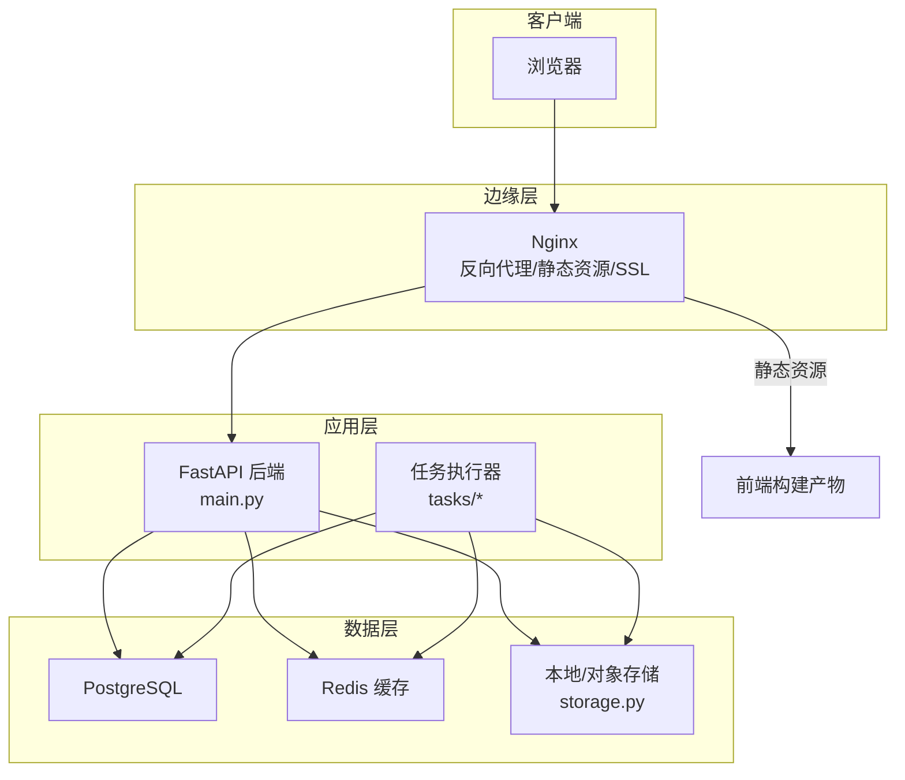
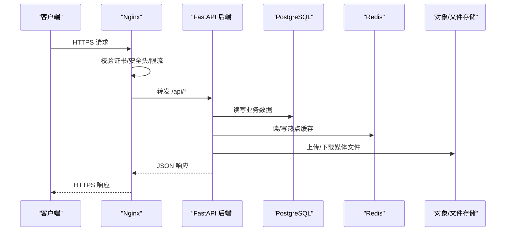
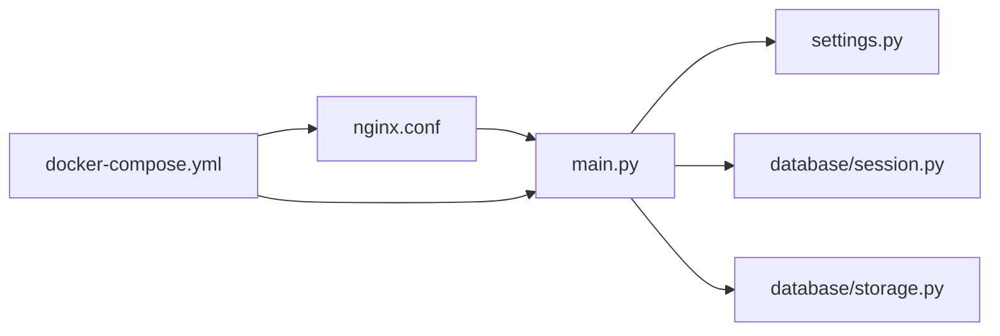

# 生产环境配置

<cite>
**本文引用的文件**   
- [backend/app/config/settings.py](file://backend/app/config/settings.py)
- [backend/app/database/session.py](file://backend/app/database/session.py)
- [backend/app/database/storage.py](file://backend/app/database/storage.py)
- [backend/main.py](file://backend/main.py)
- [frontend/nginx.conf](file://frontend/nginx.conf)
- [docker-compose.yml](file://docker-compose.yml)
- [backend/Dockerfile](file://backend/Dockerfile)
- [frontend/Dockerfile](file://frontend/Dockerfile)
- [backend/pyproject.toml](file://backend/pyproject.toml)
- [README.md](file://README.md)
</cite>

## 目录
1. [简介](#简介)
2. [项目结构](#项目结构)
3. [核心组件](#核心组件)
4. [架构总览](#架构总览)
5. [详细组件分析](#详细组件分析)
6. [依赖关系分析](#依赖关系分析)
7. [性能考虑](#性能考虑)
8. [故障排查指南](#故障排查指南)
9. [结论](#结论)
10. [附录](#附录)

## 简介
本指南面向在生产环境中部署该AI相册系统的工程师与运维人员，覆盖服务器硬件要求、操作系统兼容性、数据库（PostgreSQL）连接池与索引优化、Redis缓存策略、负载均衡与反向代理（Nginx）、SSL/HTTPS、安全加固、环境变量与密钥管理、文件存储与对象存储集成、CDN加速等关键主题。文档中的配置建议均结合仓库中现有实现与容器化编排进行说明，并提供可追溯的源码位置以便进一步查阅。

## 项目结构
后端采用FastAPI应用，通过Docker镜像运行；前端为Vue工程，使用Nginx作为静态资源服务与反向代理入口；整体通过docker-compose编排多容器服务。

图示来源
- [backend/main.py:1-200](file://backend/main.py#L1-L200)
- [frontend/nginx.conf:1-200](file://frontend/nginx.conf#L1-L200)
- [backend/app/database/session.py:1-200](file://backend/app/database/session.py#L1-L200)
- [backend/app/database/storage.py:1-200](file://backend/app/database/storage.py#L1-L200)
- [docker-compose.yml:1-200](file://docker-compose.yml#L1-L200)

章节来源
- [README.md:1-200](file://README.md#L1-L200)
- [docker-compose.yml:1-200](file://docker-compose.yml#L1-L200)
- [backend/Dockerfile:1-200](file://backend/Dockerfile#L1-L200)
- [frontend/Dockerfile:1-200](file://frontend/Dockerfile#L1-L200)

## 核心组件
- 应用入口与中间件：后端主程序加载配置、注册路由、挂载中间件与生命周期钩子。
- 数据库会话与连接池：基于SQLAlchemy引擎与会话工厂，提供连接池参数与事务上下文。
- 存储抽象：统一文件/对象存储接口，支持本地磁盘与云对象存储。
- 反向代理与静态资源：Nginx负责HTTPS终止、静态资源服务、请求转发与基础安全头。
- 容器编排：docker-compose定义服务、网络、卷与依赖关系。

章节来源
- [backend/main.py:1-200](file://backend/main.py#L1-L200)
- [backend/app/config/settings.py:1-200](file://backend/app/config/settings.py#L1-L200)
- [backend/app/database/session.py:1-200](file://backend/app/database/session.py#L1-L200)
- [backend/app/database/storage.py:1-200](file://backend/app/database/storage.py#L1-L200)
- [frontend/nginx.conf:1-200](file://frontend/nginx.conf#L1-L200)
- [docker-compose.yml:1-200](file://docker-compose.yml#L1-L200)

## 架构总览
下图展示生产环境的典型部署拓扑与关键交互路径，包括HTTPS入口、反向代理、后端服务、数据库、缓存与存储。

图示来源
- [frontend/nginx.conf:1-200](file://frontend/nginx.conf#L1-L200)
- [backend/main.py:1-200](file://backend/main.py#L1-L200)
- [backend/app/database/session.py:1-200](file://backend/app/database/session.py#L1-L200)
- [backend/app/database/storage.py:1-200](file://backend/app/database/storage.py#L1-L200)

## 详细组件分析

### 服务器硬件与操作系统兼容性
- CPU/内存
  - 后端服务：建议至少2核CPU、4GB内存；若启用大量并发或后台任务，建议4核以上、8GB内存。
  - 数据库：根据照片规模与查询负载，建议4核以上、16GB内存起步，并预留足够I/O吞吐。
  - 缓存：Redis建议2核、4GB内存，按热点键大小与命中率调整。
- 磁盘与I/O
  - 系统盘：SSD优先，用于OS与应用日志。
  - 数据盘：高IOPS SSD用于数据库与对象存储本地缓存；冷数据可使用低成本大容量盘。
- 网络
  - 公网带宽：根据图片上传/下载峰值评估，建议开启CDN分流大文件。
- 操作系统
  - Linux发行版：推荐主流发行版（如Ubuntu LTS、CentOS Stream/Rocky），内核版本需满足容器运行时要求。
  - Windows：非官方支持场景，不建议用于生产。

[本节为通用指导，不直接分析具体文件]

### 数据库配置优化（PostgreSQL）
- 连接池与并发
  - 在应用侧通过SQLAlchemy引擎设置最小/最大连接数，避免连接风暴与资源耗尽。
  - 参考路径：[backend/app/database/session.py](file://backend/app/database/session.py)
- 连接字符串与认证
  - 使用环境变量注入主机、端口、数据库名、用户名与密码，避免硬编码。
  - 参考路径：[backend/app/config/settings.py](file://backend/app/config/settings.py)
- 索引优化
  - 针对高频查询字段建立B-tree索引；对全文检索或向量检索按需创建专用索引。
  - 定期分析统计信息，确保查询计划最优。
- 查询性能调优
  - 避免N+1查询，合理使用JOIN与预加载。
  - 分页与限制返回列，减少网络与序列化开销。
  - 监控慢查询，结合EXPLAIN ANALYZE定位瓶颈。
- 备份与恢复
  - 定时逻辑备份与增量归档，保留多份副本并演练恢复流程。

章节来源
- [backend/app/database/session.py:1-200](file://backend/app/database/session.py#L1-L200)
- [backend/app/config/settings.py:1-200](file://backend/app/config/settings.py#L1-L200)

### Redis缓存配置策略
- 内存管理
  - 设置maxmemory与淘汰策略（如allkeys-lru），防止OOM。
  - 合理划分命名空间与过期时间，避免热键集中。
- 持久化
  - AOF与RDB组合策略，平衡数据安全与恢复速度。
- 集群与高可用
  - 使用哨兵或集群模式，跨节点容灾；注意分片键设计与扩容流程。
- 与后端集成
  - 在热点查询、验证码、会话与临时结果处引入缓存层，降低数据库压力。

章节来源
- [docker-compose.yml:1-200](file://docker-compose.yml#L1-L200)

### 负载均衡与反向代理（Nginx）
- 反向代理
  - 将/api前缀转发至后端服务，静态资源由Nginx直接返回。
  - 参考路径：[frontend/nginx.conf](file://frontend/nginx.conf)
- SSL证书与HTTPS强制
  - 配置证书与私钥路径，启用TLS协议与套件，强制HTTP重定向到HTTPS。
  - 参考路径：[frontend/nginx.conf](file://frontend/nginx.conf)
- 安全头与限流
  - 添加X-Frame-Options、X-Content-Type-Options、Strict-Transport-Security等头部。
  - 对登录与上传接口实施速率限制与IP白名单。
- 健康检查与优雅重启
  - 配置upstream健康检查与滚动更新策略，保障零停机发布。

章节来源
- [frontend/nginx.conf:1-200](file://frontend/nginx.conf#L1-L200)

### 安全加固措施
- 防火墙规则
  - 仅开放必要端口（如443/80），数据库与缓存端口仅限内网访问。
- 访问控制列表
  - 对管理端点与敏感接口实施IP白名单与鉴权。
- 安全头配置
  - 在Nginx层统一注入CSP、HSTS、Referrer-Policy等安全响应头。
- 最小权限原则
  - 容器与服务账户以非root运行，文件系统只读挂载，必要时再写入。

章节来源
- [frontend/nginx.conf:1-200](file://frontend/nginx.conf#L1-L200)

### 环境变量管理与密钥存储
- 环境变量
  - 数据库、Redis、存储、JWT密钥等通过环境变量注入，避免明文写入代码。
  - 参考路径：[backend/app/config/settings.py](file://backend/app/config/settings.py)、[docker-compose.yml](file://docker-compose.yml)
- 密钥管理
  - 使用外部密钥管理服务（如KMS/Secrets Manager）或受控的密钥文件挂载。
  - 定期轮换密钥，记录审计日志。
- 敏感信息保护
  - 禁止将密钥提交至版本库；CI/CD中使用加密变量或外部Vault。

章节来源
- [backend/app/config/settings.py:1-200](file://backend/app/config/settings.py#L1-L200)
- [docker-compose.yml:1-200](file://docker-compose.yml#L1-L200)

### 文件存储与对象存储集成
- 本地存储
  - 使用持久化卷挂载后端存储目录，确保数据不随容器销毁丢失。
  - 参考路径：[backend/app/database/storage.py](file://backend/app/database/storage.py)
- 对象存储
  - 对接S3兼容服务（如MinIO、阿里云OSS、腾讯云COS），配置桶名、区域与凭据。
  - 生成签名URL用于直传直下，减轻后端带宽压力。
- CDN加速
  - 将对象存储域名接入CDN，开启压缩与缓存策略，提升全球访问体验。

章节来源
- [backend/app/database/storage.py:1-200](file://backend/app/database/storage.py#L1-L200)
- [docker-compose.yml:1-200](file://docker-compose.yml#L1-L200)

### 容器化与编排
- Docker镜像
  - 后端镜像包含Python运行时与依赖；前端镜像包含构建产物与Nginx。
  - 参考路径：[backend/Dockerfile](file://backend/Dockerfile)、[frontend/Dockerfile](file://frontend/Dockerfile)
- docker-compose
  - 定义服务、网络、卷、环境变量与依赖顺序，便于本地与生产一致化部署。
  - 参考路径：[docker-compose.yml](file://docker-compose.yml)
- 依赖声明
  - Python依赖通过pyproject.toml管理，确保可重现构建。
  - 参考路径：[backend/pyproject.toml](file://backend/pyproject.toml)

章节来源
- [backend/Dockerfile:1-200](file://backend/Dockerfile#L1-L200)
- [frontend/Dockerfile:1-200](file://frontend/Dockerfile#L1-L200)
- [docker-compose.yml:1-200](file://docker-compose.yml#L1-L200)
- [backend/pyproject.toml:1-200](file://backend/pyproject.toml#L1-L200)

## 依赖关系分析
- 模块耦合
  - 后端主程序依赖配置、数据库会话与存储抽象；Nginx仅依赖静态资源与后端上游。
- 外部依赖
  - PostgreSQL、Redis、对象存储服务均为外部依赖，通过环境变量与网络隔离暴露。
- 潜在循环依赖
  - 当前分层清晰，未见明显循环导入；建议在新增模块时保持单向依赖。

图示来源
- [backend/main.py:1-200](file://backend/main.py#L1-L200)
- [backend/app/config/settings.py:1-200](file://backend/app/config/settings.py#L1-L200)
- [backend/app/database/session.py:1-200](file://backend/app/database/session.py#L1-L200)
- [backend/app/database/storage.py:1-200](file://backend/app/database/storage.py#L1-L200)
- [frontend/nginx.conf:1-200](file://frontend/nginx.conf#L1-L200)
- [docker-compose.yml:1-200](file://docker-compose.yml#L1-L200)

章节来源
- [backend/main.py:1-200](file://backend/main.py#L1-L200)
- [docker-compose.yml:1-200](file://docker-compose.yml#L1-L200)

## 性能考虑
- 数据库
  - 合理设置连接池大小与超时；对热点表建立合适索引；使用物化视图与分区表应对大数据量。
- 缓存
  - 热点数据优先落Redis；注意缓存穿透、击穿与雪崩防护（空值缓存、互斥锁、随机过期）。
- 存储
  - 大文件走对象存储与CDN；缩略图与预览图异步生成并缓存。
- 反向代理
  - 启用Gzip/Brotli压缩；合理设置keepalive与缓冲；对静态资源设置长期缓存。
- 应用
  - 异步处理耗时任务（检测、聚类、训练）；使用队列与重试机制；水平扩展无状态服务实例。

[本节为通用指导，不直接分析具体文件]

## 故障排查指南
- 常见问题
  - 数据库连接失败：检查连接串、网络可达性与账号权限。
  - Redis连接异常：确认端口、密码与maxmemory策略。
  - 文件上传失败：核对存储路径权限与对象存储凭据。
  - HTTPS报错：检查证书链与域名匹配。
- 日志与监控
  - 收集Nginx访问与错误日志；后端结构化日志；数据库慢查询日志；Redis监控指标。
- 回滚与恢复
  - 基于快照与备份快速回滚；灰度发布与蓝绿切换降低风险。

章节来源
- [frontend/nginx.conf:1-200](file://frontend/nginx.conf#L1-L200)
- [backend/app/config/settings.py:1-200](file://backend/app/config/settings.py#L1-L200)
- [backend/app/database/session.py:1-200](file://backend/app/database/session.py#L1-L200)
- [backend/app/database/storage.py:1-200](file://backend/app/database/storage.py#L1-L200)

## 结论
通过合理的硬件选型、数据库与缓存优化、反向代理与安全加固、环境变量与密钥管理、以及对象存储与CDN集成，可在生产环境获得稳定、安全且高性能的AI相册服务。建议结合监控与告警体系持续优化，并在变更前后进行压测与回归验证。

[本节为总结性内容，不直接分析具体文件]

## 附录
- 常用命令与脚本
  - 启动/停止服务、查看日志、备份与恢复脚本。
- 合规与审计
  - 访问审计、数据脱敏与隐私保护策略。

[本节为补充信息，不直接分析具体文件]