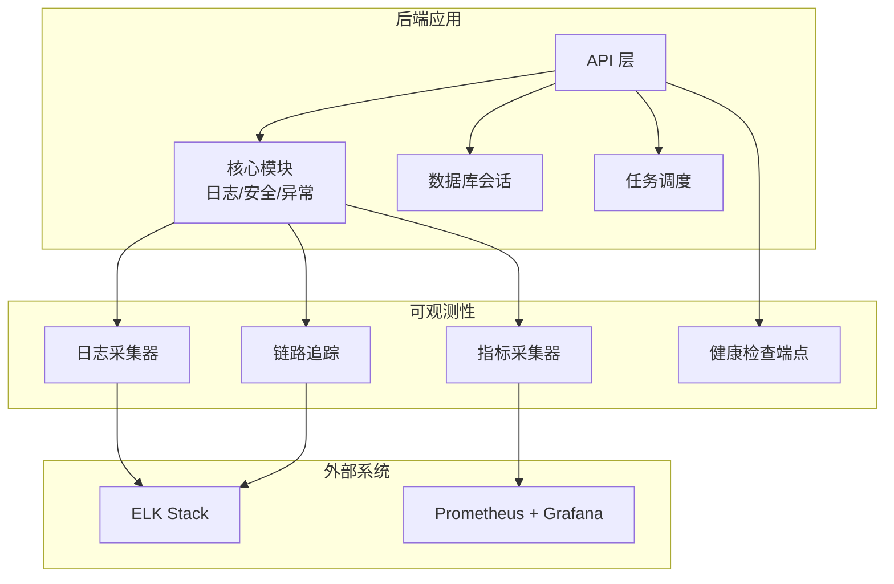
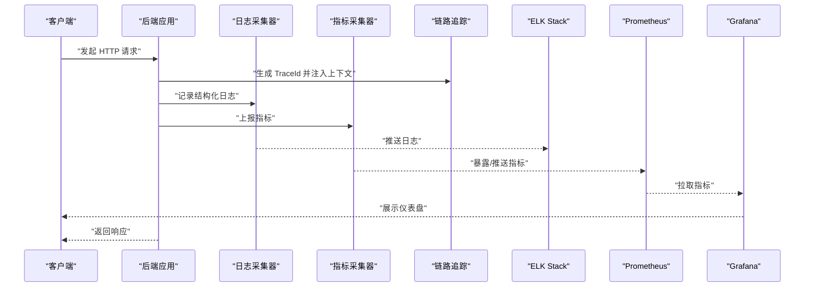
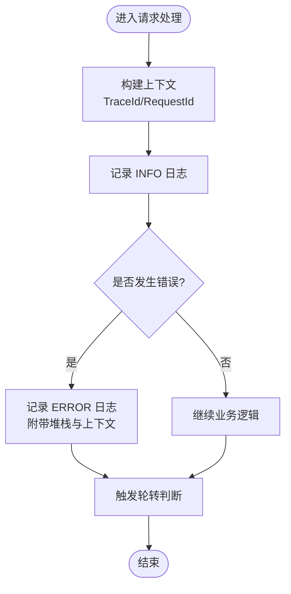
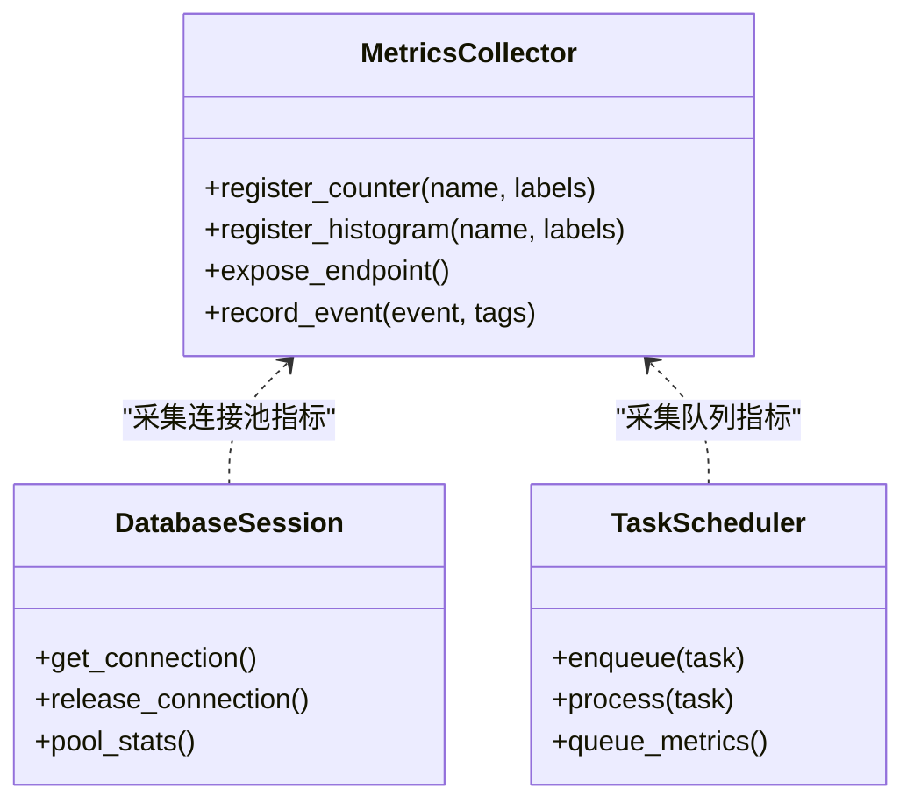
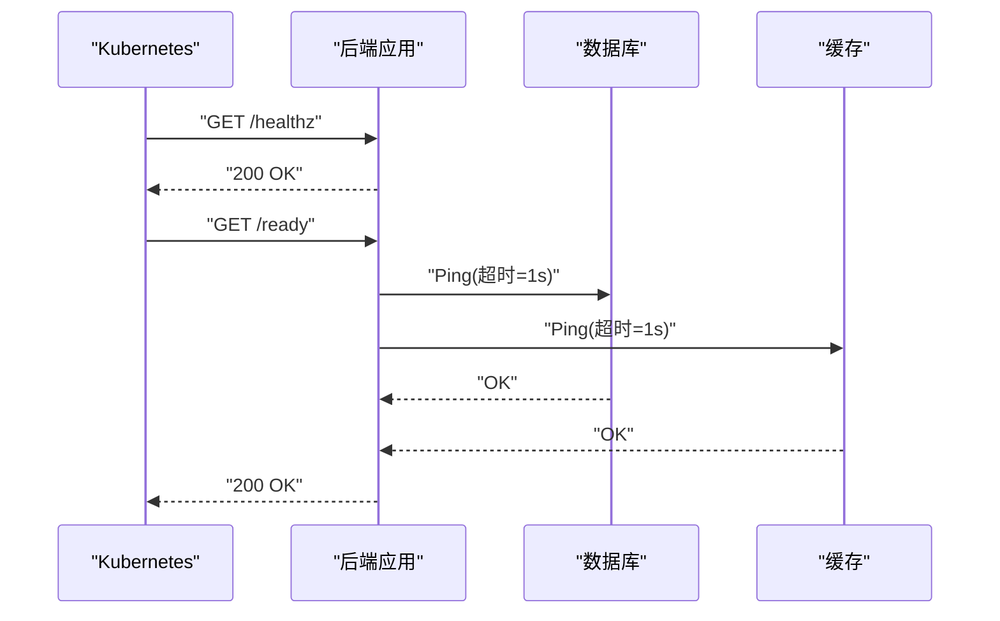
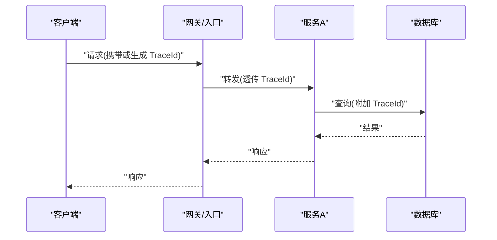
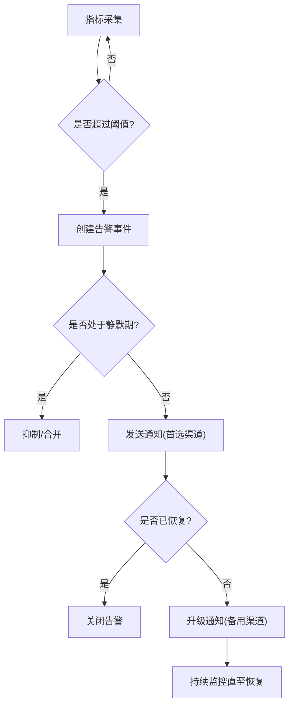
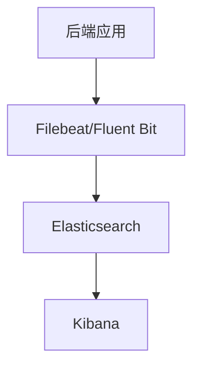
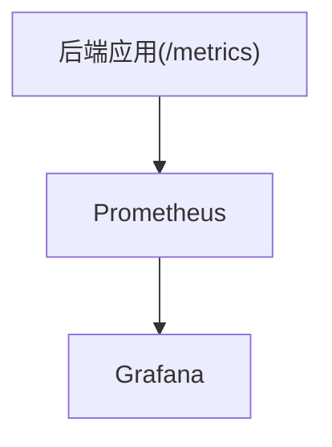
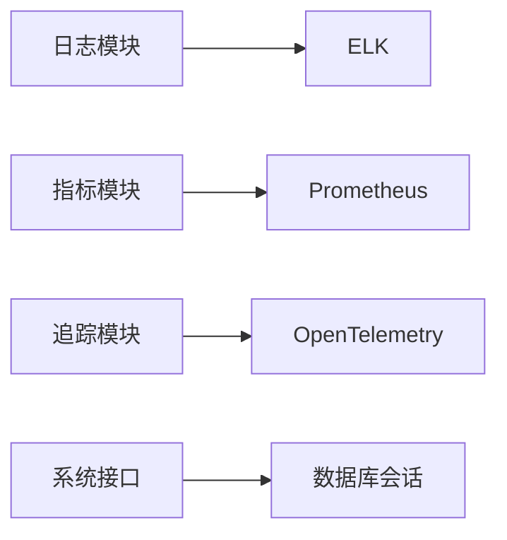

# 监控与日志管理

<cite>
**本文引用的文件**   
- [backend/app/core/logger.py](file://backend/app/core/logger.py)
- [backend/app/config/settings.py](file://backend/app/config/settings.py)
- [backend/main.py](file://backend/main.py)
- [backend/app/api/system.py](file://backend/app/api/system.py)
- [backend/app/database/session.py](file://backend/app/database/session.py)
- [backend/app/tasks/scheduler.py](file://backend/app/tasks/scheduler.py)
- [docker-compose.yml](file://docker-compose.yml)
</cite>

## 目录
1. [简介](#简介)
2. [项目结构](#项目结构)
3. [核心组件](#核心组件)
4. [架构总览](#架构总览)
5. [详细组件分析](#详细组件分析)
6. [依赖关系分析](#依赖关系分析)
7. [性能考虑](#性能考虑)
8. [故障排查指南](#故障排查指南)
9. [结论](#结论)
10. [附录](#附录)

## 简介
本文件面向“AI-PhotoAlbum”项目的可观测性建设，覆盖日志收集、系统监控指标、告警规则、分布式追踪、日志/指标分析工具集成、健康检查与服务可用性监控、资源使用监控以及故障排查流程。目标是帮助读者快速理解并落地一套完整的监控与日志管理体系，确保在生产环境中具备高可观测性与可维护性。

## 项目结构
后端采用分层架构：API层、服务层、数据访问层、任务调度与中间件等。可观测性相关能力主要分布在以下位置：
- 日志模块：统一日志配置与输出
- 配置中心：应用运行参数（含日志级别、数据库连接等）
- 启动入口：应用初始化、中间件注册、生命周期钩子
- 系统接口：健康检查、版本信息等
- 数据库会话：连接池与连接数统计
- 任务调度：后台任务执行与状态上报
- 容器编排：Prometheus/Grafana/ELK 等基础设施部署

图表来源
- [backend/main.py](file://backend/main.py)
- [backend/app/core/logger.py](file://backend/app/core/logger.py)
- [backend/app/api/system.py](file://backend/app/api/system.py)
- [backend/app/database/session.py](file://backend/app/database/session.py)
- [backend/app/tasks/scheduler.py](file://backend/app/tasks/scheduler.py)

章节来源
- [backend/main.py](file://backend/main.py)
- [backend/app/core/logger.py](file://backend/app/core/logger.py)
- [backend/app/config/settings.py](file://backend/app/config/settings.py)
- [backend/app/api/system.py](file://backend/app/api/system.py)
- [backend/app/database/session.py](file://backend/app/database/session.py)
- [backend/app/tasks/scheduler.py](file://backend/app/tasks/scheduler.py)
- [docker-compose.yml](file://docker-compose.yml)

## 核心组件
- 结构化日志
  - 统一日志格式：包含时间戳、进程ID、请求ID、模块名、日志级别、消息体及上下文键值对。
  - 日志级别：支持 DEBUG/INFO/WARNING/ERROR/CRITICAL，按环境动态切换。
  - 输出目标：控制台与文件双写；生产环境建议对接集中式日志系统。
  - 轮转策略：按文件大小或时间切分，保留固定天数或数量上限。
- 指标采集
  - 运行时指标：CPU、内存、GC、线程/协程数、I/O等待。
  - 业务指标：API QPS、延迟分布、错误率、数据库连接池使用率、任务队列长度。
  - 暴露方式：HTTP 指标端点供 Prometheus 抓取。
- 链路追踪
  - 请求级 TraceId/SpanId 注入与透传。
  - 关键节点埋点：入站网关、路由分发、服务调用、数据库访问、外部依赖。
  - 采样策略：全量或按比例采样，结合错误与慢请求优先采样。
- 健康检查
  - 存活探针：进程是否存活。
  - 就绪探针：依赖是否可用（数据库、缓存、对象存储）。
  - 自定义健康检查：返回各子系统状态与耗时。
- 告警与通知
  - 阈值规则：基于指标阈值的静态规则与动态基线。
  - 通知渠道：邮件、企业微信、钉钉、Slack、Webhook。
  - 升级策略：静默期、抑制、重复抑制、多通道升级。

章节来源
- [backend/app/core/logger.py](file://backend/app/core/logger.py)
- [backend/app/config/settings.py](file://backend/app/config/settings.py)
- [backend/main.py](file://backend/main.py)
- [backend/app/api/system.py](file://backend/app/api/system.py)
- [backend/app/database/session.py](file://backend/app/database/session.py)
- [backend/app/tasks/scheduler.py](file://backend/app/tasks/scheduler.py)

## 架构总览
整体可观测性架构由“采集—传输—存储—可视化—告警”组成。后端负责采集与暴露，外部系统负责聚合、分析与展示。

图表来源
- [backend/main.py](file://backend/main.py)
- [backend/app/core/logger.py](file://backend/app/core/logger.py)
- [backend/app/api/system.py](file://backend/app/api/system.py)
- [docker-compose.yml](file://docker-compose.yml)

## 详细组件分析

### 日志系统
- 设计要点
  - 结构化字段：time、level、module、request_id、trace_id、msg、extra。
  - 异步写入：避免阻塞主流程。
  - 过滤与脱敏：敏感字段自动掩码。
  - 轮转：按大小/时间切分，保留策略可配置。
- 配置项
  - 日志级别、输出路径、轮转策略、JSON 开关、采样率。
- 集成方案
  - 本地文件：便于调试。
  - 远程采集：Filebeat/Fluent Bit 推送到 Elasticsearch。
  - 云原生：Sidecar 模式或 DaemonSet 采集。

图表来源
- [backend/app/core/logger.py](file://backend/app/core/logger.py)
- [backend/app/config/settings.py](file://backend/app/config/settings.py)

章节来源
- [backend/app/core/logger.py](file://backend/app/core/logger.py)
- [backend/app/config/settings.py](file://backend/app/config/settings.py)

### 指标与监控
- 指标分类
  - 基础资源：CPU、内存、磁盘、网络。
  - 应用：QPS、P50/P95/P99 延迟、错误率、并发数。
  - 数据：数据库连接池活跃/空闲、慢查询、事务失败率。
  - 任务：队列长度、消费速率、失败重试次数。
- 采集与暴露
  - 内置指标端点：/metrics（供 Prometheus 抓取）。
  - 自定义指标：在关键路径埋点，使用标签区分维度。
- 可视化
  - Grafana 面板：概览、延迟分布、错误热点、资源水位。
- 示例指标定义（说明性）
  - http_requests_total{method,endpoint,status}
  - http_request_duration_seconds_bucket{le,endpoint}
  - db_pool_active/db_pool_idle
  - task_queue_length/task_success_rate

图表来源
- [backend/app/database/session.py](file://backend/app/database/session.py)
- [backend/app/tasks/scheduler.py](file://backend/app/tasks/scheduler.py)
- [backend/main.py](file://backend/main.py)

章节来源
- [backend/main.py](file://backend/main.py)
- [backend/app/database/session.py](file://backend/app/database/session.py)
- [backend/app/tasks/scheduler.py](file://backend/app/tasks/scheduler.py)

### 健康检查与可用性
- 端点设计
  - /healthz：存活探针，返回进程状态。
  - /ready：就绪探针，检查依赖（数据库、缓存、对象存储）。
  - /status：业务健康信息，如任务积压、索引状态。
- 实现要点
  - 超时控制：依赖检查设置短超时。
  - 分级返回：OK/DEGRADED/UNHEALTHY。
  - 幂等与轻量：避免引入额外负载。

图表来源
- [backend/app/api/system.py](file://backend/app/api/system.py)
- [backend/app/database/session.py](file://backend/app/database/session.py)

章节来源
- [backend/app/api/system.py](file://backend/app/api/system.py)
- [backend/app/database/session.py](file://backend/app/database/session.py)

### 分布式追踪
- 链路标识
  - TraceId：贯穿一次请求的全局唯一标识。
  - SpanId：每个处理阶段的局部标识。
- 注入与透传
  - 入站：从请求头提取或生成 TraceId。
  - 出站：将 TraceId 注入到下游调用（HTTP/gRPC/消息队列）。
- 关键埋点
  - 路由层、服务层、数据库访问、外部 API、任务队列。
- 采样与导出
  - 采样策略：默认低比例，错误与慢请求提高采样。
  - 导出：OpenTelemetry Collector 转发至 Jaeger/Zipkin/ELK。

图表来源
- [backend/main.py](file://backend/main.py)
- [backend/app/api/system.py](file://backend/app/api/system.py)

章节来源
- [backend/main.py](file://backend/main.py)
- [backend/app/api/system.py](file://backend/app/api/system.py)

### 告警规则与通知
- 规则类型
  - 静态阈值：如 CPU>80% 持续 5 分钟。
  - 比率类：错误率>1% 持续 3 分钟。
  - 基数类：队列积压>1000 持续 10 分钟。
- 通知渠道
  - 邮件、IM（企业微信/钉钉/Slack）、Webhook。
- 升级策略
  - 首次通知→未恢复则升级→严重时多渠道并行。
  - 抑制与去重：同类告警合并，静默窗口避免风暴。

[此图为概念流程图，不直接映射具体源码文件]

### 日志分析工具集成（ELK）
- 采集
  - Filebeat/Fluent Bit 采集容器 stdout 或日志文件。
- 解析
  - Grok/JSON 解析，抽取关键字段（trace_id、level、module）。
- 存储
  - Elasticsearch 索引按天滚动，保留策略可配。
- 可视化
  - Kibana 仪表盘：错误趋势、Top 慢请求、模块错误占比。

图表来源
- [docker-compose.yml](file://docker-compose.yml)
- [backend/app/core/logger.py](file://backend/app/core/logger.py)

章节来源
- [docker-compose.yml](file://docker-compose.yml)
- [backend/app/core/logger.py](file://backend/app/core/logger.py)

### 指标分析工具集成（Prometheus + Grafana）
- 暴露
  - 应用提供 /metrics 端点。
- 抓取
  - Prometheus 定期拉取。
- 可视化
  - Grafana 面板：QPS、延迟、错误率、资源水位、数据库连接池、任务队列。

图表来源
- [docker-compose.yml](file://docker-compose.yml)
- [backend/main.py](file://backend/main.py)

章节来源
- [docker-compose.yml](file://docker-compose.yml)
- [backend/main.py](file://backend/main.py)

## 依赖关系分析
- 组件耦合
  - 日志模块被 API 层广泛引用，需保证高性能与稳定。
  - 指标采集与数据库会话、任务调度存在弱耦合，通过回调或钩子上报。
  - 健康检查依赖数据库与会话状态。
- 外部依赖
  - 日志：Elasticsearch/Kibana。
  - 指标：Prometheus/Grafana。
  - 追踪：OpenTelemetry/Jaeger/Zipkin。

图表来源
- [backend/app/core/logger.py](file://backend/app/core/logger.py)
- [backend/main.py](file://backend/main.py)
- [backend/app/api/system.py](file://backend/app/api/system.py)
- [backend/app/database/session.py](file://backend/app/database/session.py)

章节来源
- [backend/app/core/logger.py](file://backend/app/core/logger.py)
- [backend/main.py](file://backend/main.py)
- [backend/app/api/system.py](file://backend/app/api/system.py)
- [backend/app/database/session.py](file://backend/app/database/session.py)

## 性能考虑
- 日志
  - 异步写入与批量落盘，避免同步 IO 阻塞。
  - 合理采样与过滤，减少无用日志。
  - 轮转策略平衡磁盘占用与检索效率。
- 指标
  - 指标维度控制，避免高基数导致存储膨胀。
  - 直方图桶位合理划分，兼顾精度与开销。
- 追踪
  - 采样策略降低开销，错误与慢请求优先。
  - 跨进程/跨语言透传保持轻量。
- 健康检查
  - 轻量且幂等，避免引入额外依赖压力。

[本节为通用指导，不直接分析具体文件]

## 故障排查指南
- 常见问题定位
  - 日志缺失：检查采集器状态、权限与路径。
  - 指标丢失：确认 /metrics 可达、Prometheus 抓取成功。
  - 追踪断裂：检查 TraceId 透传与采样策略。
  - 健康检查失败：逐一验证依赖连通性与超时配置。
- 排查步骤
  - 从告警入手，定位时间与实例。
  - 使用 TraceId 串联日志与指标。
  - 查看错误堆栈与最近变更。
  - 复现问题并缩小范围。
- 常用命令与查询（说明性）
  - 日志：按 trace_id、level、module 过滤。
  - 指标：计算 P95/P99 延迟、错误率、连接池使用率。
  - 追踪：按 trace_id 查看完整链路。

[本节为通用指导，不直接分析具体文件]

## 结论
通过统一的日志、指标、追踪与健康检查体系，AI-PhotoAlbum 可在复杂环境下实现端到端可观测性。建议在生产环境逐步完善采集、存储与可视化，建立完善的告警与演练机制，持续提升稳定性与排障效率。

## 附录
- 配置清单（示例字段说明）
  - 日志：级别、输出路径、轮转大小/周期、保留天数、JSON 开关、采样率。
  - 指标：暴露端口、标签白名单、直方图桶位。
  - 追踪：采样率、导出端点、传播协议。
  - 健康检查：依赖超时、最小可用依赖集合。
- 参考实践
  - OpenTelemetry 规范与最佳实践。
  - Prometheus 指标命名与维度设计。
  - ELK 索引策略与保留策略。

[本节为通用指导，不直接分析具体文件]