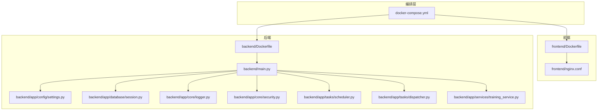
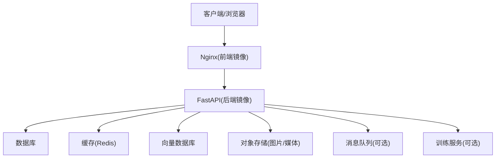
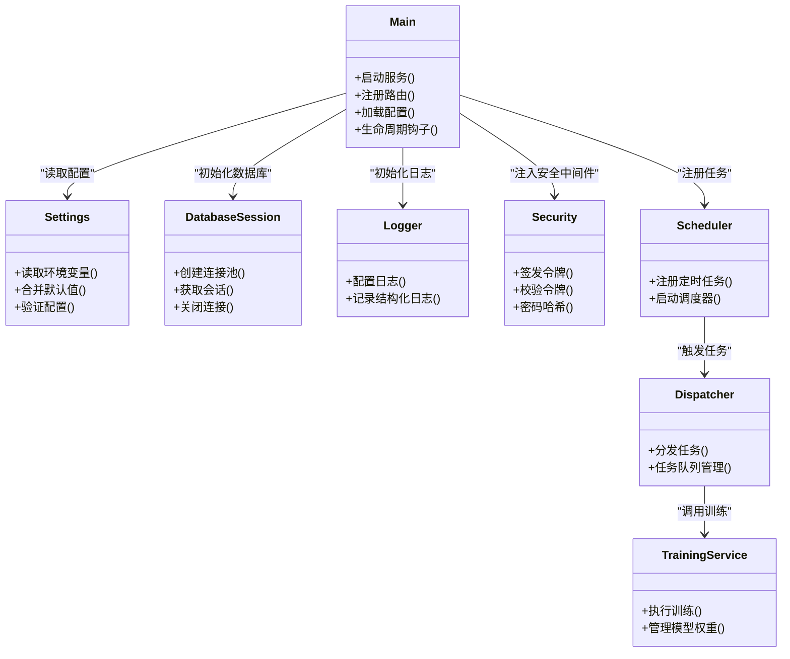

# 部署与运维

<cite>
**本文引用的文件**   
- [docker-compose.yml](file://docker-compose.yml)
- [backend/Dockerfile](file://backend/Dockerfile)
- [frontend/Dockerfile](file://frontend/Dockerfile)
- [frontend/nginx.conf](file://frontend/nginx.conf)
- [backend/main.py](file://backend/main.py)
- [backend/app/config/settings.py](file://backend/app/config/settings.py)
- [backend/app/database/session.py](file://backend/app/database/session.py)
- [backend/app/core/logger.py](file://backend/app/core/logger.py)
- [backend/app/core/security.py](file://backend/app/core/security.py)
- [backend/app/tasks/scheduler.py](file://backend/app/tasks/scheduler.py)
- [backend/app/tasks/dispatcher.py](file://backend/app/tasks/dispatcher.py)
- [backend/app/services/training_service.py](file://backend/app/services/training_service.py)
- [backend/pyproject.toml](file://backend/pyproject.toml)
</cite>

## 目录
1. [简介](#简介)
2. [项目结构](#项目结构)
3. [核心组件](#核心组件)
4. [架构总览](#架构总览)
5. [详细组件分析](#详细组件分析)
6. [依赖关系分析](#依赖关系分析)
7. [性能考虑](#性能考虑)
8. [故障排查指南](#故障排查指南)
9. [结论](#结论)
10. [附录](#附录)

## 简介
本指南面向生产环境的部署与运维，覆盖容器化镜像构建、容器编排与服务发现、环境变量与密钥管理、安全加固、监控告警、日志收集与分析、备份恢复与灾难恢复、系统维护流程以及常见问题排查与性能调优建议。文档内容基于仓库中的Docker配置、后端服务入口、数据库会话、任务调度与训练服务等关键实现进行梳理与总结。

## 项目结构
本项目采用前后端分离的架构：
- 前端：Vue 应用，使用 Nginx 提供静态资源与反向代理能力，并通过独立 Dockerfile 构建镜像。
- 后端：Python FastAPI 应用，包含 API、CRUD、模型、服务层、任务调度与训练等模块，通过独立 Dockerfile 构建镜像。
- 编排：docker-compose.yml 统一编排前后端及外部依赖（如数据库、缓存、向量库等），并提供服务间通信与数据持久化卷挂载。

图表来源
- [docker-compose.yml](file://docker-compose.yml)
- [backend/Dockerfile](file://backend/Dockerfile)
- [frontend/Dockerfile](file://frontend/Dockerfile)
- [frontend/nginx.conf](file://frontend/nginx.conf)
- [backend/main.py](file://backend/main.py)
- [backend/app/config/settings.py](file://backend/app/config/settings.py)
- [backend/app/database/session.py](file://backend/app/database/session.py)
- [backend/app/core/logger.py](file://backend/app/core/logger.py)
- [backend/app/core/security.py](file://backend/app/core/security.py)
- [backend/app/tasks/scheduler.py](file://backend/app/tasks/scheduler.py)
- [backend/app/tasks/dispatcher.py](file://backend/app/tasks/dispatcher.py)
- [backend/app/services/training_service.py](file://backend/app/services/training_service.py)

章节来源
- [docker-compose.yml](file://docker-compose.yml)
- [backend/Dockerfile](file://backend/Dockerfile)
- [frontend/Dockerfile](file://frontend/Dockerfile)
- [frontend/nginx.conf](file://frontend/nginx.conf)
- [backend/main.py](file://backend/main.py)
- [backend/app/config/settings.py](file://backend/app/config/settings.py)
- [backend/app/database/session.py](file://backend/app/database/session.py)
- [backend/app/core/logger.py](file://backend/app/core/logger.py)
- [backend/app/core/security.py](file://backend/app/core/security.py)
- [backend/app/tasks/scheduler.py](file://backend/app/tasks/scheduler.py)
- [backend/app/tasks/dispatcher.py](file://backend/app/tasks/dispatcher.py)
- [backend/app/services/training_service.py](file://backend/app/services/training_service.py)

## 核心组件
- 容器镜像构建
  - 后端镜像：基于 Python 运行时，安装依赖并启动 FastAPI 服务。参考路径：[backend/Dockerfile](file://backend/Dockerfile)、[backend/pyproject.toml](file://backend/pyproject.toml)。
  - 前端镜像：基于 Node 构建产物，由 Nginx 提供服务。参考路径：[frontend/Dockerfile](file://frontend/Dockerfile)、[frontend/nginx.conf](file://frontend/nginx.conf)。
- 服务编排
  - 使用 docker-compose 定义多服务拓扑、网络、卷、端口映射与环境变量注入。参考路径：[docker-compose.yml](file://docker-compose.yml)。
- 应用入口与配置
  - 后端主入口负责注册路由、中间件、生命周期钩子与全局配置加载。参考路径：[backend/main.py](file://backend/main.py)。
  - 配置中心集中读取环境变量与配置文件，供各模块消费。参考路径：[backend/app/config/settings.py](file://backend/app/config/settings.py)。
- 数据库与会话
  - 数据库连接与会话管理，支持连接池、事务与迁移初始化。参考路径：[backend/app/database/session.py](file://backend/app/database/session.py)。
- 日志与安全
  - 结构化日志输出与日志轮转策略。参考路径：[backend/app/core/logger.py](file://backend/app/core/logger.py)。
  - 安全相关（鉴权、密码哈希、令牌签发/校验）封装。参考路径：[backend/app/core/security.py](file://backend/app/core/security.py)。
- 任务与训练
  - 定时任务调度与异步任务分发，支撑人脸检测、向量化、训练等耗时操作。参考路径：[backend/app/tasks/scheduler.py](file://backend/app/tasks/scheduler.py)、[backend/app/tasks/dispatcher.py](file://backend/app/tasks/dispatcher.py)。
  - 训练服务封装训练流程、参数与模型管理。参考路径：[backend/app/services/training_service.py](file://backend/app/services/training_service.py)。

章节来源
- [backend/Dockerfile](file://backend/Dockerfile)
- [frontend/Dockerfile](file://frontend/Dockerfile)
- [frontend/nginx.conf](file://frontend/nginx.conf)
- [docker-compose.yml](file://docker-compose.yml)
- [backend/main.py](file://backend/main.py)
- [backend/app/config/settings.py](file://backend/app/config/settings.py)
- [backend/app/database/session.py](file://backend/app/database/session.py)
- [backend/app/core/logger.py](file://backend/app/core/logger.py)
- [backend/app/core/security.py](file://backend/app/core/security.py)
- [backend/app/tasks/scheduler.py](file://backend/app/tasks/scheduler.py)
- [backend/app/tasks/dispatcher.py](file://backend/app/tasks/dispatcher.py)
- [backend/app/services/training_service.py](file://backend/app/services/training_service.py)

## 架构总览
整体架构分为四层：
- 接入层：Nginx 提供静态资源与反向代理，可配置限流、压缩与缓存。
- 应用层：FastAPI 后端暴露 RESTful API，承载业务逻辑、AI 推理与任务调度。
- 数据层：关系型数据库、对象存储、向量数据库与缓存服务。
- 运维层：容器编排、日志采集、监控告警、备份恢复与自动化脚本。

图表来源
- [frontend/nginx.conf](file://frontend/nginx.conf)
- [backend/main.py](file://backend/main.py)
- [backend/app/database/session.py](file://backend/app/database/session.py)

## 详细组件分析

### 容器镜像构建与优化
- 后端镜像
  - 基础镜像选择：建议使用轻量级 Python 镜像或带 GPU 的基础镜像（若启用 GPU）。
  - 依赖安装：优先使用 uv/pip 缓存层，减少重建时间；将 pyproject.toml 与锁文件前置以利用缓存。
  - 运行用户：以非 root 用户运行，最小权限原则。
  - 健康检查：在镜像中集成健康检查命令，便于编排层探测。
  - 参考路径：[backend/Dockerfile](file://backend/Dockerfile)、[backend/pyproject.toml](file://backend/pyproject.toml)
- 前端镜像
  - 构建阶段：Node 环境编译静态资源，产物复制到 Nginx 镜像。
  - 缓存策略：合理分层，避免每次变更都重新安装依赖。
  - 参考路径：[frontend/Dockerfile](file://frontend/Dockerfile)

章节来源
- [backend/Dockerfile](file://backend/Dockerfile)
- [backend/pyproject.toml](file://backend/pyproject.toml)
- [frontend/Dockerfile](file://frontend/Dockerfile)

### 容器编排与服务发现
- 服务定义
  - 使用 docker-compose 定义后端、前端、数据库、缓存、向量库等服务。
  - 网络隔离：为不同环境创建独立网络，限制跨网访问。
  - 卷挂载：数据库、对象存储、日志与模型文件持久化到宿主机或云盘。
- 服务发现
  - 同 compose 网络内通过服务名解析进行内部通信。
  - 对外暴露端口由编排层统一管理，结合反向代理实现负载均衡与健康检查。
- 参考路径：[docker-compose.yml](file://docker-compose.yml)

章节来源
- [docker-compose.yml](file://docker-compose.yml)

### 环境变量与配置管理
- 配置来源
  - 环境变量优先于默认值，支持按环境（开发/测试/生产）切换。
  - 敏感信息（数据库密码、密钥、第三方 API Key）通过环境变量或外部密钥管理服务注入。
- 关键配置项
  - 数据库连接串、连接池大小、超时与重试策略。
  - 日志级别、输出目标（stdout/file）、轮转策略。
  - 安全相关：JWT 密钥、加密算法、CORS 白名单、速率限制阈值。
  - AI 服务：嵌入模型路径、GPU 开关、并发数、批大小。
- 参考路径：[backend/app/config/settings.py](file://backend/app/config/settings.py)

章节来源
- [backend/app/config/settings.py](file://backend/app/config/settings.py)

### 数据库与存储
- 连接与会话
  - 连接池配置：最大连接数、空闲回收、超时与重试。
  - 事务管理：长事务拆分、批量写入优化。
  - 迁移：在启动时执行迁移脚本，确保版本一致。
- 存储
  - 图片与媒体文件建议走对象存储，数据库仅保存元数据与索引。
  - 向量数据库用于语义检索与相似图搜索。
- 参考路径：[backend/app/database/session.py](file://backend/app/database/session.py)

章节来源
- [backend/app/database/session.py](file://backend/app/database/session.py)

### 日志与监控
- 日志
  - 结构化 JSON 格式输出，便于集中采集。
  - 分级日志与采样策略，降低 I/O 开销。
  - 参考路径：[backend/app/core/logger.py](file://backend/app/core/logger.py)
- 监控
  - 指标暴露：QPS、延迟、错误率、GC、线程/进程状态、数据库连接池使用率。
  - 健康检查：HTTP 探针与自定义就绪/存活探针。
  - 参考路径：[backend/main.py](file://backend/main.py)

章节来源
- [backend/app/core/logger.py](file://backend/app/core/logger.py)
- [backend/main.py](file://backend/main.py)

### 安全加固
- 鉴权与授权
  - JWT 签发与校验、刷新令牌、角色权限控制。
  - 密码哈希与盐值管理。
- 传输安全
  - HTTPS 终止于 Nginx，后端仅处理 HTTP。
  - CORS 白名单严格配置。
- 输入校验与防护
  - 请求体校验、SQL 注入防护、XSS/CSRF 防护。
- 参考路径：[backend/app/core/security.py](file://backend/app/core/security.py)

章节来源
- [backend/app/core/security.py](file://backend/app/core/security.py)

### 任务调度与训练
- 任务调度
  - 定时任务：周期性扫描、清理、统计、索引重建。
  - 异步任务：人脸检测、特征提取、向量化、训练等耗时操作。
- 训练服务
  - 训练参数、数据集路径、模型权重管理与回滚。
  - 训练进度与结果上报，失败重试与告警。
- 参考路径：[backend/app/tasks/scheduler.py](file://backend/app/tasks/scheduler.py)、[backend/app/tasks/dispatcher.py](file://backend/app/tasks/dispatcher.py)、[backend/app/services/training_service.py](file://backend/app/services/training_service.py)

章节来源
- [backend/app/tasks/scheduler.py](file://backend/app/tasks/scheduler.py)
- [backend/app/tasks/dispatcher.py](file://backend/app/tasks/dispatcher.py)
- [backend/app/services/training_service.py](file://backend/app/services/training_service.py)

### 反向代理与负载均衡
- Nginx 配置
  - 静态资源缓存、Gzip/Brotli 压缩、HTTP/2 开启。
  - 反向代理至后端服务，配置超时、重试与熔断。
  - 限流与访问控制列表。
- 负载均衡
  - 多副本后端服务配合 Nginx 轮询或加权策略。
  - 健康检查剔除异常实例。
- 参考路径：[frontend/nginx.conf](file://frontend/nginx.conf)

章节来源
- [frontend/nginx.conf](file://frontend/nginx.conf)

## 依赖关系分析
- 组件耦合
  - main.py 作为入口聚合配置、路由、中间件与生命周期钩子。
  - settings.py 集中配置，被各模块引用，形成松耦合的配置中心。
  - database/session.py 提供数据库访问抽象，上层服务通过依赖注入获取会话。
  - tasks 与 services 解耦，通过调度器与分发器协调。
- 外部依赖
  - 数据库、缓存、向量库、对象存储、消息队列（可选）、训练框架（可选）。

图表来源
- [backend/main.py](file://backend/main.py)
- [backend/app/config/settings.py](file://backend/app/config/settings.py)
- [backend/app/database/session.py](file://backend/app/database/session.py)
- [backend/app/core/logger.py](file://backend/app/core/logger.py)
- [backend/app/core/security.py](file://backend/app/core/security.py)
- [backend/app/tasks/scheduler.py](file://backend/app/tasks/scheduler.py)
- [backend/app/tasks/dispatcher.py](file://backend/app/tasks/dispatcher.py)
- [backend/app/services/training_service.py](file://backend/app/services/training_service.py)

章节来源
- [backend/main.py](file://backend/main.py)
- [backend/app/config/settings.py](file://backend/app/config/settings.py)
- [backend/app/database/session.py](file://backend/app/database/session.py)
- [backend/app/core/logger.py](file://backend/app/core/logger.py)
- [backend/app/core/security.py](file://backend/app/core/security.py)
- [backend/app/tasks/scheduler.py](file://backend/app/tasks/scheduler.py)
- [backend/app/tasks/dispatcher.py](file://backend/app/tasks/dispatcher.py)
- [backend/app/services/training_service.py](file://backend/app/services/training_service.py)

## 性能考虑
- 容器与运行时
  - CPU/内存限制与请求并发度匹配，避免过载。
  - 使用多阶段构建减小镜像体积，缩短拉取与启动时间。
- 数据库
  - 调整连接池大小与查询超时，避免连接耗尽。
  - 热点表加索引，分页查询优化，批量写入。
- 缓存
  - 热点数据入缓存，设置合理 TTL 与失效策略。
  - 缓存穿透/雪崩防护：布隆过滤器、随机过期、降级策略。
- 对象存储与 CDN
  - 大文件分片上传与断点续传，CDN 加速静态资源。
- 任务与训练
  - 任务队列削峰填谷，限制并发与重试退避。
  - 训练任务资源隔离，避免影响在线服务。

## 故障排查指南
- 启动失败
  - 检查环境变量与密钥是否注入正确。
  - 查看容器日志与标准输出，定位初始化错误。
  - 参考路径：[backend/main.py](file://backend/main.py)、[backend/app/core/logger.py](file://backend/app/core/logger.py)
- 数据库连接问题
  - 核对连接串、用户名/密码、网络可达性与防火墙规则。
  - 观察连接池使用率与慢查询日志。
  - 参考路径：[backend/app/database/session.py](file://backend/app/database/session.py)
- 鉴权失败
  - 检查 JWT 密钥、令牌有效期与签名算法。
  - 确认 CORS 与跨域请求头配置。
  - 参考路径：[backend/app/core/security.py](file://backend/app/core/security.py)
- 任务堆积
  - 检查任务队列消费者数量与资源配额。
  - 查看任务失败重试次数与死信队列。
  - 参考路径：[backend/app/tasks/dispatcher.py](file://backend/app/tasks/dispatcher.py)
- 训练异常
  - 核对数据集路径、模型权重与 GPU 驱动。
  - 监控训练日志与资源占用，必要时回滚模型版本。
  - 参考路径：[backend/app/services/training_service.py](file://backend/app/services/training_service.py)

章节来源
- [backend/main.py](file://backend/main.py)
- [backend/app/core/logger.py](file://backend/app/core/logger.py)
- [backend/app/database/session.py](file://backend/app/database/session.py)
- [backend/app/core/security.py](file://backend/app/core/security.py)
- [backend/app/tasks/dispatcher.py](file://backend/app/tasks/dispatcher.py)
- [backend/app/services/training_service.py](file://backend/app/services/training_service.py)

## 结论
通过容器化与编排，本项目实现了前后端解耦与弹性扩展。在生产环境中，应重点关注配置管理、安全加固、性能调优与可观测性建设。结合备份恢复与灾难恢复计划，可显著提升系统的稳定性与可维护性。

## 附录

### 环境变量清单（示例）
- 通用
  - APP_ENV: 环境标识（development/staging/production）
  - LOG_LEVEL: 日志级别（debug/info/warning/error）
  - TZ: 时区
- 数据库
  - DB_HOST, DB_PORT, DB_NAME, DB_USER, DB_PASSWORD
  - DB_POOL_SIZE, DB_MAX_OVERFLOW, DB_TIMEOUT
- 缓存
  - REDIS_HOST, REDIS_PORT, REDIS_PASSWORD, REDIS_DB
- 对象存储
  - STORAGE_TYPE, STORAGE_ENDPOINT, STORAGE_BUCKET, STORAGE_ACCESS_KEY, STORAGE_SECRET_KEY
- 向量数据库
  - VECTOR_DB_HOST, VECTOR_DB_PORT, VECTOR_DB_USER, VECTOR_DB_PASSWORD
- 安全
  - JWT_SECRET, JWT_ALGORITHM, JWT_EXPIRE_SECONDS
  - CORS_ORIGINS（逗号分隔）
- AI 与训练
  - EMBEDDING_MODEL_PATH, GPU_ENABLED, TRAIN_WORKERS, TRAIN_BATCH_SIZE

章节来源
- [backend/app/config/settings.py](file://backend/app/config/settings.py)

### 备份与恢复
- 数据库
  - 全量备份：每日一次，保留周期按合规要求。
  - 增量备份：每小时一次，结合 WAL 归档（如适用）。
  - 恢复演练：定期验证备份可用性与恢复时长。
- 对象存储
  - 跨区域复制与版本控制，防止误删与单点故障。
- 模型与配置
  - 模型权重与配置文件纳入版本控制与备份策略。

### 灾难恢复计划
- RTO/RPO 目标设定与评估。
- 多可用区部署与自动故障转移。
- 演练与复盘机制，持续改进恢复流程。

### 系统维护流程
- 灰度发布与蓝绿部署，降低发布风险。
- 滚动更新与回滚策略，确保服务连续性。
- 容量规划与扩容流程，关注 CPU/内存/磁盘/网络瓶颈。