# 项目概述

<cite>
**本文引用的文件**   
- [README.md](file://README.md)
- [docker-compose.yml](file://docker-compose.yml)
- [backend/main.py](file://backend/main.py)
- [backend/app/config/settings.py](file://backend/app/config/settings.py)
- [backend/app/api/agent.py](file://backend/app/api/agent.py)
- [backend/app/api/album.py](file://backend/app/api/album.py)
- [backend/app/api/auth.py](file://backend/app/api/auth.py)
- [backend/app/api/datasets.py](file://backend/app/api/datasets.py)
- [backend/app/api/face.py](file://backend/app/api/face.py)
- [backend/app/api/medias.py](file://backend/app/api/medias.py)
- [backend/app/api/models.py](file://backend/app/api/models.py)
- [backend/app/api/photo.py](file://backend/app/api/photo.py)
- [backend/app/api/recycle_bin.py](file://backend/app/api/recycle_bin.py)
- [backend/app/api/search.py](file://backend/app/api/search.py)
- [backend/app/api/system.py](file://backend/app/api/system.py)
- [backend/app/api/tasks.py](file://backend/app/api/tasks.py)
- [backend/app/api/training.py](file://backend/app/api/training.py)
- [backend/app/crud/album.py](file://backend/app/crud/album.py)
- [backend/app/crud/photo.py](file://backend/app/crud/photo.py)
- [backend/app/crud/task.py](file://backend/app/crud/task.py)
- [backend/app/crud/user.py](file://backend/app/crud/user.py)
- [backend/app/database/session.py](file://backend/app/database/session.py)
- [backend/app/database/storage.py](file://backend/app/database/storage.py)
- [backend/app/models/__init__.py](file://backend/app/models/__init__.py)
- [backend/app/models/agent.py](file://backend/app/models/agent.py)
- [backend/app/models/album.py](file://backend/app/models/album.py)
- [backend/app/models/description.py](file://backend/app/models/description.py)
- [backend/app/models/face.py](file://backend/app/models/face.py)
- [backend/app/models/photo.py](file://backend/app/models/photo.py)
- [backend/app/models/task.py](file://backend/app/models/task.py)
- [backend/app/models/training.py](file://backend/app/models/training.py)
- [backend/app/models/user.py](file://backend/app/models/user.py)
- [backend/app/schemas/__init__.py](file://backend/app/schemas/__init__.py)
- [backend/app/schemas/agent.py](file://backend/app/schemas/agent.py)
- [backend/app/schemas/album.py](file://backend/app/schemas/album.py)
- [backend/app/schemas/face.py](file://backend/app/schemas/face.py)
- [backend/app/schemas/photo.py](file://backend/app/schemas/photo.py)
- [backend/app/schemas/response.py](file://backend/app/schemas/response.py)
- [backend/app/schemas/task.py](file://backend/app/schemas/task.py)
- [backend/app/schemas/training.py](file://backend/app/schemas/training.py)
- [backend/app/schemas/user.py](file://backend/app/schemas/user.py)
- [backend/app/services/album_service.py](file://backend/app/services/album_service.py)
- [backend/app/services/detection_service.py](file://backend/app/services/detection_service.py)
- [backend/app/services/exif_service.py](file://backend/app/services/exif_service.py)
- [backend/app/services/face_cluster_service.py](file://backend/app/services/face_cluster_service.py)
- [backend/app/services/face_detect_service.py](file://backend/app/services/face_detect_service.py)
- [backend/app/services/geocode_service.py](file://backend/app/services/geocode_service.py)
- [backend/app/services/name_confirmation_service.py](file://backend/app/services/name_confirmation_service.py)
- [backend/app/services/photo_service.py](file://backend/app/services/photo_service.py)
- [backend/app/services/photo_vector_service.py](file://backend/app/services/photo_vector_service.py)
- [backend/app/services/search_service.py](file://backend/app/services/search_service.py)
- [backend/app/services/tag_service.py](file://backend/app/services/tag_service.py)
- [backend/app/services/thumbnail.py](file://backend/app/services/thumbnail.py)
- [backend/app/services/trainer.py](file://backend/app/services/trainer.py)
- [backend/app/services/training_service.py](file://backend/app/services/training_service.py)
- [backend/app/services/ai_providers/embedding.py](file://backend/app/services/ai_providers/embedding.py)
- [backend/app/services/train/README.md](file://backend/app/services/train/README.md)
- [backend/app/services/train/TRAINING_GUIDE.md](file://backend/app/services/train/TRAINING_GUIDE.md)
- [backend/app/services/train/config.py](file://backend/app/services/train/config.py)
- [backend/app/services/train/data_converter.py](file://backend/app/services/train/data_converter.py)
- [backend/app/services/train/train_lvis.py](file://backend/app/services/train/train_lvis.py)
- [backend/app/tasks/dispatcher.py](file://backend/app/tasks/dispatcher.py)
- [backend/app/tasks/scheduler.py](file://backend/app/tasks/scheduler.py)
- [backend/app/tasks/task_worker.py](file://backend/app/tasks/task_worker.py)
- [backend/app/tasks/detection_tasks.py](file://backend/app/tasks/detection_tasks.py)
- [backend/app/tasks/vector_tasks.py](file://backend/app/tasks/vector_tasks.py)
- [frontend/src/router/index.ts](file://frontend/src/router/index.ts)
- [frontend/src/views/HomePage.vue](file://frontend/src/views/HomePage.vue)
- [frontend/src/views/LoginPage.vue](file://frontend/src/views/LoginPage.vue)
- [frontend/src/views/PhotosPage.vue](file://frontend/src/views/PhotosPage.vue)
- [frontend/src/views/AlbumPage.vue](file://frontend/src/views/AlbumPage.vue)
- [frontend/src/views/SearchPage.vue](file://frontend/src/views/SearchPage.vue)
- [frontend/src/views/FacePage.vue](file://frontend/src/views/FacePage.vue)
- [frontend/src/views/AgentChat.vue](file://frontend/src/views/AgentChat.vue)
- [frontend/src/views/MapPage.vue](file://frontend/src/views/MapPage.vue)
- [frontend/src/views/TasksPage.vue](file://frontend/src/views/TasksPage.vue)
- [frontend/src/views/Training.vue](file://frontend/src/views/Training.vue)
- [frontend/src/views/Models.vue](file://frontend/src/views/Models.vue)
- [frontend/src/views/SettingsPage.vue](file://frontend/src/views/SettingsPage.vue)
- [frontend/src/views/Database.vue](file://frontend/src/views/Database.vue)
- [frontend/src/views/RecycleBinPage.vue](file://frontend/src/views/RecycleBinPage.vue)
- [frontend/src/components/layout/AppHeader.vue](file://frontend/src/components/layout/AppHeader.vue)
- [frontend/src/components/layout/AppSidebar.vue](file://frontend/src/components/layout/AppSidebar.vue)
- [frontend/src/components/photo/PhotoCard.vue](file://frontend/src/components/photo/PhotoCard.vue)
- [frontend/src/components/photo/PhotoDetailDrawer.vue](file://frontend/src/components/photo/PhotoDetailDrawer.vue)
- [frontend/src/components/photo/PhotoGrid.vue](file://frontend/src/components/photo/PhotoGrid.vue)
- [frontend/src/components/photo/PhotoTimeline.vue](file://frontend/src/components/photo/PhotoTimeline.vue)
- [frontend/src/components/photo/UploadDialog.vue](file://frontend/src/components/photo/UploadDialog.vue)
- [frontend/src/stores/user.ts](file://frontend/src/stores/user.ts)
- [frontend/src/stores/photo.ts](file://frontend/src/stores/photo.ts)
- [frontend/src/stores/chat.ts](file://frontend/src/stores/chat.ts)
- [frontend/src/stores/theme.ts](file://frontend/src/stores/theme.ts)
- [frontend/src/stores/layout.ts](file://frontend/src/stores/layout.ts)
- [frontend/src/api/auth.ts](file://frontend/src/api/auth.ts)
- [frontend/src/api/album.ts](file://frontend/src/api/album.ts)
- [frontend/src/api/photo.ts](file://frontend/src/api/photo.ts)
- [frontend/src/api/search.ts](file://frontend/src/api/search.ts)
- [frontend/src/api/face.ts](file://frontend/src/api/face.ts)
- [frontend/src/api/agent.ts](file://frontend/src/api/agent.ts)
- [frontend/src/api/tasks.ts](file://frontend/src/api/tasks.ts)
- [frontend/src/api/training.ts](file://frontend/src/api/training.ts)
- [frontend/src/utils/request.ts](file://frontend/src/utils/request.ts)
</cite>

## 目录
1. [简介](#简介)
2. [项目结构](#项目结构)
3. [核心组件](#核心组件)
4. [架构总览](#架构总览)
5. [详细组件分析](#详细组件分析)
6. [依赖关系分析](#依赖关系分析)
7. [性能考量](#性能考量)
8. [故障排查指南](#故障排查指南)
9. [结论](#结论)
10. [附录](#附录)

## 简介
本项目是一个AI智能相册管理系统，围绕“智能照片管理、AI驱动搜索、人脸识别、相册组织”等核心价值构建。系统通过后端服务提供REST API与任务调度能力，前端以Vue生态实现响应式交互界面；结合向量检索、人脸聚类、地理编码、元数据提取与多模态大模型代理，形成从上传、处理、索引到检索与可视化的完整闭环。

设计理念
- 以“可插拔的AI能力”为核心：将检测、嵌入、聚类、命名确认、描述生成等能力抽象为服务层，便于替换或扩展。
- 前后端解耦：前端专注于体验与可视化，后端聚焦数据处理、任务编排与持久化。
- 面向生产：容器化部署、异步任务、统一配置与日志、健壮的错误处理与回滚（回收站）。

目标用户与应用场景
- 个人与家庭用户：海量照片自动整理、按人/地/时检索、时间线浏览。
- 团队与媒体机构：批量导入、标签与描述自动化、协作与权限控制。
- 开发者与研究：开放API、训练工具链、可扩展的AI提供者接口。

快速开始（一键部署）
- 使用提供的编排文件启动前后端与必要依赖，完成初始化后即可访问前端页面进行登录、上传与管理操作。
- 首次运行建议检查配置文件中的存储路径、数据库连接与AI服务凭据。

基本使用示例
- 注册/登录 -> 上传照片 -> 等待后台任务完成（人脸检测、向量化、聚类、地理编码等）-> 在相册、地图、人物页与对话助手中进行检索与组织。

章节来源
- [README.md](file://README.md)
- [docker-compose.yml](file://docker-compose.yml)

## 项目结构
仓库采用前后端分离与分层架构：
- 后端（Python）：FastAPI应用，包含路由层、CRUD、领域服务、数据模型、Schema校验、任务调度与AI服务集成。
- 前端（Vue + TypeScript）：基于Vite构建，模块化路由、视图、组件、状态管理与API封装。
- 运维与工程：Dockerfile、编排文件、配置与锁文件。

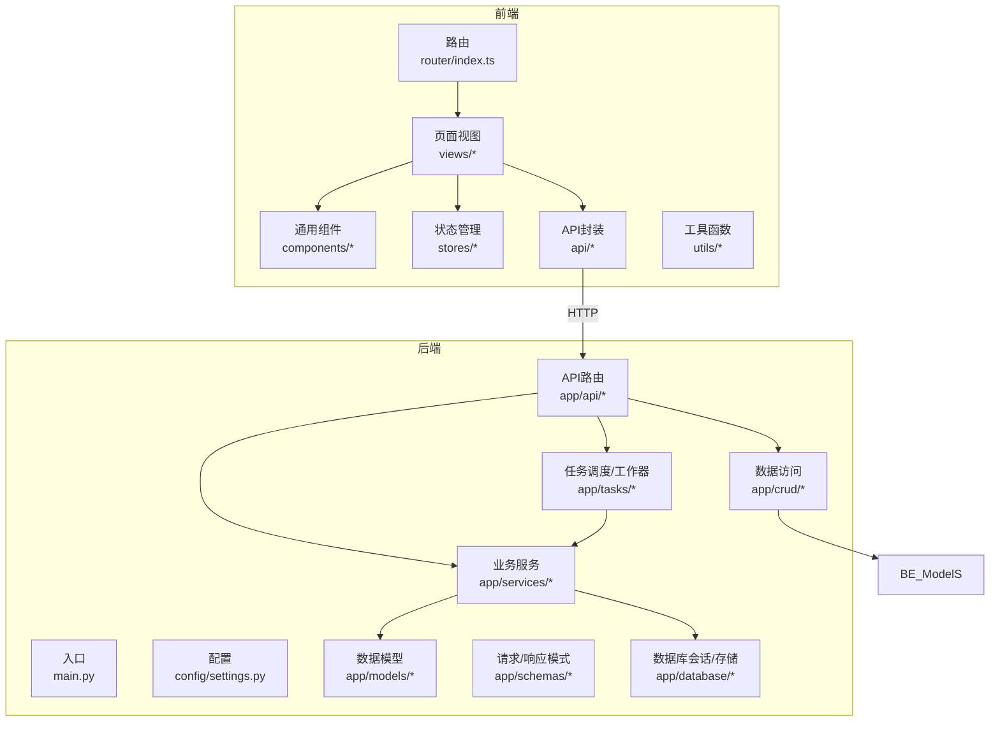

图表来源
- [backend/main.py](file://backend/main.py)
- [backend/app/config/settings.py](file://backend/app/config/settings.py)
- [backend/app/api/agent.py](file://backend/app/api/agent.py)
- [backend/app/api/album.py](file://backend/app/api/album.py)
- [backend/app/api/auth.py](file://backend/app/api/auth.py)
- [backend/app/api/face.py](file://backend/app/api/face.py)
- [backend/app/api/photo.py](file://backend/app/api/photo.py)
- [backend/app/api/search.py](file://backend/app/api/search.py)
- [backend/app/api/tasks.py](file://backend/app/api/tasks.py)
- [backend/app/crud/album.py](file://backend/app/crud/album.py)
- [backend/app/crud/photo.py](file://backend/app/crud/photo.py)
- [backend/app/crud/user.py](file://backend/app/crud/user.py)
- [backend/app/database/session.py](file://backend/app/database/session.py)
- [backend/app/database/storage.py](file://backend/app/database/storage.py)
- [backend/app/models/__init__.py](file://backend/app/models/__init__.py)
- [backend/app/models/album.py](file://backend/app/models/album.py)
- [backend/app/models/photo.py](file://backend/app/models/photo.py)
- [backend/app/models/user.py](file://backend/app/models/user.py)
- [backend/app/schemas/__init__.py](file://backend/app/schemas/__init__.py)
- [backend/app/schemas/album.py](file://backend/app/schemas/album.py)
- [backend/app/schemas/photo.py](file://backend/app/schemas/photo.py)
- [backend/app/schemas/user.py](file://backend/app/schemas/user.py)
- [backend/app/services/album_service.py](file://backend/app/services/album_service.py)
- [backend/app/services/photo_service.py](file://backend/app/services/photo_service.py)
- [backend/app/services/search_service.py](file://backend/app/services/search_service.py)
- [backend/app/services/face_cluster_service.py](file://backend/app/services/face_cluster_service.py)
- [backend/app/services/face_detect_service.py](file://backend/app/services/face_detect_service.py)
- [backend/app/services/photo_vector_service.py](file://backend/app/services/photo_vector_service.py)
- [backend/app/tasks/dispatcher.py](file://backend/app/tasks/dispatcher.py)
- [backend/app/tasks/scheduler.py](file://backend/app/tasks/scheduler.py)
- [backend/app/tasks/task_worker.py](file://backend/app/tasks/task_worker.py)
- [backend/app/tasks/detection_tasks.py](file://backend/app/tasks/detection_tasks.py)
- [backend/app/tasks/vector_tasks.py](file://backend/app/tasks/vector_tasks.py)
- [frontend/src/router/index.ts](file://frontend/src/router/index.ts)
- [frontend/src/views/HomePage.vue](file://frontend/src/views/HomePage.vue)
- [frontend/src/views/LoginPage.vue](file://frontend/src/views/LoginPage.vue)
- [frontend/src/views/PhotosPage.vue](file://frontend/src/views/PhotosPage.vue)
- [frontend/src/views/AlbumPage.vue](file://frontend/src/views/AlbumPage.vue)
- [frontend/src/views/SearchPage.vue](file://frontend/src/views/SearchPage.vue)
- [frontend/src/views/FacePage.vue](file://frontend/src/views/FacePage.vue)
- [frontend/src/views/AgentChat.vue](file://frontend/src/views/AgentChat.vue)
- [frontend/src/views/MapPage.vue](file://frontend/src/views/MapPage.vue)
- [frontend/src/views/TasksPage.vue](file://frontend/src/views/TasksPage.vue)
- [frontend/src/views/Training.vue](file://frontend/src/views/Training.vue)
- [frontend/src/views/Models.vue](file://frontend/src/views/Models.vue)
- [frontend/src/views/SettingsPage.vue](file://frontend/src/views/SettingsPage.vue)
- [frontend/src/views/Database.vue](file://frontend/src/views/Database.vue)
- [frontend/src/views/RecycleBinPage.vue](file://frontend/src/views/RecycleBinPage.vue)
- [frontend/src/components/layout/AppHeader.vue](file://frontend/src/components/layout/AppHeader.vue)
- [frontend/src/components/layout/AppSidebar.vue](file://frontend/src/components/layout/AppSidebar.vue)
- [frontend/src/components/photo/PhotoCard.vue](file://frontend/src/components/photo/PhotoCard.vue)
- [frontend/src/components/photo/PhotoDetailDrawer.vue](file://frontend/src/components/photo/PhotoDetailDrawer.vue)
- [frontend/src/components/photo/PhotoGrid.vue](file://frontend/src/components/photo/PhotoGrid.vue)
- [frontend/src/components/photo/PhotoTimeline.vue](file://frontend/src/components/photo/PhotoTimeline.vue)
- [frontend/src/components/photo/UploadDialog.vue](file://frontend/src/components/photo/UploadDialog.vue)
- [frontend/src/stores/user.ts](file://frontend/src/stores/user.ts)
- [frontend/src/stores/photo.ts](file://frontend/src/stores/photo.ts)
- [frontend/src/stores/chat.ts](file://frontend/src/stores/chat.ts)
- [frontend/src/stores/theme.ts](file://frontend/src/stores/theme.ts)
- [frontend/src/stores/layout.ts](file://frontend/src/stores/layout.ts)
- [frontend/src/api/auth.ts](file://frontend/src/api/auth.ts)
- [frontend/src/api/album.ts](file://frontend/src/api/album.ts)
- [frontend/src/api/photo.ts](file://frontend/src/api/photo.ts)
- [frontend/src/api/search.ts](file://frontend/src/api/search.ts)
- [frontend/src/api/face.ts](file://frontend/src/api/face.ts)
- [frontend/src/api/agent.ts](file://frontend/src/api/agent.ts)
- [frontend/src/api/tasks.ts](file://frontend/src/api/tasks.ts)
- [frontend/src/api/training.ts](file://frontend/src/api/training.ts)
- [frontend/src/utils/request.ts](file://frontend/src/utils/request.ts)

章节来源
- [backend/main.py](file://backend/main.py)
- [backend/app/config/settings.py](file://backend/app/config/settings.py)
- [frontend/src/router/index.ts](file://frontend/src/router/index.ts)

## 核心组件
- 认证与授权：提供登录、鉴权与用户信息管理能力。
- 照片与媒体：上传、缩略图、EXIF读取、删除与回收站恢复。
- 相册组织：创建、编辑、移动、批量操作与智能相册。
- AI能力：人脸检测与聚类、向量检索、地理编码、名称确认、描述生成。
- 任务系统：任务分发、调度与工作器执行，支持异步长耗时任务。
- 训练与模型：训练脚本、配置与数据转换工具，支持外部模型接入。
- 前端界面：首页、登录、照片、相册、搜索、人物、地图、任务、训练、设置、数据库与回收站等页面。

章节来源
- [backend/app/api/auth.py](file://backend/app/api/auth.py)
- [backend/app/api/photo.py](file://backend/app/api/photo.py)
- [backend/app/api/album.py](file://backend/app/api/album.py)
- [backend/app/api/face.py](file://backend/app/api/face.py)
- [backend/app/api/search.py](file://backend/app/api/search.py)
- [backend/app/api/tasks.py](file://backend/app/api/tasks.py)
- [backend/app/api/training.py](file://backend/app/api/training.py)
- [backend/app/api/agent.py](file://backend/app/api/agent.py)
- [backend/app/api/recycle_bin.py](file://backend/app/api/recycle_bin.py)
- [backend/app/api/medias.py](file://backend/app/api/medias.py)
- [backend/app/api/datasets.py](file://backend/app/api/datasets.py)
- [backend/app/api/system.py](file://backend/app/api/system.py)
- [backend/app/api/models.py](file://backend/app/api/models.py)
- [frontend/src/views/LoginPage.vue](file://frontend/src/views/LoginPage.vue)
- [frontend/src/views/PhotosPage.vue](file://frontend/src/views/PhotosPage.vue)
- [frontend/src/views/AlbumPage.vue](file://frontend/src/views/AlbumPage.vue)
- [frontend/src/views/SearchPage.vue](file://frontend/src/views/SearchPage.vue)
- [frontend/src/views/FacePage.vue](file://frontend/src/views/FacePage.vue)
- [frontend/src/views/MapPage.vue](file://frontend/src/views/MapPage.vue)
- [frontend/src/views/TasksPage.vue](file://frontend/src/views/TasksPage.vue)
- [frontend/src/views/Training.vue](file://frontend/src/views/Training.vue)
- [frontend/src/views/Models.vue](file://frontend/src/views/Models.vue)
- [frontend/src/views/SettingsPage.vue](file://frontend/src/views/SettingsPage.vue)
- [frontend/src/views/Database.vue](file://frontend/src/views/Database.vue)
- [frontend/src/views/RecycleBinPage.vue](file://frontend/src/views/RecycleBinPage.vue)

## 架构总览
系统采用“前端UI + 后端API + 任务队列 + 数据存储 + AI服务”的分层架构。前端通过API调用后端，后端将耗时任务投递至任务系统，由工作器执行并更新数据库与对象存储。AI能力以插件化服务形式集成，支持多种提供者。

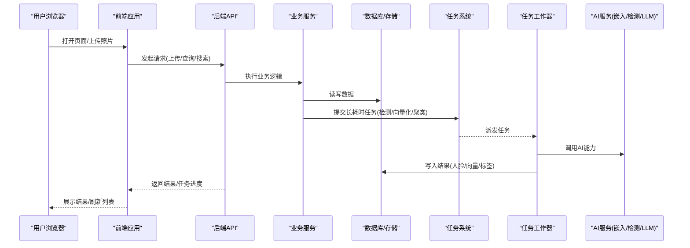

图表来源
- [backend/main.py](file://backend/main.py)
- [backend/app/api/photo.py](file://backend/app/api/photo.py)
- [backend/app/api/tasks.py](file://backend/app/api/tasks.py)
- [backend/app/services/photo_service.py](file://backend/app/services/photo_service.py)
- [backend/app/services/face_detect_service.py](file://backend/app/services/face_detect_service.py)
- [backend/app/services/photo_vector_service.py](file://backend/app/services/photo_vector_service.py)
- [backend/app/services/face_cluster_service.py](file://backend/app/services/face_cluster_service.py)
- [backend/app/tasks/dispatcher.py](file://backend/app/tasks/dispatcher.py)
- [backend/app/tasks/scheduler.py](file://backend/app/tasks/scheduler.py)
- [backend/app/tasks/task_worker.py](file://backend/app/tasks/task_worker.py)
- [backend/app/tasks/detection_tasks.py](file://backend/app/tasks/detection_tasks.py)
- [backend/app/tasks/vector_tasks.py](file://backend/app/tasks/vector_tasks.py)
- [backend/app/database/session.py](file://backend/app/database/session.py)
- [backend/app/database/storage.py](file://backend/app/database/storage.py)
- [backend/app/services/ai_providers/embedding.py](file://backend/app/services/ai_providers/embedding.py)

## 详细组件分析

### 认证与用户模块
- 功能要点：用户注册/登录、令牌签发与校验、用户资料管理。
- 关键流程：前端登录后获取令牌，后续请求携带令牌；后端校验令牌并注入当前用户上下文。
- 安全建议：最小权限原则、敏感配置外置、密码哈希与传输加密。

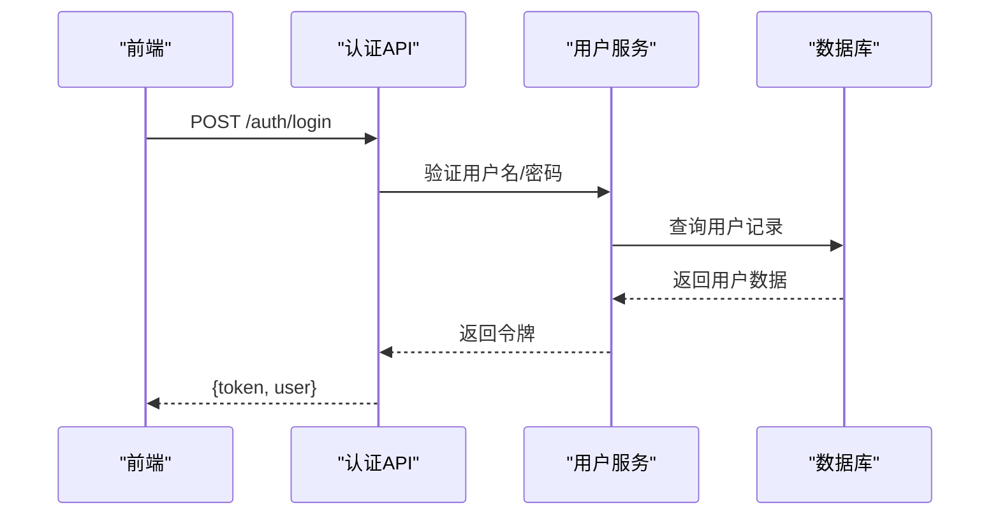

图表来源
- [backend/app/api/auth.py](file://backend/app/api/auth.py)
- [backend/app/crud/user.py](file://backend/app/crud/user.py)
- [backend/app/models/user.py](file://backend/app/models/user.py)
- [backend/app/schemas/user.py](file://backend/app/schemas/user.py)
- [frontend/src/api/auth.ts](file://frontend/src/api/auth.ts)
- [frontend/src/stores/user.ts](file://frontend/src/stores/user.ts)
- [frontend/src/views/LoginPage.vue](file://frontend/src/views/LoginPage.vue)

章节来源
- [backend/app/api/auth.py](file://backend/app/api/auth.py)
- [backend/app/crud/user.py](file://backend/app/crud/user.py)
- [backend/app/models/user.py](file://backend/app/models/user.py)
- [backend/app/schemas/user.py](file://backend/app/schemas/user.py)
- [frontend/src/api/auth.ts](file://frontend/src/api/auth.ts)
- [frontend/src/stores/user.ts](file://frontend/src/stores/user.ts)
- [frontend/src/views/LoginPage.vue](file://frontend/src/views/LoginPage.vue)

### 照片与媒体管理
- 功能要点：上传、缩略图生成、EXIF读取、删除与回收站恢复。
- 关键流程：上传后触发检测与向量化任务；删除进入回收站，支持恢复与彻底删除。
- 存储策略：原始文件与缩略图分离，元数据与向量索引持久化。

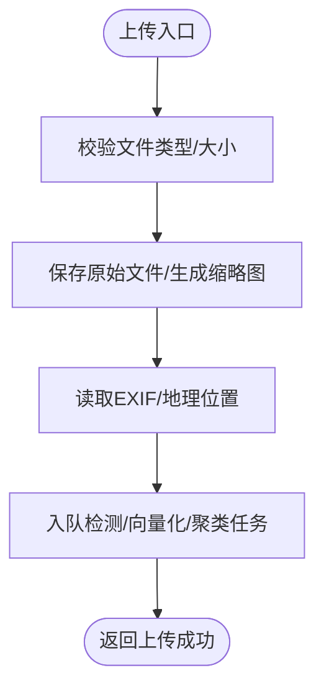

图表来源
- [backend/app/api/photo.py](file://backend/app/api/photo.py)
- [backend/app/api/medias.py](file://backend/app/api/medias.py)
- [backend/app/services/photo_service.py](file://backend/app/services/photo_service.py)
- [backend/app/services/thumbnail.py](file://backend/app/services/thumbnail.py)
- [backend/app/services/exif_service.py](file://backend/app/services/exif_service.py)
- [backend/app/tasks/detection_tasks.py](file://backend/app/tasks/detection_tasks.py)
- [backend/app/tasks/vector_tasks.py](file://backend/app/tasks/vector_tasks.py)
- [backend/app/database/storage.py](file://backend/app/database/storage.py)

章节来源
- [backend/app/api/photo.py](file://backend/app/api/photo.py)
- [backend/app/api/medias.py](file://backend/app/api/medias.py)
- [backend/app/services/photo_service.py](file://backend/app/services/photo_service.py)
- [backend/app/services/thumbnail.py](file://backend/app/services/thumbnail.py)
- [backend/app/services/exif_service.py](file://backend/app/services/exif_service.py)
- [backend/app/tasks/detection_tasks.py](file://backend/app/tasks/detection_tasks.py)
- [backend/app/tasks/vector_tasks.py](file://backend/app/tasks/vector_tasks.py)
- [backend/app/database/storage.py](file://backend/app/database/storage.py)
- [frontend/src/api/photo.ts](file://frontend/src/api/photo.ts)
- [frontend/src/views/PhotosPage.vue](file://frontend/src/views/PhotosPage.vue)
- [frontend/src/components/photo/UploadDialog.vue](file://frontend/src/components/photo/UploadDialog.vue)

### 相册组织与智能相册
- 功能要点：手动/智能相册、批量移动、条件筛选与聚合。
- 关键流程：根据规则或AI标签动态生成集合，支持实时更新。

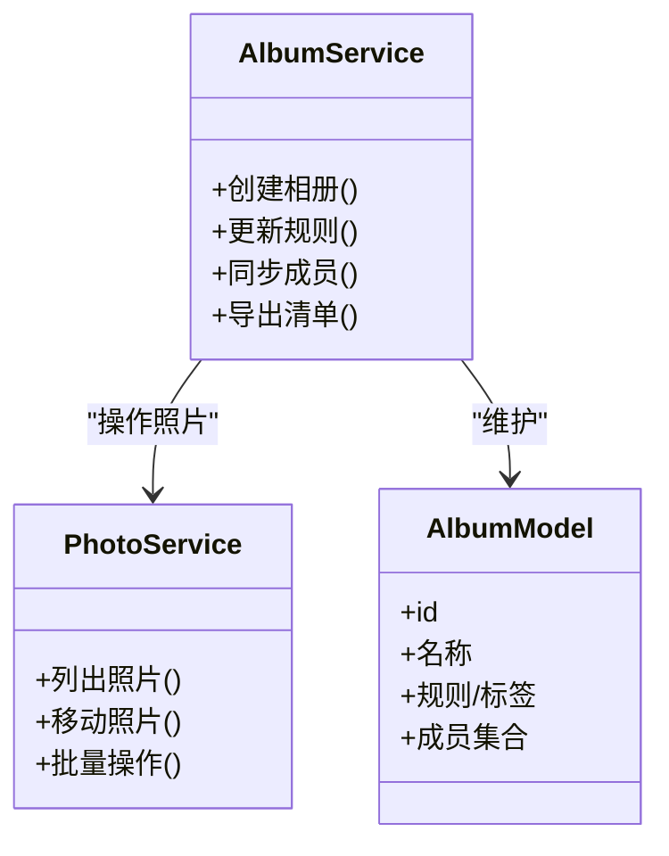

图表来源
- [backend/app/services/album_service.py](file://backend/app/services/album_service.py)
- [backend/app/services/photo_service.py](file://backend/app/services/photo_service.py)
- [backend/app/models/album.py](file://backend/app/models/album.py)
- [backend/app/schemas/album.py](file://backend/app/schemas/album.py)
- [backend/app/api/album.py](file://backend/app/api/album.py)
- [frontend/src/api/album.ts](file://frontend/src/api/album.ts)
- [frontend/src/views/AlbumPage.vue](file://frontend/src/views/AlbumPage.vue)

章节来源
- [backend/app/services/album_service.py](file://backend/app/services/album_service.py)
- [backend/app/services/photo_service.py](file://backend/app/services/photo_service.py)
- [backend/app/models/album.py](file://backend/app/models/album.py)
- [backend/app/schemas/album.py](file://backend/app/schemas/album.py)
- [backend/app/api/album.py](file://backend/app/api/album.py)
- [frontend/src/api/album.ts](file://frontend/src/api/album.ts)
- [frontend/src/views/AlbumPage.vue](file://frontend/src/views/AlbumPage.vue)

### 人脸识别与人物管理
- 功能要点：人脸检测、人脸聚类、人物合并与重命名确认。
- 关键流程：检测出人脸框与特征，聚类得到人物簇，用户确认后绑定姓名。

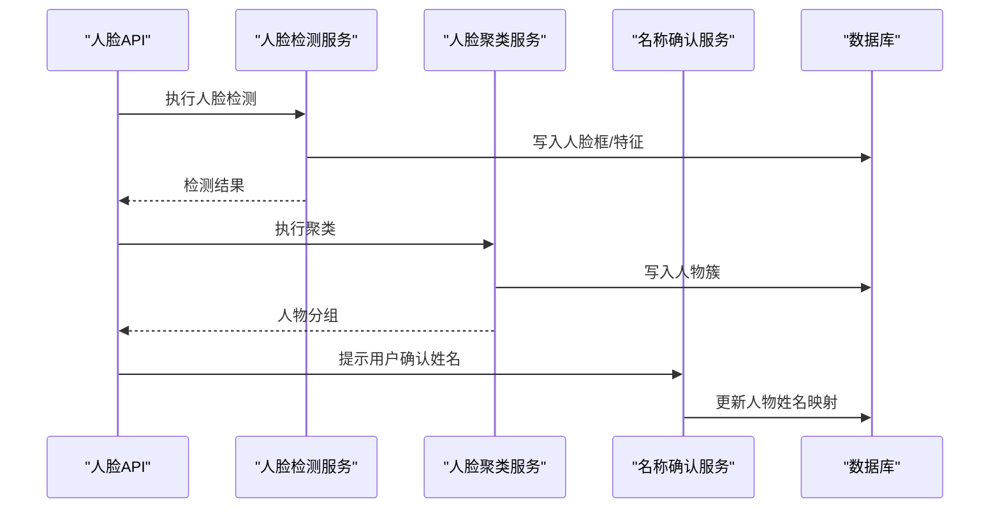

图表来源
- [backend/app/api/face.py](file://backend/app/api/face.py)
- [backend/app/services/face_detect_service.py](file://backend/app/services/face_detect_service.py)
- [backend/app/services/face_cluster_service.py](file://backend/app/services/face_cluster_service.py)
- [backend/app/services/name_confirmation_service.py](file://backend/app/services/name_confirmation_service.py)
- [backend/app/models/face.py](file://backend/app/models/face.py)
- [backend/app/schemas/face.py](file://backend/app/schemas/face.py)
- [frontend/src/api/face.ts](file://frontend/src/api/face.ts)
- [frontend/src/views/FacePage.vue](file://frontend/src/views/FacePage.vue)

章节来源
- [backend/app/api/face.py](file://backend/app/api/face.py)
- [backend/app/services/face_detect_service.py](file://backend/app/services/face_detect_service.py)
- [backend/app/services/face_cluster_service.py](file://backend/app/services/face_cluster_service.py)
- [backend/app/services/name_confirmation_service.py](file://backend/app/services/name_confirmation_service.py)
- [backend/app/models/face.py](file://backend/app/models/face.py)
- [backend/app/schemas/face.py](file://backend/app/schemas/face.py)
- [frontend/src/api/face.ts](file://frontend/src/api/face.ts)
- [frontend/src/views/FacePage.vue](file://frontend/src/views/FacePage.vue)

### AI驱动搜索与向量检索
- 功能要点：文本/图像语义检索、混合过滤（时间/地点/人物/标签）、相似图片推荐。
- 关键流程：将查询转为向量，检索最近邻，结合元数据过滤排序。

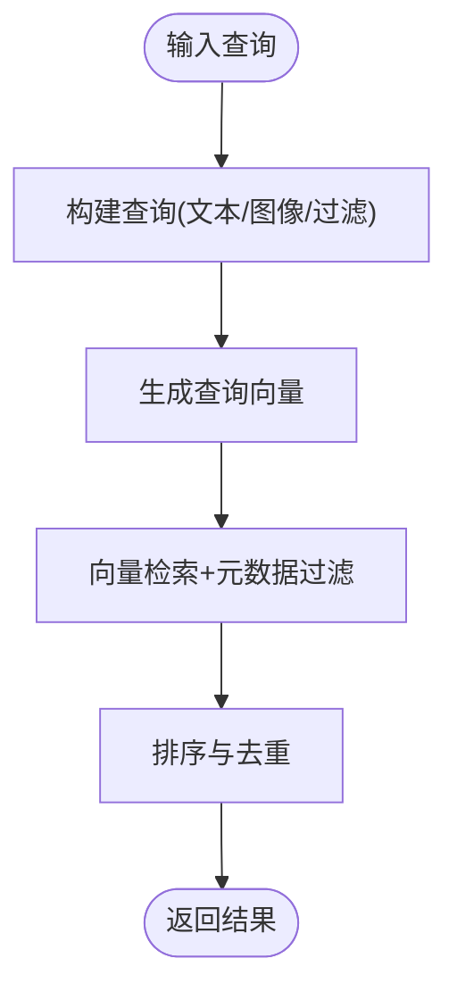

图表来源
- [backend/app/api/search.py](file://backend/app/api/search.py)
- [backend/app/services/search_service.py](file://backend/app/services/search_service.py)
- [backend/app/services/photo_vector_service.py](file://backend/app/services/photo_vector_service.py)
- [backend/app/services/ai_providers/embedding.py](file://backend/app/services/ai_providers/embedding.py)
- [frontend/src/api/search.ts](file://frontend/src/api/search.ts)
- [frontend/src/views/SearchPage.vue](file://frontend/src/views/SearchPage.vue)

章节来源
- [backend/app/api/search.py](file://backend/app/api/search.py)
- [backend/app/services/search_service.py](file://backend/app/services/search_service.py)
- [backend/app/services/photo_vector_service.py](file://backend/app/services/photo_vector_service.py)
- [backend/app/services/ai_providers/embedding.py](file://backend/app/services/ai_providers/embedding.py)
- [frontend/src/api/search.ts](file://frontend/src/api/search.ts)
- [frontend/src/views/SearchPage.vue](file://frontend/src/views/SearchPage.vue)

### 任务系统与异步处理
- 功能要点：任务分发、调度、重试与监控；检测、向量化、聚类、地理编码等任务异步执行。
- 关键流程：API提交任务 -> 调度器分配 -> 工作器执行 -> 写库回调 -> 前端轮询/推送进度。

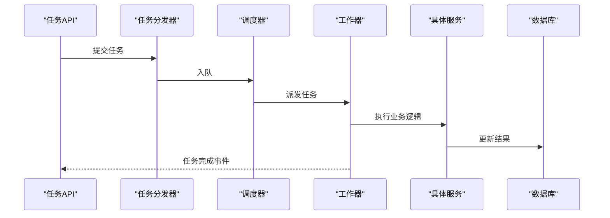

图表来源
- [backend/app/api/tasks.py](file://backend/app/api/tasks.py)
- [backend/app/tasks/dispatcher.py](file://backend/app/tasks/dispatcher.py)
- [backend/app/tasks/scheduler.py](file://backend/app/tasks/scheduler.py)
- [backend/app/tasks/task_worker.py](file://backend/app/tasks/task_worker.py)
- [backend/app/tasks/detection_tasks.py](file://backend/app/tasks/detection_tasks.py)
- [backend/app/tasks/vector_tasks.py](file://backend/app/tasks/vector_tasks.py)
- [frontend/src/api/tasks.ts](file://frontend/src/api/tasks.ts)
- [frontend/src/views/TasksPage.vue](file://frontend/src/views/TasksPage.vue)

章节来源
- [backend/app/api/tasks.py](file://backend/app/api/tasks.py)
- [backend/app/tasks/dispatcher.py](file://backend/app/tasks/dispatcher.py)
- [backend/app/tasks/scheduler.py](file://backend/app/tasks/scheduler.py)
- [backend/app/tasks/task_worker.py](file://backend/app/tasks/task_worker.py)
- [backend/app/tasks/detection_tasks.py](file://backend/app/tasks/detection_tasks.py)
- [backend/app/tasks/vector_tasks.py](file://backend/app/tasks/vector_tasks.py)
- [frontend/src/api/tasks.ts](file://frontend/src/api/tasks.ts)
- [frontend/src/views/TasksPage.vue](file://frontend/src/views/TasksPage.vue)

### 训练与模型管理
- 功能要点：训练脚本、数据转换、配置管理、模型版本与评估。
- 关键流程：准备数据集 -> 转换格式 -> 执行训练 -> 输出模型与指标 -> 注册可用模型。

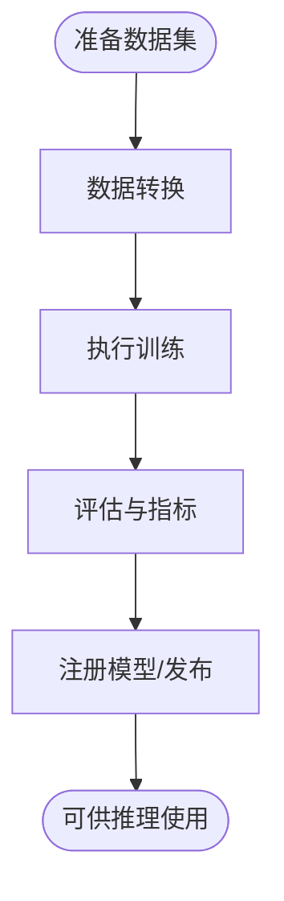

图表来源
- [backend/app/api/training.py](file://backend/app/api/training.py)
- [backend/app/services/training_service.py](file://backend/app/services/training_service.py)
- [backend/app/services/trainer.py](file://backend/app/services/trainer.py)
- [backend/app/services/train/README.md](file://backend/app/services/train/README.md)
- [backend/app/services/train/TRAINING_GUIDE.md](file://backend/app/services/train/TRAINING_GUIDE.md)
- [backend/app/services/train/config.py](file://backend/app/services/train/config.py)
- [backend/app/services/train/data_converter.py](file://backend/app/services/train/data_converter.py)
- [backend/app/services/train/train_lvis.py](file://backend/app/services/train/train_lvis.py)
- [frontend/src/api/training.ts](file://frontend/src/api/training.ts)
- [frontend/src/views/Training.vue](file://frontend/src/views/Training.vue)
- [frontend/src/views/Models.vue](file://frontend/src/views/Models.vue)

章节来源
- [backend/app/api/training.py](file://backend/app/api/training.py)
- [backend/app/services/training_service.py](file://backend/app/services/training_service.py)
- [backend/app/services/trainer.py](file://backend/app/services/trainer.py)
- [backend/app/services/train/README.md](file://backend/app/services/train/README.md)
- [backend/app/services/train/TRAINING_GUIDE.md](file://backend/app/services/train/TRAINING_GUIDE.md)
- [backend/app/services/train/config.py](file://backend/app/services/train/config.py)
- [backend/app/services/train/data_converter.py](file://backend/app/services/train/data_converter.py)
- [backend/app/services/train/train_lvis.py](file://backend/app/services/train/train_lvis.py)
- [frontend/src/api/training.ts](file://frontend/src/api/training.ts)
- [frontend/src/views/Training.vue](file://frontend/src/views/Training.vue)
- [frontend/src/views/Models.vue](file://frontend/src/views/Models.vue)

### 对话助手与多模态代理
- 功能要点：自然语言问答、意图识别、跨模态检索与总结。
- 关键流程：接收用户消息 -> 解析意图 -> 调用相关服务（搜索/相册/人物）-> 汇总回答。

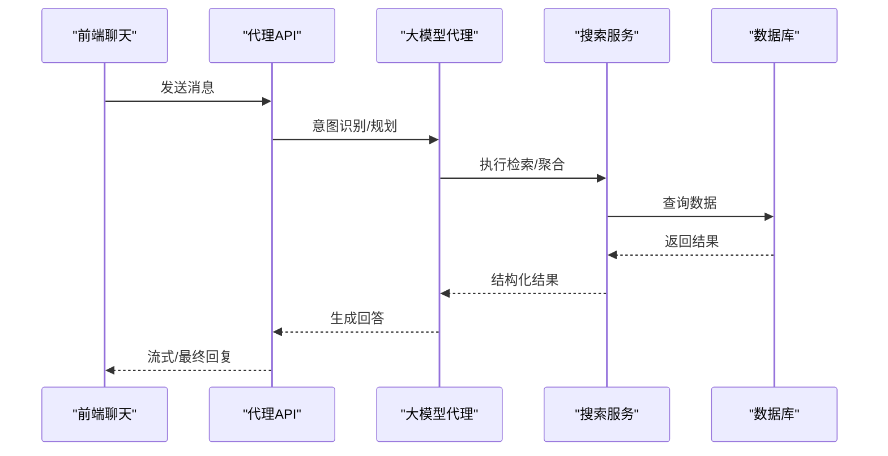

图表来源
- [backend/app/api/agent.py](file://backend/app/api/agent.py)
- [backend/app/services/agent/supervisor.py](file://backend/app/services/agent/supervisor.py)
- [backend/app/services/agent/search_agent.py](file://backend/app/services/agent/search_agent.py)
- [backend/app/services/agent/llm_agent.py](file://backend/app/services/agent/llm_agent.py)
- [backend/app/services/search_service.py](file://backend/app/services/search_service.py)
- [frontend/src/api/agent.ts](file://frontend/src/api/agent.ts)
- [frontend/src/views/AgentChat.vue](file://frontend/src/views/AgentChat.vue)
- [frontend/src/stores/chat.ts](file://frontend/src/stores/chat.ts)

章节来源
- [backend/app/api/agent.py](file://backend/app/api/agent.py)
- [backend/app/services/agent/supervisor.py](file://backend/app/services/agent/supervisor.py)
- [backend/app/services/agent/search_agent.py](file://backend/app/services/agent/search_agent.py)
- [backend/app/services/agent/llm_agent.py](file://backend/app/services/agent/llm_agent.py)
- [backend/app/services/search_service.py](file://backend/app/services/search_service.py)
- [frontend/src/api/agent.ts](file://frontend/src/api/agent.ts)
- [frontend/src/views/AgentChat.vue](file://frontend/src/views/AgentChat.vue)
- [frontend/src/stores/chat.ts](file://frontend/src/stores/chat.ts)

### 地图与地理编码
- 功能要点：基于EXIF坐标显示照片位置、逆地理编码、热力分布。
- 关键流程：读取EXIF -> 调用地理编码服务 -> 渲染地图标记。

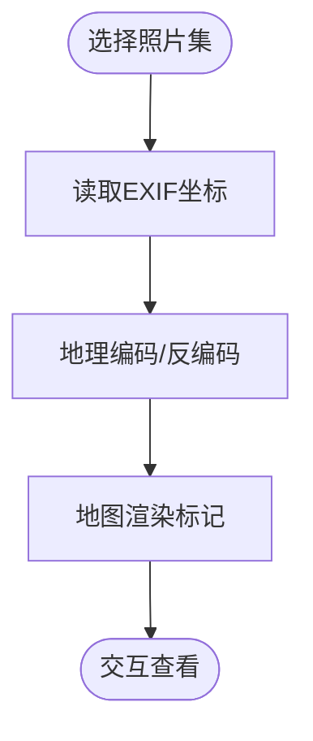

图表来源
- [backend/app/services/geocode_service.py](file://backend/app/services/geocode_service.py)
- [backend/app/services/exif_service.py](file://backend/app/services/exif_service.py)
- [frontend/src/views/MapPage.vue](file://frontend/src/views/MapPage.vue)

章节来源
- [backend/app/services/geocode_service.py](file://backend/app/services/geocode_service.py)
- [backend/app/services/exif_service.py](file://backend/app/services/exif_service.py)
- [frontend/src/views/MapPage.vue](file://frontend/src/views/MapPage.vue)

### 回收站与数据恢复
- 功能要点：软删除、恢复、彻底删除与审计。
- 关键流程：删除进入回收站 -> 定时清理 -> 支持恢复与二次确认。

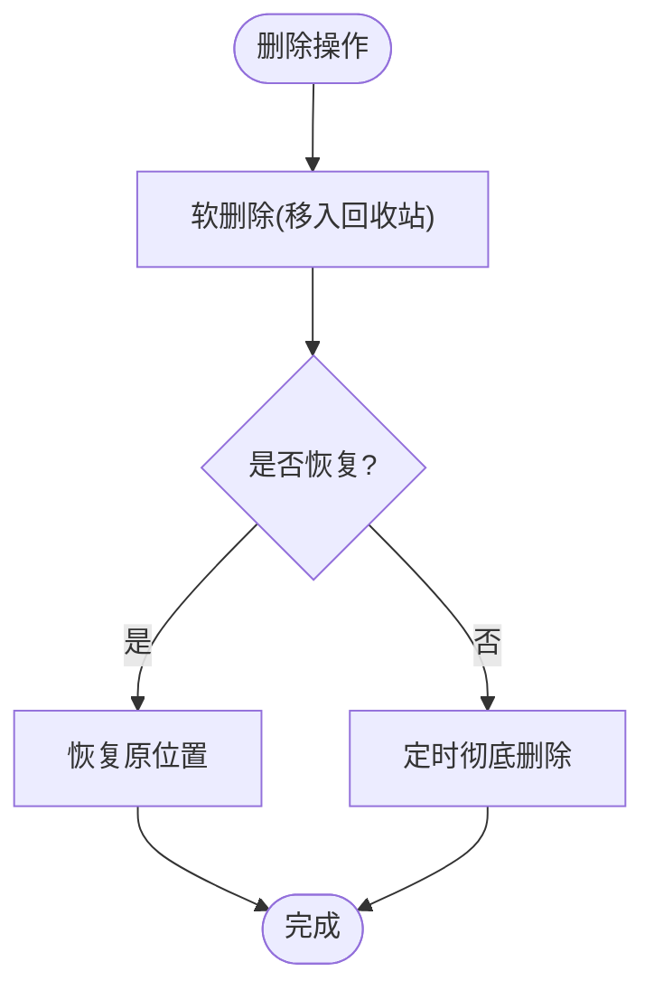

图表来源
- [backend/app/api/recycle_bin.py](file://backend/app/api/recycle_bin.py)
- [frontend/src/views/RecycleBinPage.vue](file://frontend/src/views/RecycleBinPage.vue)

章节来源
- [backend/app/api/recycle_bin.py](file://backend/app/api/recycle_bin.py)
- [frontend/src/views/RecycleBinPage.vue](file://frontend/src/views/RecycleBinPage.vue)

## 依赖关系分析
- 前端依赖：路由、视图、组件、状态管理、API封装与工具函数。
- 后端依赖：API路由依赖CRUD与服务层；服务层依赖数据模型与数据库会话；任务系统依赖调度器与工作器；AI能力通过提供者接口接入。
- 外部依赖：对象存储、数据库、向量检索、地理编码与LLM服务。

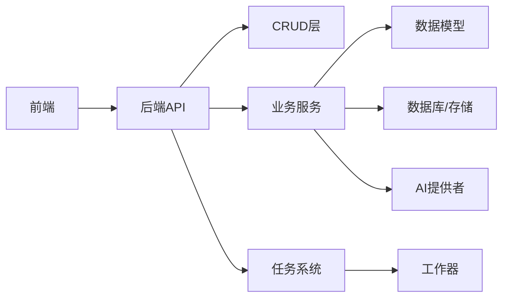

图表来源
- [backend/main.py](file://backend/main.py)
- [backend/app/api/photo.py](file://backend/app/api/photo.py)
- [backend/app/crud/photo.py](file://backend/app/crud/photo.py)
- [backend/app/services/photo_service.py](file://backend/app/services/photo_service.py)
- [backend/app/models/photo.py](file://backend/app/models/photo.py)
- [backend/app/database/session.py](file://backend/app/database/session.py)
- [backend/app/tasks/dispatcher.py](file://backend/app/tasks/dispatcher.py)
- [backend/app/tasks/task_worker.py](file://backend/app/tasks/task_worker.py)
- [backend/app/services/ai_providers/embedding.py](file://backend/app/services/ai_providers/embedding.py)

章节来源
- [backend/main.py](file://backend/main.py)
- [backend/app/api/photo.py](file://backend/app/api/photo.py)
- [backend/app/crud/photo.py](file://backend/app/crud/photo.py)
- [backend/app/services/photo_service.py](file://backend/app/services/photo_service.py)
- [backend/app/models/photo.py](file://backend/app/models/photo.py)
- [backend/app/database/session.py](file://backend/app/database/session.py)
- [backend/app/tasks/dispatcher.py](file://backend/app/tasks/dispatcher.py)
- [backend/app/tasks/task_worker.py](file://backend/app/tasks/task_worker.py)
- [backend/app/services/ai_providers/embedding.py](file://backend/app/services/ai_providers/embedding.py)

## 性能考量
- 异步任务：将检测、向量化、聚类、地理编码等耗时操作放入任务队列，避免阻塞请求。
- 缓存与索引：对常用查询结果与向量索引进行缓存，提升检索速度。
- 批处理与分页：大批量导入与列表加载采用分页与批处理策略。
- 资源隔离：GPU/CPU资源按需分配，避免相互干扰。
- 存储优化：缩略图与原始文件分离，按需生成与压缩。

[本节为通用指导，不直接分析具体文件]

## 故障排查指南
- 常见问题定位：
  - 上传失败：检查文件类型/大小限制、存储路径权限、缩略图生成服务。
  - 任务堆积：查看任务队列长度、工作器健康状态与错误日志。
  - 检索无结果：确认向量索引是否构建完成、AI提供者连通性与阈值设置。
  - 人脸未识别：检查检测模型可用性、光照与遮挡情况、聚类参数。
- 日志与监控：
  - 后端日志：统一日志输出，关注异常堆栈与慢查询。
  - 前端网络：检查API响应码与超时设置。
- 恢复与回滚：
  - 利用回收站恢复误删数据；必要时回滚模型与配置版本。

章节来源
- [backend/app/core/logger.py](file://backend/app/core/logger.py)
- [backend/app/core/exceptions.py](file://backend/app/core/exceptions.py)
- [backend/app/api/tasks.py](file://backend/app/api/tasks.py)
- [backend/app/tasks/task_worker.py](file://backend/app/tasks/task_worker.py)
- [frontend/src/utils/request.ts](file://frontend/src/utils/request.ts)

## 结论
本系统以“AI可插拔、前后端解耦、任务异步化”为核心设计，覆盖从照片入库、智能处理、检索到可视化的全链路能力。通过统一的配置与日志体系、完善的任务与错误处理机制，既满足个人用户的易用性，也为团队与企业级应用提供了可扩展的生产级基础。

[本节为总结性内容，不直接分析具体文件]

## 附录
- 术语表
  - 向量检索：将查询与数据转换为向量空间后进行相似度匹配。
  - 人脸聚类：将相似人脸归并为同一人物的过程。
  - 地理编码：将经纬度转换为可读地址的过程。
  - 回收站：软删除数据的临时存放区，支持恢复与清理。
- 快速上手清单
  - 拉取代码 -> 配置环境变量 -> 启动编排 -> 访问前端 -> 注册/登录 -> 上传照片 -> 观察任务进度 -> 使用搜索与相册功能。

[本节为补充说明，不直接分析具体文件]